# Documentation

This skill governs all documentation located in the `documentation/` directory.

- **Platform documentation**: Follow this skill for all content inside `documentation/`.
- **Inline documentation**: For source code comments, follow the skill at [`.agents/skills/code-comments/SKILL.md`](../code-comments/SKILL.md).
- **README files**: For project-level documentation and overviews, generate README.md files at the root of each project or module. These files are meant for developers, not end-users. They should follow the general pattern Why -> What -> How -> Using -> Building.

# Documentation organization

The documentation follows the [Diataxis framework](https://diataxis.fr) and is compiled with [mdBook](https://rust-lang.github.io/mdBook/). It uses simplified technical English, Markdown formatting, and Mermaid diagrams.

## The documentation describes the credential verifier

This project implements EU Age Verification with W3C Digital Credentials. The principal subject of the documentation is the **ewQwe Credential Verifier** server (`crates/ewqwe-credential-verifier-server/`), a Rust Actix-web service that verifies Verifiable Presentations and returns signed attestations.

The table below lists the components of the repository, their source path, and their role in the documentation.

| Component             | Source path                                                                      | Role in the documentation                              |
| :-------------------- | :------------------------------------------------------------------------------- | :----------------------------------------------------- |
| Credential verifier   | `crates/ewqwe-credential-verifier-server/`                                       | Principal subject. The verification server.            |
| Verifier app          | `crates/ewqwe-credential-verifier-ui/`                                           | The built-in user interface of the verifier.           |
| OpenID4VP protocol    | `crates/ewqwe-openid4vp/`                                                        | Verifier dependency. Request, DCQL, and HAIP handling. |
| Digital credential    | `crates/ewqwe-digital-credential/`                                               | Verifier dependency. Credential building and checking. |
| Example relying party | `typescript/demo-webapp/`                                                        | An advanced example of a relying-party UI.             |
| Client libraries      | `typescript/ewqwe-digital-identity/`, `crates/ewqwe-credential-verifier-client/` | Clients that the example uses.                         |

The credential verifier is documented across all four Diataxis quadrants. The verifier app is the standard user interface of the verifier, so it is documented beside the server and it leads the tutorials. The OpenID4VP protocol and the digital credential library are documented beside the server, because the credential verifier depends on them. The example relying party and the client libraries are not part of the verifier, so they are documented as an advanced how-to guide.

## The book has five sections

The table of contents has five parts: Tutorials, Reference, Explanation, How-to guides, and FAQ.

Diataxis defines four quadrants: tutorials, how-to guides, reference, and explanation. The FAQ section sits outside those quadrants as a service to them. An FAQ page answers a recurring question in a few sentences and links to the page that holds the full answer.

The `documentation/src/tutorials/` directory holds the verifier app lessons. A tutorial leads a beginner from a working setup to a first result, so the verifier app has tutorials that start from the build of the app and end in a completed verification.

## Each section separates the documented components

Every non-tutorial section holds one subdirectory per documented component, and the tutorial section holds the verifier app lessons, so a reader always knows which part of the system a page describes.

The subdirectory name is the component in lowercase with hyphens:

- `documentation/src/reference/credential-verifier/`
- `documentation/src/reference/verifier-app/`
- `documentation/src/reference/openid4vp/`
- `documentation/src/reference/digital-credential/`
- `documentation/src/tutorials/verifier-app/`

The same component names apply under `explanation/`, `how-to-guides/`, and `faq/`, in place of `reference/`.

A page belongs to the component whose behaviour it describes. A page that spans the credential verifier and a crate it uses belongs to the credential verifier, because the credential verifier depends on the crate and never the other way round.

A working document that is not part of the book, such as a migration plan, lives outside `documentation/src/` and is not registered in `SUMMARY.md`.

Every new page, and every page that moves, must follow this structure.

---

## 1. Simplified Technical English

All documentation is read by non-native English speakers. Write clearly and concisely.

### Audience and prior knowledge

Assume that the reader knows nothing about the subject. The reader is a technical professional whose strength is reading code and understanding clearly depicted algorithms, not prior study of this domain.

- **Assume general programming literacy only.** Bits, loops, functions, data structures, and the reading of code and pseudocode need no introduction. Knowledge of the subject does.
- **Introduce every concept before you use it**, in the order the reader needs it.
- **Define every term on first use**, even a term that is common in the field. Gloss it in the sentence, in parentheses, or in a terms table.
- **Do not lean on the field's shorthand.** A term such as a verifiable presentation, a holder binding, a nonce, or selective disclosure means nothing until the page says what it means here.
- **Prefer a concrete example, a table, or a diagram** over an appeal to prior knowledge.

### Core Rules

- **Short, direct sentences**: Express one idea per sentence.
- **No complicated structures**: Avoid compound sentences with multiple dependent clauses.
- **Precise technical vocabulary**: Use consistent, standard technical terms. Do not use idioms, metaphors, or buzzwords.
- **Active voice and present tense**: Prefer "The server verifies the token" over "The token will be verified by the server".
- **Clear antecedents**: Avoid ambiguous pronouns like "it", "this", or "that" when referring to systems or components. State the subject explicitly.

### Professional Tone and Typographic Standards

- **Sentence case**: Apply sentence case to all document titles, section headings, table headers, and diagram node labels. Only capitalize the first letter and proper nouns or recognized acronyms (e.g., _JWT_, _DCQL_, _HTTP_, _TLS_, _HAIP_, _Rust_). Never use Title Case.
- **No decorative emojis**: Do not use decorative or informal emojis (such as ⚡, 🚀, 🎉, 💡, 🔥, 📦) in titles, headings, tables, or text.
- **GitHub alerts**: Use standard Markdown callouts for emphasis:
  - `> [!NOTE]` for helpful context.
  - `> [!IMPORTANT]` for crucial operational details.
  - `> [!WARNING]` for critical traps or destructive actions.
- **Mathematical sobriety**: Do not overload text with unnecessary academic formulas. Use plain natural language for algorithms, validation rules, and pipelines. Reserve formal mathematical notation strictly for foundational cryptographic definitions, such as the binding between a nonce and a session transcript.

---

## 2. Diataxis quadrants

All documentation in `documentation/src/` is structured according to the [Diataxis framework](https://diataxis.fr). Diataxis separates documentation by the need of the reader, and each quadrant serves exactly one need.

Every page belongs to exactly one quadrant. Do not mix modes on a single page.

| Quadrant          | Target Directory                   | Orientation   | Purpose                                                                                                                                                 |
| :---------------- | :--------------------------------- | :------------ | :------------------------------------------------------------------------------------------------------------------------------------------------------ |
| **Tutorials**     | `documentation/src/tutorials/`     | Learning      | Guided, step-by-step lessons for beginners to acquire foundational knowledge through reliable exercises.                                                |
| **How-to Guides** | `documentation/src/how-to-guides/` | Task          | Goal-oriented, step-by-step instructions to solve a specific practical problem. Assumes basic system knowledge.                                         |
| **Reference**     | `documentation/src/reference/`     | Information   | Factual, neutral, and complete specifications of components, architectures, APIs, and schemas. No narrative or tutorial steps.                          |
| **Explanation**   | `documentation/src/explanation/`   | Understanding | Clarifies design choices, architecture, background context, and trade-offs. Discusses models rather than internal code details.                         |
| **FAQ**           | `documentation/src/faq/`           | Recall        | Answers the recurring questions in a few sentences and links to the page that holds the full answer. This section is an addition to the four quadrants. |

Each of the four non-tutorial directories above holds one `credential-verifier/`, `verifier-app/`, `openid4vp/`, or `digital-credential/` subdirectory, and a page goes into the subdirectory of its component. The `tutorials/` directory holds the `verifier-app/` subdirectory.

### Quadrant Guidelines

1. **Tutorials** (`tutorials/verifier-app/`):
   - Provide a guaranteed path from start to finish.
   - Introduce concepts progressively through action.
   - Explain what happened immediately after each action.
   - Cover the verifier app: build it, sign in, and complete an age verification.

2. **How-to Guides** (`how-to-guides/<component>/`):
   - State the target goal and prerequisites at the beginning.
   - Provide sequential, numbered, actionable steps.
   - Give expected output for each command or action.
   - Include troubleshooting notes for common failure modes.

3. **Reference** (`reference/<component>/`):
   - Present authoritative, exhaustive technical facts.
   - Document every public item of the component: the signature, the contract, the errors, and the limits.
   - Keep entries structured, neutral, and searchable.

4. **Explanation** (`explanation/<component>/`):
   - Explain _why_ the system is designed the way it is.
   - Compare architectural alternatives and justify decisions.
   - Focus on concepts and data models. Readers do not need direct access to the Rust source code.
   - Use pseudocode or diagrams instead of raw implementation details.

5. **FAQ** (`faq/<component>/`):
   - State the question as a heading, in sentence case, and end it with a question mark.
   - Answer in one to three sentences, and link to the page that holds the full answer.
   - Keep a question only where a reader has already asked it, or where a page makes the answer easy to get wrong.
   - Do not repeat the content of the quadrant pages. An answer that needs a table or a diagram belongs on the page it links to.

---

## 3. mdBook and navigation structure

All documentation is compiled with [mdBook](https://rust-lang.github.io/mdBook/). The table of contents is `documentation/src/SUMMARY.md`, and mdBook is strict about its format.

- **Parts are level-1 headings.** The five `#` lines of the file declare the five sections of the sidebar: Tutorials, Reference, Explanation, How-to guides, and FAQ. mdBook renders a part title as unclickable text.
- **mdBook ignores every other heading level in `SUMMARY.md`.** A `##` or `###` line is discarded without a warning, which leaves the chapters flat and hides the sections. Use `#` for a section.
- **The component groups are draft chapters.** A line such as `- [Credential verifier]()` declares a chapter that holds no file, and mdBook renders it as an unclickable group label that folds the sub-chapters below it. This is the only mechanism that the format offers for a group of pages that has no page of its own, so the empty destination is deliberate and does not mark a missing page. A Markdown formatter may print that destination as `(<>)`, which mdBook reads in the same way; do not "fix" it into a real path.
- **Nesting is indentation.** A chapter that is indented under another item becomes its sub-chapter, which is what places the pages of a component under its group label. Two spaces and four spaces both nest, and the two must not be mixed within one file. The formatter of this repository writes two spaces, and the pages of a component sit one level deep.
- **Registration in `SUMMARY.md`**: Every page must be listed under its section, inside the group of its component. mdBook ignores a file that is not registered.
- **Strict relative paths**: Never use absolute file paths (such as `/Users/...` or `/mnt/...`). Use relative markdown links between files, or workspace-relative paths from the repository root (`documentation/src/...`).
- **No unfinished pages**: Committed documentation must not contain `TODO` items or empty placeholder pages. A draft chapter appears in `SUMMARY.md` only as a component group label.
- **Avoid stub file regeneration**: If `mdbook watch` or `mdbook serve` is running, it creates a stub `.md` file for every path that `SUMMARY.md` declares and the disk does not hold. When you move or rename a page, update `SUMMARY.md` first, then delete the stub files that the watcher creates at the old paths.

The skeleton below shows the five sections and the component groups of each one.

```markdown
# Summary

[Introduction](introduction.md)

# Tutorials

- [Verifier app](<>)
  - [Run the verifier app](./tutorials/verifier-app/run-the-verifier-app.md)
  - [Complete an age verification](./tutorials/verifier-app/complete-an-age-verification.md)

# Reference

- [Credential verifier](<>)
  - [Configuration](./reference/credential-verifier/configuration.md)
  - [HTTP API](./reference/credential-verifier/http-api.md)
- [Verifier app](<>)
  - [The verifier app](./reference/verifier-app/verifier-app.md)
- [OpenID4VP](<>)
  - [Request parameters](./reference/openid4vp/request-parameters.md)
- [Digital credential](<>)
  - [Credential formats](./reference/digital-credential/credential-formats.md)

# Explanation

- [Credential verifier](<>)
  - [The verification process](./explanation/credential-verifier/verification-process.md)
- [OpenID4VP](<>)
  - [Protocol modes](./explanation/openid4vp/protocol-modes.md)
- [Digital credential](<>)
  - [Selective disclosure](./explanation/digital-credential/selective-disclosure.md)

# How-to guides

- [Credential verifier](<>)
  - [Develop your own relying-party UI](./how-to-guides/credential-verifier/develop-a-relying-party-ui.md)
- [Verifier app](<>)
  - [Configure the verifier app](./how-to-guides/verifier-app/configure-the-verifier-app.md)
- [Digital credential](<>)
  - [Issue a test credential](./how-to-guides/digital-credential/issue-a-test-credential.md)

# FAQ

- [Credential verifier](<>)
  - [Questions about the server](./faq/credential-verifier/faq.md)
- [Digital credential](<>)
  - [Questions about credentials](./faq/digital-credential/faq.md)
```

---

## 4. Markdown formatting rules

All markdown files must conform to the following formatting standards:

### Line Wrapping

- **Do not split sentences**: Never insert line breaks or carriage returns in the middle of a sentence.
- **Keep paragraphs small**: Prefer max 3-5 sentences per paragraph.
- A single sentence may exceed 80 characters. Line length enforcement (MD013) is intentionally disabled in `.markdownlint.json`.

### Tables (MD060)

- Format all tables with `aligned` columns for readable source diffs:

  ```markdown
  | Header One | Header Two | Header Three |
  | :--------- | :--------- | :----------- |
  | Value A    | Value B    | Value C      |
  ```

### Code Blocks

- Always specify a language identifier on every code fence for syntax highlighting (e.g., `bash`, `rust`, `yaml`, `json`, `toml`, `sql`, `text`).
- If uncertain, default to `text`.
- **Configuration and scripts**: Shell scripts, `curl` commands, CLI invocations, and configuration files (`.yaml`, `.toml`) must be complete and directly copy-paste executable.
- **Application source code**: Avoid large copy-pasted implementation bodies that drift over time. Document types, interfaces, and function signatures with `todo!()` or pseudocode for the implementation details.

---

## 5. Mermaid architecture diagrams

Use native Mermaid diagrams instead of long narrative descriptions for complex workflows, state transitions, and component interactions.

Diagrams render through mdBook using the [mdbook-mermaid](https://github.com/badboy/mdbook-mermaid) preprocessor and a vendored `mermaid.min.js` in `documentation/`. `mdbook-mermaid` only rewrites ` ```mermaid ` fences into `<pre class="mermaid">` blocks; it does not parse or execute diagram content. All rendering behavior, including markdown-label support and theme colors, comes from the bundled Mermaid library itself. Upgrading the `mdbook-mermaid` crate version does not change diagram rendering or fix the issues below; it only affects the preprocessor plumbing.

### Rule 1: No ASCII art

Plain-text schemas, ASCII boxes (`┌─┐│└─┘`), and text arrows are prohibited. Use native Mermaid syntax (`flowchart`, `sequenceDiagram`, `stateDiagram-v2`, `erDiagram`).

### Rule 2: Markdown-safe labels (avoids "Unsupported markdown" errors)

Mermaid parses every node label, edge label, and subgraph title as a small markdown dialect. It only understands **bold** (`**text**`), _italic_ (`*text*`), plain text, and line breaks (`<br/>` or a literal newline inside a backtick-quoted label). Any other markdown construct fails silently and renders the literal text `Unsupported markdown: <type>` in place of the label. This is a permanent Mermaid limitation, not a bug fixed by a newer package version.

Do not use these constructs anywhere inside a node or edge label, including inside `"..."` quoted labels:

| Forbidden pattern                           | Fails as                                          | Use instead                                                           |
| :------------------------------------------ | :------------------------------------------------ | :-------------------------------------------------------------------- |
| `1. Authenticate` (digit, dot, space)       | `list`                                            | `1- Authenticate`, `(1) Authenticate`, or `Step 1: Authenticate`      |
| `- Item` or `* Item` (bullet at line start) | `list`                                            | `• Item` (bullet character, not a markdown list marker)               |
| `` `code` `` (single backtick codespan)     | `codespan`                                        | Plain text, or wrap the whole label in double backticks: ``"`code`"`` |
| `[text](url)`                               | `link`                                            | `text (url)` written as plain text                                    |
| `# Heading` (hash, space, at line start)    | `heading`                                         | Plain text without a leading `#`                                      |
| `> Quote` (at line start)                   | `blockquote`                                      | Plain text without a leading `>`                                      |
| `<User JWT>` (bare angle brackets)          | swallowed as an unknown HTML tag, text disappears | `&lt;User JWT&gt;` (escaped), or reword: `Bearer token (User JWT)`    |

Before committing, build the book and confirm no label was silently dropped:

```bash
mdbook build documentation/
grep -rl "Unsupported markdown" --include="*.html" documentation/book/ && echo "FIX REQUIRED" || echo "clean"
```

The `--include="*.html"` part matters. The vendored `documentation/book/mermaid*.min.js` holds the string as part of the Mermaid library, so a search without it always reports a hit.

### Rule 3: Force diagram colors with a white container and `%%{init}` (mandatory)

mdBook switches Mermaid's global theme between `default` (light) and `dark` (dark) depending on the reader's page theme (see `documentation/mermaid-init.js`). In the `dark` theme, Mermaid renders subgraph clusters as dark grey and edge lines and labels as light grey, regardless of any `classDef` set on individual nodes. `classDef` only styles the nodes it is attached to; it never styles subgraph/cluster backgrounds or edge lines. A diagram that defines `classDef` colors but skips the `%%{init}` override looks fine in light mode and becomes illegible in dark mode (dark clusters, washed-out grey arrows and labels sitting on the forced-white container), which is the root cause of the reported contrast issues.

Every diagram, without exception, must be wrapped in an opaque white HTML container and start with the `%%{init}` directive below, so it renders identically regardless of the reader's mdBook theme:

````markdown

```mermaid
%%{init: {'theme': 'base', 'themeVariables': { 'background': '#ffffff', 'mainBkg': '#ffffff', 'clusterBkg': '#ffffff', 'clusterBorder': '#cbd5e1', 'lineColor': '#334155', 'primaryColor': '#ffffff', 'secondaryColor': '#ffffff', 'tertiaryColor': '#ffffff', 'primaryTextColor': '#0f172a', 'secondaryTextColor': '#0f172a', 'tertiaryTextColor': '#0f172a', 'edgeLabelBackground': '#ffffff' }}}%%
flowchart LR
    ...
```

<div style="background-color: #ffffff; padding: 18px; border-radius: 8px; border: 1px solid #e2e8f0; margin-bottom: 24px;">



</div>
````

A quick way to audit every page for diagrams that miss the wrapper. The command counts the fences and the containers per file, and prints one line per file:

````bash
find documentation/src -name '*.md' -exec awk 'FNR==1 { if (NR>1) print prev": mermaid="c" wrapped="w; c=0; w=0; prev=FILENAME } /```mermaid/ { c++ } /background-color: #ffffff/ { w++ } END { print prev": mermaid="c" wrapped="w }' {} +
````

The two counts must be equal on every line. The command needs one `awk` invocation over all files, because the counts reset at the first line of each file.

### Rule 4: Spacer nodes in subgraphs

In `flowchart` subgraphs, insert an invisible spacer node (`SP1[" "]`) between the subgraph header and the first inner node to prevent title overlap:

```mermaid
subgraph SUB["Subgraph Title"]
    direction TB
    SP1[" "]
    FIRST["First Component"]
    SP1 ~~~ FIRST
end

style SP1 fill:none,stroke:none
```

### Standard Color Palette (WCAG Accessible)

Use the standardized high-contrast palette classes for diagrams:

| Class       | Subsystem          | Fill (`fill`)            | Border (`stroke`)      | Text (`color`)          |
| :---------- | :----------------- | :----------------------- | :--------------------- | :---------------------- |
| **`cMgmt`** | Management Plane   | `#eff6ff` (Light Blue)   | `#3b82f6` (Blue)       | `#1e40af` (Dark Blue)   |
| **`cSec`**  | Security Plane     | `#fef2f2` (Light Red)    | `#ef4444` (Red)        | `#991b1b` (Dark Red)    |
| **`cCtrl`** | Control Plane      | `#fffbeb` (Light Amber)  | `#f59e0b` (Amber)      | `#92400e` (Dark Brown)  |
| **`cData`** | Data Plane         | `#ecfdf5` (Light Green)  | `#10b981` (Green)      | `#065f46` (Dark Green)  |
| **`cObs`**  | Observability & AI | `#faf5ff` (Light Purple) | `#8b5cf6` (Purple)     | `#5b21b6` (Dark Purple) |
| **`cExt`**  | External Actors    | `#f8fafc` (Light Gray)   | `#64748b` (Slate Gray) | `#0f172a` (Dark Slate)  |

Declare classes in diagrams as needed:

```mermaid
classDef cExt fill:#f8fafc,stroke:#64748b,stroke-width:2px,color:#0f172a;
classDef cSec fill:#fef2f2,stroke:#ef4444,stroke-width:2px,color:#991b1b;
classDef cMgmt fill:#eff6ff,stroke:#3b82f6,stroke-width:2px,color:#1e40af;
classDef cCtrl fill:#fffbeb,stroke:#f59e0b,stroke-width:2px,color:#92400e;
classDef cData fill:#ecfdf5,stroke:#10b981,stroke-width:2px,color:#065f46;
classDef cObs fill:#faf5ff,stroke:#8b5cf6,stroke-width:2px,color:#5b21b6;
```

---

## 6. Verification checklist

Before completing documentation updates, verify the following:

- [ ] **Diataxis placement**: The page is in the directory of its quadrant and its component (`how-to-guides/<component>/`, `reference/<component>/`, `explanation/<component>/`, or `faq/<component>/`), or, for a tutorial, in `tutorials/verifier-app/`.
- [ ] **Section and group**: `SUMMARY.md` lists the page under one of the five `#` sections and inside the group of its component.
- [ ] **Nesting**: The chapter is indented under its group label, and the file uses one indentation width throughout.
- [ ] **No orphan page**: Every file under `documentation/src/` appears in `SUMMARY.md`, and no stub file remains at an old path.
- [ ] **Simplified Technical English**: Sentences are short and direct; vocabulary is precise; no complex clauses or idioms.
- [ ] **No assumed knowledge**: Every concept is introduced, and every term is defined or glossed, before the reader needs it.
- [ ] **Sentence case**: All headings, titles, table headers, and diagram labels use sentence case.
- [ ] **No decorative emojis**: Emojis are removed from titles, tables, and prose.
- [ ] **No line breaks inside sentences**: Sentences should not be split across multiple lines.
- [ ] **Aligned tables**: Table columns are aligned according to MD060.
- [ ] **Syntax highlighting**: All code blocks have a language identifier.
- [ ] **Mermaid containers**: Every diagram is wrapped in a `#ffffff` container with the `%%{init}` directive and standard-palette `classDef` styles.
- [ ] **Mermaid labels are markdown-safe**: No leading `N.`, `-`, `*`, `#`, `>`, no single backticks, no `[text](url)` links, no bare `<...>` angle brackets in labels.
- [ ] **No "Unsupported markdown" in build output**: `grep -rl "Unsupported markdown" --include="*.html" documentation/book/` returns nothing after `mdbook build documentation/`.
- [ ] **Links resolve**: Every relative link points at a file that exists, and every `#anchor` names a heading of its target page. mdBook checks neither one, so run the check:

  ```bash
  python3 - <<'PY'
  import glob, os, re

  def slug(heading):
      text = re.sub(r"[^a-z0-9 _-]", "", heading.strip().lower())
      return re.sub(r"[ _]+", "-", text).strip("-")

  bad = []
  for path in glob.glob("documentation/src/**/*.md", recursive=True):
      for target in re.findall(r"\]\(([^)\s]*)\)", open(path).read()):
          # An empty destination is a draft chapter, which is a group label and not a page.
          if target.startswith("http") or target in ("", "<>"):
              continue
          file_part, _, anchor = target.partition("#")
          resolved = os.path.normpath(os.path.join(os.path.dirname(path), file_part)) if file_part else path
          if not os.path.exists(resolved):
              bad.append(path + ": missing " + target)
          elif anchor and anchor not in [slug(h) for h in re.findall(r"^#+ +(.*)$", open(resolved).read(), re.M)]:
              bad.append(path + ": no heading matches " + target)
  print("\n".join(bad) if bad else "all links and anchors resolve")
  PY
  ```

- [ ] **Clean build**: `mdbook build documentation/` completes with zero errors.
