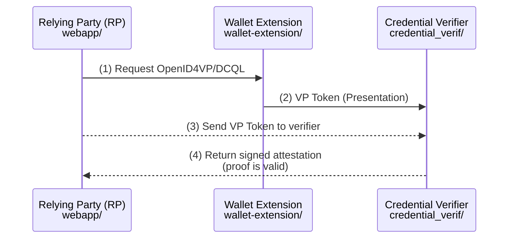

# AI Agent Instructions for ewqwe-auth

## Project Overview

This is an **EU Age Verification** system implementing the [EU Age Verification Profile](https://ageverification.dev/Technical%20Specification/annexes/annex-A/annex-A-av-profile) using W3C Digital Credentials:

- **Wallet Extension** (`wallet-extension/`) plus shared library (`js-lib/ewqwe-digital-identity/`) - TypeScript/vanilla JS extension host and helper library for storing Proof of Age credentials.
- **Webapp** (`webapp/`) - TypeScript/Deno **Relying Party (RP)** - performs verification requests and receives attestations.
- **Credential Verifier** (`credential_verifier/`) - Rust actix-web server - receives VP Tokens, validates proofs, and issues signed attestations.
- **OpenID4VP Rust helper crate** (`crates/openid4vp/`) - reusable protocol implementation and DCQL matching logic.

Standards: W3C Digital Credentials API, ISO/IEC 18013-5 (mDL/mDoc), OpenID4VP 1.0, EU Age Verification Profile, Harvard/Concerned Human Analysis Profile (HAIP).

## Architecture

The RP **delegates verification** to the credential_verifier, which validates the VP token (OpenID4VP / W3C DCQL) and returns a signed attestation (JWT or COSE). A dedicated `crates/openid4vp/` module contains shared request/response parsing, DCQL evaluation, and HAIP/JAR support.



## OpenID4VP + W3C DCQL Flows

This project implements [OpenID4VP 1.0](https://openid.net/specs/openid-4-verifiable-presentations-1_0.html) and W3C Digital Credentials Query Language (DCQL) with HAIP additions.

### Protocol modes in webapp

- `w3c-dc-openid4vp` (default on desktop): Annex C Sub-protocol B — OpenID4VP over W3C Digital Credentials API using `protocol: "openid4vp-v1-unsigned"`.
- `w3c-dc-iso-mdoc`: Annex C Sub-protocol A — raw ISO mDoc over DC API using `protocol: "org-iso-mdoc"` with CBOR/HPKE.
- `w3c-dc-fallback`: try Sub-protocol B first, then Sub-protocol A, then OpenID4VP cross-device.
- `openid4vp-cross-device`: QR code based cross-device OpenID4VP flow, `response_mode=direct_post`.
- `openid4vp-same-device`: same-device redirect flow, `response_mode=fragment`.
- `simulated`: local simulated proof path for development/test.

### Same-Device Flow (OpenID4VP)

- RP and Wallet on same device
- Uses redirects with `response_mode=fragment`
- Authorization Request → Wallet Extension → Authorization Response (VP Token)
- Recover from page reload with `sessionStorage` state restore in `webapp/src/relying_party_app.ts`

### Cross-Device Flow (OpenID4VP)

- RP on different device than Wallet (e.g., QR code scanning)
- Uses `response_mode=direct_post` with `response_uri`
- Wallet POSTs VP Token directly to RP endpoint (via `webapp/src/server.ts` proxy to `credential_verifier`)

### HAIP / JAR support

- `credential_verifier` supports `application/jwt` / `application/json` id_token handling and JAR profile requirement `authentication_request` via `openid4vp_endpoints`.
- JOSE/JWK discovery via `/.well-known/jwks.json` exposes verifier key IDs and optional JAR signing keys.

Key parameters:

- `response_type=vp_token` - Request Verifiable Presentations
- `dcql_query` - Digital Credentials Query Language for required claims
- `nonce` - Binds presentation to transaction (replay prevention)
- `client_id` with prefixes like `redirect_uri:` or `x509_hash:`

## Rust Workspace Conventions

### Cargo Workspace Structure

- **Root workspace** (`Cargo.toml`): Defines shared dependencies via `[workspace.dependencies]`
- **Members**: `credential_verifier`, `crates/logging`, `crates/openid4vp`, `crates/ewqwe-digital-identity`, `crates/ewqwe-digital-credential`, `crates/ewqwe-verifier-app`
- All members use `workspace = true` for version, edition, rust-version, authors, license

### Credential Building and Verification Library (`crates/ewqwe-digital-credential`)

- `ewqwe_digital_credential` crate provides all tooling to build, sign, and **verify** EU/EUDI credentials.
- Used by `credential_verifier` as a **regular runtime dependency** (not dev-only).
- **Building:**
  - **`CredentialIssuer`**: ephemeral two-level PKI (CA → issuer leaf + device key) for test and demo scenarios
  - **SD-JWT VC**: EU Age Verification Profile (`eu.europa.ec.av.1`) and EUDI PID (`eu.europa.ec.eudi.pid.1`)
  - **mDoc DeviceResponse**: ISO/IEC 18013-5, OpenID4VP `SessionTranscript`-bound `DeviceSignature`
- **Verification:**
  - **`decode_mdoc_presentation`**: lightweight CBOR claim extraction, no crypto
  - **`decode_sd_jwt_presentation`**: SD-JWT VC claim extraction + KB-JWT nonce, no crypto
  - **`verify_sd_jwt_signatures`**: `x5c` certificate chain + KB-JWT holder binding verification
  - **`verify_mdoc_presentation`**: full COSE_Sign1 `IssuerAuth` + `DeviceSignature` + MSO digest verification
- Feature `vendored` links OpenSSL statically (for CI / cross-compilation)
- See [`crates/ewqwe-digital-credential/README.md`](crates/ewqwe-digital-credential/README.md) for full API docs.

### OpenID4VP Service Layer

- `crates/openid4vp` contains reusable OpenID4VP + DCQL evaluation, request validation, and HAIP/JAR support. `credential_verifier` uses this crate for its HTTP endpoints.
- `credential_verifier/src/server/openid4vp_endpoints.rs` exposes: `/ewqwe_api/openid4vp/init`, `/ewqwe_api/openid4vp/direct_post`, `/ewqwe_api/openid4vp/request/{id}`, `/ewqwe_api/openid4vp/status/{id}`, `/.well-known/jwks.json`.

### Error Handling Pattern

**Critical**: Use the project's error handling system, not anyhow/eyre directly.

```rust
use crate::{AttError, AttResult, AttResultHelper};

// Type alias for Results
pub type AttResult<R> = Result<R, AttError>;

// Error context helper trait (custom, extends Result and Option)
fn example() -> AttResult<String> {
    some_operation()
        .context("failed to do operation")?;  // AttResultHelper trait
    Ok("success".to_string())
}

// Error construction macros (in credential_verifier/src/error/)
auth_error!("something went wrong");           // Create error
auth_bail!("early return with error");         // Return early
auth_ensure!(condition, "must be true");       // Guard clause
```

### TLS Configuration

Server supports both OpenSSL and rustls via Cargo features (default: `openssl`). TLS parameters in `TlsParams` struct require:

- `server_private_key`: PKCS#8 PEM format
- `server_certificate`: PEM format
- `server_ca_chain`: CA chain in PEM
- Optional `client_ca_cert_chain` for mTLS

### Logging

Use the `ewqwe_logging` crate ([crates/logging/](crates/logging/)):

```rust
use ewqwe_logging::{TracingConfig, tracing_init};

// Initialize at app start (NOT in #[tokio::test])
let _guard = tracing_init(&config);

// Use tracing macros
tracing::info!("server started");
tracing::debug!(user_id = %id, "processing request");
```

**Important**: In `#[tokio::test]`, use `log_init(Some("debug"))` instead of `tracing_init()` due to OTLP gRPC limitations.

### Testing

- Unit tests: `#[test]` in `tests.rs` modules within feature modules
- Integration tests: `credential_verifier/src/tests/` with `#[actix_web::test]` or `#[tokio::test]`
- Test utilities: `credential_verifier/src/tests/test_client/` and `test_server/`

## TypeScript/Deno Conventions

### Project Structure

Both `wallet-extension/` and `webapp/` follow the same pattern:

- `deno.json`: Tasks and imports configuration
- `vite.config.ts`: Vite bundler config
- `tailwind.config.js` + `postcss.config.js`: Tailwind CSS
- `src/`: TypeScript sources (no framework - vanilla TS)
- For shared credential types and protocol helpers, see `js-lib/ewqwe-digital-identity/`.

### Development Commands

```bash
cd wallet-extension/    # or webapp/
deno task dev      # Start dev server (wallet-extension: 5173, webapp: 5174)
deno task build    # Production build
deno task preview  # Preview production build
```

### Code Patterns

**No React/Vue** - Uses vanilla TypeScript with class-based architecture:

```typescript
// Main app controller pattern (wallet.ts, rp.ts)
export class WalletApp {
  private store: CredentialStore;
  private logger: DebugLogger;

  initialize(): void {
    this.setupEventListeners();
    this.renderUI();
  }
}
```

Type definitions centralized in `types.ts`:

- `StoredCredential`, `OpenID4VPRequest`, `OpenID4VPResponse`
- ISO 18013-5 structures: `MobileDriverLicense`, `MDLNamespace`

Credential configurations in `config.ts` (webapp) define ISO namespace mappings:

```typescript
export const CREDENTIAL_TYPES: Record<string, CredentialTypeConfig> = {
  mdl: {
    docType: "org.iso.18013.5.1.mDL",
    namespace: "org.iso.18013.5.1",
    claims: [
      /* ISO claim definitions */
    ],
  },
};
```

## Common Tasks

### Running the Full Stack

```bash
# Terminal 1: Wallet Extension
cd wallet-extension && deno task dev

# Terminal 2: Webapp (RP)
cd webapp && deno task dev

# Terminal 3 (future): Rust credential verifier
cd credential_verifier
cargo run --features openssl
```

### Webapp Proxy to Credential Verifier

- `webapp/server.ts` proxies `/ewqwe_api/openid4vp/*` to `CREDENTIAL_VERIFIER_URL`.
- Supports TLS with `CA_CERT_PATH`, connection retries for stale TLS sessions, and auto CA certificate reload for cert rotation.
- `poolIdleTimeout=30000` by default.

### Adding Rust Dependencies

Edit root `Cargo.toml` `[workspace.dependencies]`, then reference in member crate:

```toml
# In credential_verifier/Cargo.toml
my_crate = { workspace = true }
```

### Rust Feature Flags

- `openssl` (default) or `rustls`: TLS backend
- `no_jwt_validation`: **TEST ONLY** - disables JWT verification

## Runtime Dependencies

### Redis

The credential verifier requires a **Redis server** for session storage. The server connects to Redis at startup:

```rust
// From credential_verifier/src/server/att_server.rs
let storage = RedisSessionStore::new("redis://127.0.0.1:6379")
    .await
    .expect("failed to create Redis session store");
```

**Start Redis before running the server:**

```bash
# macOS (Homebrew)
brew services start redis

# Linux (systemd)
sudo systemctl start redis

# Docker
docker run -d -p 6379:6379 redis:alpine
```

Sessions are configured with a 24-hour TTL using `actix-session` with `redis-session` feature.

## Test Certificates

Test certificates for TLS connections and attestation signing are located in:

- **EC (P-256)**: `credential_verifier/src/tests/certificates/ec/`
- **RSA (4096-bit)**: `credential_verifier/src/tests/certificates/rsa/`

All certificates have SANs: `DNS:demo.ewqwe.local, DNS:localhost, IP:127.0.0.1`. For HAIP, the `client_id` derived from the EC server certificate is `x509_hash:<cert_sha256>`. The `cert_hash` is the base64url-encoded SHA-256 digest of the DER-encoded leaf certificate.

`demo.ewqwe.local` is used as the primary DNS SAN so that the EUDI Wallet's `response_uri` host-match check passes when running against the Android Studio emulator. The emulator must resolve `demo.ewqwe.local` → host machine — see [Android emulator setup](#android-emulator-setup) below.

| File                         | Purpose                                         |
| ---------------------------- | ----------------------------------------------- |
| `ewqwe.chain.pem`            | Full CA certificate chain                       |
| `ewqwe.root.key.pem`         | Root CA private key                             |
| `ewqwe.server.cert.pem`      | Server TLS certificate                          |
| `ewqwe.server.key.pem`       | Server private key (for TLS/signing)            |
| `ewqwe.server.fullchain.pem` | Leaf + CA chain (EC only, for JAR `x5c` header) |
| `ewqwe.user1.cert.pem`       | Client certificate for mTLS testing             |
| `ewqwe.user1.key.pem`        | Client private key                              |
| `ewqwe.user1.p12`            | PKCS#12 bundle for browser testing              |

**⚠️ These are TEST CERTIFICATES ONLY** - never use in production.

Generate new certificates using the provided scripts:

```bash
cd credential_verifier/src/tests/certificates/ec
./generate_certs_p256.sh

cd ../rsa
./generate_certs_rsa4096.sh
```

## Attestation Signing

The credential verifier signs attestations confirming successful age verification. Supported formats and algorithms:

### JWT Attestations (RS256/ES256)

```rust
use credential_verifier::attestation::{
    AttestationClaims, JwtSigner, SigningAlgorithm
};

// Create claims
let claims = AttestationClaims::new(
    "verifier.example.com",  // issuer
    "rp.example.com",        // audience (relying party)
    "session-123",           // subject (session ID)
    true,                    // age_verified
)
.with_age_over(18)
.with_namespace("eu.europa.ec.av.1")
.with_nonce("request-nonce");

// Sign with ES256 (P-256 ECDSA)
let signer = JwtSigner::from_pem(SigningAlgorithm::ES256, &private_key_pem)?;
let jwt = signer.sign_to_string(&claims)?;

// Or RS256 (RSA)
let signer = JwtSigner::from_pem(SigningAlgorithm::RS256, &rsa_key_pem)?;
```

### COSE/CBOR Attestations (ES256/RS256)

For mDoc-compatible attestations using COSE_Sign1 (RFC 8152):

```rust
use credential_verifier::attestation::{
    AttestationClaims, CoseSigner, CoseSigningAlgorithm, verify_cose_attestation
};

// Sign
let signer = CoseSigner::from_pem(CoseSigningAlgorithm::ES256, &private_key_pem)?
    .with_key_id(b"key-2024-01");
let cose_bytes = signer.sign_to_bytes(&claims)?;

// Verify
let verified = verify_cose_attestation(&cose_bytes, &public_key_pem, CoseSigningAlgorithm::ES256)?;
```

### Attestation Claims Structure

| Claim          | Type    | Description                           |
| -------------- | ------- | ------------------------------------- |
| `iss`          | String  | Credential verifier identifier        |
| `aud`          | String  | Relying party identifier              |
| `sub`          | String  | Session/transaction ID                |
| `exp/iat/nbf`  | i64     | Standard JWT timestamps               |
| `jti`          | String  | Unique attestation ID (UUID)          |
| `age_verified` | bool    | Whether age requirement was met       |
| `age_over`     | u8?     | Age threshold verified (e.g., 18, 21) |
| `av_namespace` | String? | Namespace used (eu.europa.ec.av.1)    |
| `nonce`        | String? | Nonce from OpenID4VP request          |

## Key Files Reference

| Purpose                        | Location                                                                                                                 |
| ------------------------------ | ------------------------------------------------------------------------------------------------------------------------ |
| Error types & macros           | [credential_verifier/src/error/](credential_verifier/src/error/)                                                         |
| Attestation signing            | [credential_verifier/src/attestation/](credential_verifier/src/attestation/)                                             |
| Server entry point             | [credential_verifier/src/server/att_server.rs](credential_verifier/src/server/att_server.rs)                             |
| Verify endpoint (HTTP handler) | [credential_verifier/src/server/verify_endpoint/mod.rs](credential_verifier/src/server/verify_endpoint/mod.rs)           |
| Logging configuration          | [crates/logging/src/lib.rs](crates/logging/src/lib.rs)                                                                   |
| Test certificates (EC)         | [credential_verifier/src/tests/certificates/ec/](credential_verifier/src/tests/certificates/ec/)                         |
| Test certificates (RSA)        | [credential_verifier/src/tests/certificates/rsa/](credential_verifier/src/tests/certificates/rsa/)                       |
| DCQL query examples            | [documentation/dcql_age_verification.md](documentation/dcql_age_verification.md)                                         |
| Credential building            | [crates/ewqwe-digital-credential/](crates/ewqwe-digital-credential/)                                                     |
| mDoc CBOR decoder (no crypto)  | [crates/ewqwe-digital-credential/src/mdoc_decoder.rs](crates/ewqwe-digital-credential/src/mdoc_decoder.rs)               |
| SD-JWT VC verification         | [crates/ewqwe-digital-credential/src/sd_jwt_verification.rs](crates/ewqwe-digital-credential/src/sd_jwt_verification.rs) |
| mDoc COSE verification         | [crates/ewqwe-digital-credential/src/mdoc_verification.rs](crates/ewqwe-digital-credential/src/mdoc_verification.rs)     |
| Wallet main logic              | [wallet-extension/src/wallet.ts](wallet-extension/src/wallet.ts)                                                         |
| RP credential handling         | [webapp/src/credentials.ts](webapp/src/credentials.ts)                                                                   |
| ISO credential configs         | [webapp/src/config.ts](webapp/src/config.ts)                                                                             |
| Verifier App crate             | [crates/ewqwe-verifier-app/](crates/ewqwe-verifier-app/)                                                                 |
| Verifier App routes            | [crates/ewqwe-verifier-app/src/routes.rs](crates/ewqwe-verifier-app/src/routes.rs)                                       |
| Verifier App stores            | [crates/ewqwe-verifier-app/src/stores/](crates/ewqwe-verifier-app/src/stores/)                                           |
| Verifier App SPA               | [crates/ewqwe-verifier-app/src/static/index.html](crates/ewqwe-verifier-app/src/static/index.html)                       |
| Verifier App documentation     | [documentation/src/qrcode_app.md](documentation/src/qrcode_app.md)                                                       |
| Standards documentation        | [documentation/](documentation/)                                                                                         |

## Standards Compliance

When working with credentials, consult:

- [documentation/digital_credential_format.md](documentation/digital_credential_format.md) - Format specs
- ISO 18013-5 namespace: `org.iso.18013.5.1` for mDL claims
- OpenID4VP protocol for presentation exchanges
- W3C Digital Credentials API: `navigator.credentials.get()`/`.create()`
