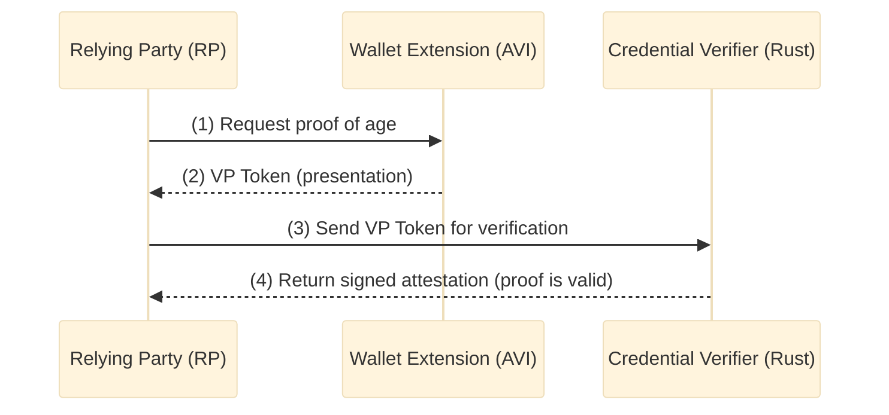

# Digital Credentials Authentication Project

This project contains a browser extension wallet, a Relying Party web App, and a Rust credential verifier for demonstrating W3C Digital Credentials:

1. **Wallet Extension** (`/wallet-extension`) - A browser extension implementing the Age Verification App Instance (AVI)
2. **Web App** (`/web App`) - A Relying Party demo that requests and verifies credentials
3. **Credential Verifier** (`/credential_verifier`) - Rust backend that verifies presentations and issues attestations

## Quick Start

### Prerequisites

- [Deno](https://deno.land/) v1.40 or later

[text](https://meet.google.com/qrk-rnjv-kap?authuser%3D1%26hs%3D122%26ijlm%3D1772011860195)### Running the Web App (RP)

Open two terminal windows:

**Terminal 1 - Web App API (port 8000):**

```bash
cd webapp

PUBLIC_URL=https://<WEB_APP_URL> \
deno task api
```

**Terminal 2 - Web App UI (port 5174):**

```bash
cd webapp
deno task vite
```

### Running the Wallet Extension

See [wallet-extension/README.md](wallet-extension/README.md) for build and installation steps.

### Running the Credential Verifier (Rust)

The verifier requires Redis running at `redis://127.0.0.1:6379`.

The verifier may also need a reverse proxy (e.g. Nginx):

```sh
docker run --name ewqwe_proxy -p 4343:443 bgrieder/ewqwe_nginx
```

Then run the verifier with

```bash
cd credential_verifier

RUST_LOG=info \
X509_CERT_PATH=src/tests/certificates/ec/ewqwe.server.fullchain.pem \
X509_KEY_PATH=src/tests/certificates/ec/ewqwe.server.key.pem \
cargo run --features openssl
```

### Editing and serving the documentation

The documentation is located in the `documentation` directory, written in Markdown, and served with `mdbook`:

```bash
mdbook serve --open
```

## Architecture



## Technology Stack

- **Runtime**: Deno
- **Build Tool**: Vite
- **Language**: TypeScript
- **Styling**: Tailwind CSS
- **Backend**: Rust (credential verifier)

## Standards Implemented

- [W3C Digital Credentials API](https://www.w3.org/TR/digital-credentials/)
- [W3C Verifiable Credentials Data Model 2.0](https://www.w3.org/TR/vc-data-model-2.0/)
- [OpenID for Verifiable Presentations (OpenID4VP)](https://openid.net/specs/openid-4-verifiable-presentations-1_0.html)
- [ISO/IEC 18013-5 (Mobile Driving License)](https://www.iso.org/standard/69084.html)

## Project Structure

```text
ewqwe-auth/
├── opus.md                 # Project requirements
├── README.md               # This file
├── wallet-extension/       # Browser extension wallet (AVI)
│   ├── manifest.json
│   ├── background/
│   ├── content/
│   ├── popup/
│   └── src/
├── web App/                 # Relying Party demo application
│   ├── deno.json
│   ├── server.ts
│   ├── vite.config.ts
│   ├── index.html
│   └── src/
└── credential_verifier/    # Rust verifier backend
    ├── Cargo.toml
    └── src/
```

## Current Capabilities

- Same-device and cross-device OpenID4VP flows
- Browser extension wallet with sample credentials
- Rust verifier with attestation signing
