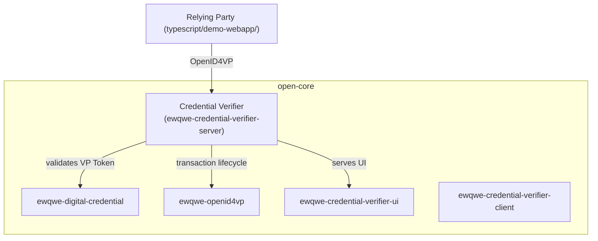

# ewQwe Identity — Open Core

[](LICENSE)

**EU Age Verification** system implementing the [EU Age Verification Profile](https://ageverification.dev/) using W3C Digital Credentials.

This is the **open-core** (BSL-1.1) repository. The enterprise version with OTLP tracing, PostgreSQL/Redis backends, APISIX/EIDAS auth, and multi-tenancy is in available on [ewQwe's website](https://ewqwe.com/identity).

---

## Repository Structure

```
├── Cargo.toml                    ─ Rust workspace (6 crates)
├── crates/
│   ├── ewqwe-logging/           ─ stdout-only logging
│   ├── ewqwe-digital-credential/─ credential crypto (SD-JWT, mDoc)
│   ├── ewqwe-openid4vp/         ─ OpenID4VP protocol, DCQL, stores (SQLite)
│   ├── ewqwe-credential-verifier-client/ ─ RP client library
│   ├── ewqwe-credential-verifier-ui/     ─ Web UI (SQLite)
│   └── ewqwe-credential-verifier-server/ ─ Server + routes
├── typescript/     ─ pnpm workspace (TypeScript/Node.js)
│   ├── ewqwe-digital-identity/ ─ Shared JS library (@ewqwe/digital-identity)
│   └── demo-webapp/            ─ Relying Party demo (@ewqwe/demo-webapp)
├── documentation/   ─ mdBook docs
└── certificates/    ─ Dev/test certificates only
```

## Prerequisites

- **Rust** 1.70+ (install via [rustup](https://rustup.rs))
- **pnpm** >= 9 (for TypeScript workspace — install via `npm install -g pnpm`)
- **Redis** (required for credential verifier sessions)

## Build & Run

### Open-Core Rust Crates

```bash
# Build all crates
cargo build --workspace

# Run all tests
cargo test --workspace

# Run the credential verifier server with dev config
cargo run -- -p ewqwe_credential_verifier_server -- \
  crates/ewqwe-credential-verifier-server/credential-server.toml
```

> **Note:** The open-core uses SQLite and in-memory stores by default. No PostgreSQL or Redis setup is needed for basic operation.

### TypeScript Workspace (Relying Party Demo & Shared Library)

```bash
cd typescript
pnpm install
pnpm --filter @ewqwe/digital-identity build
pnpm dev          # starts demo-webapp on https://localhost:5174
```

See the [TypeScript workspace README](typescript/README.md) for more details.

### Verifier UI (Admin Dashboard)

The Verifier UI is an embedded SPA in `crates/ewqwe-credential-verifier-ui/ui/`. Build with:

```bash
cd crates/ewqwe-credential-verifier-ui/ui
pnpm install
pnpm build
```

For development with hot-reload and API proxy to the credential verifier:

```bash
pnpm dev          # starts on https://localhost:5174
```

See the [crate README](crates/ewqwe-credential-verifier-ui/README.md) for more details.

## Publishing to crates.io

Crates must be published bottom-up (leaf dependencies first):

```bash
cargo publish -p ewqwe_digital_credential
cargo publish -p ewqwe_logging
cargo publish -p ewqwe_openid4vp
cargo publish -p ewqwe_credential_verifier_client
cargo publish -p ewqwe_credential_verifier_ui
cargo publish -p ewqwe_credential_verifier_server
```

## Architecture



## License

This project is licensed under the **Business Source License 1.1** (BSL-1.1). See [LICENSE](LICENSE).

## Enterprise Version

The **enterprise** version adds:

| Feature | Enterprise Crate |
|---------|-----------------|
| OpenTelemetry (OTLP) tracing & metrics | `ewqwe-enterprise-logging` |
| PostgreSQL & Redis stores | `ewqwe-enterprise-stores` |
| APISIX/EIDAS authentication | `ewqwe-enterprise-auth` |
| mTLS, multi-tenancy, K8s Helm charts | `ewqwe-enterprise-server` |

Check the web-site for details on the enterprise offering.
