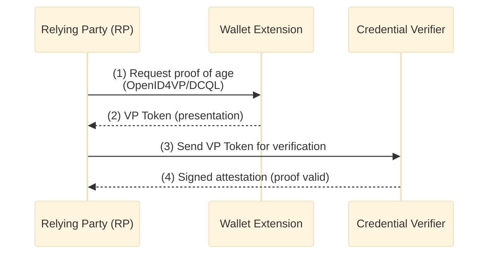

# ewQwe Identity

**For user-facing documentation, see [documentation/](documentation/) or visit the [online docs](https://ewqwe-identity.readthedocs.io).**

This is a **developer guide** for building and running the ewQwe Identity system locally.

## Project Overview

This project implements the [EU Age Verification Profile](https://ageverification.dev/) using W3C Digital Credentials, consisting of:

- **Relying Party (RP)** (`webapp/`) - Deno/TypeScript application that requests and verifies credentials
- **Credential Verifier** (`crates/ewqwe-credential-verifier-server/`) - Rust backend that validates VP Tokens and issues attestations
- **Verifier UI** (`crates/ewqwe-credential-verifier-ui/ui/`) - Admin dashboard for managing verifier operations
- **Reverse Proxy** (`reverse-proxy/`) - Docker-based Nginx proxy with Let's Encrypt ACME support

## Prerequisites

- **Deno** v1.40+ (for webapp)
- **Rust** 1.70+ (for credential verifier)
- **Node.js/npm** (for verifier UI)
- **Docker** (for reverse proxy and optional services)
- **Redis** (required for credential verifier session storage)

## Quick Start - Development Setup

### 1. Start Redis (Required for Verifier)

```bash
# macOS (Homebrew)
brew services start redis

# Linux (systemd)
sudo systemctl start redis

# Docker
docker run -d -p 6379:6379 redis:alpine
```

Verify Redis is running: `redis-cli ping` should return `PONG`.

### 2. Credential Verifier Server + UI

**Terminal 1 - Rust Verifier Server:**

```bash
cd crates/ewqwe-credential-verifier-server

# The server looks for credential-server.toml in the current directory
# or in platform-specific config directories:
#   macOS: ~/Library/Application Support/ewQwe/Credential Server/config.toml
#   Linux: ~/.config/ewQwe/Credential Server/config.toml
#   Windows: %APPDATA%\ewQwe\Credential Server\config.toml

RUST_LOG=info cargo run
```

The server starts on `https://localhost:9443` (self-signed certificate for development).

**Terminal 2 - Verifier UI (npm dev server):**

```bash
cd crates/ewqwe-credential-verifier-ui/ui

npm install
npm run dev
```

The UI dev server starts on `http://localhost:5173` and proxies API calls to the Rust server.

### 3. Relying Party Webapp

Open **two new terminals**:

**Terminal 3 - Deno Backend API (port 5175):**

```bash
cd webapp

deno task api
```

**Terminal 4 - Vite Dev UI (port 5174):**

```bash
cd webapp

deno task vite
```

Access the RP at `http://localhost:5174`.

### 4. Browser Extension Wallet

See [wallet-extension/README.md](wallet-extension/README.md) for building and installing the extension.

## Component Development Details

### Credential Verifier Server (`crates/ewqwe-credential-verifier-server/`)

The Rust backend validates OpenID4VP presentations and issues signed attestations.

**Features:**
- OpenID4VP 1.0 and W3C DCQL support
- mDoc (ISO/IEC 18013-5) and SD-JWT VC verification
- JWT and COSE attestation signing
- Session storage via Redis with 24-hour TTL
- TLS with configurable certificate paths
- HAIPv1 (HAIP/JAR) support for advanced flows

**Configuration:** `credential-server.toml` (see `crates/ewqwe-credential-verifier-server/credential-server.toml` for example)

**Key endpoints:**
- `POST /ewqwe_api/openid4vp/init` - Initialize verification request
- `POST /ewqwe_api/openid4vp/direct_post` - Cross-device VP Token submission
- `GET /.well-known/jwks.json` - JOSE key discovery

**Running with custom config:**

```bash
cd crates/ewqwe-credential-verifier-server

# Copy and edit example config
cp credential-server.toml ./my-config.toml
# Edit my-config.toml with your paths...

# Run with custom config file in current directory
RUST_LOG=info cargo run
```

### Verifier UI (`crates/ewqwe-credential-verifier-ui/ui/`)

A Vite + TypeScript admin dashboard for the credential verifier.

```bash
cd crates/ewqwe-credential-verifier-ui/ui

# Development (auto-reload on changes)
npm run dev

# Production build
npm run build

# Preview production build locally
npm run preview
```

The UI proxies API requests to `https://localhost:9443` (configured in `vite.config.ts`).

### Relying Party Webapp (`webapp/`)

A Deno/TypeScript application demonstrating OpenID4VP credential requests.

**Key files:**
- `server.ts` - Deno backend API server (proxies to credential verifier)
- `src/relying_party_app.ts` - RP application logic
- `vite.config.ts` - Frontend build configuration

**Development tasks:**

```bash
cd webapp

deno task dev     # Print reminder to run api + vite
deno task api     # Start backend (port 5175)
deno task vite    # Start Vite dev server (port 5174)
deno task build   # Production build
deno task preview # Preview production build
```

**Environment variables:**
- `CREDENTIAL_VERIFIER_URL` - Backend verifier URL (default: `https://localhost:9443`)
- `PUBLIC_URL` - Public RP URL for redirects

**Flow:**
1. User requests proof of age at RP (port 5174)
2. RP backend (port 5175) creates OpenID4VP authorization request
3. Authorization request is sent to wallet extension via W3C DC or redirect
4. Wallet presents VP Token back to RP
5. RP server proxies to credential verifier for validation
6. Verifier returns signed attestation, RP displays result

### Reverse Proxy (`reverse-proxy/`)

Production-grade Nginx reverse proxy with automatic HTTPS (Let's Encrypt ACME).

**Building:**

```bash
cd reverse-proxy

docker build -t ewqwe-reverse-proxy .
```

**Running:**

```bash
cd reverse-proxy

# Edit environment in reverse_proxy_run.sh before running:
# - DOMAIN: your domain (e.g., id.demo.ewqwe.eu)
# - DESTINATION: upstream server (e.g., 192.168.1.10:9443)
# - CERTBOT_EMAIL: your email for Let's Encrypt

bash reverse_proxy_run.sh
```

**Network setup:**
- Forward port 80 and 443 from your router to the machine running this container
- After ACME provisioning, close port 80 to prevent abuse
- The proxy listens on `4080:80` and `4043:443` on the Docker host

**Configuration:** See `nginx.conf.template` and `nginx-http.conf` for Nginx settings.

## Documentation

The full technical documentation is located in the `documentation/` directory:

```bash
cd documentation

# Serve locally with mdbook
mdbook serve --open
```

Key topics:
- **Architecture & Flows** - OpenID4VP, W3C DCQL, same-device vs cross-device
- **Credential Formats** - mDoc, SD-JWT VC, EU Age Verification Profile
- **Standards Compliance** - ISO/IEC 18013-5, OpenID4VP 1.0, W3C Digital Credentials API
- **QR Code Verifier App** - Standalone verification for cross-device flows

## Architecture



**Flow:**
1. RP creates an OpenID4VP authorization request with W3C DCQL query
2. Wallet receives request, extracts required claims, creates Verifiable Presentation
3. RP receives VP Token and sends to credential verifier for validation
4. Verifier checks signatures, validates claims, returns signed attestation
5. RP displays result to user

## Technology Stack

| Component | Technology |
|-----------|-----------|
| **Wallet Extension** | TypeScript, Manifest V3 |
| **RP Webapp** | Deno, TypeScript, Vite, Tailwind CSS |
| **Verifier Server** | Rust, Actix-web, OpenID4VP protocol |
| **Verifier UI** | TypeScript, Vite, Tailwind CSS |
| **Reverse Proxy** | Nginx, Docker, Let's Encrypt |
| **Session Storage** | Redis |

## Standards Implemented

- **[W3C Digital Credentials API](https://www.w3.org/TR/digital-credentials/)** - Browser credential storage and retrieval
- **[W3C Digital Credentials Query Language (DCQL)](https://www.w3.org/TR/digital-credential-query-language/)** - Credential request syntax
- **[OpenID4VP 1.0](https://openid.net/specs/openid-4-verifiable-presentations-1_0.html)** - Presentation request protocol
- **[ISO/IEC 18013-5 (mDL)](https://www.iso.org/standard/69084.html)** - Mobile document format
- **[EU Age Verification Profile](https://ageverification.dev/)** - Age verification specification
- **[W3C Verifiable Credentials Data Model 2.0](https://www.w3.org/TR/vc-data-model-2.0/)** - Credential data format

## Project Structure

```
ewqwe-identity/
├── README.md                               # This file
├── documentation/                          # User & developer docs (mdbook)
│   ├── src/                               # Markdown source files
│   └── book.toml                          # mdbook config
├── wallet-extension/                       # Browser extension wallet
│   ├── manifest.json
│   ├── src/
│   ├── popup/
│   ├── background/
│   └── content/
├── webapp/                                  # Relying Party demo (Deno/TypeScript)
│   ├── deno.json
│   ├── server.ts                          # Backend API
│   ├── vite.config.ts
│   ├── tailwind.config.js
│   └── src/
├── crates/                                  # Rust workspace
│   ├── ewqwe-credential-verifier-server/  # Verifier backend
│   │   ├── Cargo.toml
│   │   ├── credential-server.toml         # Example config
│   │   └── src/
│   ├── ewqwe-credential-verifier-ui/      # Verifier admin UI (Rust server)
│   │   ├── ui/                            # Frontend (npm/Vite)
│   │   │   ├── package.json
│   │   │   ├── vite.config.ts
│   │   │   └── src/
│   │   └── src/
│   ├── ewqwe-digital-credential/          # Credential building & verification
│   ├── ewqwe-digital-identity/            # Shared types & utilities
│   ├── logging/                            # Tracing configuration
│   └── openid4vp/                         # OpenID4VP protocol implementation
├── js-lib/                                  # TypeScript shared libraries
│   ├── ewqwe-digital-identity/
│   └── ewqwe-digital-identity-backend/
├── reverse-proxy/                           # Nginx proxy (Docker)
│   ├── Dockerfile
│   ├── nginx.conf.template
│   ├── nginx-http.conf
│   ├── entrypoint.sh
│   └── reverse_proxy_run.sh               # Launch script
├── certificates/                            # Test TLS & signing certificates
│   ├── tls/
│   ├── signer/
│   └── issuers_cas/
└── Cargo.toml                              # Rust workspace manifest
```

## Troubleshooting

### Redis Connection Error
```
Error: failed to create Redis session store
```
**Solution:** Ensure Redis is running on `localhost:6379` and accessible.

### TLS Certificate Errors
The development server uses self-signed certificates. Browsers will show security warnings, which is expected.
- For CLI tools: use `--insecure` or `--no-check-certificate` flags
- For curl/Deno: use `--insecure` or trust the self-signed certificate

### Verifier UI Cannot Connect to Server
If the UI shows connection errors:
1. Ensure credential verifier server is running on `https://localhost:9443`
2. Check browser console for CORS errors
3. Verify the proxy path in `vite.config.ts` matches your server URL

## Contributing

For contribution guidelines and development setup details, see [CONTRIBUTING.md](CONTRIBUTING.md) (if present).

## License

See LICENSE file for details.
