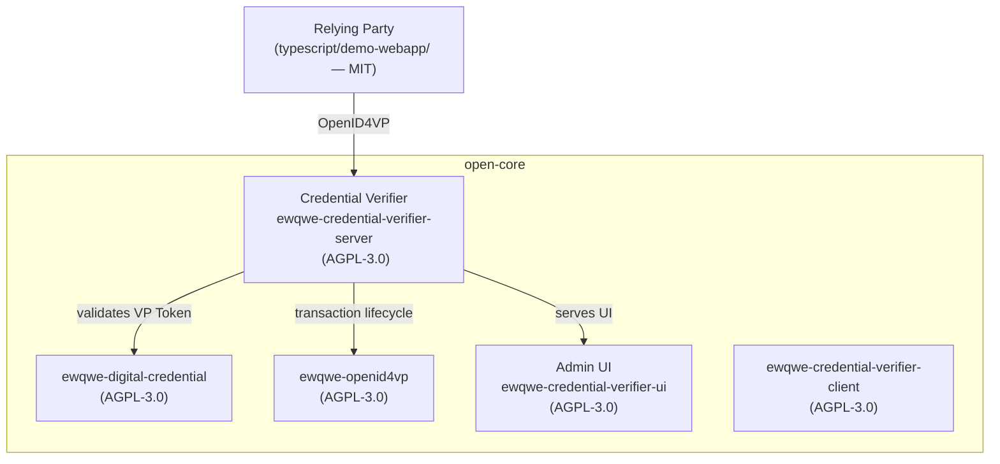

# ewQwe *`/you-kwee/`* Identity — Open Core


[](LICENSE)
&
[](typescript/LICENSE)

**Open-source** credential verifier developped in the EU andcompatible with the **EUDI/EIDAS wallet ecosystem**.

This project provides a complete solution, with a user interface, for verifying digital credentials, including the "age over 18" verification for the widely deployed France Identité Numérique wallet.

---

## Why an open-source credential verifier

The EU Digital Identity (EUDI) Wallet ecosystem enables citizens to present electronically signed credentials — such as Proof of Age — to relying parties. This project provides the **verifier side** of that ecosystem: a server that accepts Verifiable Presentations from EUDI Wallets (via OpenID4VP), validates their cryptographic integrity, and returns signed attestations.

The credential verifier server ships with an **embedded admin UI** (build the SPA, enable it in the config, and it's served at the server root URL — no separate frontend deployment required). A **MIT-licensed demo webapp** is also provided so you can see how to embed digital credential verification into an existing web application.

## Components

This repository contains:

| Component | Description | License |
|---|---|---|
| **Credential Verifier** (`ewqwe-credential-verifier-server`) | Core server: receives VP Tokens, validates proofs (SD-JWT, mDoc), issues signed JWT attestations. Handles the full OpenID4VP transaction lifecycle. | AGPL-3.0 |
| **Admin UI** (`ewqwe-credential-verifier-ui`) | Embedded SPA served by the verifier. Age Verification dashboard with QR-code-driven flow, user management, audit journal, and i18n. Works out of the box. | AGPL-3.0 |
| **Demo Webapp** (`typescript/demo-webapp`) | Relying Party (RP) demo — vanilla TypeScript SPA that requests credentials via OpenID4VP and displays verification results. MIT-licensed so you can freely adapt and embed it. | MIT |
| **Shared JS Library** (`typescript/@ewqwe/digital-identity`) | TypeScript library: DCQL query builders, protocol profiles, EwqweApiClient, attestation parsing. Published to npm. | MIT |
| **OpenID4VP Library** (`ewqwe-openid4vp`) | Reusable Rust crate: DCQL query building, JAR signing, JWE decryption, transaction stores. | AGPL-3.0 |
| **Digital Credential Library** (`ewqwe-digital-credential`) | Rust crate: SD-JWT VC and mDoc (ISO 18013-5) credential building, signing, and verification with ephemeral PKI. | AGPL-3.0 |
| **RP Client Library** (`ewqwe-credential-verifier-client`) | Rust client library for the credential verification API. | AGPL-3.0 |



## How it works

The **Relying Party** (your application, or the demo-webapp) initiates an OpenID4VP transaction with the **Credential Verifier**. The user's EUDI Wallet scans a QR code (or receives a deep link) and presents the requested credential. The verifier:

1. Receives the VP Token via `direct_post`
2. Decrypts JWE, validates JWS/JAdES signatures
3. Verifies mDoc COSE or SD-JWT disclosures against the issuer's certificate chain
4. Returns a signed JWT attestation to the relying party

The **Admin UI** provides an operator-facing dashboard — no separate deployment needed, the SPA is compiled into the server binary and served at the root URL.

## Using

### Embedded Admin UI

The Admin UI is an SPA. Before the server can serve it, the SPA must be built:

```bash
cd crates/ewqwe-credential-verifier-ui/ui
pnpm install
pnpm build
cd -
```

Then start the server with the development config (which has `[verifier_ui]`
enabled and `ui_dist_path` pointing at the built SPA):

```bash
cargo run -p ewqwe_credential_verifier_server -- \
  crates/ewqwe-credential-verifier-server/credential-server.toml
```

When the `[verifier_ui]` section has `enabled = true` and the `dist/` directory
exists, the UI is served at the root URL and the API at `/api/v1/*`.

On first start, navigate to the server URL and complete the one-time bootstrap
to create an admin account.  Then you can:

- Generate QR codes for cross-device OpenID4VP flows
- Monitor transactions and verification results in real time
- Manage operator users and view the audit journal

> **Note:** The development config has `[verifier_ui]` enabled and points to
> `../ewqwe-credential-verifier-ui/ui/dist` relative to the config file. If the
> SPA has not been built, the server logs a trace-level message and skips
> serving it — no error is raised.

### Demo Webapp (Relying Party)

The demo-webapp shows how to integrate credential verification into your own web app:

```bash
cd typescript
pnpm install
pnpm --filter @ewqwe/digital-identity build
pnpm --filter @ewqwe/demo-webapp dev    # https://localhost:5174
```

See the [TypeScript workspace README](typescript/README.md) for details.

### As a Rust Dependency

```toml
[dependencies]
ewqwe_credential_verifier_client = { git = "https://github.com/rd-ewqwe/ewqwe-identity" }
```

## Building

### Prerequisites

- **Rust** 1.70+ (install via [rustup](https://rustup.rs))
- **pnpm** >= 9 (install via `npm install -g pnpm`)

> The open-core uses SQLite and in-memory stores by default. No PostgreSQL or Redis setup is needed for basic operation.

### Rust Crates

```bash
# Build all crates
cargo build --workspace
```

### TypeScript Workspace

```bash
cd typescript
pnpm install
pnpm --filter @ewqwe/digital-identity build
pnpm build
```

### Admin UI (embedded SPA)

The UI SPA is built separately from the Rust crate:

```bash
cd crates/ewqwe-credential-verifier-ui/ui
pnpm install
pnpm build
```

For development with hot-reload:

```bash
pnpm dev    # https://localhost:5174
```

## Testing

```bash
# All Rust crates
cargo test --workspace

# TypeScript library
cd typescript
pnpm --filter @ewqwe/digital-identity test

# All TypeScript packages
pnpm test
```

---

## License

The open-core crates are licensed under the **AGPL-3.0** — see [LICENSE](LICENSE). The TypeScript packages `@ewqwe/digital-identity` and `demo-webapp` are licensed under **MIT**.

## Enterprise Version

The **enterprise** version adds:

| Feature | Enterprise Crate |
|---------|-----------------|
| OpenTelemetry (OTLP) tracing & metrics | `ewqwe-enterprise-logging` |
| PostgreSQL & Redis stores | `ewqwe-enterprise-stores` |
| APISIX/EIDAS authentication | `ewqwe-enterprise-auth` |
| mTLS, multi-tenancy, K8s Helm charts | `ewqwe-enterprise-server` |

**Credential Verification as a Service** is coming soon — check [ewqwe.eu](https://ewqwe.eu) for updates and details on the enterprise offering.
