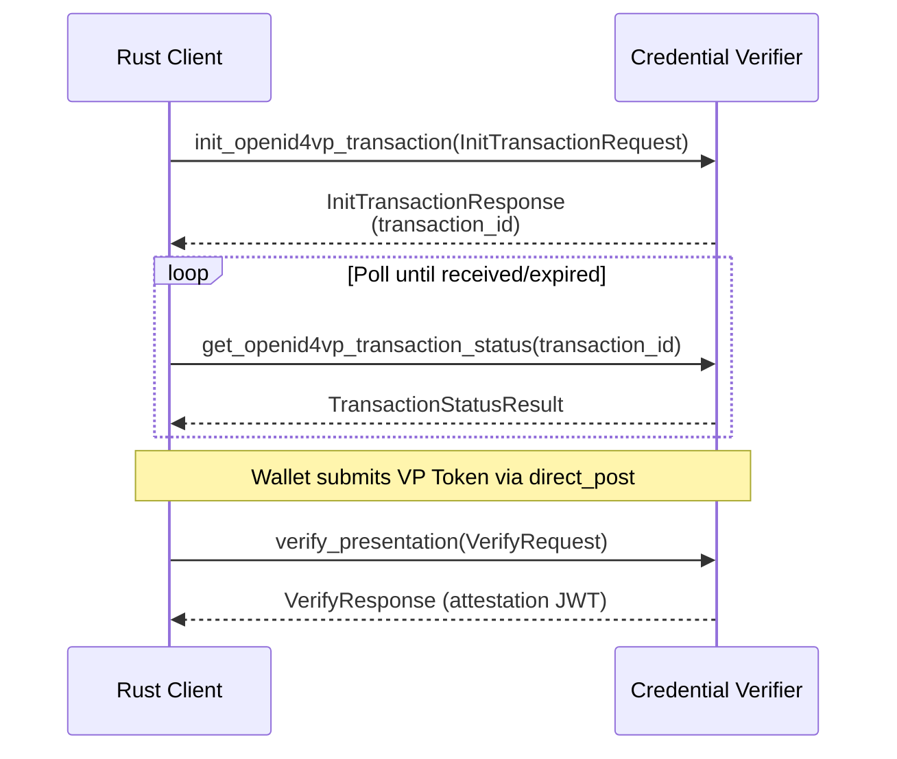

# `ewqwe_digital_identity`

Rust client library for the [ewQwe EU Age Verification](https://ageverification.dev/) system.

Mirrors the `@ewqwe/digital-identity` JavaScript library and covers:

- All `/ewqwe_api/openid4vp/*` REST endpoints (OpenID4VP 1.0 transaction lifecycle)
- The `/ewqwe_api/verify` credential verification endpoint
- Typed request/response models for OpenID4VP 1.0, DCQL, and EU Age Verification

[](https://crates.io/crates/ewqwe_digital_identity)
[](https://docs.rs/ewqwe_digital_identity)
[](LICENSE)

---

## Table of Contents

1. [Quick Start](#quick-start)
2. [Feature Flags](#feature-flags)
3. [Transport Injection](#transport-injection)
4. [Mutual TLS (mTLS)](#mutual-tls-mtls)
5. [Endpoint Reference](#endpoint-reference)
6. [Models](#models)
7. [Error Handling](#error-handling)
8. [Testing](#testing)
9. [Standards](#standards)

---

## Quick Start

Add to your `Cargo.toml`:

```toml
[dependencies]
ewqwe_digital_identity = "0.1"
tokio = { version = "1", features = ["full"] }
```

```rust
use ewqwe_digital_identity::{ClientOptions, EwqweApiClient, InitTransactionRequest};

#[tokio::main]
async fn main() -> ewqwe_digital_identity::Result<()> {
    // Build the client.  Provide the CA cert if the server uses a private CA.
    let opts = ClientOptions::new("https://verifier.example.com")?
        .with_ca_cert(include_str!("ca-chain.pem"));

    let client = EwqweApiClient::new(opts)?;

    // Step 1 — initialize a transaction (server builds DCQL authorization request)
    let req = InitTransactionRequest::new("https://rp.example.com")
        .with_profile("annex-a")
        .with_credential_type("proof-of-age");

    let tx = client.init_openid4vp_transaction(req).await?;

    println!("Transaction ID : {}", tx.transaction_id);
    println!("QR code URI    : {}", tx.authorization_request_uri);

    // Step 2 — poll status until wallet has responded
    loop {
        let status = client.get_openid4vp_transaction_status(&tx.transaction_id).await?;

        match status.status {
            ewqwe_digital_identity::TransactionStatus::Pending => {
                tokio::time::sleep(std::time::Duration::from_millis(500)).await;
            }
            ewqwe_digital_identity::TransactionStatus::Received => {
                let auth_resp = status.authorization_response.unwrap();
                println!("VP Token received: {}", &auth_resp.vp_token[..40]);
                break;
            }
            other => {
                eprintln!("Unexpected status: {other:?}");
                break;
            }
        }
    }

    Ok(())
}
```

---

## Feature Flags

| Feature       | Default | Description                                             |
|---------------|---------|---------------------------------------------------------|
| `default-tls` | ✅      | TLS via [native-tls](https://crates.io/crates/native-tls) (OpenSSL / SChannel) |
| `rustls-tls`  | ❌      | TLS via [rustls](https://crates.io/crates/rustls) (pure Rust, no system libs) |

Enable `rustls-tls` (and disable the default):

```toml
ewqwe_digital_identity = { version = "0.1", default-features = false, features = ["rustls-tls"] }
```

---

## Transport Injection

The client is generic over the HTTP transport via the [`HttpClient`] trait.
Any `Send + Sync + 'static` type that implements `get_json` and `post_json`
can be used:

```rust
use async_trait::async_trait;
use ewqwe_digital_identity::{ApiError, HttpClient, Result};
use serde::{Serialize, de::DeserializeOwned};
use url::Url;

struct MyTransport;

#[async_trait]
impl HttpClient for MyTransport {
    async fn get_json<R: DeserializeOwned>(&self, url: Url) -> Result<R> {
        // … call your own HTTP stack …
        todo!()
    }

    async fn post_json<B: Serialize + Send + Sync, R: DeserializeOwned>(
        &self,
        url: Url,
        body: &B,
    ) -> Result<R> {
        todo!()
    }
}

// Inject it:
let client = EwqweApiClient::with_http_client(
    url::Url::parse("https://verifier.example.com").unwrap(),
    MyTransport,
);
```

`Arc<C>` also implements `HttpClient` so you can share the transport between the
client and your test assertions:

```rust
let stub = std::sync::Arc::new(MyStub::new());
let client = EwqweApiClient::with_http_client(base_url, Arc::clone(&stub));
// … run requests …
let calls = stub.calls.lock().unwrap();
assert_eq!(calls[0].0, "POST");
```

---

## Mutual TLS (mTLS)

The `/ewqwe_api/verify` endpoint requires a valid client certificate by default.
Provide PEM-encoded certificate and private key via [`ClientOptions::with_client_cert`]:

```rust
use ewqwe_digital_identity::{ClientOptions, EwqweApiClient};

let cert_pem = std::fs::read_to_string("client.cert.pem")?;
let key_pem  = std::fs::read_to_string("client.key.pem")?;

let opts = ClientOptions::new("https://verifier.example.com")?
    .with_ca_cert(&std::fs::read_to_string("ca-chain.pem")?)
    .with_client_cert(cert_pem, key_pem);

let client = EwqweApiClient::new(opts)?;
```

The server returns HTTP 401 when the client certificate is absent or invalid.

---

## Endpoint Reference

| Method | Path                                             | Client method                              |
|--------|--------------------------------------------------|--------------------------------------------|
| POST   | `/ewqwe_api/openid4vp/init`                      | `init_openid4vp_transaction`               |
| GET    | `/ewqwe_api/openid4vp/status/{id}`               | `get_openid4vp_transaction_status`         |
| GET    | `/ewqwe_api/openid4vp/request/{id}`              | `get_openid4vp_authorization_request`      |
| POST   | `/ewqwe_api/openid4vp/request/{id}`              | `post_openid4vp_authorization_request`     |
| POST   | `/ewqwe_api/openid4vp/direct_post`               | `post_openid4vp_direct_post`               |
| GET    | `/ewqwe_api/openid4vp/.well-known/jwks.json`     | `get_openid4vp_jwks`                       |
| POST   | `/ewqwe_api/verify`                              | `verify_presentation` (requires mTLS)      |
| GET    | `/version`                                       | `get_version`                              |

---

## Models

All request/response types are in [`models`] and re-exported at the crate root.

### Transaction lifecycle



### `DcqlQuery` — custom credential request

```rust
use ewqwe_digital_identity::{
    DcqlClaimsQuery, DcqlCredentialMeta, DcqlCredentialQuery, DcqlQuery, ClaimsPathComponent,
    InitTransactionRequest,
};

let query = DcqlQuery {
    credentials: vec![
        DcqlCredentialQuery {
            id: "age_proof".into(),
            format: "mso_mdoc".into(),
            meta: DcqlCredentialMeta {
                doctype_value: Some("org.iso.18013.5.1.mDL".into()),
                ..Default::default()
            },
            claims: Some(vec![
                DcqlClaimsQuery {
                    id: None,
                    path: vec![
                        ClaimsPathComponent::Key("org.iso.18013.5.1".into()),
                        ClaimsPathComponent::Key("age_over_18".into()),
                    ],
                    values: None,
                },
            ]),
            claim_sets: None,
        },
    ],
};

let req = InitTransactionRequest::new("https://my-rp.example.com")
    .with_dcql_query(query);
```

---

## Error Handling

All methods return `ewqwe_digital_identity::Result<T>` (a type alias for
`std::result::Result<T, ApiError>`).

```rust
use ewqwe_digital_identity::ApiError;

match client.get_version().await {
    Ok(v)  => println!("Server version: {}", v.version),
    Err(ApiError::Server { status: 404, .. }) => eprintln!("endpoint not found"),
    Err(ApiError::Server { status, body })    => eprintln!("server error {status}: {body}"),
    Err(ApiError::Transport(e))               => eprintln!("network error: {e}"),
    Err(ApiError::Decode(e))                  => eprintln!("response parse error: {e}"),
    Err(ApiError::Config(msg))                => eprintln!("configuration error: {msg}"),
    Err(ApiError::Url(e))                     => eprintln!("URL error: {e}"),
}
```

---

## Testing

### Unit tests (no live server)

Run the full unit test suite:

```bash
cargo test -p ewqwe_digital_identity
```

Tests use an in-process `StubHttpClient` — no network required.

### E2E tests (against credential-verifier)

E2E tests live in `credential_verifier/src/tests/end_to_end_tests/` and use
the `EwqweApiClient` with the default `reqwest` transport against a real
credential-verifier process started in-process.

```bash
# Requires Redis and test certificates (see credential_verifier/src/tests/certificates/)
cargo test -p credential_verifier -- e2e_ewqwe_client --nocapture
```

---

## Standards

This library targets the following standards:

| Standard | Reference |
|----------|-----------|
| OpenID4VP 1.0 | [openid.net/specs](https://openid.net/specs/openid-4-verifiable-presentations-1_0.html) |
| DCQL (§6) | OpenID4VP 1.0 §6 + §7 |
| ISO/IEC 18013-5 (mDL) | ISO namespace `org.iso.18013.5.1` |
| EU Age Verification Profile (Annex A) | [ageverification.dev](https://ageverification.dev/) |
| HAIP | [openid.net/specs/haip](https://openid.net/specs/openid4vc-high-assurance-interoperability-profile-1_0.html) |

---

## License

AGPL-3.0 — see [LICENSE](LICENSE).
