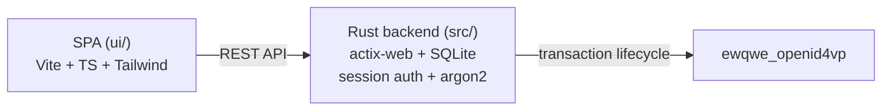

# ewqwe-credential-verifier-ui

**Admin dashboard and QR‑code verification app for the ewQwe credential verifier.**

## Why

The credential verifier needs a web-based administration interface to manage verifications beyond what a Relying Party integration provides. Operators need to:

- Trigger OpenID4VP transactions and display QR codes for cross-device flows
- Monitor verification results in real time
- Manage users, view the audit journal, and update app settings
- Perform one-time bootstrap setup (admin account creation)

This crate provides that interface as an embedded SPA with a Rust backend, all mountable under `/api/v1` in the credential verifier server.

## What

The crate is composed of two parts:

- **Rust backend** (`src/`) — actix-web route handlers, session-based auth (argon2), SQLite stores for users/journal/settings, and a QR‑based OpenID4VP transaction flow using `ewqwe_openid4vp`.
- **TypeScript SPA frontend** (`ui/`) — vanilla TypeScript single-page application built with Vite and Tailwind CSS. It communicates with the backend via a REST API and a Vite dev-server proxy.

### Routes

| Path | Purpose |
|---|---|
| `POST /api/v1/setup/bootstrap` | One-time admin creation |
| `GET /api/v1/setup/status` | Bootstrap status (public) |
| `POST /api/v1/auth/login` | Login |
| `POST /api/v1/auth/logout` | Logout |
| `GET /api/v1/auth/me` | Current session user |
| `POST /api/v1/qr/generate` | Initiate OpenID4VP transaction + return QR data |
| `GET /api/v1/qr/{id}/status` | Poll verification result |
| `GET /api/v1/admin/users` | List users (admin) |
| `POST /api/v1/admin/users` | Create user (admin) |
| `PUT /api/v1/admin/users/{id}` | Update user (admin) |
| `DELETE /api/v1/admin/users/{id}` | Delete user (admin) |
| `GET /api/v1/admin/journal` | Filterable audit log (admin) |
| `PUT /api/v1/admin/settings` | Update app settings (admin) |
| `GET /api/v1/settings` | Read public settings |
| `GET /api/v1/i18n` | Locale JSON files |
| `/` | SPA static assets (served from `ui/dist/`) |

## How



The frontend is built into static files (`ui/dist/`) that are embedded into the Rust binary via `actix-files` and served alongside the API routes.

## Using

The crate is designed to be mounted as a scope on an existing actix-web server:

```rust
use ewqwe_credential_verifier_ui::{VerifierUiConfig, mount_verifier_ui};

let config = VerifierUiConfig {
    data_dir: "./data".into(),
    session_secret: "your-secret".into(),
    jwt_secret: "your-jwt-secret".into(),
    openid4vp_service: /* your OpenID4VPService instance */,
    credential_verifier: /* your VerifierCredentialVerifier instance */,
};

let app = actix_web::App::new()
    .configure(|cfg| mount_verifier_ui(cfg, config));
```

The SPA expects the API to be available at `/api/v1/*` relative to the mount point.

## Building

### Prerequisites

- **Rust** 1.70+ (part of the workspace — `cargo build --workspace`)
- **pnpm** >= 9 (for the SPA frontend)

### SPA

```bash
cd crates/ewqwe-credential-verifier-ui/ui
pnpm install
pnpm build          # produces ui/dist/
```

### Rust crate

```bash
cargo build -p ewqwe_credential_verifier_ui
```

The Rust build assumes the SPA has already been built — `ui/dist/` is embedded at compile time.

### Development (SPA with hot-reload)

Start the credential verifier server (in one terminal, from the project root):

```bash
cargo run -p ewqwe_credential_verifier_server -- \
  crates/ewqwe-credential-verifier-server/credential-server.toml
```

Start the Vite dev server (in another terminal, from the `ui/` directory):

```bash
cd crates/ewqwe-credential-verifier-ui/ui
pnpm dev            # starts Vite dev server on port 9888
                    # proxies /api, /ewqwe_api, /.well-known, /version to
                    # the credential verifier backend
```

> **Important:** Before starting, adjust the `backendProxy.target` URL in
> [`ui/vite.config.ts`](ui/vite.config.ts) to match the address of your running
> credential verifier backend (e.g. `https://localhost:9443` or
> `https://192.168.1.90:9443`).

Both processes need to be running simultaneously. The Vite dev server proxies API
requests to the Rust backend, giving you hot-reload for the SPA while the backend
handles real OpenID4VP transactions.

## Testing

### Rust Tests

```bash
cargo test -p ewqwe_credential_verifier_ui
```

### SPA Tests

The frontend uses vanilla TypeScript with no test framework currently configured. Tests can be added via Vitest in `ui/vitest.config.ts`.

## License

EUPL-1.2 — see [LICENSE](LICENSE).
