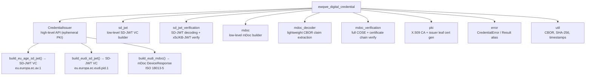

# `ewqwe-digital-credential`

A Rust library for building and signing **EU Age Verification** and **EUDI** credentials in all
standard formats, together with an ephemeral PKI helper for test and demonstration scenarios.

---

## Overview

This crate originated from the test infrastructure in `credential_verifier` and is now a
standalone, reusable library.  It provides the complete **credential signing and verification**
side of the ewQwe identity system.

The `credential_verifier` server uses this crate as a regular dependency for all credential
parsing and cryptographic verification.

Supported credential formats and profiles:

| Format | Profile / `docType` | Standard |
|--------|---------------------|----------|
| SD-JWT VC | `eu.europa.ec.av.1` | EU Age Verification Profile (Annex A) |
| SD-JWT VC | `eu.europa.ec.eudi.pid.1` | EUDI Wallet PID |
| mDoc `DeviceResponse` | `eu.europa.ec.eudi.pid.1` | ISO/IEC 18013-5 + OpenID4VP |

---

## Architecture



---

## Quick Start

### Add to `Cargo.toml`

```toml
[dependencies]
ewqwe_digital_credential = { path = "../crates/ewqwe-digital-credential" }

# Optionally link OpenSSL statically (e.g., CI, no system OpenSSL):
# ewqwe_digital_credential = { path = "../crates/ewqwe-digital-credential", features = ["vendored"] }
```

### Issuing an EU Age Verification SD-JWT

```rust
use ewqwe_digital_credential::CredentialIssuer;

// 1. Generate a fresh ephemeral PKI (CA, issuer leaf, device key) — all in-memory.
let issuer = CredentialIssuer::generate().expect("generate issuer keys");

// 2. Trust the CA: write the PEM to the verifier's credential_issuer_ca_dir.
std::fs::write("/path/to/verifier/ca_dir/my-ca.pem", &issuer.ca_cert_pem).unwrap();

// 3. Build a signed EU Age Verification SD-JWT VC.
let nonce = "a3b7c219-abc";          // from the OpenID4VP authorization request
let client_id = "redirect_uri:https://verifier.example/callback";
let sd_jwt = issuer.build_eu_age_sd_jwt(nonce, client_id);
// → "<issuer-jwt>~<kb-jwt>"  ready to submit as a VP Token
```

### Issuing a EUDI PID SD-JWT

```rust
use ewqwe_digital_credential::CredentialIssuer;

let issuer = CredentialIssuer::generate().expect("generate issuer keys");
let sd_jwt = issuer.build_eudi_sd_jwt("my-nonce", "redirect_uri:https://verifier.example/cb");
// → "<issuer-jwt>~<kb-jwt>"
// Claims: given_name="Test", family_name="User", birth_date="1990-01-01", age_over_18=true
```

### Issuing a EUDI PID mDoc (ISO 18013-5)

```rust
use ewqwe_digital_credential::CredentialIssuer;

let issuer = CredentialIssuer::generate().expect("generate issuer keys");
let mdoc_b64 = issuer.build_eudi_mdoc(
    "my-nonce",
    "redirect_uri:https://verifier.example/callback",
    "https://verifier.example/callback",
);
// → base64url-encoded CBOR DeviceResponse
// Claims: given_name, family_name, birth_date, age_over_18
```

---

## API Reference

### `CredentialIssuer`

The primary entry point.  Holds a two-level ephemeral PKI and a device holder key pair.

```rust
pub struct CredentialIssuer {
    /// PEM of the self-signed CA certificate.
    /// Write this to the verifier's `credential_issuer_ca_dir` before starting the server.
    pub ca_cert_pem: Vec<u8>,

    /// DER-encoded issuer leaf certificate (appears in SD-JWT `x5c[0]` / mDoc `x5chain`).
    pub issuer_cert_der: Vec<u8>,

    /// Device public key as JWK (`cnf.jwk` in SD-JWT payloads).
    pub device_pubkey_jwk: serde_json::Value,
}
```

#### Methods

| Method | Returns | Description |
|--------|---------|-------------|
| `CredentialIssuer::generate()` | `Result<Self>` | Create fresh EC P-256 CA, issuer, and device keys + X.509 certs |
| `build_eu_age_sd_jwt(nonce, client_id)` | `String` | EU Age Verification Profile SD-JWT VC (`eu.europa.ec.av.1`) |
| `build_eudi_sd_jwt(nonce, client_id)` | `String` | EUDI PID SD-JWT VC (`eu.europa.ec.eudi.pid.1`) |
| `build_eudi_mdoc(nonce, client_id, response_uri)` | `String` | EUDI PID mDoc `DeviceResponse` (base64url CBOR) |
| `device_pubkey_jwk_bytes()` | `Vec<u8>` | Device public key as serialised JWK bytes |
| `device_pubkey_raw_xy()` | `Result<(Vec<u8>, Vec<u8>)>` | Raw P-256 (x, y) coordinates, zero-padded to 32 bytes each |

---

## Module Reference

### `sd_jwt` — SD-JWT VC builder functions

Low-level functions for building SD-JWT VCs without `CredentialIssuer`.

```rust
use ewqwe_digital_credential::sd_jwt::{build_eu_age_sd_jwt, build_eudi_pid_sd_jwt};

// Build EU Age Verification SD-JWT VC
let sd_jwt = build_eu_age_sd_jwt(
    &issuer_key,          // PKey<Private> — EC P-256 issuer signing key
    &issuer_cert_der,     // DER-encoded issuer leaf certificate
    &device_pubkey_jwk,   // serde_json::Value — device public key JWK
    &device_key,          // PKey<Private> — EC P-256 device (holder) key
    nonce,                // &str — nonce from OpenID4VP request
    client_id,            // &str — audience for KB-JWT
)?;
```

**SD-JWT structure:**

- **Issuer JWT**: `alg=ES256`, `x5c=[<issuer-cert-der-b64>, <ca-cert-der-b64>]` header; payload contains all credential claims plus `cnf.jwk`.
- **KB-JWT**: `alg=ES256`, signed by the device key; payload: `nonce`, `aud=client_id`, `iat`, SHA-256 of issuer JWT as `sd_hash`.
- **Format**: `<issuer-jwt>~<kb-jwt>` (no `~`-separated disclosure elements — claims are clear-text).

### `mdoc` — ISO 18013-5 mDoc builder

Low-level functions for building `DeviceResponse` CBOR structures.

```rust
use ewqwe_digital_credential::mdoc::{
    build_eudi_pid_mdoc,
    build_openid4vp_session_transcript_direct_post,
    ec_key_to_public_jwk,
};

let mdoc_b64 = build_eudi_pid_mdoc(
    &issuer_key,
    &issuer_cert_der,
    &ca_cert_der,      // DER-encoded CA cert — placed in IssuerAuth x5chain[1]
    &device_key,
    nonce,
    client_id,
    response_uri,      // &str — OpenID4VP response_uri for SessionTranscript
)?;
```

**mDoc structure:**

- **`IssuerAuth`**: COSE_Sign1 with `alg=-7` (ES256), `x5chain` unprotected header (label 33) containing `[issuer_cert_der, ca_cert_der]`.  Payload is the tag-24 encoded `MobileSecurityObject`.
- **`MobileSecurityObject`** (MSO): SHA-256 `valueDigests` of all `IssuerSignedItem`s, device public key as `COSE_Key`, validity period from now + 1 year.
- **`DeviceAuth` / `DeviceSignature`**: COSE_Sign1 (detached payload) signed by the device key over `DeviceAuthenticationBytes`, bound to the `SessionTranscript` for the given `client_id`, `nonce`, and `response_uri` (`OpenID4VPDCAPIHandover` format).

#### `build_openid4vp_session_transcript_direct_post`

```rust
/// Build the CBOR-encoded SessionTranscript matching the verifier's
/// DirectPost transcript for a given (client_id, nonce, response_uri).
pub fn build_openid4vp_session_transcript_direct_post(
    client_id: &str,
    nonce: &str,
    response_uri: &str,
) -> Vec<u8>;
```

This function mirrors the transcript construction in the production `credential_verifier`.
Use it if you need to verify a `DeviceSignature` outside of the normal verification flow.

---

## Verification API

The crate exposes a full verification stack consumed by `credential_verifier` at runtime.

### `mdoc_decoder` — Claim extraction (no crypto)

Quickly extracts the claim map from a base64-encoded `DeviceResponse` CBOR without
performing any cryptographic verification.  Useful at parse time before the full
verification context (transaction nonce, CA list) is available.

```rust
use ewqwe_digital_credential::{decode_mdoc_presentation, DecodedMdoc};

let decoded: DecodedMdoc = decode_mdoc_presentation(base64url_device_response)?;
println!("docType: {}", decoded.doc_type);
for (ns, claims) in &decoded.namespaces {
    println!("  {ns}: {:?}", claims.keys().collect::<Vec<_>>());
}
```

### `sd_jwt_verification` — SD-JWT VC verification

```rust
use ewqwe_digital_credential::{
    decode_sd_jwt_presentation, verify_sd_jwt_signatures,
    DecodedSdJwt, SigVerificationResult,
};

// 1. Decode claims (no crypto)
let decoded: DecodedSdJwt = decode_sd_jwt_presentation(compact_sd_jwt)?;
println!("vct: {}, issuer: {}", decoded.vct, decoded.issuer);
println!("claims: {:?}", decoded.claims);
println!("nonce from KB-JWT: {:?}", decoded.nonce);

// 2. Verify x5c chain + KB-JWT signature
let result: SigVerificationResult = verify_sd_jwt_signatures(compact_sd_jwt, trusted_cas);
if result.issuer_sig_valid && result.kb_sig_valid && result.issuer_trusted {
    println!("Presentation verified");
} else {
    println!("Errors: {:?}", result.errors);
}
```

**`SigVerificationResult` fields:**

| Field | Type | Description |
|-------|------|-------------|
| `issuer_sig_valid` | `bool` | Issuer JWT `x5c` signature verified |
| `kb_sig_valid` | `bool` | Key Binding JWT signature verified |
| `issuer_trusted` | `bool` | Issuer cert chains to a trusted CA |
| `skipped` | `bool` | Verification skipped (non-SD-JWT presentation) |
| `errors` | `Vec<String>` | Accumulated error messages |

### `mdoc_verification` — Full mDoc/COSE verification

Performs all ISO 18013-5 checks end-to-end:

1. Base64-decode → CBOR parse → `DeviceResponse` navigation.
2. `IssuerAuth` `COSE_Sign1` signature + `x5chain` certificate chain.
3. MSO `docType` match and `IssuerSignedItem` digest verification.
4. `DeviceSignature` over the reconstructed OpenID4VP `SessionTranscript`.
5. MSO validity window check.

```rust
use ewqwe_digital_credential::{verify_mdoc_presentation, MdocVerificationResult};

let result: MdocVerificationResult = verify_mdoc_presentation(
    base64url_device_response,
    client_id,          // from OpenID4VP request
    nonce,              // from OpenID4VP request
    response_uri,       // from OpenID4VP request
    false,              // set true for direct_post.jwt / dc_api.jwt
    None,               // JWK thumbprint (required when encrypted)
    trusted_cas,
)?;

println!("doc_type: {}", result.doc_type);
println!("issuer_trusted: {}", result.issuer_trusted);
println!("claims: {}", result.claims);
```

**`MdocVerificationResult` fields:**

| Field | Type | Description |
|-------|------|-------------|
| `claims` | `serde_json::Value` | Disclosed claims (object per namespace, or nested) |
| `doc_type` | `String` | `docType` from the `Document`, e.g. `eu.europa.ec.eudi.pid.1` |
| `namespace` | `String` | Primary namespace, e.g. `eu.europa.ec.eudi.pid.1` |
| `not_expired` | `bool` | MSO validUntil is in the future |
| `issuer_trusted` | `bool` | Issuer cert chains to a trusted CA |

### `CredentialError`

All verification functions return `Result<_, CredentialError>`.  The relevant variant is:

```rust
#[error("Invalid presentation: {0}")]
InvalidPresentation(String),
```

Call `.map_err(|e| AttError::BadRequest(e.to_string()))` to convert into the server's
`AttError` type.

---

## Lower-level module docs

### `pki` — X.509 PKI helpers

```rust
use ewqwe_digital_credential::pki::{build_ca_cert, build_issuer_cert};

// Self-signed CA cert (CN="ewQwe Credential CA", O="ewQwe"), 1-year validity
let ca_cert = build_ca_cert(&ca_key)?;

// Issuer leaf cert signed by CA (CN="ewQwe Credential Issuer", O="ewQwe"), 1-year validity
let issuer_cert = build_issuer_cert(&ca_key, &ca_cert, &issuer_key)?;
```

### `error` — Error types

```rust
use ewqwe_digital_credential::CredentialError;

match result {
    Err(CredentialError::OpenSsl(e))  => { /* OpenSSL key/cert operation failed */ }
    Err(CredentialError::Jwt(e))      => { /* JWT encoding failed */ }
    Err(CredentialError::Cbor(msg))   => { /* CBOR serialisation failed */ }
    Err(CredentialError::Build(msg))  => { /* Missing field or invalid state */ }
    Ok(credential) => { /* use the credential */ }
}
```

---

## Credential Claim Reference

### EU Age Verification Profile (`eu.europa.ec.av.1`)

| Claim | Type | Value |
|-------|------|-------|
| `vct` | String | `"eu.europa.ec.av.1"` |
| `over_18` | bool | `true` |
| `iss` | String | `"https://test-issuer.example"` |
| `cnf.jwk` | JWK | device public key |

### EUDI PID SD-JWT (`eu.europa.ec.eudi.pid.1`)

| Claim | Type | Value |
|-------|------|-------|
| `vct` | String | `"eu.europa.ec.eudi.pid.1"` |
| `given_name` | String | `"Test"` |
| `family_name` | String | `"User"` |
| `birth_date` | String | `"1990-01-01"` |
| `age_over_18` | bool | `true` |
| `cnf.jwk` | JWK | device public key |

### EUDI PID mDoc (`eu.europa.ec.eudi.pid.1`, namespace `eu.europa.ec.eudi.pid.1`)

| Claim | CBOR type | Value |
|-------|-----------|-------|
| `given_name` | tstr | `"Test"` |
| `family_name` | tstr | `"User"` |
| `birth_date` | tstr | `"1990-01-01"` |
| `age_over_18` | bool | `true` |

---

## Feature Flags

| Feature | Default | Description |
|---------|---------|-------------|
| `vendored` | off | Compile and link OpenSSL statically via `openssl/vendored`. Required for cross-compilation and CI environments without a system OpenSSL. |

### Using `vendored` in dev-dependencies

```toml
# credential_verifier/Cargo.toml
[dev-dependencies]
ewqwe_digital_credential = { workspace = true, features = ["vendored"] }
```

---

## Security Notes

- All private key material is held in memory only and is **never written to disk**.
- `CredentialIssuer::ca_cert_pem` (a *public* certificate) is the only field intended to be
  written to disk — specifically to the verifier's `credential_issuer_ca_dir`.
- Credentials are signed with **ES256** (ECDSA P-256 + SHA-256) throughout.
- The issuer identity (`iss = "https://test-issuer.example"`) is a placeholder suitable for
  test and demonstration scenarios only.  Production issuers must use a proper DID or
  HTTPS URL with key discovery.
- **These credentials are for testing only** — do not use in production without replacing the
  issuer identity, key rotation, and certificate management.

---

## Integration with the credential verifier

The typical test setup:

```rust
use ewqwe_digital_credential::CredentialIssuer;

// 1. Generate credentials issuer
let issuer = CredentialIssuer::generate().unwrap();

// 2. Write the CA PEM to a temp directory
let ca_dir = tempfile::tempdir().unwrap();
let ca_path = ca_dir.path().join("test-ca.pem");
std::fs::write(&ca_path, &issuer.ca_cert_pem).unwrap();

// 3. Start the credential verifier, pointing it at that CA dir
//    (see credential_verifier/src/tests/test_server.rs for helpers)

// 4. Build a credential and send it as a VP Token
let nonce = "...";   // from /ewqwe_api/openid4vp/request/:id
let sd_jwt = issuer.build_eu_age_sd_jwt(nonce, &client_id);

// 5. POST to /ewqwe_api/verify and assert the attestation claims
```

See [`credential_verifier/src/tests/end_to_end_tests/verification_tests.rs`](../../credential_verifier/src/tests/end_to_end_tests/verification_tests.rs)
for complete working examples of all three credential types.

---

## Dependencies

| Crate | Use |
|-------|-----|
| `openssl` | EC key generation, ECDSA signing, X.509 certificate building |
| `jsonwebtoken` | JWT encoding (ES256) for SD-JWT issuer JWT and KB-JWT |
| `ciborium` | CBOR encoding for mDoc structures |
| `base64` | Base64url encoding for `x5c` headers and output VP Tokens |
| `sha2` | SHA-256 for mDoc `valueDigests` and SD-JWT `sd_hash` |
| `serde_json` | JWK and JWT claim handling |
| `chrono` | RFC 3339 timestamp formatting for mDoc validity periods |
| `uuid` | Random `digestID` generation for mDoc `IssuerSignedItem`s |
| `thiserror` | `CredentialError` derive macro |
