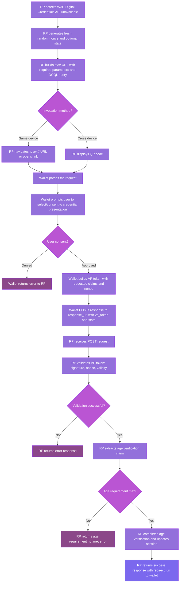

# Age Verification: OpenID4VP Fallback

This chapter explains the **OpenID for Verifiable Presentations (OpenID4VP)** fallback mechanism used for age verification when the **W3C Digital Credentials API** is not available.

It focuses on the requirements from **EU Age Verification Profile Annex A, Section A.5 (OpenID for Verifiable Presentations profile Requirements)**.

## Why a fallback mechanism?

The W3C Digital Credentials API is the primary method specified in Annex A.5. However:

- Not all browsers support it yet (see browser compatibility notes in the References chapter).
- The API may be disabled by user preference or enterprise policy.
- Browser extensions cannot register as Digital Credentials providers (see Demo Wallet chapter).

When the native API is unavailable, the Relying Party **MUST** fall back to OpenID4VP with specific constraints defined by the Age Verification Profile.

## End-to-end flow



## OpenID4VP request parameters for the authorize endpoint

According to [OpenID for Verifiable Presentations 1.0, Section 5](https://openid.net/specs/openid-4-verifiable-presentations-1_0.html#section-5), the Authorization Request to the `authorize` endpoint contains the following parameters:

| Parameter | Required | Description | Age Verification Profile Notes |
|-----------|----------|-------------|-------------------------------|
| `response_type` | ✓ | MUST be `vp_token` for Verifiable Presentation requests | Fixed value: `vp_token` |
| `client_id` | ✓ | Identifier of the Relying Party | MUST use format: `redirect_uri:<response_uri>` |
| `nonce` | ✓ | Random value to bind the presentation to the session | MUST be cryptographically random and fresh per request |
| `response_mode` | ✓ | How the Authorization Response is returned | MUST be `direct_post` for cross-device flows |
| `response_uri` | conditional | Endpoint where the wallet POSTs the response | REQUIRED when `response_mode=direct_post` |
| `presentation_definition` | conditional* | [DIF Presentation Exchange](https://identity.foundation/presentation-exchange/) query | Age Verification Profile uses `dcql_query` instead (see below) |
| `dcql_query` | conditional* | [Digital Credentials Query Language](https://openid.net/specs/openid-4-verifiable-presentations-1_0.html#section-6) query | REQUIRED for Age Verification Profile (DCQL supersedes Presentation Exchange) |
| `state` | optional | Opaque value to maintain state between request and callback | RECOMMENDED for session correlation |
| `scope` | optional | OpenID Connect scopes | Not used in Age Verification Profile |
| `redirect_uri` | optional | Fallback redirect after response delivery | Not used with `direct_post` |

\* **Either** `presentation_definition` **OR** `dcql_query` MUST be present ([OpenID4VP Section 5.1](https://openid.net/specs/openid-4-verifiable-presentations-1_0.html#section-5.1)). The Age Verification Profile mandates DCQL.

### Client ID schemes (OpenID4VP Section 5.3)

The `client_id` parameter uses a **scheme prefix** to indicate how the RP is identified. Different profiles mandate different schemes:

| Scheme | Format | JAR Required | Trust Mechanism | Profile |
|--------|--------|--------------|-----------------|---------|
| `redirect_uri:` | `redirect_uri:<response_uri>` | **No** (unsigned request) | TLS + Web PKI | **Annex A (Age Verification)** |
| `x509_san_dns:` | `x509_san_dns:<DNS>` | Yes (signed JAR with `x5c`) | X.509 certificate SAN DNS | HAIP (EUDI Wallet) |
| `x509_hash:` | `x509_hash:<hash>` | Yes (signed JAR with `x5c`) | X.509 certificate hash | HAIP (EUDI Wallet) |
| `verifier_attestation:` | `verifier_attestation:<client_id>` | Yes (signed JAR with `jwt` header) | JWT from Trusted Attestation Issuer | HAIP (optional) |
| `pre-registered` | `<client_id>` (no prefix) | Optional | Pre-configured in wallet | Custom deployments |

#### `redirect_uri` scheme (Annex A - Age Verification)

- The client_id equals the response_uri: `client_id=redirect_uri:https://rp.example.com/callback`
- Request is sent **unsigned** (no JAR, no `x5c`, no cryptographic verification)
- Trust is based on TLS and the Web PKI
- Simplest implementation, suitable for LoA Substantial

#### `x509_san_dns` scheme (HAIP - EUDI Wallet)

- The client_id is a DNS name matching a SAN in the X.509 certificate: `client_id=x509_san_dns:rp.example.com`
- Request **MUST be signed** as a JWT-secured Authorization Request (JAR, RFC 9101)
- The `x5c` JOSE header contains the certificate chain
- The wallet validates the certificate against its **Reader Trust Store**
- Requires the RP's root CA to be trusted by the wallet

#### `verifier_attestation` scheme (HAIP - optional)

- The client_id is an identifier attested by a trusted issuer: `client_id=verifier_attestation:my-verifier`
- Request **MUST be signed** as JAR with a `jwt` JOSE header containing the attestation
- The attestation JWT is signed by a **Trusted Attestation Issuer**
- The wallet validates the attestation JWT against trusted issuer public keys
- **Trusted Issuers**: These are entities pre-configured in the wallet that are authorized to issue verifier attestations. In the EU context, this would typically be:
  - National trust list operators
  - EU-level trust services
  - Designated attestation providers listed in official registries
  - **Currently, no public list of trusted attestation issuers exists for general use**

> **Important**: The `verifier_attestation` scheme requires an established trust framework with designated attestation issuers. Since no such framework currently exists for general Age Verification, Annex A mandates the simpler `redirect_uri` scheme instead.

### Response modes (OpenID4VP Section 5.2)

| Mode | Description | Use Case |
|------|-------------|----------|
| `fragment` | VP token returned in URL fragment | Same-device flows (NOT used in Age Verification Profile) |
| `direct_post` | VP token POSTed to `response_uri` | Cross-device flows (REQUIRED for Age Verification Profile) |
| `direct_post.jwt` | Encrypted JWT POSTed to `response_uri` | Enhanced privacy (optional extension) |

### Example Authorization Request (Age Verification Profile compliant)

```
av://authorize?
  response_type=vp_token&
  response_mode=direct_post&
  client_id=redirect_uri%3Ahttps%3A%2F%2Frp.example.com%2Fapi%2Fopenid4vp%2Fcallback&
  response_uri=https%3A%2F%2Frp.example.com%2Fapi%2Fopenid4vp%2Fcallback&
  nonce=550e8400-e29b-41d4-a716-446655440000&
  state=7c9e2d8f-3a1b-4e5f-8d7c-9a1b2c3d4e5f&
  dcql_query=%7B%22credentials%22%3A%5B%7B%22id%22%3A%22age_attestation%22%2C%22format%22%3A%22mso_mdoc%22%2C%22meta%22%3A%7B%22doctype_value%22%3A%22eu.europa.ec.av.1%22%7D%2C%22claims%22%3A%5B%7B%22namespace%22%3A%22eu.europa.ec.av.1%22%2C%22claim_name%22%3A%22age_over_18%22%7D%5D%7D%5D%7D
```

**References:**

- [OpenID4VP 1.0, Section 5: Authorization Request](https://openid.net/specs/openid-4-verifiable-presentations-1_0.html#section-5)
- [OpenID4VP 1.0, Section 6: DCQL](https://openid.net/specs/openid-4-verifiable-presentations-1_0.html#section-6)
- [EU Age Verification Profile, Annex A.5](https://ageverification.dev/av-doc-technical-specification/docs/annexes/annex-A/annex-A-av-profile/#openid-for-verifiable-presentations-profile-requirements)

## Normative requirements

The following requirements are **mandatory** when using OpenID4VP for age verification:

### 1) Support the `av://` custom URL scheme

- The Relying Party MUST construct a request URL using the `av://` scheme.
- This triggers the Age Verification App (wallet) if installed on the device.
- Example: `av://authorize?response_type=vp_token&...`

### 2) Use `response_type=vp_token`

- The response MUST be a Verifiable Presentation token.
- This is the standard OpenID4VP response type for presentation exchanges.

### 3) Use `response_mode=direct_post`

- The wallet MUST POST the response directly to the RP's `response_uri`.
- This enables cross-device flows (e.g., QR code scanning).
- No fragment-based or query-based response is permitted.

### 4) Send the request by value (no JAR)

- The RP MUST include all request parameters directly in the `av://` URL.
- Request objects by reference (JAR - JWT-secured Authorization Request) are NOT required.
- This simplifies wallet implementation and reduces round-trips.

### 5) Client identifier scheme: `redirect_uri` + `response_uri`

- The `client_id` MUST use the format: `redirect_uri:<response_uri>`
- Example: `client_id=redirect_uri:https://rp.example.com/callback`
- This binds the client identity to the response endpoint.

### 6) Include a `nonce` parameter

- The `nonce` parameter MUST be present.
- It binds the presentation to the specific transaction and prevents replay attacks.
- The wallet MUST include the `nonce` in the VP token.

### 7) Use DCQL for the query

- The request MUST use the Digital Credentials Query Language (DCQL) as defined in OpenID4VP Section 6.
- See the [DCQL Age Verification](./dcql_age_verification.md) chapter for concrete query examples.

### 8) `state` parameter is optional

- The RP MAY include a `state` parameter per OpenID4VP Section 4.1.1.
- This helps the RP correlate responses with requests.
- However, it is not mandatory for the Age Verification Profile.

### 9) Client authentication is not required

- The wallet does not need to authenticate the RP cryptographically.
- Origin validation and nonce binding provide sufficient security for age verification.
- This is explicitly out of scope for this profile.

## Implementation: building the request

### TypeScript/JavaScript example (RP side)

```typescript
// 1) Generate nonce and state
const nonce = crypto.randomUUID(); // or a cryptographic random string
const state = crypto.randomUUID(); // optional but recommended for correlation

// 2) Define the response_uri where the wallet will POST back
const responseUri = "https://rp.example.com/api/openid4vp/callback";

// 3) Build the client_id using the redirect_uri scheme
const clientId = `redirect_uri:${responseUri}`;

// 4) Construct the DCQL query for age verification
// (see DCQL Age Verification chapter for detailed examples)
const dcqlQuery = {
  credentials: [
    {
      id: "age_attestation",
      format: "mso_mdoc",
      meta: {
        doctype_value: "eu.europa.ec.av.1",
      },
      claims: [
        {
          namespace: "eu.europa.ec.av.1",
          claim_name: "age_over_18",
        },
      ],
    },
  ],
};

// 5) Encode the DCQL query as a URL parameter
const dcqlQueryParam = encodeURIComponent(JSON.stringify(dcqlQuery));

// 6) Build the av:// URL
const avUrl = new URL("av://authorize");
avUrl.searchParams.set("response_type", "vp_token");
avUrl.searchParams.set("response_mode", "direct_post");
avUrl.searchParams.set("client_id", clientId);
avUrl.searchParams.set("response_uri", responseUri);
avUrl.searchParams.set("nonce", nonce);
avUrl.searchParams.set("dcql_query", dcqlQueryParam);
avUrl.searchParams.set("state", state); // optional

console.log("Age Verification Request URL:", avUrl.toString());

// 7) Invoke the wallet
// Option A: Direct navigation (same device)
// window.location.href = avUrl.toString();

// Option B: QR code (cross-device)
// generateQRCode(avUrl.toString());

// Option C: Deep link (mobile)
// <a href="${avUrl}">Verify your age</a>
```

### Example `av://` URL (formatted for readability)

```
av://authorize?
  response_type=vp_token&
  response_mode=direct_post&
  client_id=redirect_uri%3Ahttps%3A%2F%2Frp.example.com%2Fapi%2Fopenid4vp%2Fcallback&
  response_uri=https%3A%2F%2Frp.example.com%2Fapi%2Fopenid4vp%2Fcallback&
  nonce=550e8400-e29b-41d4-a716-446655440000&
  state=7c9e2d8f-3a1b-4e5f-8d7c-9a1b2c3d4e5f&
  dcql_query=%7B%22credentials%22%3A%5B%7B%22id%22%3A%22age_attestation%22%2C...
```

## Implementation: handling the response

The wallet POSTs a `application/x-www-form-urlencoded` body to the `response_uri` with the following parameters:

| Parameter | Required | Description |
|-----------|----------|-------------|
| `vp_token` | ✓ | The Verifiable Presentation containing the requested claims |
| `presentation_submission` | ✓ | Descriptor mapping the VP token to the DCQL query (OpenID4VP Section 6) |
| `state` | optional | Echoed from the request if provided |

### TypeScript/JavaScript example (RP endpoint)

```typescript
// Express.js / Node.js example
app.post("/api/openid4vp/callback", async (req, res) => {
  const { vp_token, presentation_submission, state } = req.body;

  // 1) Validate state (if used)
  if (state && !validateState(state)) {
    return res.status(400).json({ error: "invalid_state" });
  }

  // 2) Parse the VP token
  // The format depends on the credential type (JWT, mDoc CBOR, etc.)
  // For this example, assume JWT-encoded VP
  let vpPayload;
  try {
    vpPayload = parseAndVerifyVP(vp_token); // verify signature, issuer trust, etc.
  } catch (error) {
    return res.status(400).json({ error: "invalid_vp_token" });
  }

  // 3) Validate the nonce
  const expectedNonce = retrieveNonceForSession(state); // from server-side session
  if (vpPayload.nonce !== expectedNonce) {
    return res.status(400).json({ error: "invalid_nonce" });
  }

  // 4) Extract the age verification claim
  const ageOver18 = extractClaim(vpPayload, "eu.europa.ec.av.1", "age_over_18");
  
  if (ageOver18 !== true) {
    return res.status(403).json({ error: "age_requirement_not_met" });
  }

  // 5) Success - complete the age verification flow
  markSessionAsAgeVerified(state);
  
  // Return success response to wallet
  res.status(200).json({ 
    redirect_uri: "https://rp.example.com/success"
  });
});
```

### Example VP token (JWT format, simplified)

```json
{
  "iss": "https://wallet.example.com",
  "aud": "redirect_uri:https://rp.example.com/api/openid4vp/callback",
  "nonce": "550e8400-e29b-41d4-a716-446655440000",
  "vp": {
    "@context": ["https://www.w3.org/2018/credentials/v1"],
    "type": ["VerifiablePresentation"],
    "verifiableCredential": [
      {
        "type": ["VerifiableCredential", "ProofOfAge"],
        "credentialSubject": {
          "eu.europa.ec.av.1": {
            "age_over_18": true
          }
        },
        "issuer": "https://issuer.example.com",
        "issuanceDate": "2025-01-15T00:00:00Z",
        "proof": {
          "type": "JsonWebSignature2020",
          "created": "2025-01-15T00:00:00Z",
          "jws": "eyJhbGciOiJFUzI1NiIsImI2NCI6ZmFsc2UsImNyaXQiOlsiYjY0Il19...."
        }
      }
    ]
  }
}
```

### Example presentation_submission

```json
{
  "id": "submission_1",
  "definition_id": "age_verification",
  "descriptor_map": [
    {
      "id": "age_attestation",
      "format": "jwt_vp",
      "path": "$",
      "path_nested": {
        "format": "jwt_vc",
        "path": "$.vp.verifiableCredential[0]"
      }
    }
  ]
}
```

## Same-device vs. Cross-device flows

### Same-device flow

1. User clicks "Verify Age" button in the RP web app.
2. RP navigates to `av://authorize?...` (or opens in a new window).
3. OS launches the Age Verification App.
4. User approves the presentation.
5. Wallet POSTs to `response_uri`.
6. RP endpoint processes the response and updates the session.
7. User is redirected back to the RP web app (via `redirect_uri` in the response).

### Cross-device flow (QR code)

1. RP displays a QR code encoding the `av://` URL.
2. User scans the QR code with their mobile device.
3. Mobile wallet parses the request and prompts for consent.
4. Wallet POSTs to `response_uri` (cross-device).
5. RP endpoint updates the session.
6. Desktop browser polls the RP session endpoint or uses WebSocket to detect completion.
7. RP redirects the desktop browser to the success page.

## Security considerations (Age Verification)

### Nonce binding

- **CRITICAL**: The RP MUST generate a fresh, cryptographically random `nonce` for each request.
- The RP MUST store the `nonce` server-side (keyed by `state` or session ID).
- The RP MUST reject VP tokens with missing or incorrect `nonce` values.
- This prevents replay attacks and session fixation.

### Origin validation

- The `response_uri` MUST be on the same origin as the RP.
- The RP MUST validate that the `audience` (`aud`) claim in the VP token matches the expected `client_id`.

### HTTPS requirement

- The `response_uri` MUST use HTTPS in production.
- This protects the VP token in transit.

### Data minimization

- Request only the claims needed for age verification (e.g., `age_over_18`).
- Avoid requesting full name, address, portrait, or other identifying attributes unless your privacy policy requires them.

### No client authentication

- While client authentication is out of scope for this profile, RPs SHOULD still validate:
  - VP token signature (issuer trust).
  - VP token validity period.
  - Credential status (revocation, expiration).

## Interop checklist

- [ ] `av://` URL scheme is registered and can launch the wallet.
- [ ] `response_type=vp_token` is set.
- [ ] `response_mode=direct_post` is set.
- [ ] `client_id` uses the `redirect_uri:` prefix.
- [ ] `nonce` is fresh, random, and stored server-side.
- [ ] `dcql_query` is valid JSON and follows the DCQL schema.
- [ ] `response_uri` is HTTPS and handles POST requests.
- [ ] Wallet POSTs `vp_token` + `presentation_submission` + optional `state`.
- [ ] RP validates `nonce`, `aud`, signature, and claim values.
- [ ] RP returns a redirect URI or success indicator to the wallet.

## Comparison with W3C Digital Credentials API

| Aspect | W3C Digital Credentials API | OpenID4VP Fallback |
|--------|----------------------------|-------------------|
| **Invocation** | `navigator.credentials.get()` | `av://` custom URL scheme |
| **Response delivery** | JavaScript Promise (in-page) | HTTP POST to `response_uri` |
| **Cross-device support** | Limited (requires browser extension workaround) | Native (via QR code) |
| **Browser support** | Chrome (flag), limited | Universal (OS handles URL scheme) |
| **Request format** | Base64url CBOR (ISO 18013-7) | Query parameters + DCQL JSON |
| **Response format** | Base64url CBOR (HPKE encrypted) | JWT or CBOR (no encryption required) |
| **Primary use case** | Same-device, browser-native | Cross-device, mobile wallets |

## EU Age Verification Profile (Annex A) Requirements Summary

The [EU Age Verification Profile Annex A, Section A.5](https://ageverification.dev/av-doc-technical-specification/docs/annexes/annex-A/annex-A-av-profile/) defines the **normative requirements** for OpenID4VP when used as a fallback mechanism for age verification.

### Mandatory Requirements

| Requirement | Value | Rationale |
|-------------|-------|-----------|
| URL scheme | `av://` | Custom scheme to invoke the Age Verification App |
| Response type | `vp_token` | Standard OpenID4VP response for presentations |
| Response mode | `direct_post` | Enables cross-device flows; wallet POSTs directly to RP |
| Client ID scheme | **`redirect_uri`** | Simplest scheme; no JAR, no trust lists required |
| Request format | By value (no JAR) | No signed request objects required |
| Query format | DCQL | Digital Credentials Query Language (OpenID4VP Section 6) |
| Nonce | Required | Binds presentation to transaction, prevents replay |
| Client authentication | **Not required** | Out of scope for Age Verification Profile |

### Explicitly Out of Scope

The following are **explicitly excluded** from the Age Verification Profile:

- **JAR (JWT-secured Authorization Request)** - Signed requests are not required
- **Encrypted responses** (`direct_post.jwt`) - TLS is sufficient
- **Trust lists of RPs** - No pre-registration or attestation required
- **x509_san_dns / verifier_attestation schemes** - These depend on trust lists

### Design Rationale (from Annex A.9)

> *"The effectiveness of `x509_san_dns` and `verifier_attestation` schemes depends on the existence of a trust list of RPs. For this reason, the Age Verification solution uses the simpler `redirect_uri` scheme. An alternative could be the use of `x509_san_dns` together with the Web PKI, however, any malicious entity can obtain a valid Web PKI certificate."*

This means the Age Verification Profile relies on **TLS and the Web PKI** for transport security, without additional cryptographic verification of the verifier's identity.

## Comparison with HAIP (High Assurance Interoperability Profile)

The EUDI Wallet implements **HAIP** (High Assurance Interoperability Profile), which has stricter requirements than the Age Verification Profile. Understanding these differences is critical when choosing which wallet to target.

| Feature | Age Verification Profile (Annex A) | HAIP (EUDI Wallet) |
|---------|-----------------------------------|-------------------|
| **Target LoA** | Substantial | High |
| **Client ID scheme** | `redirect_uri` | `x509_san_dns`, `x509_hash`, `verifier_attestation` |
| **Signed request (JAR)** | Not required | **Required** (RFC 9101) |
| **Response mode** | `direct_post` | `direct_post.jwt` (encrypted) |
| **Trust mechanism** | TLS + Web PKI | Reader Trust Store + certificate validation |
| **Reader authentication** | Not required | Certificate chain validation |
| **Trust list of RPs** | Not used | Required for verifier_attestation |
| **Threat model** | Does not include malicious CAs | Assumes potential CA compromise |

### Key Implications for Relying Parties

1. **Age Verification App (Annex A compliant)**
   - Use `client_id=redirect_uri:https://your-rp.com/callback`
   - Send unsigned requests directly in the `av://` URL
   - No certificate or JAR required

2. **EUDI Wallet (HAIP compliant)**
   - Use `client_id=x509_san_dns:your-rp.com`
   - Sign the request as a JAR with `x5c` header containing your certificate chain
   - Your root CA must be in the wallet's Reader Trust Store

### Wallet Compatibility Matrix

| Wallet | `redirect_uri` | `x509_san_dns` | `x509_hash` | `verifier_attestation` |
|--------|----------------|----------------|-------------|------------------------|
| **Age Verification App** (ageverification.dev) | ✅ Expected | ? | ? | ? |
| **EUDI Wallet** (eu-digital-identity-wallet) | ❌ Not supported | ✅ | ✅ | ❌ Not configured |
| **Demo webapp (this project)** | ✅ Planned | ✅ Implemented | ❌ | ❌ |

> **Note**: The EUDI Wallet pre-built APKs from GitHub only support `x509_san_dns` and `x509_hash`. The `redirect_uri` scheme is **not supported** without modifying the wallet source code.

### Two Wallets, Two Profiles

There are **two separate wallet projects** for different use cases:

1. **EUDI Wallet** ([eu-digital-identity-wallet/eudi-app-android-wallet-ui](https://github.com/eu-digital-identity-wallet/eudi-app-android-wallet-ui))
   - Implements HAIP for EU Digital Identity
   - Supports PID, mDL, and other credentials
   - Uses `x509_san_dns` / `x509_hash` schemes
   - Pre-built APKs available on GitHub Releases

2. **Age Verification App** ([ageverification.dev](https://ageverification.dev/av-app-android-wallet-ui/))
   - Forked from EUDI Wallet, customized for Age Verification
   - Only stores Proof of Age attestations
   - Expected to support `redirect_uri` scheme per Annex A
   - Uses `av://` URL scheme for invocation
   - Separate issuer/verifier infrastructure at ageverification.dev

> **Important**: The APK at `https://github.com/eu-digital-identity-wallet/eudi-app-android-wallet-ui/releases` is the **EUDI Wallet**, not the Age Verification App. It does **not** implement Annex A's `redirect_uri` scheme and will reject such requests.

## Implementation Strategy for the Demo Webapp

Based on the above analysis, the demo webapp should implement **both profiles** to support different wallets:

### For Proof of Age (Annex A Profile)

```typescript
// Use redirect_uri scheme - no JAR, no certificate
const clientId = `redirect_uri:${responseUri}`;
const avUrl = `av://authorize?response_type=vp_token&response_mode=direct_post&client_id=${encodeURIComponent(clientId)}&response_uri=${encodeURIComponent(responseUri)}&nonce=${nonce}&dcql_query=${dcqlQuery}`;
```

### For mDL / National ID (HAIP Profile)

```typescript
// Use x509_san_dns scheme - signed JAR with x5c header
const clientId = `x509_san_dns:${hostname}`;
// Build and sign JAR JWT with x5c header containing certificate chain
const jar = await signJAR(claims, privateKey, certificateChain);
const requestUri = await storeJAR(jar); // or embed by value
```

### Dual-Mode Support

The webapp should detect which credential type is being requested and use the appropriate scheme:

| Credential Type | DocType | Client ID Scheme | Target Wallet |
|-----------------|---------|------------------|---------------|
| Proof of Age | `eu.europa.ec.av.1` | `redirect_uri` | Age Verification App |
| Mobile Driving Licence | `org.iso.18013.5.1.mDL` | `x509_san_dns` | EUDI Wallet |
| National ID (PID) | `eu.europa.ec.eudi.pid.1` | `x509_san_dns` | EUDI Wallet |

## References

- EU Age Verification Profile – Annex A, A.5 (OpenID4VP Requirements): <https://ageverification.dev/av-doc-technical-specification/docs/annexes/annex-A/annex-A-av-profile/#openid-for-verifiable-presentations-profile-requirements>
- OpenID for Verifiable Presentations 1.0: <https://openid.net/specs/openid-4-verifiable-presentations-1_0.html>
- OpenID4VP Section 6 (DCQL): <https://openid.net/specs/openid-4-verifiable-presentations-1_0.html#section-6>
- DCQL Age Verification chapter (this book): [DCQL Age Verification](./dcql_age_verification.md)
- ISO mDoc + DCAPI chapter (this book): [Age Verification: ISO mDoc + DCAPI](./iso_18013_dcapi_age_verification.md)
