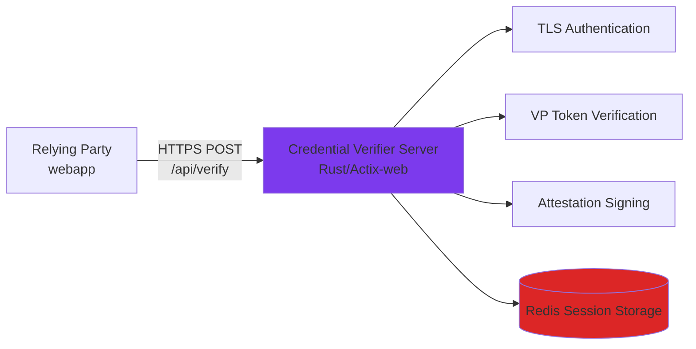
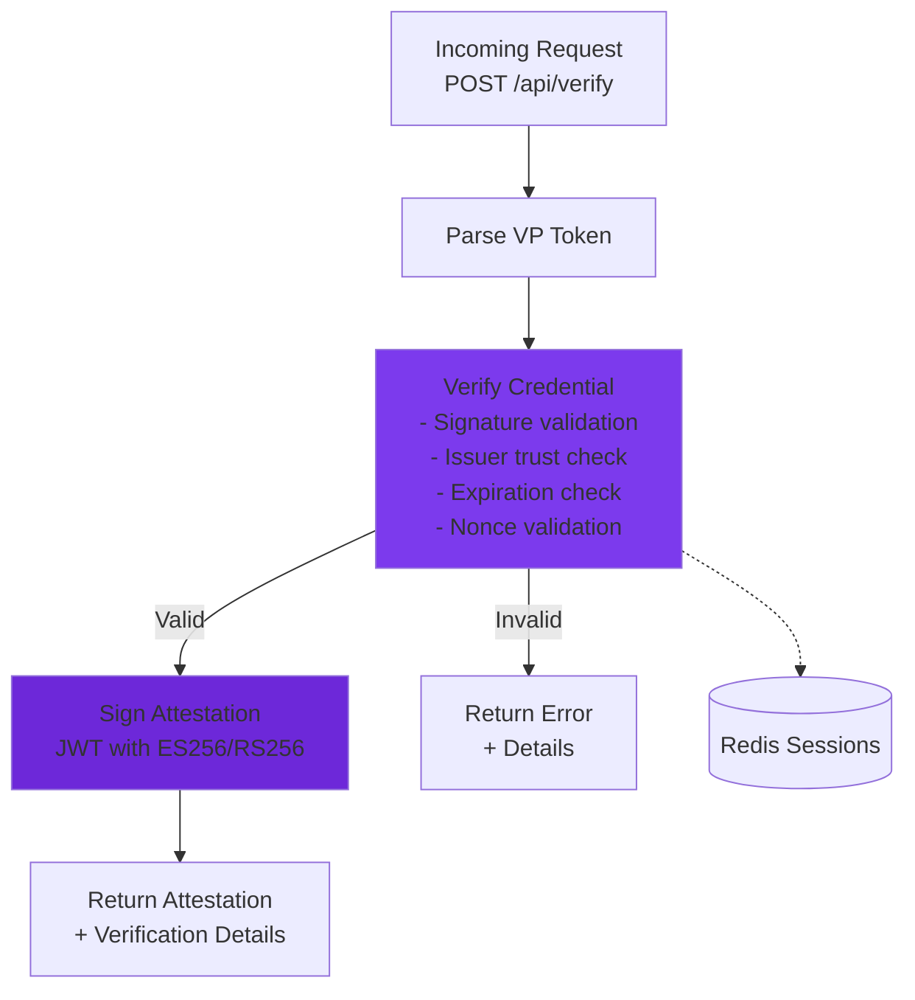

# ewQwe Credential Verification Server

The **ewQwe Credential Verification Server** is a production-ready backend service that Relying Parties (RPs) use to verify credentials presented by users' digital wallets. Instead of implementing complex cryptographic verification logic directly in web applications, RPs delegate credential verification to this trusted service, which returns signed attestations confirming successful verification.

> **Technical Note**: While named "Credential Verifier," this service technically verifies **Verifiable Presentations** (VP Tokens) that contain credentials. In the W3C Verifiable Credentials data model, credentials are cryptographically bound into presentations before verification. We use "Credential Verifier" throughout this documentation for clarity, as the business purpose is verifying credential authenticity—non-expert users immediately understand verifying credentials, while "Presentation Verifier" requires explaining the technical distinction between credentials and presentations.

This architecture provides several key benefits:

- **Security**: Cryptographic verification happens on a secure backend, isolated from browser environments
- **Centralization**: A single verification service can support multiple RPs across an organization
- **Standards Compliance**: Implements OpenID4VP, W3C Digital Credentials, and ISO/IEC 18013-5 (mDoc) standards
- **Auditability**: Comprehensive logging and telemetry for compliance and debugging

> **Note**: The current implementation is under active development and not yet final. Some features and APIs may change before the 1.0 release.

## Server Architecture

The credential verifier is built using Rust with the Actix-web framework and consists of several key components:



## Cryptographic Operations

The verifier handles the complex cryptographic operations:



## Verification Process

The server performs the following verification steps:

1. **Parse VP Token**: Deserialize the JSON-encoded credential presentation
2. **Cryptographic Verification**: Validate digital signatures (COSE for mDocs, JWS for JWTs)
3. **Issuer Trust**: Verify the credential issuer against a trusted registry
4. **Expiration Check**: Ensure the credential is still valid
5. **Nonce Validation**: Verify the nonce matches the original request (prevents replay attacks)
6. **Claim Extraction**: Extract relevant claims from verified credentials
7. **Attestation Signing**: Generate a signed JWT attestation confirming verification

> **Current Status**: Steps 2-3 are simulated in the current implementation. Production versions will implement full cryptographic verification against trusted issuer registries.

## Installation and Configuration

### Prerequisites

- **Rust** 1.75 or later
- **Redis** 6.0 or later (for session storage)
- **OpenSSL** 3.0+ or **rustls** (for TLS)

### Building from Source

```bash
# Clone the repository
git clone https://github.com/your-org/ewqwe-identity.git
cd ewqwe-identity/credential_verifier

# Build with default features (OpenSSL TLS backend)
cargo build --release --features openssl

# Or build with rustls
cargo build --release --features rustls
```

The compiled binary will be located at `target/release/credential-verifier`.

### Runtime Dependencies

#### Redis Server

The server requires a running Redis instance for session management:

```bash
# macOS (Homebrew)
brew install redis
brew services start redis

# Linux (systemd)
sudo systemctl start redis

# Docker
docker run -d -p 6379:6379 redis:alpine
```

By default, the server connects to Redis at `redis://127.0.0.1:6379`. This can be configured in the server initialization code.

**Production Checklist**:

- ✅ Use production TLS certificates from trusted CA
- ✅ Configure Redis with authentication and TLS
- ✅ Enable mTLS for client authentication
- ✅ Set up proper logging aggregation (ELK, Datadog, etc.)
- ✅ Implement rate limiting and DDoS protection
- ✅ Regular security audits and dependency updates
- ✅ Monitor with health checks and alerting
- ✅ Configure firewall rules to restrict access

**Systemd Service Example** (`/etc/systemd/system/credential-verifier.service`):

```ini
[Unit]
Description=ewQwe Credential Verifier Server
After=network.target redis.service

[Service]
Type=simple
User=ewqwe
WorkingDirectory=/opt/credential-verifier
Environment=RUST_LOG=info
Environment=REDIS_URL=redis://127.0.0.1:6379
ExecStart=/opt/credential-verifier/credential-verifier
Restart=on-failure
RestartSec=10

[Install]
WantedBy=multi-user.target
```

### Monitoring and Observability

**Key Metrics to Monitor**:

- Request rate and latency for `/api/verify` endpoint
- Verification success/failure rates
- TLS handshake errors
- Redis connection pool status
- Memory and CPU usage

### Configuration Parameters

TODO  Replace with actual config.toml or env vars

#### TLS Parameters

TODO  Replace with actual config.toml or env vars

### Example Configuration

TODO  Replace with actual config.toml or env vars

### Test Certificates

For development and testing, pre-generated certificates are available:

- **EC (P-256)**: `credential_verifier/src/tests/certificates/ec/`
- **RSA (4096-bit)**: `credential_verifier/src/tests/certificates/rsa/`

⚠️ **Never use test certificates in production environments.**

## Logging and Telemetry

The credential verifier uses the `ewqwe_logging` crate for comprehensive observability, supporting multiple backends:

- **Console Output**: Structured logs with optional ANSI colors
- **File Logging**: Daily rolling file appender
- **Syslog**: Unix/macOS/Linux system logging
- **OpenTelemetry (OTLP)**: Distributed tracing and metrics

### Basic Logging Setup

TODO  Replace with actual config.toml or env vars

### Advanced Telemetry Configuration

TODO  Replace with actual config.toml or env vars

### Log Levels

TODO  Replace with actual config.toml or env vars

### Key Log Events

The server emits structured logs for:

- **Request Processing**: VP token receipt, parsing, verification steps
- **Authentication**: Session validation, user identification
- **Verification Results**: Success/failure with detailed reasons
- **Attestation Signing**: Algorithm used, claims embedded
- **Errors**: Detailed error context with stack traces

Example log output:

```
2026-02-01T12:00:00.123Z INFO credential_verifier::server: Server listening on 0.0.0.0:8443
2026-02-01T12:00:15.456Z INFO credential_verifier::endpoints: VP Token received length=2048
2026-02-01T12:00:15.460Z DEBUG credential_verifier::endpoints: Parsing VP token
2026-02-01T12:00:15.462Z INFO credential_verifier::endpoints: VP Token parsed doc_type="org.iso.18013.5.1.mDL"
2026-02-01T12:00:15.465Z INFO credential_verifier::endpoints: Verification successful sig=true expired=false trusted=true
2026-02-01T12:00:15.468Z INFO credential_verifier::attestation: Signing attestation algorithm=ES256
```

## TLS Authentication Mechanisms

The server supports both standard TLS and mutual TLS (mTLS) authentication.

### Standard TLS (Server Authentication)

TODO  Replace with actual config.toml or env vars

### Mutual TLS (mTLS)

TODO  Replace with actual config.toml or env vars

With mTLS:

- Clients must present valid certificates signed by the client CA
- Server extracts and validates client certificates on connection
- Client identity can be used for authorization decisions

### Certificate Formats

All certificates must be in **PEM format**:

- **Private Keys**: PKCS#8 PEM encoding
- **Certificates**: X.509 PEM encoding
- **CA Chains**: Concatenated PEM certificates (root and intermediates)

## API Endpoints

The server exposes the following REST API endpoints:

### `POST /api/verify` - Verify Credential

Verifies a Verifiable Presentation (VP) token from a user's wallet and returns a signed attestation if valid.

**Request Body**:

```json
{
  "vp_token": "{\"proof_of_age\":[\"base64url_mdoc_presentation\"]}",
  "presentation_submission": null,
  "nonce": "random-nonce-from-request",
  "state": "session-state",
  "client_id": "https://example.com"
}
```

> **Note**: `presentation_submission` is **optional** and typically `null` when the wallet uses DCQL queries (OpenID4VP Section 8.1). With DCQL, the `vp_token` is a JSON object where keys are credential IDs from the query.

**Response** (Success):

```json
{
  "success": true,
  "message": "Credential verified successfully",
  "claims": {
    "age_over_18": true,
    "birth_date": "1990-01-01"
  },
  "verification_details": {
    "signature_valid": true,
    "not_expired": true,
    "issuer_trusted": true,
    "timestamp": "2026-02-01T12:00:00Z",
    "doc_type": "org.iso.18013.5.1.mDL",
    "namespace": "org.iso.18013.5.1"
  },
  "attestation": "eyJhbGciOiJFUzI1NiIsInR5cCI6IkpXVCJ9..."
}
```

**Response** (Failure):

```json
{
  "success": false,
  "message": "Credential verification failed",
  "verification_details": {
    "signature_valid": false,
    "not_expired": true,
    "issuer_trusted": false,
    "timestamp": "2026-02-01T12:00:00Z",
    "doc_type": "org.iso.18013.5.1.mDL",
    "namespace": "org.iso.18013.5.1"
  },
  "errors": [
    "Invalid signature",
    "Untrusted issuer"
  ]
}
```

### `GET /version` - Server Version

Returns the server version information. Requires valid session authentication.

**Response**:

```json
{
  "version": "0.1.0"
}
```

## Security Considerations

### Current Implementation Status

⚠️ The current implementation is a **demonstration/prototype** with simulated verification steps. Before production use:

1. **Implement Real Signature Verification**: Replace simulated checks with actual COSE/JWS cryptographic validation
2. **Trusted Issuer Registry**: Integrate with a production issuer trust list
3. **Revocation Checking**: Add support for credential revocation lists (CRLs) or OCSP
4. **Rate Limiting**: Implement request rate limiting to prevent abuse
5. **Secret Management**: Use proper secret management (HashiCorp Vault, AWS Secrets Manager, etc.) for private keys
6. **Audit Logging**: Ensure all verification events are logged immutably for compliance

### Production Checklist

- [ ] Replace test certificates with production certificates from trusted CA
- [ ] Configure production Redis with authentication and TLS
- [ ] Enable mTLS for client authentication
- [ ] Implement real cryptographic verification
- [ ] Set up centralized logging/monitoring (ELK, Datadog, etc.)
- [ ] Configure firewall rules to restrict access
- [ ] Regular security audits and dependency updates
- [ ] Disaster recovery and backup procedures
-

## Getting Help

For issues, questions, or contributions:

- **GitHub Issues**: [Report bugs or request features](https://github.com/your-org/ewqwe-identity/issues)
- **Documentation**: [Full technical documentation](https://your-docs-site.dev)
- **Community**: Join our discussion forums

## Related Documentation

- [User Journey - Sequence Diagram](./user-journey.md) - Complete credential flow
- [Components Architecture](./architecture.md) - System architecture overview
- [DCQL Age Verification](./dcql_age_verification.md) - Query language for credential requests
- [Digital Credential Format](./digital_credential_format.md) - Credential format specifications
