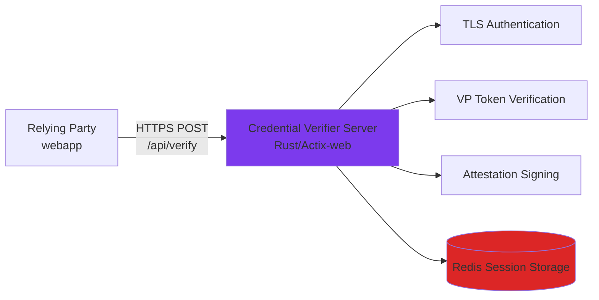
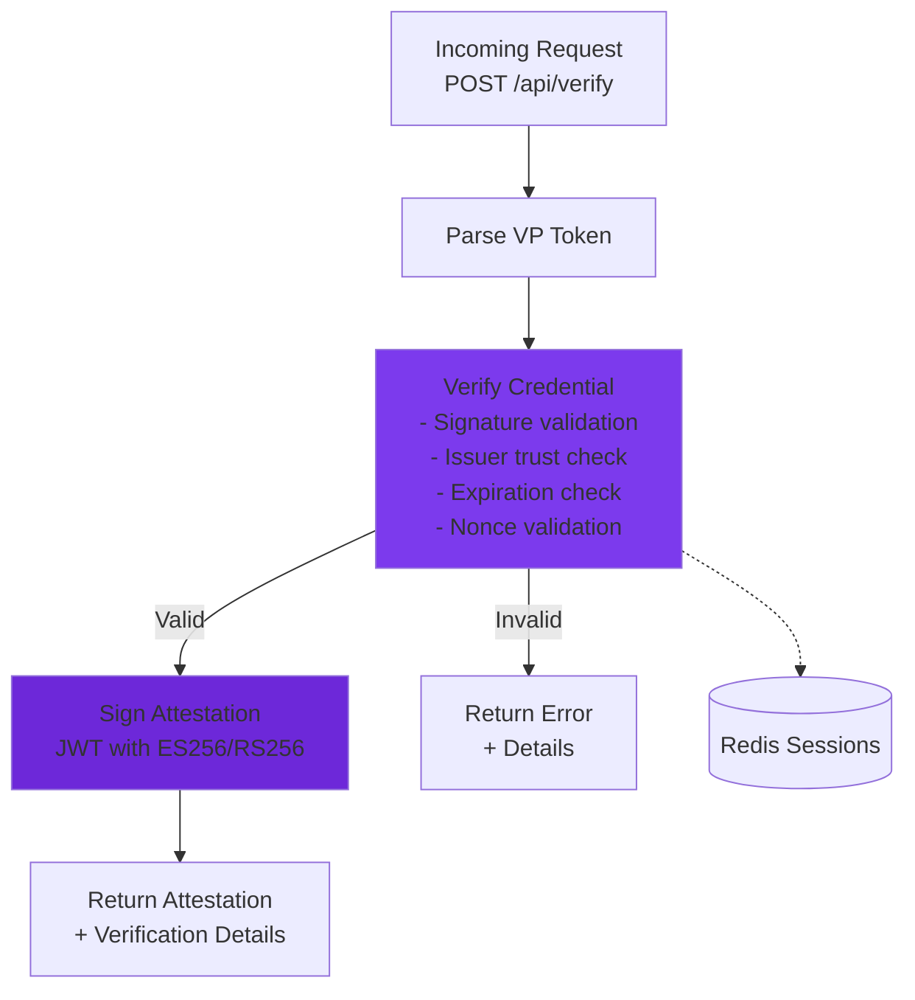

# ewQwe Credential Verification Server

The **ewQwe Credential Verification Server** is a production-ready backend service that Relying Parties (RPs) use to verify credentials presented by users' digital wallets. Instead of implementing complex cryptographic verification logic directly in web applications, RPs delegate credential verification to this trusted service, which returns signed attestations confirming successful verification.

> **Technical Note**: While named "Credential Verifier," this service technically verifies **Verifiable Presentations** (VP Tokens) that contain credentials. In the W3C Verifiable Credentials data model, credentials are cryptographically bound into presentations before verification. We use "Credential Verifier" throughout this documentation for clarity, as the business purpose is verifying credential authenticity—non-expert users immediately understand verifying credentials, while "Presentation Verifier" requires explaining the technical distinction between credentials and presentations.

This architecture provides several key benefits:

- **Security**: Cryptographic verification happens on a secure backend, isolated from browser environments
- **Centralization**: A single verification service can support multiple RPs across an organization
- **Standards Compliance**: Implements OpenID4VP, W3C Digital Credentials, and ISO/IEC 18013-5 (mDoc) standards
- **Auditability**: Comprehensive logging and telemetry for compliance and debugging

> **Note**: The current implementation is under active development and not yet final. Some features and APIs may change before the 1.0 release.

## Server Architecture

The credential verifier is built using Rust with the Actix-web framework and consists of several key components:



## Cryptographic Operations

The verifier handles the complex cryptographic operations:



## Verification Process

The server performs the following verification steps:

1. **Parse VP Token**: Deserialize the credential presentation (DCQL-wrapped mDoc CBOR, SD-JWT VC compact serialisation, or direct JSON)
2. **Claim Extraction**: Extract selectively-disclosed claims from SD-JWT disclosures or mDoc namespaced elements
3. **Expiration Check**: Verify `exp` timestamp in SD-JWT payload
4. **Nonce Binding**: The `state` from the request is used to look up the server-stored `OpenID4VPTransaction` nonce, which is compared against the nonce embedded in the KB-JWT of the SD-JWT VC presentation — this prevents replay attacks since the nonce never travels in the request body
5. **Cryptographic Signature Verification** (SD-JWT VC):
   - **Issuer JWT signature**: The `x5c` header provides the leaf certificate; its public key verifies the issuer JWT via `jsonwebtoken`. Supports ES256, ES384, RS256, RS384, RS512.
   - **Issuer trust**: The leaf certificate is validated against the trusted issuer CA certificates configured in `ServerParams::trusted_issuer_certs` using OpenSSL X.509 chain verification.
   - **KB-JWT holder signature**: The holder's public key is extracted from the `cnf.jwk` claim in the issuer payload. EC (P-256/P-384/P-521), RSA, and EdDSA key types are supported.
6. **Attestation Signing**: Generate an ES256-signed JWT attestation confirming verification

> **Remaining limitations:**
>
> - **mDoc signatures**: MSO COSE_Sign1 signature verification for mDoc presentations is not yet implemented.
> - **SD-JWT without x5c**: If the issuer JWT has no `x5c` header, the issuer public key cannot be obtained and signature verification is skipped.
> - **Trusted-issuer CA list**: Currently configured as a static set of PEM files in `credential-server.toml`. Production deployments should integrate with dynamic trust sources (ETSI Trusted Lists, OpenID Federation, or X.509 AKI per OpenID4VP §6.1.1).

## Installation and Configuration

### Prerequisites

- **Rust** 1.75 or later
- **Redis** 6.0 or later (for session storage)
- **OpenSSL** 3.0+ or **rustls** (for TLS)

### Building from Source

```bash
# Clone the repository
git clone https://github.com/your-org/ewqwe-identity.git
cd ewqwe-identity/credential_verifier

# Build with default features (OpenSSL TLS backend)
cargo build --release --features openssl

# Or build with rustls
cargo build --release --features rustls
```

The compiled binary will be located at `target/release/credential-verifier`.

### Runtime Dependencies

#### Redis Server

The server requires a running Redis instance for session management:

```bash
# macOS (Homebrew)
brew install redis
brew services start redis

# Linux (systemd)
sudo systemctl start redis

# Docker
docker run -d -p 6379:6379 redis:alpine
```

By default, the server connects to Redis at `redis://127.0.0.1:6379`. This can be configured in the server initialization code.

**Production Checklist**:

- ✅ Use production TLS certificates from trusted CA
- ✅ Configure Redis with authentication and TLS
- ✅ Enable mTLS for client authentication
- ✅ Set up proper logging aggregation (ELK, Datadog, etc.)
- ✅ Implement rate limiting and DDoS protection
- ✅ Regular security audits and dependency updates
- ✅ Monitor with health checks and alerting
- ✅ Configure firewall rules to restrict access

**Systemd Service Example** (`/etc/systemd/system/credential-verifier.service`):

```ini
[Unit]
Description=ewQwe Credential Verifier Server
After=network.target redis.service

[Service]
Type=simple
User=ewqwe
WorkingDirectory=/opt/credential-verifier
Environment=RUST_LOG=info
Environment=REDIS_URL=redis://127.0.0.1:6379
ExecStart=/opt/credential-verifier/credential-verifier
Restart=on-failure
RestartSec=10

[Install]
WantedBy=multi-user.target
```

### Monitoring and Observability

**Key Metrics to Monitor**:

- Request rate and latency for `/api/verify` endpoint
- Verification success/failure rates
- TLS handshake errors
- Redis connection pool status
- Memory and CPU usage

### Configuration Parameters

TODO  Replace with actual config.toml or env vars

#### TLS Parameters

TODO  Replace with actual config.toml or env vars

### Example Configuration

TODO  Replace with actual config.toml or env vars

### Test Certificates

For development and testing, pre-generated certificates are available:

- **EC (P-256)**: `credential_verifier/src/tests/certificates/ec/`
- **RSA (4096-bit)**: `credential_verifier/src/tests/certificates/rsa/`

⚠️ **Never use test certificates in production environments.**

## Logging and Telemetry

The credential verifier uses the `ewqwe_logging` crate for comprehensive observability, supporting multiple backends:

- **Console Output**: Structured logs with optional ANSI colors
- **File Logging**: Daily rolling file appender
- **Syslog**: Unix/macOS/Linux system logging
- **OpenTelemetry (OTLP)**: Distributed tracing and metrics

### Basic Logging Setup

TODO  Replace with actual config.toml or env vars

### Advanced Telemetry Configuration

TODO  Replace with actual config.toml or env vars

### Log Levels

TODO  Replace with actual config.toml or env vars

### Key Log Events

The server emits structured logs for:

- **Request Processing**: VP token receipt, parsing, verification steps
- **Authentication**: Session validation, user identification
- **Verification Results**: Success/failure with detailed reasons
- **Attestation Signing**: Algorithm used, claims embedded
- **Errors**: Detailed error context with stack traces

Example log output:

```
2026-02-01T12:00:00.123Z INFO credential_verifier::server: Server listening on 0.0.0.0:8443
2026-02-01T12:00:15.456Z INFO credential_verifier::endpoints: VP Token received length=2048
2026-02-01T12:00:15.460Z DEBUG credential_verifier::endpoints: Parsing VP token
2026-02-01T12:00:15.462Z INFO credential_verifier::endpoints: VP Token parsed doc_type="org.iso.18013.5.1.mDL"
2026-02-01T12:00:15.465Z INFO credential_verifier::endpoints: Verification successful sig=true expired=false trusted=true
2026-02-01T12:00:15.468Z INFO credential_verifier::attestation: Signing attestation algorithm=ES256
```

## TLS Authentication Mechanisms

The server supports both standard TLS and mutual TLS (mTLS) authentication.

### Standard TLS (Server Authentication)

TODO  Replace with actual config.toml or env vars

### Mutual TLS (mTLS)

TODO  Replace with actual config.toml or env vars

With mTLS:

- Clients must present valid certificates signed by the client CA
- Server extracts and validates client certificates on connection
- Client identity can be used for authorization decisions

### Certificate Formats

All certificates must be in **PEM format**:

- **Private Keys**: PKCS#8 PEM encoding
- **Certificates**: X.509 PEM encoding
- **CA Chains**: Concatenated PEM certificates (root and intermediates)

## API Endpoints

The server exposes the following REST API endpoints:

### `POST /api/verify` - Verify Credential

Verifies a Verifiable Presentation (VP) token from a user's wallet and returns a signed attestation if valid.

**Request Body**:

```json
{
  "vp_token": "{\"proof_of_age\":[\"base64url_mdoc_presentation\"]}",
  "presentation_submission": null,
  "state": "session-state",
  "client_id": "https://example.com"
}
```

> **Note**: `presentation_submission` is **optional** and typically `null` when the wallet uses DCQL queries (OpenID4VP Section 8.1). With DCQL, the `vp_token` is a JSON object where keys are credential IDs from the query.
>
> The `state` field is **required** for transaction binding: the server looks up the original `OpenID4VPTransaction` by state and compares the stored transaction context against the presentation proof. For SD-JWT VC that means comparing the stored nonce against the KB-JWT nonce. For `mso_mdoc` that means rebuilding the OpenID4VP handover from the stored `client_id`, `nonce`, and `response_uri` before verifying `deviceAuth.deviceSignature`.

**Response** (Success):

```json
{
  "success": true,
  "message": "Credential verified successfully",
  "claims": {
    "age_over_18": true,
    "birth_date": "1990-01-01"
  },
  "verification_details": {
    "signature_valid": true,
    "not_expired": true,
    "issuer_trusted": true,
    "timestamp": "2026-02-01T12:00:00Z",
    "doc_type": "org.iso.18013.5.1.mDL",
    "namespace": "org.iso.18013.5.1"
  },
  "attestation": "eyJhbGciOiJFUzI1NiIsInR5cCI6IkpXVCJ9..."
}
```

**Response** (Failure):

```json
{
  "success": false,
  "message": "Credential verification failed",
  "verification_details": {
    "signature_valid": false,
    "not_expired": true,
    "issuer_trusted": false,
    "timestamp": "2026-02-01T12:00:00Z",
    "doc_type": "org.iso.18013.5.1.mDL",
    "namespace": "org.iso.18013.5.1"
  },
  "errors": [
    "Invalid signature",
    "Untrusted issuer"
  ]
}
```

### `GET /version` - Server Version

Returns the server version information. Requires valid session authentication.

**Response**:

```json
{
  "version": "0.1.0"
}
```

## Security Considerations

### Current Implementation Status

#### 1. Nonce Replay Prevention ✅

The nonce used for replay prevention is looked up **server-side** from the `OpenID4VPTransaction` store. The `verify_credential_endpoint` receives the `state` field from the request, loads the stored transaction, and compares the stored nonce against the holder-binding proof in the presentation. The nonce is never taken from the HTTP request body.

The `state` value itself follows the OAuth/OpenID4VP model: it is an opaque client-maintained correlation value. In this repository the wallet-facing client is the delegated verifier service behind `/api/openid4vp/init`, so it may generate the `state` itself. If the RP wants to own `state`, it can now supply one in `InitTransactionRequest` and the service preserves it verbatim.

**Flow**:

1. `init_transaction()` stores a fresh nonce in the `OpenID4VPTransaction`
2. The wallet binds this nonce into the holder-binding proof of the presentation
3. `verify_credential_endpoint` looks up the transaction by `state` and retrieves the stored nonce plus the original OpenID4VP request context
4. The verifier compares that stored context against the presentation proof — mismatch leads to verification failure
5. After a successful verification, the transaction is consumed so the VP token is single-use

#### 2. Cryptographic Signature Verification

| Signature | Algorithm | Key Source | Crate | Status |
|-----------|-----------|------------|-------|--------|
| SD-JWT VC issuer JWT | ES256/ES384/RS256/RS384/RS512 | `x5c` leaf certificate | `jsonwebtoken` v9 | ✅ Implemented |
| KB-JWT holder binding | ES256/RS256/EdDSA | `cnf.jwk` claim in issuer payload | `jsonwebtoken` v9 | ✅ Implemented |
| mDoc IssuerAuth / DeviceSignature | ES256 / ES384 / ES512 | X.509 chain in `issuerAuth`, device key in MSO `deviceKeyInfo.deviceKey` | `coset` + `openssl` | ✅ Implemented |

**SD-JWT VC**: The JWT header `x5c` provides the leaf certificate. Its public key is extracted via `openssl` and used with `jsonwebtoken::decode()` for signature verification. The `cnf.jwk` claim in the issuer payload provides the holder's public key for KB-JWT verification. EC, RSA, and EdDSA key types are supported.

**mDoc**: The verifier now performs the full wallet-facing checks needed for `mso_mdoc` presentations in this flow:

- verifies the `issuerAuth` `COSE_Sign1` signature
- validates the `issuerAuth` X.509 chain against `trusted_issuer_certs`
- parses the MobileSecurityObject and validates `valueDigests` against each disclosed `IssuerSignedItem`
- reconstructs the OpenID4VP `SessionTranscript` / `OpenID4VPHandover` from `client_id`, `nonce`, `response_uri`, and the response-encryption JWK thumbprint when `direct_post.jwt` is used
- verifies `deviceAuth.deviceSignature` with the device public key from `deviceKeyInfo.deviceKey`

Current limitation: `deviceAuth.deviceMac` is still rejected; the verifier currently supports `deviceSignature`-based holder binding.

#### 3. Trusted-Issuer List

The `trusted_issuer_certs` configuration parameter in `credential-server.toml` specifies PEM files for trusted issuer CA certificates. The leaf certificate from the SD-JWT `x5c` header is validated against this list using OpenSSL X.509 chain verification.

Currently configured with two test issuer CAs from the Android wallet test suites:

- `av_issuer_ca01.pem` — Age Verification Issuer CA 01 (CN=Age Verification Issuer CA 01, C=AV)
- `pidissuerca02_eu.pem` — PID Issuer CA 02 (CN=PID Issuer CA 02, O=EUDI Wallet Reference Implementation, C=EU)

OpenID4VP 1.0 section 6.1.1 defines three trust mechanisms:

| Mechanism | Type | Description |
|-----------|------|-------------|
| `aki` | X.509 Authority Key Identifier | Match issuer cert chain against known AKIs |
| `etsi_tl` | ETSI Trusted List (TS 119 612) | EU Member State official trust lists (LOTL) |
| `openid_federation` | OpenID Federation Entity | Federation-based trust chains |

The type definitions for these mechanisms already exist in `crates/openid4vp/src/types.rs` (`TrustedAuthority`, `TrustedAuthorityType`).

**No central Age Verification issuer registry exists yet.** The EU LOTL covers eIDAS services but not AV-specific credential issuers. The Age Verification Profile uses the `redirect_uri` client_id scheme precisely because no issuer trust framework is established yet.

For production, integrate with dynamic trust sources (ETSI Trusted Lists, OpenID Federation) rather than relying solely on the static certificate list.

### Production Checklist

- [x] ~~Fix nonce replay: use server-stored nonce, not client-supplied~~
- [x] ~~Implement SD-JWT VC issuer JWT signature verification~~
- [x] ~~Implement KB-JWT holder signature verification~~
- [x] ~~Add trusted-issuer CA certificate configuration~~
- [x] ~~Implement mDoc IssuerAuth signature verification~~
- [x] ~~Implement mDoc DeviceSignature verification bound to OpenID4VPHandover~~
- [x] ~~Consume verified transactions so the verifier endpoint is one-shot~~
- [ ] Replace test certificates with production certificates from trusted CA
- [ ] Configure production Redis with authentication and TLS
- [ ] Enable mTLS for client authentication
- [ ] Implement `deviceAuth.deviceMac` verification when that proof mode is needed
- [ ] Handle SD-JWT VCs without `x5c` header (e.g. issuer key lookup by `kid`)
- [ ] Integrate with dynamic trust sources (ETSI Trusted Lists, OpenID Federation)
- [ ] Implement credential revocation checking (CRLs or OCSP)
- [ ] Set up centralized logging/monitoring (ELK, Datadog, etc.)
- [ ] Configure firewall rules to restrict access
- [ ] Implement rate limiting to prevent abuse
- [ ] Use proper secret management (HashiCorp Vault, etc.) for private keys
- [ ] Regular security audits and dependency updates
- [ ] Disaster recovery and backup procedures
-

## Getting Help

For issues, questions, or contributions:

- **GitHub Issues**: [Report bugs or request features](https://github.com/your-org/ewqwe-identity/issues)
- **Documentation**: [Full technical documentation](https://your-docs-site.dev)
- **Community**: Join our discussion forums

## Related Documentation

- [User Journey - Sequence Diagram](./user-journey.md) - Complete credential flow
- [Components Architecture](./architecture.md) - System architecture overview
- [DCQL Age Verification](./dcql_age_verification.md) - Query language for credential requests
- [Digital Credential Format](./digital_credential_format.md) - Credential format specifications
