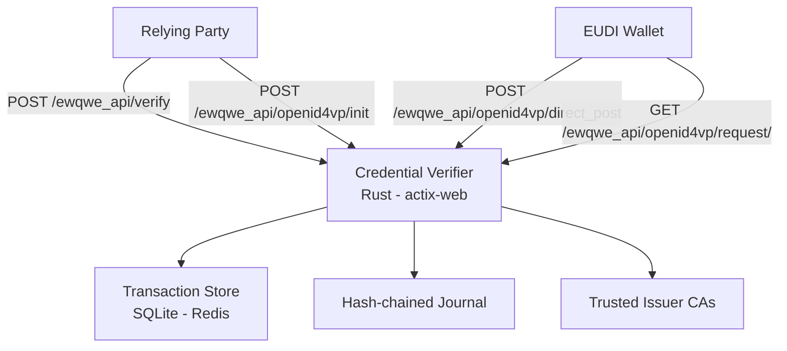

# Credential Verifier Server

The Credential Verifier is a Rust (actix-web) server that validates **Verifiable Presentations** from EUDI Wallets via OpenID4VP, cryptographically verifies them, and returns signed JWT attestations to Relying Parties.

It handles the full OpenID4VP transaction lifecycle — from generating authorization requests (with optional JAR signing for HAIP) to receiving VP Tokens, decrypting JWE, validating signatures, and issuing attestations.

## Architecture



## What it verifies

| Format | Checks performed |
|--------|-----------------|
| **mso_mdoc** (COSE_Sign1) | IssuerAuth MSO signature via `x5chain` certificate chain. MSO digest against each disclosed `IssuerSignedItem`. DeviceSignature (holder binding) via `SessionTranscript` / OpenID4VP handover. MSO `validUntil` / `validFrom` expiry. |
| **dc+sd-jwt** | Issuer JWT signature via `x5c` certificate chain. `_sd` digest disclosure verification. KB-JWT holder binding (`cnf.jwk`, nonce, audience). `exp` claim expiry. |

The verification process:

1. **Parse** VP Token (mDoc CBOR or SD-JWT compact serialization)
2. **Extract** selectively-disclosed claims
3. **Check expiry** against MSO validity period or JWT `exp`
4. **Verify nonce binding** — the `state` parameter looks up the stored transaction nonce, validated against the KB-JWT or `SessionTranscript`
5. **Validate signatures** against the issuer's certificate chain via the trusted CA directory
6. **Sign attestation** — returns an ES256-signed JWT bound to the `transaction_id`

## API Endpoints

### OpenID4VP Transaction Flow

| Method | Path | Description |
|--------|------|-------------|
| `POST` | `/ewqwe_api/openid4vp/init` | Create a new transaction. Accepts `credential_type`, `profile`, `dcql_query`. Returns `transaction_id`, `request_uri`, `qr_code_data_url`. |
| `GET` | `/ewqwe_api/openid4vp/request/{id}` | Serve the authorization request (signed JAR for HAIP, plain JSON for Annex A). |
| `POST` | `/ewqwe_api/openid4vp/direct_post` | Receive VP Token from wallet (the `response_uri`). |
| `GET` | `/ewqwe_api/openid4vp/status/{id}` | Poll transaction status (`pending`, `scanned`, `verified`, `failed`, `expired`). |

### Verification

| Method | Path | Description |
|--------|------|-------------|
| `POST` | `/ewqwe_api/verify` | Verify a VP Token. Accepts `vp_token`, `state`, `client_id`. Returns `success`, `claims`, `attestation` (signed JWT). |
| `POST` | `/ewqwe_api/dc_api/verify` | Verify a DC API credential. Accepts `device_response_b64` (pre-decrypted mDoc), `nonce`, `doc_type`. |
| `GET` | `/ewqwe_api/dc_api/nonce` | Generate a DC API nonce for replay protection. |

### Utility

| Method | Path | Description |
|--------|------|-------------|
| `GET` | `/version` | Server version. |
| `GET` | `/ewqwe_api/openid4vp/.well-known/jwks.json` | Public JWK set (for JAR verification and JWE encryption). |

### Journal

| Method | Path | Description |
|--------|------|-------------|
| `GET` | `/ewqwe_api/journal/{username}/entries` | List verification entries (paginated, filterable by date). |
| `GET` | `/ewqwe_api/journal/{username}/verify` | Verify hash-chain integrity. |
| `GET` | `/ewqwe_api/journal/{username}/download` | Download journal as JSON. |

## Installation

### Prerequisites

- **Rust** 1.70+
- **pnpm** >= 9 (for building the admin UI SPA)

The open-core uses SQLite and in-memory stores by default — no PostgreSQL or Redis needed for basic operation.

### Quick Start (Docker)

```bash
docker pull ghcr.io/rd-ewqwe/ewqwe-identity:latest

docker run --rm -p 9888:9888 \
  -e PUBLIC_ROOT_URL="https://verifier.your-domain.com" \
  --name credential-verifier \
  ghcr.io/rd-ewqwe/ewqwe-identity:latest
```

Navigate to `http://localhost:9888` and complete the one-time bootstrap to create an admin account.

See the [Container README](https://github.com/rd-ewqwe/ewqwe-identity/blob/main/container/README.md) for persistent storage, TLS, Kubernetes, and production signer certificates.

### Build from Source

```bash
# Build the server
cargo build --release -p ewqwe_credential_verifier_server

# Build the admin UI SPA (optional — see Credential Verifier UI page)
cd crates/ewqwe-credential-verifier-ui/ui
pnpm install && pnpm build
```

Start the server:

```bash
cargo run -p ewqwe_credential_verifier_server -- \
  crates/ewqwe-credential-verifier-server/credential-server.toml
```

### As a Rust Dependency

```toml
[dependencies]
ewqwe_credential_verifier_client = { git = "https://github.com/rd-ewqwe/ewqwe-identity" }
```

## Configuration

The server uses a TOML config file. It searches for `credential-server.toml` in the current directory, then at the platform-specific application support path.

### Minimal Config (Development)

```toml
host_name = "0.0.0.0"
host_port = 9888
public_root_url = "http://localhost:9888"

[verifier_ui]
enabled = true
ui_dist_path = "../ewqwe-credential-verifier-ui/ui/dist"
```

### Full Configuration Reference

```toml
host_name = "0.0.0.0"
host_port = 9443
public_root_url = "https://verifier.example.com:9443"
rust_log = "info,credential_verifier=debug"
# Authentication disabled for local dev:
disable_authentication = true
disabled_authentication_user = "local_tests_user"

# TLS (mutual TLS supported)
[tls_params]
server_private_key = "certs/server.key.pem"
server_certificate = "certs/server.cert.pem"
server_ca_chain = "certs/ca.chain.pem"
client_ca_cert_chain = "certs/client-ca.pem"     # mTLS clients

# OpenID4VP transaction handling
[openid4vp_config]
transaction_ttl_secs = 300                         # Default: 5 minutes

[openid4vp_config.transaction_store]
backend = "sqlite_file"                            # sqlite_memory | sqlite_file | redis | postgres
path = "transactions.db"

# HAIP: JAR signing and JWE decryption
[openid4vp_config.haip_config]
x509_cert_path = "certs/server.fullchain.pem"
x509_key_path = "certs/server.key.pem"

# Hash-chained audit journal
[journal_config]
enabled = true
backend = "sqlite_file"
path = "journal.db"

# Admin UI (see Credential Verifier UI page)
[verifier_ui]
enabled = true
app_name = "My Verifier"
session_secret = "..."                              # Generate: openssl rand -hex 64
ui_dist_path = "../ewqwe-credential-verifier-ui/ui/dist"

# OpenTelemetry (OTLP) — enterprise feature
[tracing_config]
service_name = "credential_verifier"

[tracing_config.otlp]
enabled = false
url = "http://localhost:4317"
```

### Transaction Store Backends

| Backend | Use case | Availability |
|---------|----------|-------------|
| `sqlite_memory` | Development / testing (default) | Open-core |
| `sqlite_file` | Single-instance with persistence | Open-core |
| `redis` | Multi-instance / HA with TTL-native expiry | Enterprise |
| `postgres` | Enterprise deployments | Enterprise |

## Verification Journal

The journal is an append-only, hash-chained audit log of every verification event. Each entry's hash is chained to the previous entry, forming a tamper-evident chain.

Formula: `entry_hash = SHA-256(previous_hash || attestation_signature_hash || created_at_iso8601)`

The `/ewqwe_api/journal/{username}/verify` endpoint recomputes all hashes to detect tampering.

## Security

### Nonce Replay Prevention

The nonce is stored server-side in the transaction store. The `verify` endpoint receives the `state` field, loads the transaction, and compares the stored nonce against the holder-binding proof (KB-JWT nonce for SD-JWT VC, `SessionTranscript` nonce for mDoc). The nonce is **never** accepted from the HTTP request body.

### Trusted Issuer CA Directory

All `*.pem` files in the configured issuers CA directory are loaded as trusted anchors at startup. Certs are cached — restart the server to pick up changes.

## Related Pages

- [Protocols & Formats Summary](./summary_protocols_formats.md) — protocol and format reference
- [Credential Verifier UI](./credential_verifier_ui.md) — admin dashboard documentation
- [Demo Webapp](./demo_webapp.md) — Relying Party demo

## Enterprise Version

PostgreSQL and Redis stores, OpenTelemetry (OTLP) tracing, APISIX/eIDAS authentication, mTLS, multi-tenancy, and K8s Helm charts are available in the **enterprise** version. [Contact ewqwe.eu](https://ewqwe.eu) for details.
