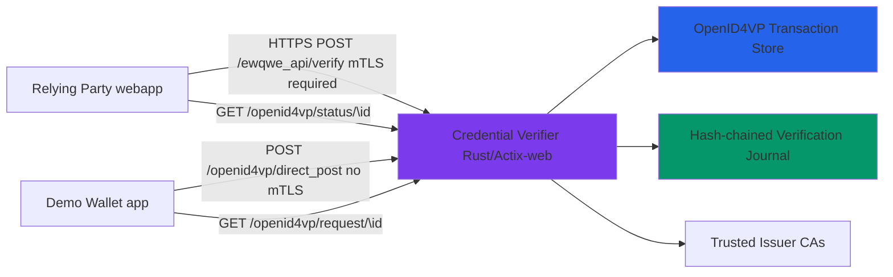

# ewQwe Credential Verification Server

The **ewQwe Credential Verification Server** is a production-ready backend service that Relying Parties (RPs) use to verify credentials presented by users' digital wallets. Instead of implementing complex cryptographic verification logic directly in web applications, RPs delegate credential verification to this trusted service, which returns signed attestations confirming successful verification.

> **Technical Note**: While named "Credential Verifier," this service technically verifies **Verifiable Presentations** (VP Tokens) that contain credentials. In the W3C Verifiable Credentials data model, credentials are cryptographically bound into presentations before verification.

This architecture provides several key benefits:

- **Security**: Cryptographic verification happens on a secure backend, isolated from browser environments
- **Centralization**: A single verification service can support multiple RPs across an organization
- **Standards Compliance**: Implements OpenID4VP, W3C Digital Credentials, ISO/IEC 18013-5 (mDoc), SD-JWT VC, HAIP, and EU AV Profile
- **Auditability**: Comprehensive logging and telemetry for compliance and debugging

## Server Architecture

The credential verifier is built using Rust with the Actix-web framework:



## Protocol Implementation Status

The server implements the following protocols and profiles. The table shows what is complete and what is missing for each.

### OpenID4VP (Annex B)

| Feature | Status | Details |
|---------|--------|---------|
| Transaction init | ✅ Complete | `POST /ewqwe_api/openid4vp/init` — creates transaction, builds DCQL query, returns QR data |
| Authorization request serving | ✅ Complete | `GET/POST /ewqwe_api/openid4vp/request/{id}` — returns signed JAR (HAIP) or plain JSON (Annex A) |
| Wallet direct_post | ✅ Complete | `POST /ewqwe_api/openid4vp/direct_post` — receives VP token from wallet |
| Status polling | ✅ Complete | `GET /ewqwe_api/openid4vp/status/{id}` — returns transaction status and VP token when received |
| JWKS serving | ✅ Complete | `GET /ewqwe_api/openid4vp/.well-known/jwks.json` — public keys for JAR verification |
| DCQL query language | ✅ Complete | Modern JSON-based query language for credential requests |
| `redirect_uri` scheme (EU AV) | ✅ Complete | Annex A fallback with plain `direct_post` |
| `x509_san_dns` scheme | ✅ Complete | DNS-based client ID verification |
| `x509_hash` scheme | ✅ Complete | Certificate hash-based client ID verification (HAIP) |
| `did` scheme | ⚠️ Partial | Parsed but no DID resolution logic |
| `x509_san_uri` scheme | ✅ Complete | URI SAN-based client ID verification |
| HAIP JAR signing | ✅ Complete | JWT-secured authorization requests with `x5c` certificate chain |
| HAIP JWE response decryption | ✅ Complete | ECDH-ES + A256GCM decryption of wallet responses |
| Cross-device (QR) | ✅ Complete | QR code generation, wallet posts to `direct_post` |
| Same-device (deep link) | ✅ Complete | Deep link via `openid4vp://` URL scheme |
| `presentation_definition` (PEX) | ❌ Not supported | Only DCQL is supported. Legacy PEX is not implemented |
| **EU-AV profile without JAR** | ✅ Complete | Deliberately omits JAR for privacy (uses `redirect_uri` scheme, no request signing) |

### ISO/IEC 18013-7 Annex C (W3C Digital Credentials API)

Annex C defines **two sub-protocols** over the W3C Digital Credentials API:

| Sub-protocol | Protocol ID | Request | Response | Server endpoint |
|---|---|---|---|---|
| **A — Raw ISO mDoc** | `"org-iso-mdoc"` | CBOR `["dcapi", ...]` + CBOR `DeviceRequest` | HPKE-encrypted mDoc in CBOR `["dcapi", ...]` | `POST /ewqwe_api/dc_api/verify` (stateless, pre-decrypted mDoc) |
| **B — OpenID4VP over DC API** | `"openid4vp-v1-unsigned"` | Standard OpenID4VP Authorization Request (JSON) | Standard VP Token (via `dc_api` or `dc_api.jwt` response mode) | `POST /ewqwe_api/verify` (existing endpoint — no server-side changes needed) |

**For Sub-protocol B**, the wallet returns a standard OpenID4VP Authorization Response. The RP
forwards the VP token to the existing `/ewqwe_api/verify` endpoint, which processes it identically
to a token received via `direct_post`. The verifier server does not need to distinguish between
Annex B (deep link) and Annex C Sub-protocol B (DC API) — both produce the same `vp_token` format.

| Feature | Status | Details |
|---------|--------|---------|
| `dc_api/verify` endpoint | ✅ Complete | Receives already-decrypted mDoc DeviceResponse (Sub-protocol A), validates signatures |
| Nonce endpoint | ✅ Complete | `GET /ewqwe_api/dc_api/nonce` — server-generated nonce for stronger replay protection |
| HPKE encryption | ⚠️ Client-side only | HPKE key generation and decryption happen in the browser (RP webapp). Server receives already-decrypted data |
| Annex C wrapper (`["dcapi", ...]`) | ⚠️ Client-side only | CBOR blob construction and parsing happen in the RP webapp's `DcApiService` (Sub-protocol A only) |
| Protocol `"openid4vp-v1-*"` | ✅ Handled by existing `/ewqwe_api/verify` | Sub-protocol B VP tokens are verified by the standard OpenID4VP endpoint — no server changes needed |
| Protocol `"org-iso-mdoc"` | ⚠️ Client-side only | The raw Annex C protocol identifier (Sub-protocol A) is wired through `DcApiService` + `/dc_api/verify` |

### ISO/IEC 18013-7 Annex A (REST API / Device Retrieval)

| Feature | Status | Details |
|---------|--------|---------|
| Direct CBOR DeviceRequest | ❌ Not implemented | No wallet implements Annex A; the standard is not used by any major EUDI wallet |
| Direct DeviceResponse CBOR | ❌ Not implemented | |

### Credential Formats

| Format | Verification | Status | Details |
|--------|-------------|--------|---------|
| `mso_mdoc` (COSE_Sign1) | IssuerAuth MSO signature | ✅ Complete | Certificate chain verification via `x5chain` header |
| `mso_mdoc` | MSO digest verification | ✅ Complete | Each disclosed `IssuerSignedItem` verified against MSO `valueDigests` |
| `mso_mdoc` | DeviceSignature | ✅ Complete | Holder binding via `SessionTranscript` in OpenID4VP handover |
| `mso_mdoc` | Non-expired / validFrom | ✅ Complete | MSO `validUntil` and `validFrom` checked |
| `dc+sd-jwt` | Issuer JWT signature | ✅ Complete | `x5c` header certificate chain verification |
| `dc+sd-jwt` | Selective disclosure | ✅ Complete | `_sd` digests verified against salted claim digests |
| `dc+sd-jwt` | KB-JWT holder binding | ✅ Complete | `cnf.jwk` public key verifies KB-JWT; nonce and audience checked |
| `dc+sd-jwt` | Expiration | ✅ Complete | `exp` claim in issuer JWT checked |

## Verification Process

The server performs the following verification steps:

1. **Parse VP Token**: Deserialize the credential presentation — DCQL-wrapped mDoc CBOR, SD-JWT VC compact serialisation, or direct JSON
2. **Claim Extraction**: Extract selectively-disclosed claims from SD-JWT `_sd` digests or mDoc `IssuerSigned` namespaced elements
3. **Expiration Check**: Verify `exp` timestamp (SD-JWT payload) or MSO `validUntil` / `validFrom` (mDoc)
4. **Nonce Binding**: The `state` from the request is used to look up the server-stored `OpenID4VPTransaction` nonce, which is compared against the nonce embedded in the KB-JWT (SD-JWT VC) or the reconstructed `SessionTranscript` (mDoc)
5. **Cryptographic Signature Verification** (see [Credential Formats](./credential_formats.md) for details)
6. **Attestation Signing**: Generate an ES256-signed JWT attestation confirming verification, bound to the `transaction_id` as the `sub` claim

## API Endpoints

### Route Overview

All endpoints are under the `/ewqwe_api` scope, except `/version`.

| Method | Path | Auth | Description |
|--------|------|------|-------------|
| POST | `/ewqwe_api/verify` | mTLS | Verify a VP token from the RP |
| POST | `/ewqwe_api/openid4vp/init` | mTLS | Initialize an OpenID4VP transaction |
| GET | `/ewqwe_api/openid4vp/status/{id}` | mTLS | Poll transaction status |
| POST | `/ewqwe_api/openid4vp/direct_post` | None | Wallet POSTs VP token |
| GET | `/ewqwe_api/openid4vp/request/{id}` | None | Wallet fetches authorization request |
| POST | `/ewqwe_api/openid4vp/request/{id}` | None | Wallet fetches authorization request |
| GET | `/ewqwe_api/openid4vp/.well-known/jwks.json` | None | Public JWK set |
| POST | `/ewqwe_api/dc_api/verify` | None | Verify DC API (Annex C) presentation |
| GET | `/ewqwe_api/dc_api/nonce` | None | Generate a fresh nonce |
| GET | `/ewqwe_api/.well-known/issuer_certs` | mTLS | List loaded issuer CA certificates |
| GET | `/ewqwe_api/journal/{username}/entries` | mTLS | List journal entries |
| GET | `/ewqwe_api/journal/{username}/verify` | mTLS | Verify journal chain integrity |
| GET | `/ewqwe_api/journal/{username}/download` | mTLS | Download journal as JSON file |
| GET | `/version` | None | Server version |

### `POST /ewqwe_api/verify` — Verify Credential

Verifies a VP Token received from the RP (which obtained it from the wallet via direct_post or the DC API). Requires mTLS client certificate authentication.

**Request Body**:

```json
{
  "vp_token": "<VP token string>",
  "presentation_submission": "<optional JSON string or object>",
  "state": "<transaction state from OpenID4VP>",
  "client_id": "<RP identity; required when state is absent (DC API flow)>"
}
```

| Field | Type | Description |
|-------|------|-------------|
| `vp_token` | string | The VP token — DCQL-wrapped mDoc CBOR or SD-JWT VC compact serialisation |
| `presentation_submission` | string/object? | Optional DCQL credential-to-VP mapping (typically `null` with DCQL) |
| `state` | string? | OpenID4VP state for transaction binding (absent in DC API flow) |
| `client_id` | string? | RP identity; required when `state` is absent (same-device DC API flow) |

**Response** (Success):

```json
{
  "success": true,
  "message": "Credential verified successfully",
  "verification_details": {
    "signature_valid": true,
    "not_expired": true,
    "issuer_trusted": true
  },
  "attestation": "eyJhbGciOiJFUzI1NiIsInR5cCI6IkpXVCJ9..."
}
```

**Response** (Failure):

```json
{
  "success": false,
  "message": "Credential verification failed",
  "verification_details": {
    "signature_valid": false,
    "not_expired": true,
    "issuer_trusted": true
  },
  "attestation": "eyJhbGciOiJFUzI1NiIsInR5cCI6IkpXVCJ9...",
  "errors": ["..."]
}
```

| Field | Type | Description |
|-------|------|-------------|
| `success` | boolean | `true` if all verification checks passed |
| `message` | string | Human-readable result |
| `verification_details` | object? | Present for both success and failure |
| `verification_details.signature_valid` | boolean | Whether the issuer + holder cryptographic signatures validated |
| `verification_details.not_expired` | boolean | Whether the credential is within its validity period |
| `verification_details.issuer_trusted` | boolean | Whether the issuer certificate chain is trusted |
| `attestation` | string | Signed attestation JWT (ES256) — always present, contains verification status, doc_type, and credential claims |
| `errors` | string[]? | Failure details (present only on failure) |

### `POST /ewqwe_api/openid4vp/init` — Initialize Transaction

Creates a new OpenID4VP transaction and returns a QR code data URL. Requires mTLS.

**Request Body**:

```json
{
  "credential_type": "proof-of-age",
  "profile": "annex-a",
  "dcql_query": { ... },
  "nonce": "...",
  "state": "...",
  "client_metadata": { ... }
}
```

| Field | Type | Description |
|-------|------|-------------|
| `credential_type` | string? | Credential type key (`proof-of-age`, `mdl`, `national-id`, etc.) |
| `profile` | string? | Protocol profile (`annex-a` or `haip`) |
| `dcql_query` | object? | DCQL query (auto-built from credential_type if omitted) |
| `nonce` | string? | Optional nonce (auto-generated if omitted) |
| `state` | string? | Optional state (auto-generated if omitted) |
| `client_metadata` | object? | RP metadata (name, logo URI, supported VP formats) |

**Response**:

```json
{
  "transaction_id": "ffaa4952-aed5-4a5e-9c1f-6678629e92b3",
  "client_id": "redirect_uri:https://...",
  "client_id_scheme": "redirect_uri",
  "request_uri": "https://.../ewqwe_api/openid4vp/request/ffaa4952-...",
  "authorization_request_uri": "av://?client_id=...",
  "expires_in": 300,
  "profile": "annex-a",
  "qr_code_data_url": "data:image/svg+xml;base64,..."
}
```

| Field | Type | Description |
|-------|------|-------------|
| `transaction_id` | string | Unique transaction ID for status polling |
| `client_id` | string | Constructed client_id per profile |
| `client_id_scheme` | string | `redirect_uri` (Annex A) or `x509_hash` (HAIP) |
| `request_uri` | string | URL where the wallet fetches the full authorization request |
| `authorization_request_uri` | string | Full URI for QR code or deep link |
| `expires_in` | integer | Transaction TTL in seconds |
| `profile` | string | `annex-a` or `haip` |
| `qr_code_data_url` | string? | QR code as data:image/svg+xml;base64 (cross-device only) |

### `GET /ewqwe_api/openid4vp/request/{id}` — Authorization Request

Returns the authorization request that the wallet fetches. No authentication required.

**Response**:

For Annex A (plain JSON, `application/json`):

```json
{
  "client_id": "redirect_uri:https://...",
  "client_id_scheme": "redirect_uri",
  "response_type": "vp_token",
  "response_mode": "direct_post",
  "response_uri": "https://.../ewqwe_api/openid4vp/direct_post",
  "state": "...",
  "nonce": "...",
  "dcql_query": { ... },
  "client_metadata": { ... }
}
```

For HAIP (`application/oauth-authz-req+jwt`): Returns a signed JWT (JAR) with the same payload, signed with the JAR signing key, including `x5c` certificate chain in the JWT header.

### `POST /ewqwe_api/openid4vp/direct_post` — Wallet Response

Receives the VP token from the wallet. No authentication required. Accepts both `application/x-www-form-urlencoded` and `application/json`.

**Response**: Always HTTP 200 with `{}` (per OpenID4VP §8.2).

### `GET /ewqwe_api/openid4vp/status/{id}` — Transaction Status

Polls the transaction status. Requires mTLS.

**Response**:

```json
{
  "status": "pending",
  "expires_in": 180
}
```

When the wallet has responded (`status: "received"`), the response includes the VP token for the RP to forward to `/verify`.

### `GET /ewqwe_api/openid4vp/.well-known/jwks.json` — Public JWK Set

Returns the server's public keys. No authentication required.

```json
{
  "keys": [
    {
      "kty": "EC",
      "crv": "P-256",
      "use": "sig",
      "alg": "ES256",
      "kid": "ewqwe-jar-key-1",
      "x": "...",
      "y": "..."
    },
    {
      "kty": "EC",
      "crv": "P-256",
      "use": "sig",
      "alg": "ES256",
      "kid": "<cert_sha256_fingerprint>",
      "x": "...",
      "y": "...",
      "x5c": ["<base64 DER certificate>"]
    }
  ]
}
```

### `POST /ewqwe_api/dc_api/verify` — Verify DC API Credential

Verifies an mDoc DeviceResponse received via the W3C Digital Credentials API (ISO 18013-7 Annex C). Accepts an already-decrypted mDoc. No authentication required.

**Request Body**:

```json
{
  "device_response_b64": "o2R2ZXJzaW9uYzEuMGR...",
  "nonce": "n-0S6_WzA2Mj",
  "client_id": "https://rp.example.com",
  "doc_type": "eu.europa.ec.av.1"
}
```

| Field | Type | Description |
|-------|------|-------------|
| `device_response_b64` | string | Base64url-encoded (no pad), **already-decrypted** mDoc DeviceResponse CBOR |
| `nonce` | string | The nonce from the `encryptionInfo` (used for replay prevention) |
| `client_id` | string | RP identity (attestation `aud` claim) |
| `doc_type` | string? | Expected document type (optional — verified if present) |

**Response**: Same structure as `POST /ewqwe_api/verify`.

### `GET /ewqwe_api/dc_api/nonce` — Generate DC API Nonce

Returns a fresh server-generated nonce for Annex C flows.

```json
{
  "nonce": "A9oCtxIlW_bRqX4ZGcus-ToWqHKZQg8tIJ5XpKrB6BE",
  "expires_in": 300
}
```

### `GET /version` — Server Version

```json
{
  "version": "0.1.0"
}
```

### Journal Endpoints

All journal endpoints require mTLS authentication and the authenticated user must match the `{username}` path parameter.

#### `GET /ewqwe_api/journal/{username}/entries`

Lists journal entries for the authenticated user.

**Query parameters**: `limit` (default 20, max 1000), `before` (RFC 3339), `after` (RFC 3339).

**Response**: JSON array of journal entries. The UI-facing `JournalEntryView` omits internal chain-hash fields:

```json
[
  {
    "created_at": "2026-05-17T16:35:20Z",
    "qrcode_app_user_email": "verifier@example.com",
    "success": true,
    "claims": { "age_over_18": true },
    "doc_type": "eu.europa.ec.av.1",
    "namespace": "eu.europa.ec.av.1",
    "credential_claims": { "eu.europa.ec.av.1": { "age_over_18": true } }
  }
]
```

#### `GET /ewqwe_api/journal/{username}/verify`

Verifies the full hash-chain integrity for the authenticated user.

**Response**:

```json
{
  "username": "demo-user",
  "valid": true,
  "entries_verified": 42,
  "first_entry_hash": "abc...",
  "last_entry_hash": "def..."
}
```

#### `GET /ewqwe_api/journal/{username}/download`

Downloads all journal entries as a JSON file attachment.

## Installation and Configuration

### Prerequisites

- **Rust** 1.75 or later
- **OpenSSL** 3.0+ or **rustls** (for TLS)
- A **transaction store** backend — SQLite in-memory is the default

### Building from Source

```bash
cd crates/ewqwe-credential-verifier-server

# Default (OpenSSL)
cargo build --release

# With rustls instead of OpenSSL
cargo build --release --no-default-features --features rustls
```

### Configuration File

The server uses a TOML configuration file. It searches for `credential-server.toml` in the current directory, then in `~/Library/Application Support/ewQwe/Credential Server/config.toml` (macOS).

**Full configuration reference**:

```toml
host_name = "0.0.0.0"
host_port = 9443
public_root_url = "https://verifier.example.com:9443"
disable_authentication = true
disabled_authentication_user = "local_tests_user"
rust_log = "info,credential_verifier=debug,ewqwe_openid4vp=debug"

[tls_params]
server_private_key = "certs/server.key.pem"
server_certificate = "certs/server.cert.pem"
server_ca_chain = "certs/ca.chain.pem"
client_ca_cert_chain = "certs/client-ca.pem"   # Required for mTLS

[openid4vp_config]
transaction_ttl_secs = 300

[openid4vp_config.transaction_store]
backend = "sqlite_file"
path = "transactions.db"

[openid4vp_config.haip_config]
x509_cert_path = "certs/server.fullchain.pem"
x509_key_path = "certs/server.key.pem"

[journal_config]
enabled = true
backend = "sqlite_file"
path = "journal.db"

[verifier_ui]
enabled = true
app_name = "My Verifier"
session_secret = "..."
```

### Transaction Store Backends

| Backend | Type | Description |
|---------|------|-------------|
| `sqlite_memory` | In-memory | Default — no persistence, shared cache across connections |
| `sqlite_file` | File | Single-instance deployments with persistence |
| `postgres` | PostgreSQL | Multi-instance / HA deployments |
| `redis` | Redis | TTL-native expiry, distributed deployments |

### TLS Configuration

| Parameter | Description |
|-----------|-------------|
| `server_private_key` | PKCS#8 PEM private key |
| `server_certificate` | X.509 PEM server certificate |
| `server_ca_chain` | CA chain for client verification |
| `client_ca_cert_chain` | CA cert for mTLS client certificate validation |

### HAIP / JAR Configuration

Required when using the HAIP profile with JAR-signed authorization requests:

```toml
[openid4vp_config.haip_config]
x509_cert_path = "certs/server.fullchain.pem"   # Leaf + CA chain
x509_key_path  = "certs/server.key.pem"          # Private key for JAR signing
```

### Test Certificates

Test certificates for development are located in `certificates/tls/` and `certificates/signer/`. Generate new ones with the provided scripts:

```bash
cd certificates/tls
./generate_tls_certs.sh
```

## Embedded Credential Verifier App

The server includes an optional embedded web application for admin-managed verifier users to generate QR codes. See the [Credential Verifier UI](./credential_verifier_ui.md) documentation.

## Logging and Telemetry

The server uses the `tracing` crate for structured logging with OpenTelemetry (OTLP) support.

### Key Log Events (Info Level)

Every API request is logged at INFO level with structured fields:

```log
INFO http.request: POST /ewqwe_api/openid4vp/init
  enduser.id=local_tests_user
  http.method=POST http.target=/ewqwe_api/openid4vp/init http.request_id=<uuid>
```

On completion:

```log
INFO http.request: request completed
  http.status_code=200 enduser.id="local_tests_user" duration_ms=26
```

4xx responses are logged at WARN, 5xx at ERROR. All events include `enduser.id`, `http.status_code`, `http.method`, `http.target`, `http.request_id`, and `duration_ms` for dashboard building.

### OpenTelemetry

Configure OTLP export in the config:

```toml
[tracing_config]
service_name = "credential_verifier"

[tracing_config.otlp]
enabled = true
url = "http://localhost:4317"
```

## Security Considerations

### Nonce Replay Prevention

The nonce is looked up **server-side** from the `OpenID4VPTransaction` store. The `verify` endpoint receives the `state` field, loads the stored transaction, and compares the stored nonce against the holder-binding proof in the presentation. The nonce is **never** taken from the HTTP request body.

### Trusted-Issuer CA Directory

All `*.pem` files in the configured `issuers_cas_dir` directory are loaded as trusted CA anchors at server startup. Certs are cached; restart the server to pick up file changes. By default, the directory resolves relative to the config file location.

## Verification Journal

The journal is an append-only, hash-chained audit log of every verification event.

### Hash-Chaining Formula

```
entry_hash = SHA-256(previous_hash || attestation_signature_hash || created_at_iso8601)
```

Each entry's `entry_hash` is chained to the previous entry's hash, forming a tamper-evident chain. Verification recomputes every hash from genesis to the current head.

### Journal HTTP API

| Method | Path | Description |
|--------|------|-------------|
| GET | `/ewqwe_api/journal/{username}/entries` | List entries (paginated, filterable by date) |
| GET | `/ewqwe_api/journal/{username}/verify` | Verify chain integrity |
| GET | `/ewqwe_api/journal/{username}/download` | Download as JSON attachment |

All journal endpoints require mTLS and username matching.

### Raw Journal Entry Fields

| Field | Type | Description |
|-------|------|-------------|
| `id` | string | Surrogate primary key (UUIDv4) |
| `username` | string | Authenticated user |
| `previous_hash` | string? | SHA-256 of preceding entry (hex) |
| `entry_hash` | string | SHA-256 chain hash for this entry (hex) |
| `attestation_signature_hash` | string | SHA-256 of raw attestation JWT bytes (hex) |
| `attestation_jti` | string? | `jti` claim from attestation JWT |
| `client_id` | string? | RP identity |
| `doc_type` | string? | Credential doc type |
| `namespace` | string? | Credential namespace |
| `qrcode_app_user_id` | string? | QR App user ID (when triggered via embedded app) |
| `qrcode_app_user_email` | string? | QR App user email |
| `verification_summary` | object | JSON summary of verification outcome |
| `created_at` | datetime | UTC timestamp |

### Journal Backend Comparison

| Backend | Read Scalability | Write Throughput | Operational Complexity | Suitable For |
|---------|-----------------|-----------------|------------------------|-------------|
| SQLite in-memory | Low | Low | None (zero config) | Development / testing |
| SQLite file | Low | Medium | Low (file on disk) | Single-instance deployments |
| PostgreSQL | High | High | Medium (requires DB admin) | HA / multi-instance deployments |

---

## Implementation Gap Summary

| Protocol / Format | Status | What's Missing |
|-------------------|--------|----------------|
| **OpenID4VP Annex B** (DCQL, HAIP, EU-AV) | ✅ Complete | No significant gaps. PEX not supported (intentionally — EUDIW mandates DCQL) |
| **ISO 18013-7 Annex C** (DC API) | ✅ Complete | **Sub-protocol B** (`openid4vp-v1-unsigned` via DC API) is wired as the default desktop flow. **Sub-protocol A** (`org-iso-mdoc` + HPKE) also works via `DcApiService` + `/dc_api/verify`. Both are available in the protocol dropdown. |
| **ISO 18013-7 Annex A** (REST API) | ❌ Not implemented | No wallet supports this. Would require CBOR DeviceRequest construction and direct HTTP transport |
| **mso_mdoc verification** | ✅ Complete | Full COSE_Sign1, MSO digest, DeviceSignature, SessionTranscript verification |
| **SD-JWT VC verification** | ✅ Complete | Full issuer JWT, `x5c` chain, KB-JWT, `_sd` disclosure verification |
| **HAIP JAR signing** | ✅ Complete | JWT signing with `x5c` certificate chain |
| **HAIP JWE decryption** | ✅ Complete | ECDH-ES + A256GCM |
| **EU-AV Blueprint** | ✅ Complete | No-JAR, `redirect_uri` scheme, `direct_post` |
| **Verifier App UI — Annex C** | ❌ Missing | SPA only supports QR code flow, not DC API |
| **Verifier App UI — claim picker** | ❌ Missing | Cannot select specific credential claims |
| **Verifier App UI — HAIP selector** | ❌ Missing | Always uses auto-detected profile |

---

## Related Documentation

- [Protocols & Formats Summary](./summary_protocols_formats.md)
- [User Journey](./user-journey.md)
- [Credential Formats](./credential_formats.md)
- [Credential Verifier UI](./credential_verifier_ui.md)
- [EU Age Verification Profile](https://ageverification.dev/Technical%20Specification/annexes/annex-A/annex-A-av-profile/)
