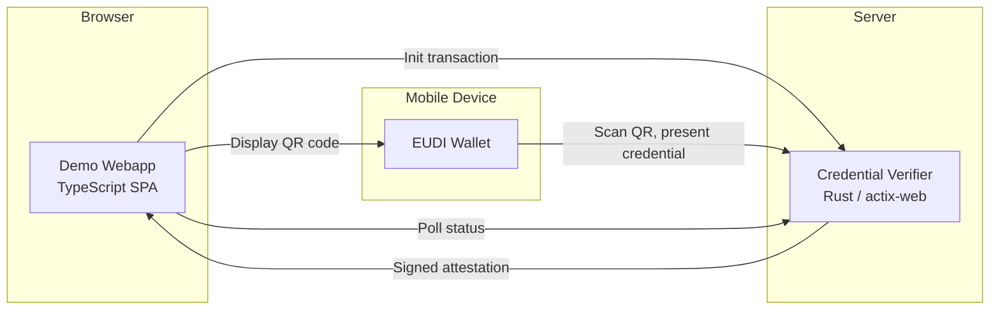

# Demo Architecture

The demo system showcases a complete credential verification flow:

1. **Demo Webapp** — a Relying Party SPA that requests credentials
2. **Credential Verifier** — the backend that cryptographically verifies presentations
3. **Wallet** — a mobile wallet app (EUDI Wallet, France Identité, or Age Verification App)

## System Architecture



The credential verifier serves both the verifier API and (when the admin UI is enabled) the embedded SPA at the root URL.

## Setting Up

### 1. Start the Credential Verifier

```bash
cargo run -p ewqwe_credential_verifier_server -- \
  crates/ewqwe-credential-verifier-server/credential-server.toml
```

The development config uses HTTP on port 9888 with authentication disabled.

### 2. Start the Demo Webapp

```bash
cd typescript
pnpm install
pnpm --filter @ewqwe/digital-identity build
pnpm --filter @ewqwe/demo-webapp dev
```

The webapp runs at `https://localhost:5174` and proxies API calls to the verifier.

### 3. Run a Wallet

For full end-to-end testing, you need a wallet on a mobile device (physical or emulator):

- **EUDI Wallet** — see [EUDI Wallet on Android Studio](./eudi_wallet_android_studio.md)
- **Age Verification App** — see [Age Verification App on Android Studio](./av_wallet_android_studio.md)
- **France Identité** — see [France Identité Wallet](./notes/france_identite_wallet.md)

For local network setup connecting the emulator to the verifier, see [Local Network Setup](./eudi_wallet/local_network.md).

## Port Assignments

| Component | Port | Description |
|-----------|------|-------------|
| Credential Verifier | 9888 (dev) | Verification server |
| Demo Webapp (Vite) | 5174 | RP web interface |

## Next Steps

- [User Journey](./user-journey.md) — detailed protocol flows
- [Protocols & Formats Summary](./summary_protocols_formats.md) — standards reference
- [Credential Verifier Server](./credential_verifier_server.md) — server configuration
