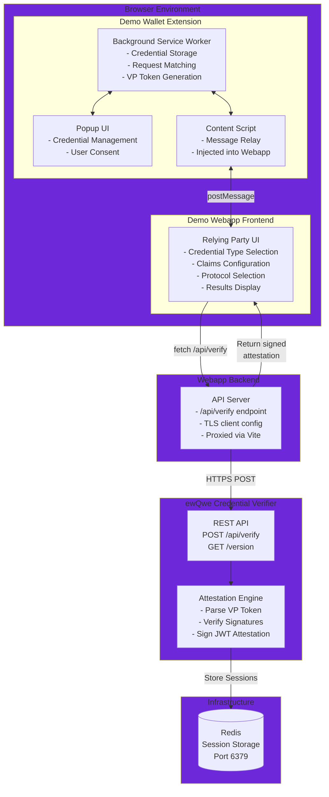

# Demo Architecture

## Overview

This demonstration system showcases a complete credential verification flow using three main components:

1. **Demo Wallets**:

   1. Age Verification Mobile App - A mobile application that acts as a wallet on Android devices, allowing users to manage and present age verification credentials on . Emulator for testing and development purposes.
   2. EUDI Wallet - A reference implementation of a mobile wallet based on the EU Digital Identity (EUDI) specifications and HAIP profile. The wallet runs in the Android Studio Emulator for testing and development purposes.
   3. Browser Extension - A browser extension that acts as the user's digital wallet, demonstrating the (future) W3C Digital Credentials API for web applications.
2. **Relying Party Demo Webapp** - A reference implementation of a Relying Party (RP) web application that requests and verifies credentials from users.
3. **ewQwe Credential Verifier Server** - A production-ready backend service that performs cryptographic verification on behalf of Relying Parties.

The demo wallets and webapp work together to demonstrate the complete end-to-end flow of credential presentation and verification. The webapp serves as both a functional demonstration and a **starting point for Relying Parties** who want to implement credential verification in their own web applications.

> **Source Code**: The wallets and relying party webapp source codes are available on GitHub for developers to use as a reference implementation. (GitHub repository details to be provided)

## System Architecture

The following diagram shows how the components interact in a complete credential verification flow:



## Setting Up the Demo Environment

### Verification Checklist

- ✅ Redis responding to `redis-cli ping`
- ✅ Credential Verifier listening on <https://127.0.0.1:9443>
- ✅ Webapp frontend accessible at <https://localhost:5174>
- ✅ Webapp backend API proxied through Vite
- ✅ Wallet extension loaded in browser toolbar

### Test the Complete Flow

1. **Open the Demo Webapp**: Navigate to [https://localhost:5174](https://localhost:5174)

2. **Configure a Request**:
   - Select credential type (e.g., "Proof of Age")
   - Choose required claims (e.g., "age_over_18")
   - Select protocol (try "W3C Digital Credentials API" first)

3. **Request Credentials**:
   - Click "Request Credentials"
   - If W3C API fails (as expected in current browsers), the webapp will fallback to OpenID4VP
   - The wallet extension should receive the request

4. **Wallet Consent**:
   - A postMessage event triggers the wallet's content script
   - The wallet matches available credentials
   - User grants consent (automatically in demo mode, or via popup)

5. **Verification**:
   - Wallet returns VP token to webapp
   - Webapp forwards to credential verifier via backend
   - Verifier validates and returns signed attestation
   - Webapp displays verification results and extracted claims

**Expected Result**: You should see verified claims displayed in the webapp UI with a success message and the signed attestation JWT.

## Port Assignments

| Component                  | Port  | Protocol | Description                                      |
|----------------------------|-------|----------|--------------------------------------------------|
| Webapp Frontend (Vite)     | 5174  | HTTPS    | Demo RP web interface + proxy to backend API     |
| Webapp Backend (Deno)      | 5175  | HTTP     | API server (proxied via Vite)                    |
| Credential Verifier (Rust) | 9443  | HTTPS    | Verification server with TLS                     |
| Redis                      | 6379  | TCP      | Session storage for Credential Verifier          |

## Troubleshooting

### Common Issues

**Issue**: Webapp can't connect to credential verifier

**Solution**:

- Check verifier is running: `curl -k https://127.0.0.1:9443/version`
- Verify Redis is running: `redis-cli ping`
- Check backend logs for TLS certificate errors
- Ensure CA certificate is correctly configured in `webapp/server.ts`

---

**Issue**: Wallet extension not responding to requests

**Solution**:

- Open extension debugging console
- Check for JavaScript errors in content script
- Verify extension has permissions for the webapp origin
- Reload the extension and refresh the webapp page

---

**Issue**: Verification fails with "Invalid signature"

**Solution**:

- This is expected in demo mode - signature verification is simulated
- For production, ensure proper issuer certificates are configured
- Check that credential was signed by a trusted issuer
- Verify the credential hasn't expired

---

**Issue**: Redis connection errors

**Solution**:

- Ensure Redis is running: `redis-server`
- Check Redis is accessible: `redis-cli ping`
- Verify connection string in verifier configuration
- Check firewall rules if Redis is on a different host

## Next Steps

- Review the [User Journey](./user-journey.md) for detailed protocol flow
- Learn about [Credential Verifier Server](./credential_verifier_server.md) configuration
- Explore [DCQL Age Verification](./dcql_age_verification.md) for credential queries
- Study [Credential Format Specifications](./digital_credential_format.md)

## Startup Commands Summary

For quick reference, here are the commands to start all components:

```bash
# Terminal 1: Redis (required by Credential Verifier)
redis-server

# Terminal 2: Credential Verifier (Rust)
cd credential_verifier
RUST_LOG=info \
X509_CERT_PATH=src/tests/certificates/ec/ewqwe.server.fullchain.pem \
X509_KEY_PATH=src/tests/certificates/ec/ewqwe.server.key.pem \
cargo run --features openssl

# Terminal 3 — Webapp API server (port 5175)
cd webapp
deno task api

# Terminal 4 — Webapp Vite dev server (port 5174, HTTPS)
cd webapp
deno task vite

# Browser: Install/load Demo Wallet extension
# - From Chrome Web Store: Search "ewQwe Demo Wallet"
# - Or load unpacked from wallet-extension/dist/

# Open: https://localhost:5174
```

**Alternative**: Use the provided shell script or tmux session for one-command startup.
