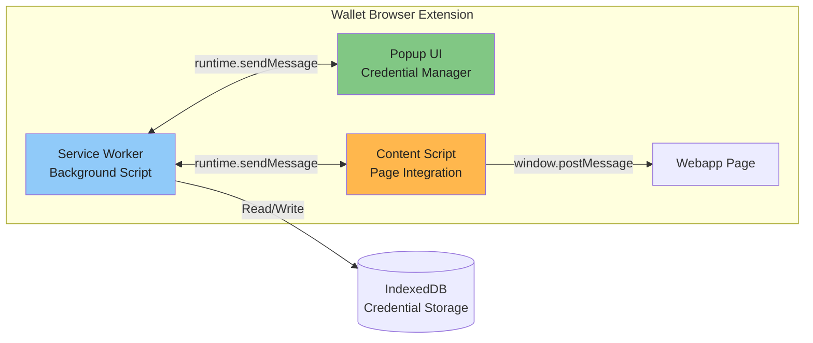

# The Demo Wallet Browser Extension

The **Demo Wallet Browser Extension** is a browser extension that acts as the user's digital wallet, storing verifiable credentials (Proof of Age, Driver's License, National ID cards, etc.).

It serves [hardcoded demo credentials](#hard-coded-demo-credentials) for testing and demonstration purposes.

## Architecture of the wallet

The wallet extension consists of three main components:



**Key Features**:

- Credential storage using browser IndexedDB
- Support for multiple credential formats (mDL, PID, Proof of Age)
- User consent UI for credential sharing
- W3C Digital Credentials API and OpenID4VP protocol support

## Compliant but not EU Certified

> [!WARNING]
> **Demo Wallet - Not EU-Certified**
>
> While the OpenID4VP fallback mechanism used in this implementation is fully compliant with the [EU Age Verification Profile (Annex A)](https://ageverification.dev/Technical%20Specification/annexes/annex-A/annex-A-av-profile), **this Demo Wallet Browser Extension is NOT an approved wallet under the EU Digital Identity Framework**.

According to the [eIDAS 2.0 Regulation (EU) 2024/1183](https://eur-lex.europa.eu/legal-content/EN/TXT/?uri=CELEX:32024R1183), Article 5a(4):

> "The European Digital Identity Wallet shall be certified in accordance with a high level of assurance as referred to in Article 8(2)(c) of Regulation (EU) No 910/2014 and in accordance with the common toolbox referred to in Article 5a(11) of this Regulation."

 **This Demo Wallet:**

- ❌ Has **NO security** - credentials are stored in `chrome.storage.local` without encryption
- ❌ Contains **hard-coded test credentials** with fabricated data
- ❌ Is **NOT certified** under eIDAS 2.0 high assurance levels (LoA High)
- ❌ Does **NOT** implement secure key management (no TPM/Secure Enclave integration)
- ❌ Is **NOT** registered with any EU Member State's Digital Identity Wallet Provider

 This demo wallet exists **solely for testing and demonstration purposes** to:

 1. Exercise the full OpenID4VP credential presentation flow.
 2. Test DCQL query matching and credential selection.
 3. Validate the **ewQwe Credential Verifier** backend attestation signing and verification.
 4. Demonstrate browser extension-based wallet architecture (for educational purposes).

 **For production use**, you must integrate with an **EU-certified EUDI Wallet** that meets eIDAS 2.0 requirements. See the [EU Digital Identity Wallet Architecture and Reference Framework (ARF)](https://github.com/eu-digital-identity-wallet/eudi-doc-architecture-and-reference-framework) for certification requirements.

## Installation and Setup

### Prerequisites

Before setting up the demo system, ensure you have the following installed:

- **Deno** 1.40 or later - [Install Deno](https://deno.land/manual/getting_started/installation)
- **Google Chrome** or **Chromium-based browser**
- **Node.js** 18+ (optional) - Only if building the extension from source

### Install the Demo Wallet Browser Extension

The Demo Wallet extension will be available in the **Google Chrome Web Store** for easy installation.

#### Option A: Install from Chrome Web Store (Recommended)

1. Open Google Chrome
2. Navigate to the Chrome Web Store
3. Search for "ewQwe Demo Wallet" or follow the direct link (to be provided)
4. Click **Add to Chrome**
5. Confirm by clicking **Add extension**
6. The wallet icon should appear in your browser toolbar

#### Option B: Install from Source (Development)

For developers who want to build from source or test unreleased versions:

```bash
# Clone the repository
git clone https://github.com/your-org/ewqwe-identity.git
cd ewqwe-identity/wallet-extension

# Install dependencies and build
npm install
npm run build

# The extension will be built to wallet-extension/dist/
```

**Load unpacked extension in Chrome**:

1. Open Chrome and navigate to `chrome://extensions/`
2. Enable **Developer mode** (toggle in top-right corner)
3. Click **Load unpacked**
4. Select the `wallet-extension/dist/` directory
5. The extension should now be loaded and visible in your toolbar

**Initial Setup**:

- Click the wallet icon in your browser toolbar
- The wallet will initialize with sample credentials (mDL, Proof of Age, etc.)
- You can view, add, or remove credentials through the popup interface

## Hard-Coded Demo Credentials

The Demo Wallet comes pre-loaded with test credentials in standard formats for demonstration purposes. **These credentials contain fabricated data and must never be used for real identity verification.**

### Mobile Driver's License (mDL)

Format: **ISO/IEC 18013-5** compliant mDoc

**Document Type**: `org.iso.18013.5.1.mDL`

**Namespace**: `org.iso.18013.5.1`

**Claims**:

```json
{
    "family_name": "Doe",
    "given_name": "Jane",
    "birth_date": "1985-03-15",
    "age_over_18": true,
    "age_over_21": true,
    "issue_date": "2020-01-01",
    "expiry_date": "2030-01-01",
    "issuing_country": "US",
    "issuing_authority": "California DMV",
    "document_number": "D1234567",
    "portrait": "<base64-encoded-placeholder-image>",
    "driving_privileges": [
        {
            "vehicle_category_code": "B",
            "issue_date": "2020-01-01",
            "expiry_date": "2030-01-01"
        }
    ]
}
```

### EU Proof of Age Attestation

Format: **EU Age Verification Profile** compliant credential

**Document Type**: `eu.europa.ec.eudi.av.1`

**Namespace**: `eu.europa.ec.av.1`

**Claims**:

```json
{
    "age_over_18": true,
    "age_over_21": true,
    "issuance_date": "2024-01-15",
    "expiry_date": "2025-01-15",
    "issuing_authority": "Demo Age Verification Authority",
    "issuing_country": "EU"
}
```

### Personal Identification Data (PID)

Format: **EU Digital Identity Wallet (EUDI) PID** format

**Document Type**: `eu.europa.ec.eudi.pid.1`

**Namespace**: `eu.europa.ec.eudi.pid.1`

**Claims**:

```json
{
    "family_name": "Doe",
    "given_name": "Jane",
    "birth_date": "1985-03-15",
    "age_over_18": true,
    "age_birth_year": 1985,
    "nationality": "US",
    "issuance_date": "2024-01-01",
    "expiry_date": "2034-01-01",
    "issuing_authority": "Demo Member State",
    "issuing_country": "EU",
    "document_number": "PID123456789"
}
```

### Credential Encoding

All credentials are stored as **CBOR-encoded mDoc structures** following ISO 18013-5 specifications:

- **DeviceResponse**: Contains one or more `Document` structures
- **IssuerSigned**: Contains `IssuerNameSpaces` with claim values
- **DeviceSigned**: Contains optional device authentication (not implemented in demo)
- **Mobile Security Object (MSO)**: Contains digests and issuer signature (placeholder in demo)

**Storage Format**:

```typescript
interface StoredCredential {
    id: string;                    // UUID
    format: "mdoc" | "sd-jwt";     // Credential format
    docType: string;               // e.g., "org.iso.18013.5.1.mDL"
    data: Uint8Array;              // CBOR-encoded mDoc
    metadata: {
        issuer: string;
        issuedAt: string;            // ISO 8601 timestamp
        expiresAt?: string;
        credentialType: string;      // Display name
    };
}
```

### Security Warnings

> [!CAUTION]
> **Demo Credentials Are NOT Secure**
>
> - Private keys are **hard-coded in the extension source code**
> - No actual cryptographic signing occurs (placeholders only)
> - Stored in **unencrypted browser storage** (`chrome.storage.local`)
> - MSO (Mobile Security Object) contains **invalid signatures**
> - **Any relying party can detect these are fake** during real verification

These credentials are designed to:

- ✅ Pass **format validation** (correct CBOR structure, ISO namespace mappings)
- ✅ Exercise **DCQL query matching** logic
- ✅ Test **selective disclosure** UI and claim filtering
- ❌ **Fail cryptographic verification** by any production verifier

## Why Browser Extensions Cannot Be Credential Providers

### Current Browser API Limitations

As of February 2026, **browser extensions cannot register as native Digital Credentials API providers** in any major browser. This is a fundamental architectural limitation, not a configuration issue. This means the **Demo Wallet Browser Extension** cannot integrate with Chrome's or Firefox's native credential systems.

#### Chrome/Chromium Status

**Chrome does not support extension-based credential providers.** The Digital Credentials API architecture requires:

1. **Native credential providers** integrated at the OS level (Android Credential Manager, iOS Wallet)
2. **Browser built-in providers** with privileged access to security subsystems
3. **Origin Trial tokens** for experimental access (only available to specific origins, not extensions)

**Authoritative References:**

- [W3C Digital Credentials API Specification](https://www.w3.org/TR/digital-credentials/): Defines the API surface but does not specify extension provider registration mechanisms.
- [Chrome Platform Status: Digital Credentials](https://chromestatus.com/feature/5139144021733376): Shows "Available behind a flag" status, but only for native providers.
- [Chromium Issue Tracker](https://bugs.chromium.org/p/chromium/issues/list?q=digital%20credentials): No extension provider registration API exists.
- [Chrome Extension APIs](https://developer.chrome.com/docs/extensions/reference/): No `chrome.credentials` or provider registration API available.

The Digital Credentials API in Chrome uses a **privileged provider model** that requires:

```text
Operating System Level
       ↓
Browser Security Subsystem  
       ↓
Digital Credentials API
       ↓
Native Providers ONLY (no extension API)
```

**Quote from the W3C Digital Credentials API specification:**

> "The Digital Credentials API enables web applications to request and receive digital credentials. User agents expose this capability through a credentials interface that **integrates with platform authenticators** and credential management systems."

The phrase "platform authenticators" explicitly refers to OS-level providers, not browser extensions.

#### Firefox Status

**Firefox does not implement the Digital Credentials API at all.** As of February 2026:

- ❌ No `DigitalCredential` interface
- ❌ No `navigator.credentials.get({ digital: {...} })` support
- ❌ Not on the implementation roadmap

**Authoritative References:**

- [Firefox Platform Status](https://platform-status.mozilla.org/) - Digital Credentials API is not listed
- [MDN Web Docs: Digital Credentials API](https://developer.mozilla.org/en-US/docs/Web/API/Credential_Management_API) - No mention of Digital Credentials support in Firefox
- [Can I Use: Digital Credentials](https://caniuse.com/digital-credentials) - Shows no browser support data (feature not tracked)
- [Firefox Web API Standards Positions](https://mozilla.github.io/standards-positions/) - No official position on Digital Credentials API

#### Safari/WebKit Status

**Safari/WebKit has not implemented the Digital Credentials API.**

- ❌ No implementation
- ❌ No public commitment to implement
- ❌ Focuses on Passkeys/WebAuthn instead

### Technical Reasons Extensions Cannot Be Providers

Even if browsers wanted to support extension-based providers, significant technical barriers exist:

#### 1. Security Model Conflicts

Browser extensions run in **sandboxed contexts** with limited privileges. The Digital Credentials API requires:

- **Direct access to credential storage** (extensions use `chrome.storage.local`, isolated from the security subsystem)
- **Cryptographic key management** at the platform level (extensions cannot access TPM/Secure Enclave)
- **Biometric authentication integration** (extensions cannot trigger OS-level biometric prompts)
- **Zero trust from the browser** (extensions can be malicious; credential providers must be trusted)

#### 2. Extension Lifecycle Issues

Browser extensions can be:

- **Disabled by the user** at any time (credential providers must be always available)
- **Updated or uninstalled** without system-level coordination (breaking active credential sessions)
- **Loaded in developer mode** without code signing validation (security risk for credential handling)
- **Injected with arbitrary code** during development (incompatible with secure credential operations)

#### 3. Credential Provider Registration Architecture

Native credential provider registration requires:

**On Android:**

```kotlin
// Requires system-level registration via Android CredentialManager API
// Not accessible to browser extensions
CredentialManager.create(context)
  .registerCredentialProvider(...)
```

**On iOS:**

```swift
// Requires entitlements and PassKit/CryptoKit integration
// Not available to browser extensions
ASAuthorizationController.credentialProvider = ...
```

**On Desktop (Windows/macOS/Linux):**

- Requires **native messaging host** (separate executable outside browser)
- Requires **system registry/filesystem registration**
- Requires **OS-level security prompts** (not accessible to web extensions)

#### 4. Chrome Extension API Gaps

The Chrome Extension APIs do **not** include:

- ❌ `chrome.credentials.registerProvider()` - Does not exist
- ❌ `chrome.digitalCredentials.*` - No such API namespace
- ❌ `chrome.identity.setCredentialProvider()` - Not available
- ❌ Any hooks into `navigator.credentials.get()` for the `digital` credential type

The only credential-related API is `chrome.identity`, which handles OAuth2 flows, not Digital Credentials.

**Reference:** [Chrome Extensions API Reference](https://developer.chrome.com/docs/extensions/reference/) - Complete API documentation with no credential provider registration capabilities

### Browser Support Matrix (February 2026)

| Browser | Digital Credentials API | Extension as Provider | Native Provider Support |
| ------- | ----------------------- | --------------------- | ----------------------- |
| Chrome 131+ | 🟡 Experimental (Origin Trial) | ❌ Not possible | 🟢 Android/ChromeOS only |
| Firefox | ❌ Not implemented | ❌ Not possible | ❌ No support |
| Safari | ❌ Not implemented | ❌ Not possible | ❌ No support |
| Edge | 🟡 Same as Chrome | ❌ Not possible | 🟡 Same as Chrome |

**Legend:**

- 🟢 Available
- 🟡 Limited/Experimental
- ❌ Not available
