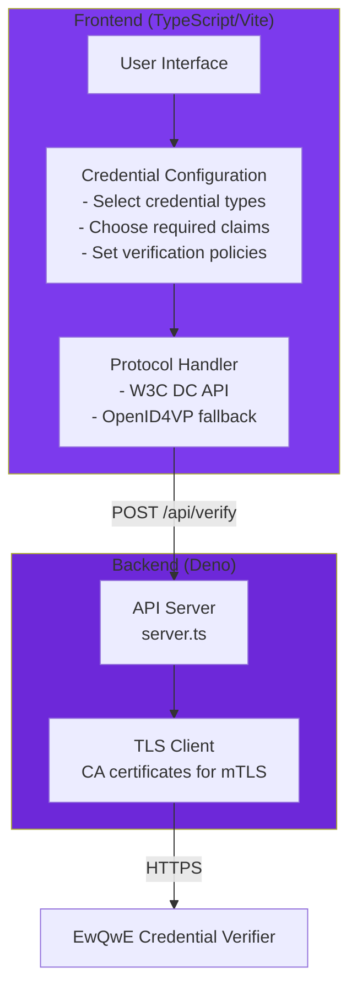

# The Relying Party Demo Web Application

The **Relying Party Demo Web Application** is a sample web application that demonstrates how to request and verify credentials from the Demo Wallet Browser Extension using both the W3C Digital Credentials API and the OpenID4VP protocol.

**Use as a Starting Point**:

- Clean, well-documented TypeScript code
- Modular architecture for easy customization
- Configuration-driven credential requests
- Reference implementation of OpenID4VP protocol
- Example integration with credential verifier

## Flow Overview



## Installation and Setup

### Prerequisites

Before setting up the demo system, ensure you have the following installed:

- **Deno** 1.40 or later - [Install Deno](https://deno.land/manual/getting_started/installation)

### Step 2: Start the Demo Webapp

The demo webapp uses Deno for both frontend and backend development.

#### Install and Configure

```bash
# Navigate to the webapp directory
cd webapp

# No installation needed - Deno handles dependencies automatically
```

#### Start the Development Server

The webapp requires two processes: the frontend (Vite dev server) and the backend API server.

**Option A: Start Both Processes Together** (Recommended)

```bash
# From the webapp/ directory
deno task dev
```

This command starts both the Vite frontend server (port 5174) and the Deno API backend server (port 5175) concurrently.

**Option B: Start Processes Separately**

If you prefer to run them in separate terminal windows for debugging:

```bash
# Terminal 1: Start the backend API server
cd webapp
deno task api

# Terminal 2: Start the frontend Vite dev server
cd webapp
deno task vite
```

#### Verify Webapp is Running

> Install the Demo Wallet Browser Extension first, as described in the [Demo Wallet Browser Extension](./demo_wallet_extension.md) chapter.

1. Open your browser to [http://localhost:5174](http://localhost:5174)
2. You should see the Relying Party demo interface
3. The page will allow you to:
   - Select credential types (mDL, Proof of Age, National ID)
   - Choose required claims (age_over_18, birth_date, etc.)
   - Select verification protocol (W3C Digital Credentials API or OpenID4VP)
   - Request credentials from the wallet
