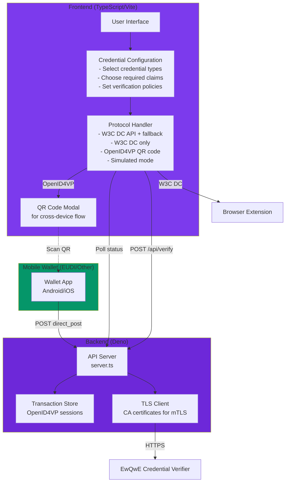
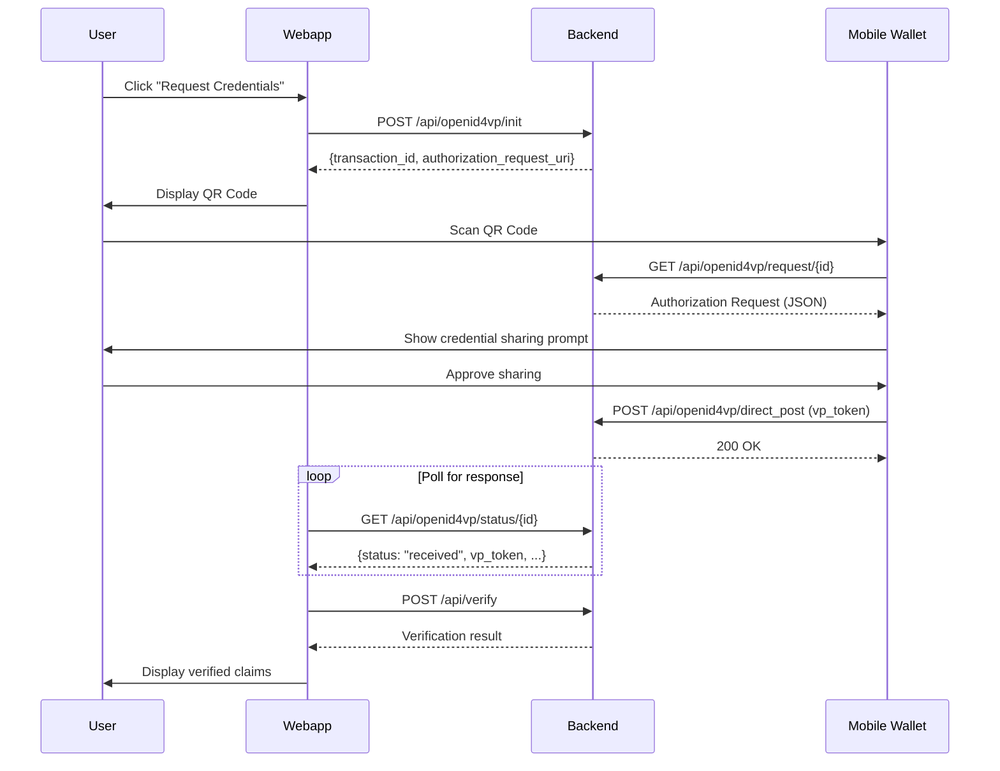
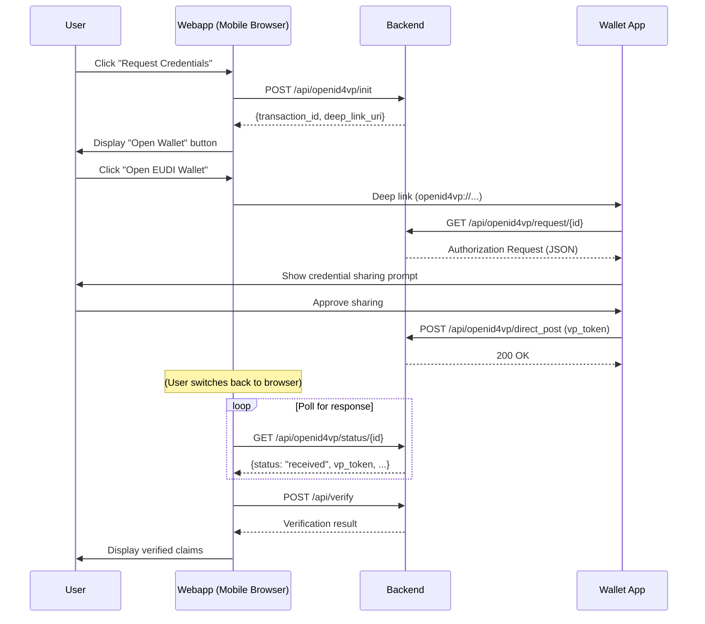

# The Relying Party Demo Web Application

The **Relying Party Demo Web Application** is a sample web application that demonstrates how to request and verify credentials from:

1. **Demo Wallet Browser Extension** - Using the W3C Digital Credentials API
2. **EUDI Wallet (Android/iOS)** - Using the OpenID4VP cross-device flow with QR codes

This implementation is compatible with the [EUDI Wallet Reference Implementation](https://github.com/eu-digital-identity-wallet/eudi-app-android-wallet-ui).

**Use as a Starting Point**:

- Clean, well-documented TypeScript code
- Modular architecture for easy customization
- Configuration-driven credential requests
- Reference implementation of OpenID4VP 1.0 protocol
- Cross-device flow with QR code generation
- Example integration with credential verifier

## Flow Overview



## Protocol Options

The webapp supports five protocol modes:

| Protocol | Description | Use Case |
|----------|-------------|----------|
| **W3C DC + fallback** | Tries W3C Digital Credentials API first, falls back to OpenID4VP cross-device | Default - best compatibility |
| **W3C DC only** | Uses only the native browser API with wallet extension | Desktop with browser extension |
| **OpenID4VP (Cross-Device)** | Cross-device flow with QR code scanning | Mobile wallets via QR code (EUDI Wallet) |
| **OpenID4VP (Same-Device)** | Same-device flow with deep link | Mobile browsers with wallet app installed |
| **Simulated** | Mock response for testing without a wallet | Development/testing |

### OpenID4VP Cross-Device Flow

When using OpenID4VP cross-device mode, the webapp implements the cross-device flow as specified in [OpenID4VP 1.0](https://openid.net/specs/openid-4-verifiable-presentations-1_0.html):

1. **Initialize Transaction**: Frontend requests a new transaction from the backend
2. **Display QR Code**: A modal shows a QR code containing the authorization request URI
3. **Wallet Scans QR**: User scans the QR code with their mobile wallet (e.g., EUDI Wallet)
4. **Wallet Fetches Request**: Wallet fetches the full authorization request from `request_uri`
5. **User Approves**: User reviews and approves the credential sharing request
6. **Wallet POSTs Response**: Wallet sends the VP token to `response_uri` (direct_post)
7. **Frontend Receives Result**: Frontend polls for status and receives the VP token



### OpenID4VP Same-Device Flow

When using OpenID4VP same-device mode, the webapp uses a deep link (`openid4vp://...`) to trigger the wallet app on the same device. This is ideal for mobile browsers where the wallet app is installed:

1. **Initialize Transaction**: Frontend requests a new transaction from the backend
2. **Display Deep Link Button**: A modal shows a button to open the wallet app
3. **User Opens Wallet**: User clicks the button, which opens the wallet via deep link
4. **Wallet Fetches Request**: Wallet fetches the full authorization request from `request_uri`
5. **User Approves**: User reviews and approves the credential sharing request
6. **Wallet POSTs Response**: Wallet sends the VP token to `response_uri` (direct_post)
7. **Frontend Receives Result**: Frontend polls for status and receives the VP token



## Installation and Setup

### Prerequisites

Before setting up the demo system, ensure you have the following installed:

- **Deno** 1.40 or later - [Install Deno](https://deno.land/manual/getting_started/installation)

### Using with EUDI Wallet (Android)

To test with the EUDI Wallet reference implementation:

1. Download the EUDI Wallet app from [GitHub Releases](https://github.com/eu-digital-identity-wallet/eudi-app-android-wallet-ui/releases)
2. Install the APK on your Android device
3. Set up the wallet with a PID (Personal Identification Data) from the issuer

#### HTTPS Requirement (Important)

Android blocks cleartext HTTP traffic by default. The EUDI Wallet will fail to connect to an HTTP server with the error: **"ClearText HTTP traffic not permitted"**.

**Solution: Use a tunneling service like ngrok to expose your local server over HTTPS:**

```bash
# Install ngrok (if not already installed)
brew install ngrok  # macOS
# or download from https://ngrok.com/download

# Start the webapp first
cd webapp
deno task dev

# In another terminal, create an HTTPS tunnel to the API server (port 5175)
ngrok http 5175
```

ngrok will display a forwarding URL like `https://abc123.ngrok.io`. Use this as your `PUBLIC_URL`:

```bash
# Set the PUBLIC_URL to the ngrok HTTPS URL
export PUBLIC_URL="https://abc123.ngrok.io"
deno task dev
```

Now when you scan the QR code or tap the deep link, the EUDI Wallet will be able to connect via HTTPS.

> **Note**: The free tier of ngrok provides a random URL that changes each time. For persistent testing, consider ngrok's paid tier or alternatives like [Cloudflare Tunnel](https://developers.cloudflare.com/cloudflare-one/connections/connect-apps/).

### Start the Demo Webapp

The demo webapp uses Deno for both frontend and backend development.

#### Install and Configure

```bash
# Navigate to the webapp directory
cd webapp

# No installation needed - Deno handles dependencies automatically
```

#### Start the Development Server

The webapp requires two processes: the frontend (Vite dev server) and the backend API server.

**Option A: Start Both Processes Together** (Recommended)

```bash
# From the webapp/ directory
deno task dev
```

This command starts both the Vite frontend server (port 5174) and the Deno API backend server (port 5175) concurrently.

**Option B: Start Processes Separately**

If you prefer to run them in separate terminal windows for debugging:

```bash
# Terminal 1: Start the backend API server
cd webapp
deno task api

# Terminal 2: Start the frontend Vite dev server
cd webapp
deno task vite
```

#### Verify Webapp is Running

> Install the Demo Wallet Browser Extension first, as described in the [Demo Wallet Browser Extension](./demo_wallet_extension.md) chapter.

1. Open your browser to [http://localhost:5174](http://localhost:5174)
2. You should see the Relying Party demo interface
3. The page will allow you to:
   - Select credential types (mDL, Proof of Age, National ID)
   - Choose required claims (age_over_18, birth_date, etc.)
   - Select verification protocol
   - Request credentials from the wallet

## API Endpoints

### OpenID4VP Endpoints (Cross-Device Flow)

| Endpoint | Method | Description |
|----------|--------|-------------|
| `/api/openid4vp/init` | POST | Initialize a new transaction, returns QR code data |
| `/api/openid4vp/request/{id}` | GET | Wallet fetches authorization request (request_uri) |
| `/api/openid4vp/direct_post` | POST | Wallet posts VP token (response_uri) |
| `/api/openid4vp/status/{id}` | GET | Frontend polls for transaction status |

### Verification Endpoints

| Endpoint | Method | Description |
|----------|--------|-------------|
| `/api/verify` | POST | Verify a VP token (proxies to Credential Verifier) |
| `/api/health` | GET | Health check |

## Environment Variables

| Variable | Default | Description |
|----------|---------|-------------|
| `PUBLIC_URL` | `http://localhost:5175` | Public URL for OpenID4VP callbacks (must be accessible from mobile) |
| `CREDENTIAL_VERIFIER_URL` | `https://127.0.0.1:9443` | URL of the Credential Verifier server |
| `CA_CERT_PATH` | `../credential_verifier/.../ewqwe.chain.pem` | CA certificate for TLS to Credential Verifier |
