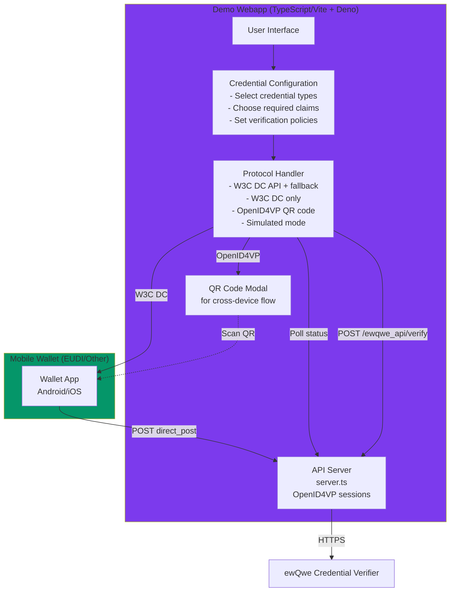
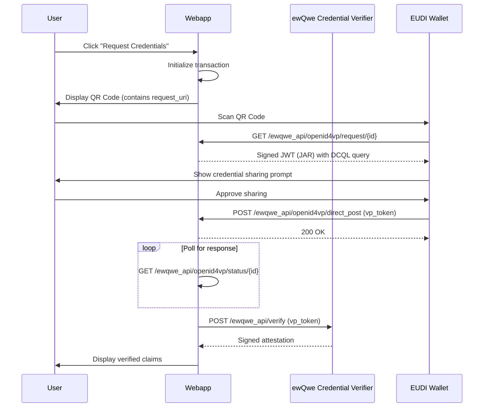
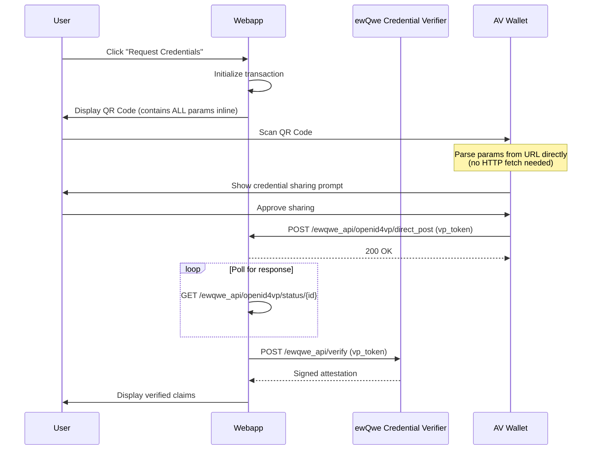
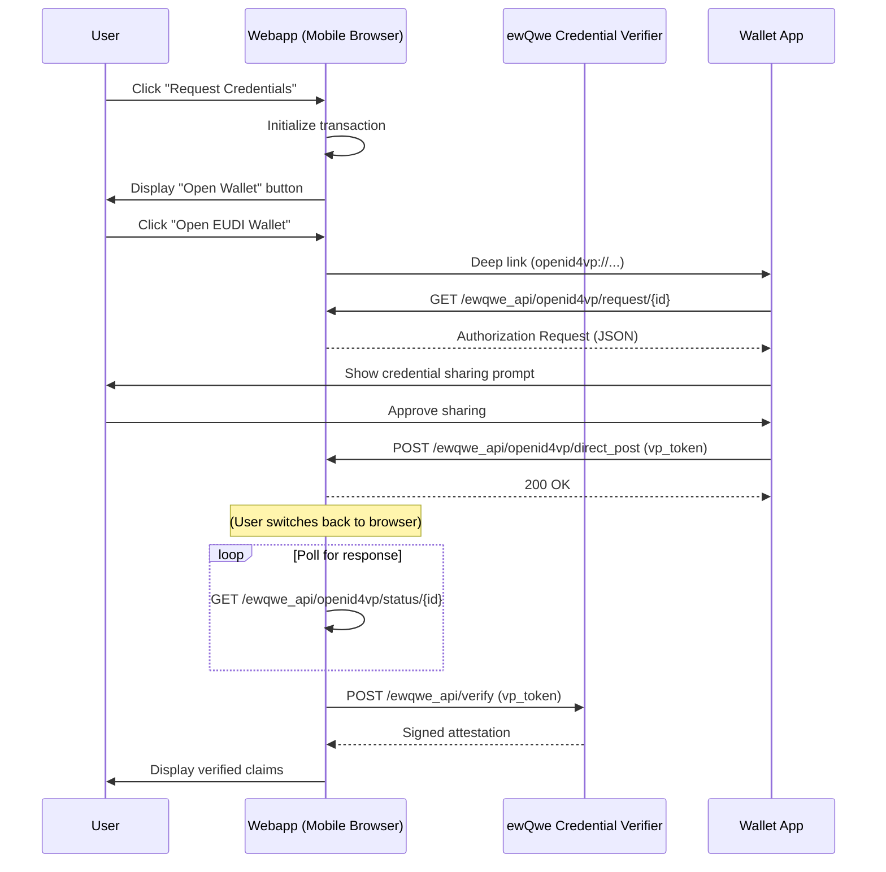

# The Relying Party Demo Web Application

The **Relying Party Demo Web Application** is a sample web application that demonstrates how to request and verify credentials from:

1. **EUDI Wallet (Android/iOS)** - Using the OpenID4VP cross-device flow with QR codes (HAIP profile)
2. **Age Verification Apps** - Using the OpenID4VP Annex A profile for Proof of Age

This implementation is compatible with:

- [EUDI Wallet Reference Implementation](https://github.com/eu-digital-identity-wallet/eudi-app-android-wallet-ui) (HAIP profile)
- Age Verification Apps implementing the [EU Age Verification Profile Annex A](https://ageverification.dev/Technical%20Specification/annexes/annex-A/annex-A-av-profile)

**Use as a Starting Point**:

- Clean, well-documented TypeScript code
- Modular architecture for easy customization
- Configuration-driven credential requests
- Reference implementation of OpenID4VP 1.0 protocol
- Cross-device flow with QR code generation
- Example integration with credential verifier

## Flow Overview



## Protocol Options

The webapp supports five protocol modes:

| Protocol | Description | Use Case |
| -------- | ----------- | -------- |
| **W3C DC + fallback** | Tries native W3C Digital Credentials API (`navigator.credentials.get`) first, falls back to OpenID4VP cross-device | Default on **desktop** — works on compatible browsers/devices with a mobile wallet |
| **W3C DC only** | Uses only the native W3C Digital Credentials API with ISO 18013-7 Annex C | Compatible browsers/devices with a wallet supporting the DC API |
| **ISO 18013-7 Annex C** | Pure Annex C: HPKE + CBOR `encryptionInfo`/`deviceRequest` blobs with `"org-iso-mdoc"` protocol | Wallets supporting the ISO mDoc format natively via the DC API |
| **OpenID4VP (Cross-Device)** | Cross-device flow with QR code scanning | Mobile wallets via QR code (EUDI Wallet, AV Apps) |
| **OpenID4VP (Same-Device)** | Same-device flow with deep link | Default on **mobile** — reliable across all Android/iOS versions |
| **Simulated** | Mock response for testing without a wallet | Development/testing |

### Why W3C Digital Credentials is Disabled on Mobile

On Android 15+, Chrome supports the [W3C Digital Credentials API](https://www.w3.org/TR/digital-credentials/).
However, invoking `navigator.credentials.get({ digital: ... })` on Android routes the request through
[Android CredentialManager](https://developer.android.com/identity/sign-in/credential-manager),
which presents a **system-level picker UI before** the web page receives any response.

The wallet's DCAPI handler (via [`eudi-lib-android-wallet-core`](https://github.com/eu-digital-identity-wallet/eudi-lib-android-wallet-core))
receives the request with `protocol: "openid4vp"` — a protocol identifier that version 0.24.0 of the
library does not yet recognize in its DCAPI handler, causing an "Unsupported protocol: openid4vp" error
**inside the wallet** before the webapp's `try/catch` fallback can execute.

This creates a broken user experience:

| Android Version | DC API Available | Result |
| --------------- | ---------------- | ------ |
| Android 14 (emulator) | No | Silent throw → silent fallback to deep link ✓ |
| Android 15 (real device) | Yes | CredentialManager shows system UI → wallet fails visibly ✗ |

**Solution**: On mobile devices, this webapp skips the W3C DC API entirely and goes directly to
the OpenID4VP same-device deep-link flow, which is reliable across all Android versions.

> **References**: [W3C Digital Credentials API](https://www.w3.org/TR/digital-credentials/) ·
> [Android CredentialManager](https://developer.android.com/identity/sign-in/credential-manager) ·
> [EUDI Wallet Core library](https://github.com/eu-digital-identity-wallet/eudi-lib-android-wallet-core)

## Protocol Profiles

The webapp automatically selects the appropriate OpenID4VP profile based on the credential type being requested:

### HAIP Profile (High Assurance Interoperability Profile)

Used for **Mobile Driver's License (mDL)** and **National ID (PID)**.

| Parameter | Value | Description |
| --------- | ----- | ----------- |
| Client ID Scheme | `x509_san_dns` | X.509 certificate with SAN DNS entry |
| Request Format | Signed JAR | JWT Authorization Request with `x5c` header |
| Response Mode | `direct_post.jwt` | Encrypted/signed response |
| URL Scheme | `eudi-openid4vp://` | EUDI Wallet deep link scheme |
| Content-Type | `application/oauth-authz-req+jwt` | RFC 9101 JAR format |

**Certificate Requirements**: The server must have a valid X.509 certificate chain. The leaf certificate's SAN DNS entry is used as the client identifier. The EUDI Wallet verifies the JAR signature against the certificate.

### Annex A Profile (EU Age Verification Profile)

Used for **Proof of Age** attestations.

| Parameter | Value | Description |
| --------- | ----- | ----------- |
| Client ID Scheme | `redirect_uri` | Redirect URI as client identifier |
| Request Format | Plain JSON | No JAR signing (redirect_uri cannot use signed requests) |
| Response Mode | `direct_post` | Plain VP token response |
| URL Scheme | `av://` | Age Verification App deep link scheme |
| Content-Type | `application/json` | Standard JSON format |

**Note**: The `redirect_uri` client_id_scheme requires plain JSON authorization requests. Signed JARs are not permitted with this scheme.

**Reference**: [EU Age Verification Profile Annex A](https://ageverification.dev/Technical%20Specification/annexes/annex-A/annex-A-av-profile)

### Profile Selection

The profile is determined automatically based on the credential type:

| Credential Type | Profile | Format | Target Wallet |
| --------------- | ------- | ------ | ------------- |
| Mobile Driver's License (mDL) | HAIP | MSO MDOC | EUDI Wallet |
| National ID (PID) | HAIP | MSO MDOC | EUDI Wallet |
| Health ID (SD-JWT VC) | HAIP | SD-JWT VC | EUDI Wallet |
| Proof of Age | Annex A | MSO MDOC | Age Verification App |

The UI displays badges indicating which profile and credential format are active, along with key technical details about the protocol configuration.

### OpenID4VP Cross-Device Flow

When using OpenID4VP cross-device mode, the webapp implements the cross-device flow as specified in [OpenID4VP 1.0](https://openid.net/specs/openid-4-verifiable-presentations-1_0.html):

1. **Initialize Transaction**: Frontend requests a new transaction from the backend
2. **Display QR Code**: A modal shows a QR code containing the authorization request URI
3. **Wallet Scans QR**: User scans the QR code with their mobile wallet
4. **Wallet Parses Request**: Wallet parses the authorization request (see profile differences below)
5. **User Approves**: User reviews and approves the credential sharing request
6. **Wallet POSTs Response**: Wallet sends the VP token to `response_uri` (direct_post)
7. **Frontend Receives Result**: Frontend polls for status and receives the VP token

#### Technical Details

The implementation follows the EUDI Wallet specifications for HAIP, and the EU Age Verification Profile for Annex A:

- **Profile-Aware Requests**: The `/ewqwe_api/openid4vp/init` endpoint accepts a `credential_type` parameter to determine the profile
- **Request Delivery**:
  - **HAIP**: QR code contains `request_uri`; wallet fetches signed JAR from that URI
  - **Annex A**: QR code contains ALL parameters inline (no `request_uri`); wallet parses parameters directly from the URL
- **Request Format**: HAIP uses signed JAR per [RFC 9101](https://www.rfc-editor.org/rfc/rfc9101.html); Annex A uses plain parameters (redirect_uri scheme forbids signed requests)
- **DCQL Query**: Uses [DCQL (Digital Credentials Query Language)](https://openid.net/specs/openid-4-verifiable-presentations-1_0.html#dcql) instead of presentation_definition
- **ES256 Signing**: JAR is signed with an EC P-256 key using ES256 algorithm (HAIP only)
- **Client ID Scheme**: Uses `x509_san_dns` for HAIP, `redirect_uri` for Annex A
- **Client Metadata**: When provided, MUST include `vp_formats_supported` (required field)

**HAIP Flow (mDL, PID)** - Wallet fetches request from `request_uri`:



**Annex A Flow (Proof of Age)** - All parameters inline in URL (no request_uri fetch):



### OpenID4VP Same-Device Flow

When using OpenID4VP same-device mode, the webapp uses a deep link to trigger the wallet app on the same device. This is ideal for mobile browsers where the wallet app is installed:

1. **Initialize Transaction**: Frontend requests a new transaction from the backend
2. **Display Deep Link Button**: A modal shows a button to open the wallet app
3. **User Opens Wallet**: User clicks the button, which opens the wallet via deep link
4. **Wallet Parses Request**: Wallet parses the authorization request (HAIP: fetches from `request_uri`; Annex A: reads inline parameters)
5. **User Approves**: User reviews and approves the credential sharing request
6. **Wallet POSTs Response**: Wallet sends the VP token to `response_uri` (direct_post)
7. **Frontend Receives Result**: Frontend polls for status and receives the VP token



## Installation and Setup

### Prerequisites

Before setting up the demo system, ensure you have the following installed:

- **Deno** 1.40 or later - [Install Deno](https://deno.land/manual/getting_started/installation)

### Start the Demo Webapp

The demo webapp uses Deno for both frontend and backend development.

#### Install and Configure

```bash
# Navigate to the webapp directory
cd webapp

# No installation needed - Deno handles dependencies automatically
```

#### Start the Development Server

The webapp requires three processes running concurrently:

```bash
# Terminal 1 — ewQwe Credential Verifier (port 9443, HTTPS)
cd credential_verifier
cat > credential-server.toml <<'EOF'
host_name = "0.0.0.0"
host_port = 9443
default_username = "demo-user"

[tls_params]
server_private_key = "src/tests/certificates/ec/ewqwe.server.key.pem"
server_certificate = "src/tests/certificates/ec/ewqwe.server.cert.pem"
server_ca_chain = "src/tests/certificates/ec/ewqwe.chain.pem"

[openid4vp_config]
transaction_ttl_secs = 300

[openid4vp_config.haip_config]
x509_cert_path = "src/tests/certificates/ec/ewqwe.server.fullchain.pem"
x509_key_path = "src/tests/certificates/ec/ewqwe.server.key.pem"
EOF

RUST_LOG=info \
cargo run --features openssl

# Terminal 2 — Webapp API server (port 5175)
cd webapp
deno task api

# Terminal 3 — Webapp Vite dev server (port 5174, HTTPS)
cd webapp
deno task vite
```

#### Verify Webapp is Running

1. Open your browser to [https://localhost:5174](https://localhost:5174)
2. You should see the Relying Party demo interface
3. The page will allow you to:
   - Select credential types (mDL, Proof of Age, National ID)
   - Choose required claims (age_over_18, birth_date, etc.)
   - Select verification protocol
   - Request credentials from the wallet

### Debugging Chrome on Android Studio Emulator

When testing the webapp with mobile wallets on the Android Studio Emulator, you can view Chrome's console logs using Chrome DevTools Remote Debugging:

1. **Enable USB Debugging on Emulator**: The Android Studio Emulator has USB debugging enabled by default
2. **Open Chrome on the Emulator**: Launch Chrome and navigate to `https://demo.ewqwe.local:5174`
3. **Access Remote Debugging**:
   - On your development machine, open Chrome
   - Navigate to `chrome://inspect/#devices`
   - Wait for the emulator device to appear (may take a few seconds)
4. **Inspect the Page**:
   - Under your emulator device, you'll see a list of open Chrome tabs
   - Click **"inspect"** next to the webapp tab
   - A DevTools window opens showing the console, network traffic, and DOM inspector

This is particularly useful for:

- Debugging OpenID4VP protocol flows
- Viewing network requests to your backend API
- Inspecting QR code scanning and deep link behavior
- Troubleshooting JavaScript errors in the mobile browser

> **Tip**: Console logs, network requests, and JavaScript errors from the emulator's Chrome will appear in real-time in the DevTools window on your development machine, just like debugging a local webpage.

## API Endpoints

### OpenID4VP Endpoints (Cross-Device Flow)

| Endpoint | Method | Description |
| -------- | ------ | ----------- |
| `/ewqwe_api/openid4vp/init` | POST | Initialize a new transaction, returns QR code data and profile info |
| `/ewqwe_api/openid4vp/request/{id}` | GET | Wallet fetches authorization request (signed JAR for HAIP, plain JSON for Annex A) |
| `/ewqwe_api/openid4vp/direct_post` | POST | Wallet posts VP token (response_uri) |
| `/ewqwe_api/openid4vp/status/{id}` | GET | Frontend polls for transaction status |

#### Init Transaction Request

```typescript
interface InitTransactionRequest {
  presentation_definition?: object;  // Credential request (converted to DCQL)
  dcql_query?: object;               // DCQL query (preferred)
  nonce?: string;                    // Optional, generated if not provided
    state?: string;                    // Optional client-managed correlation value
  credential_type?: string;          // "mdl" | "national-id" | "proof-of-age"
  profile?: "haip" | "annex-a";      // Explicit profile override
}
```

#### Init Transaction Response

```typescript
interface InitTransactionResponse {
  transaction_id: string;
  client_id: string;                 // Format depends on profile
  client_id_scheme: "x509_san_dns" | "redirect_uri";
  request_uri: string;
  authorization_request_uri: string; // QR code content
  deep_link_uri: string;             // Same-device deep link
  expires_in: number;
  profile: "haip" | "annex-a";       // Selected profile
}
```

### Verification Endpoints

| Endpoint | Method | Description |
| -------- | ------ | ----------- |
| `/ewqwe_api/verify` | POST | Verify a VP token (proxies to Credential Verifier) |
| `/ewqwe_api/health` | GET | Health check |

## Environment Variables

| Variable | Default | Description |
| -------- | ------- | ----------- |
| `CREDENTIAL_VERIFIER_URL` | `https://127.0.0.1:9443` | URL of the Credential Verifier server |
| `CA_CERT_PATH` | `../credential_verifier/src/tests/certificates/ec/ewqwe.chain.pem` | CA certificate for TLS to Credential Verifier |
