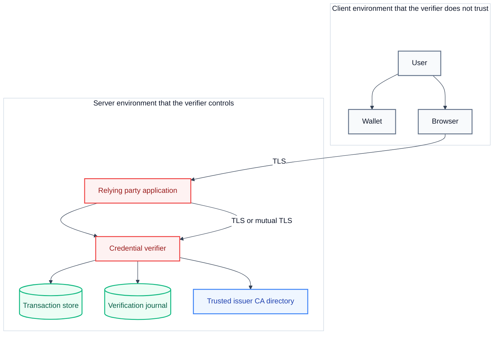

# Security model

The credential verifier makes a trust decision for a relying party. This page explains where the trust boundaries sit, why the checks live behind those boundaries, and which data the verifier handles.

A trust boundary is a line beyond which the verifier no longer trusts the input. Data that crosses a boundary is validated before it influences a decision.

## The trust boundaries

Three environments take part, and the verifier trusts only the innermost one.

The client environment holds the user, the wallet, and the browser. The verifier treats everything from this environment as untrusted, including a presentation that the user approved. The server environment holds the relying party, the verifier, and the stores that the verifier owns.

## Why verification runs on a backend

The verifier runs the checks outside the browser for three reasons.

- The verification keys and the CA directory must never reach the client. A key in a browser can be read by the browser's user.
- One service can serve many relying parties, so every relying party shares one correct implementation of the checks.
- The audit record stays with the service, so an operator can prove which presentations were accepted.

A relying party that verified a presentation in the browser would have to trust code that the user can modify. The delegation keeps that trust inside the boundary that the operator controls.

## Transport security

Every connection to the verifier uses TLS, so a network observer cannot read or modify a presentation in transit. The server certificate and the CA chain are named in the `[tls_params]` section of the configuration file. The full procedure is in [configure TLS](../../how-to-guides/credential-verifier/configure-tls.md).

For the endpoints that a relying party calls, the verifier can also require a client certificate, which is mutual TLS. The verifier then reads the common name of the client certificate and uses it as the authenticated username. A wildcard common name is rejected, because a wildcard could match many callers. The journal uses this username to scope each chain of records to one owner.

The wallet-facing endpoints do not require a client certificate, because a wallet has no certificate from the verifier's client CA. A wallet authenticates the verifier instead, and the HAIP profile does so through the verifier's certificate chain.

> [!WARNING]
> Set `disable_authentication = true` only for local development and tests. That setting removes the client-certificate requirement and attributes every request to the configured user.

## Replay prevention

A presentation is valid for the request that created it and for no other request. The verifier enforces this with a nonce and with single-use transactions.

The verifier stores a fresh nonce in the transaction when the relying party creates it. The wallet binds that nonce into the holder binding proof, and the verifier compares the bound nonce with the stored nonce whenever the stored transaction is present. The nonce never appears in the verification request body, because a request that supplied its own nonce could match a recorded presentation. A successful verification consumes the transaction, and an mDoc request then fails because the verifier needs the stored request to rebuild the session transcript.

The verifier also rejects a request whose `client_id` does not match the `client_id` that the stored transaction holds, when that transaction exists. That check stops a presentation from being redirected to a different relying party.

The full sequence is in [the verification process](verification-process.md).

## The trusted issuer CA directory

A signature proves only that some key signed a credential. The verifier must also know which issuers it trusts. The `credentials_cas_dir` setting names a directory of PEM files, and the verifier loads every `*.pem` file in that directory at startup.

The verifier accepts a chain that terminates at any certificate in the directory, including an intermediate CA. A credential whose chain does not reach the directory is marked as untrusted, and the verifier does not accept it for an attestation.

> [!IMPORTANT]
> The directory is read once at startup and cached. Restart the server after you add or remove a certificate. A missing directory stops the server at startup.

Trust that is limited to a static directory has known limits. OpenID4VP defines several trust mechanisms, including ETSI Trusted Lists and OpenID Federation, and the type definitions for those mechanisms exist in the protocol crate. This server uses the static directory only, so an operator must maintain it from a trusted source.

## Data minimization

The verifier handles only what the relying party asked for.

- The asked-for claims are fixed in the request before the wallet acts, so the verifier receives disclosures that match the request.
- The attestation carries the verified claims and nothing else.
- The transaction store holds the wallet response only until the transaction expires or is consumed.
- The journal stores a hash of the attestation, a summary of the outcome, and the credential metadata. It does not store the raw presentation.

The journal never leaves the boundary that the operator controls, and a client can read only its own journal. Details are in [the verification journal](../../reference/credential-verifier/verification-journal.md).

## Known limits

The current implementation has these limits.

- The nonce binding for an SD-JWT VC depends on a live transaction. After the verifier consumes the transaction, no stored nonce remains for the comparison, so the verifier cannot reject a repeated SD-JWT presentation from its own state alone.
- The verifier does not check credential revocation, so a credential that an issuer revoked is still accepted while it is otherwise valid.
- The trusted issuer list is a static directory, not a dynamic trust source.
- An mDoc that carries a `deviceMac` holder proof is rejected; only `deviceSignature` is supported.
- The test certificates in the repository are for development only and must not be used in production.
