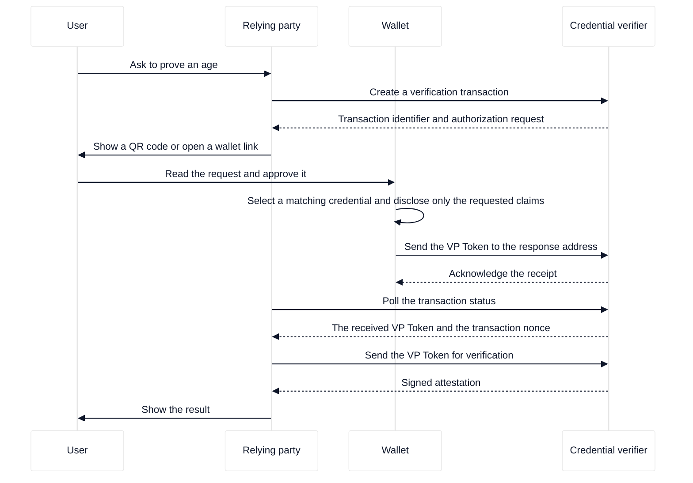

# The user journey

This page follows one person who proves an age to a website, from the first click to the result. The journey spans four parties: the user, the relying party (RP), the wallet, and the credential verifier.

A wallet is the application that stores the user's credentials and presents them. The relying party is the website or service that needs the proof. The credential verifier is the backend service that decides whether the proof is trustworthy. A credential is a signed statement about the user, such as "this person is over 18".

## The parties and what each one owns

Each party owns a different part of the journey, and the split exists for security and for privacy.

| Party               | Owns                                                           |
| :------------------ | :------------------------------------------------------------- |
| User                | Approves or denies each request on the wallet.                 |
| Wallet              | Stores credentials and builds the presentation.                |
| Relying party       | Decides why it needs the proof and what to do with the result. |
| Credential verifier | Runs the cryptographic checks and signs the result.            |

The user consents on the wallet, so the relying party never sees a credential that the user did not approve. The relying party never holds a verification key, so it cannot forge a result.

## Two wallets and two profiles

The European Digital Identity ecosystem defines two profiles for presentation, and each profile has its own wallet implementation. The relying party chooses a profile from the wallets that it needs to support.

| Aspect              | Age Verification App (Annex A)        | EUDI Wallet (HAIP)                                |
| :------------------ | :------------------------------------ | :------------------------------------------------ |
| Profile             | EU Age Verification Profile           | High Assurance Interoperability Profile           |
| Typical credentials | Proof of age                          | Personal identity data and mobile driving licence |
| Client identifier   | The redirect URI of the verifier      | A DNS name from the verifier certificate          |
| Request signing     | Not required                          | Required, as a signed JWT                         |
| Response mode       | Plain `direct_post`                   | Encrypted `direct_post.jwt`                       |
| Trust model         | The verifier is known by its callback | The verifier is known by its certificate          |

The Annex A profile is simple to integrate because the request is plain query parameters. The HAIP profile provides higher assurance because the wallet authenticates the verifier through a certificate chain. Both profiles use OpenID4VP as the exchange protocol, and the difference between them is described in [protocol modes](../openid4vp/protocol-modes.md).

## Same device and cross device

The protocol steps do not change with the physical arrangement of the devices. Only the way in which the wallet receives the request changes.

- On the same device, the relying party opens a deep link that the wallet app registers, such as a link with an `av://` or `eudi-openid4vp://` scheme.
- Across devices, the relying party displays a QR code, and the user scans it with the wallet on a second device.

Both arrangements return the presentation to the verifier, because the verifier owns the callback address. The Annex A profile and the HAIP profile each use their own response mode for that return.

## The journey in order

The diagram shows the shared journey. The wallet interaction in the middle is the same for both profiles; the verifier decides the exact request parameters from the profile.

## What happens at each boundary

The relying party creates the transaction before the user acts. A transaction holds the purpose of the request, the requested claims, a fresh nonce, and the addresses that the wallet must use. The nonce makes each presentation unique, so a recorded presentation cannot be replayed.

The wallet receives the authorization request and matches it against the credentials that it stores. The wallet then shows a consent screen, and the user decides. On approval, the wallet builds a presentation that contains only the claims named in the request, signs it with the holder key, and sends it to the verifier.

The verifier receives the presentation at the callback address and stores it in the transaction. The relying party learns that the presentation arrived by polling the transaction status. The relying party then sends the presentation to the verification endpoint, and the verifier performs the checks described in [the verification process](verification-process.md).

The verifier returns a signed attestation. The relying party verifies the attestation signature, reads the outcome, and uses the claims for its own decision. The wallet is no longer involved after it sends the presentation, and the verifier consumes the transaction so the presentation is single use.

## How the user experiences the journey

The user sees three things. The user sees the request, which names the relying party and the claims that the relying party wants. The user sees a consent screen from the wallet, where the user can approve or refuse. The user then sees the result from the relying party, such as a confirmation that access is granted.

The user never sees a birth date leave the wallet unless the user approves that claim. A well-formed age request asks for a derived claim such as `age_over_18`, so the wallet answers "true" or "false" without revealing the date of birth. This behaviour follows from [selective disclosure](../digital-credential/selective-disclosure.md) and is a property of the credential format, not of this server.
