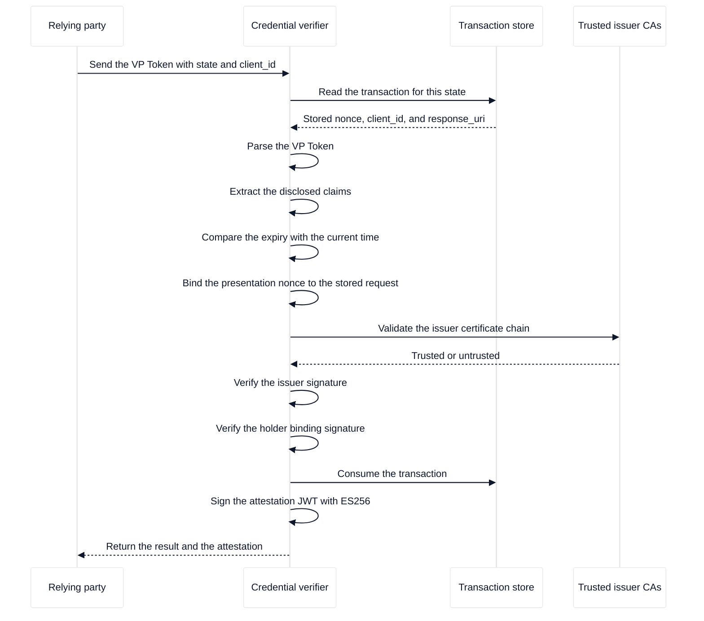

# The verification process

A relying party (RP) asks the credential verifier to decide whether a presentation is trustworthy. A presentation arrives from a wallet over the network, so the verifier treats it as untrusted input and repeats every check that a security decision needs. The result of those checks is a signed attestation.

This page explains what the verifier checks, in the order in which the checks depend on each other, and why each check exists. For the exact request and response fields, see [the HTTP API reference](../../reference/credential-verifier/http-api.md).

## Why the verifier repeats the checks

The relying party cannot see inside a presentation, and the browser that hosts the relying party must not hold verification keys. The verifier therefore owns the checks and reports only the outcome. Each check answers one separate question.

| Question                                                 | Check                                     |
| :------------------------------------------------------- | :---------------------------------------- |
| Is the message well formed?                              | Parse the VP Token.                       |
| Which claims does the holder disclose?                   | Extract the disclosed claims.             |
| Is the credential still valid?                           | Compare the expiry with the current time. |
| Does this presentation answer this request?              | Bind the nonce and the request context.   |
| Was the credential issued by a party we trust?           | Validate the issuer certificate chain.    |
| Did the issuer sign this credential?                     | Verify the issuer signature.              |
| Does the holder control the key bound to the credential? | Verify the holder binding signature.      |

The checks build on each other. A signature check is meaningless without the certificate chain that identifies the issuer, and the chain check is meaningless without a credential that parses. The verifier stops at the first check that fails and reports the reason.

## The verifier and the surrounding components

The diagram below shows the order of the exchange during one verification. The relying party owns the wallet interaction and the verifier owns the checks.

## Parsing the presentation and extracting the claims

A presentation reaches the verifier as a VP Token. The verifier accepts the DCQL response shape, in which credential query identifiers are the keys of a JSON object, and it also accepts a direct JSON presentation. Inside a DCQL entry, a value that contains a `~` separator is an SD-JWT VC, and a base64url value is an mDoc `DeviceResponse` in CBOR.

After parsing, the verifier reads the claims that the wallet disclosed. An SD-JWT VC carries clear-text claims in the issuer JWT payload and selectively disclosed claims in the Disclosures. An mDoc carries disclosed elements inside one or more namespaces. The verifier never sees a claim that the wallet did not disclose, which is the mechanism described in [selective disclosure](../digital-credential/selective-disclosure.md).

## Checking the expiry

A credential can be valid at issuance and invalid at presentation. The verifier reads the `exp` claim of an SD-JWT VC, or the validity window of the mDoc `MobileSecurityObject`, and rejects the presentation when the current time falls outside that window.

## Binding the nonce to the stored transaction

A recorded presentation could be sent again unless the presentation is bound to a fresh value. The verifier solves this with a nonce, which is a single-use random value.

The relying party creates a transaction before it invokes the wallet. The transaction holds the nonce, the `client_id`, and the `response_uri` that the verifier used for that specific request. When the relying party later sends the VP Token, it sends the `state` value, and the verifier reads the transaction for that state. The verifier compares the stored context with the proof inside the presentation:

- For an SD-JWT VC, the wallet binds the nonce into the Key Binding JWT, and the verifier compares that nonce with the stored nonce.
- For an mDoc, the wallet binds the request into the `SessionTranscript`. The verifier rebuilds the transcript from the stored `client_id`, `nonce`, and `response_uri`, and for encrypted responses also from the JWK thumbprint of the encryption key. The `DeviceSignature` then verifies against that rebuilt transcript.

The nonce never travels in the verification request body. A request that carried its own nonce could choose a value that matches a recorded presentation, so the verifier takes the nonce from its own store instead.

Some same-device flows deliver the presentation through the browser interface without a server-side transaction. In that case the verifier has no stored nonce, so it requires the `client_id` in the request body and uses the nonce that the presentation carries. An mDoc presentation always needs `state`, because the verifier cannot rebuild the session transcript without the stored request.

A successful verification consumes the stored transaction. An mDoc presentation then cannot be verified a second time, because the verifier rebuilds the session transcript from the stored request and has nothing left to rebuild it from. For an SD-JWT VC the verifier compares the stored nonce with the presentation nonce whenever a stored transaction exists; [the security model](security-model.md) states the limit of that binding.

## Verifying the issuer and the holder

Two signatures protect an mDoc and an SD-JWT VC, and they prove different things. The issuer signature proves that the credential came from the named issuer. The holder binding signature proves that the party who presents the credential controls the private key that the credential names. Without the second signature, a copied credential would be as good as the original.

| Credential format | Issuer check                                               | Holder binding check                                              |
| :---------------- | :--------------------------------------------------------- | :---------------------------------------------------------------- |
| SD-JWT VC         | The `x5c` header of the issuer JWT, missing is a rejection | The Key Binding JWT, verified with the key in `cnf.jwk`           |
| mDoc              | The `IssuerAuth` COSE_Sign1 and its `x5chain`              | The `DeviceSignature` COSE_Sign1 over `DeviceAuthenticationBytes` |

For both formats the verifier validates the certificate chain against the trusted issuer CA directory. A certificate that stops at an intermediate CA in that directory is sufficient; the chain does not have to reach a root in the directory. An mDoc must also match every disclosed element against the SHA-256 digest in the `MobileSecurityObject`, which proves that the disclosed value is the value the issuer signed and not a modified copy. Only the `deviceSignature` proof is supported; a presentation that carries `deviceMac` instead is rejected.

For the supported algorithms and the exact fields, see [credential formats](../../reference/digital-credential/credential-formats.md).

## Signing the attestation

When all checks pass, the verifier signs an attestation, which is a JWT that states the outcome for one relying party. The attestation binds the result to the request:

- The issuer is the common name of the attestation signing certificate.
- The audience is the relying party `client_id`.
- The subject is the transaction identifier.
- The nonce, the credential document type, and the namespace are included when known.
- The verified credential claims are flattened into the token, and they appear only when verification succeeded.

The verifier signs with ES256 and sets a key identifier in the token header, so the relying party can select the matching public key from the JWKS endpoint. The default validity is five minutes. For the full claim list, see [attestations](../../reference/credential-verifier/attestations.md).

When a presentation parses but fails a check, the answer depends on the format. For an SD-JWT VC, the verifier returns an unsuccessful result together with an attestation that records the failure and carries no claims. For an mDoc, the verifier returns a request error instead, because the mDoc checks do not produce a partial result. The exact status codes are listed in [the HTTP API reference](../../reference/credential-verifier/http-api.md).

## What the relying party does next

The relying party verifies the attestation signature with the public key from the JWKS endpoint and then reads the `verified` claim and the credential claims. Verification is complete at that point; the relying party does not contact the wallet again. The relying party then uses the claims for its own decision, such as granting access or starting a session.

The verifier records each successful event in the [verification journal](../../reference/credential-verifier/verification-journal.md) when journaling is enabled.
