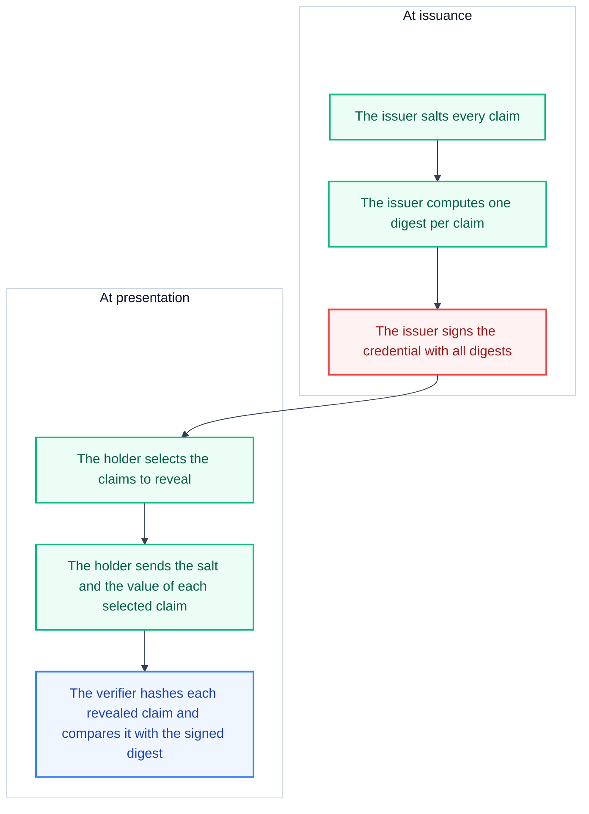

# Selective disclosure

Selective disclosure lets a holder reveal a subset of the claims in a credential. The verifier still checks the issuer signature, so the verifier trusts the revealed claims as much as it trusts the whole credential.

This page explains why selective disclosure exists, how each format implements it, and what the mechanism means for privacy. For the exact data structures, see [Credential formats](../../reference/digital-credential/credential-formats.md).

## Why selective disclosure is needed

A verifier usually needs one fact. An age check needs to know whether the holder is over 18. The credential that proves this fact often contains much more: a name, a birth date, a portrait, and an address.

Without selective disclosure, the holder must give the verifier the complete credential, so the verifier learns every claim. Selective disclosure separates the claims, so the holder reveals only the claims that the request needs. The signature of the issuer stays valid for the revealed subset.

## How the mechanism works

Both formats use the same idea. The issuer commits to every claim at issuance with a salted hash. The salt is a random value that the issuer adds to each claim. Later, the holder reveals a claim by sending its salt and its value. The verifier rebuilds the hash and compares it with the signed commitment.

The salt has two purposes. First, two credentials with the same claim value produce different hashes. Second, a verifier cannot guess an undisclosed value, because the verifier does not know the salt.

## Selective disclosure in mso_mdoc

In the mso_mdoc format, the issuer signs a Mobile Security Object (MSO) that holds one digest per claim. The digest covers a structure that holds the claim name, the value, and the salt. The claim values themselves are not in the MSO.

A presentation carries one `IssuerSignedItem` per revealed claim. Each item holds the claim name, the value, and the salt. The MSO keeps its signature and stays unchanged. The verifier recomputes the digest of each presented item and compares it with the matching digest in the MSO.

A claim that the holder does not reveal has no `IssuerSignedItem` in the presentation, so the verifier never sees the value. The MSO holds only opaque digests, so the verifier learns nothing about the values that the holder did not reveal.

## Selective disclosure in SD-JWT VC

In the SD-JWT VC format, the issuer puts a digest of each disclosable claim in the `_sd` array of the issuer JWT. The original value is removed from the payload and replaced by that digest.

A disclosure is a small base64url-encoded array that holds the salt, the claim name, and the claim value. A presentation lists the disclosures for the claims that the holder reveals. The verifier recomputes the digest of each disclosure and checks that it appears in the `_sd` array.

A claim that the issuer does not protect with a digest stays in the JWT payload as clear text. Such a claim is always visible to every verifier.

## What it means for privacy

Selective disclosure gives the holder control over the data that a verifier receives. The following points describe the effect.

- The verifier learns only the disclosed claims. Undisclosed claims stay hidden, including their names, because the digest hides the content.
- The salted hashing prevents a verifier from guessing an undisclosed value. A guessed value produces a different hash unless the verifier also knows the salt.
- The issuer signature still covers the disclosed claims, so the verifier does not need to trust the holder for the claim values.
- Holder binding stops the replay of a stolen credential. The holder must sign the presentation with the private key that the credential names.
- The nonce binds the presentation to one transaction, so a verifier cannot reuse a presentation later.

For age verification, the Proof of Age attestation shows the full benefit. The attestation carries only `age_over_18`. A verifier learns one bit of information and no identity data. An mDL can also disclose `age_over_18` alone, without the birth date or the portrait, when the wallet supports selective disclosure.

## Selective disclosure in the test credentials

The `ewqwe_digital_credential` library builds test credentials with every claim in visible form. The `build_eu_age_sd_jwt` and `build_eudi_sd_jwt` functions place claims in the issuer JWT payload as clear text and add no disclosures. The `build_eudi_mdoc` function places every claim in the `nameSpaces` of the presentation. A test credential therefore reveals all the claims that it contains. For the builder API, see [Issue a test credential](../../how-to-guides/digital-credential/issue-a-test-credential.md).

## Related topics

- [Credential formats](../../reference/digital-credential/credential-formats.md) lists the exact structures and the verification steps.
- [Credential types](../../reference/digital-credential/credential-types.md) lists the claims of each credential type.
- [Issue a test credential](../../how-to-guides/digital-credential/issue-a-test-credential.md) shows how to build a credential for a test.
