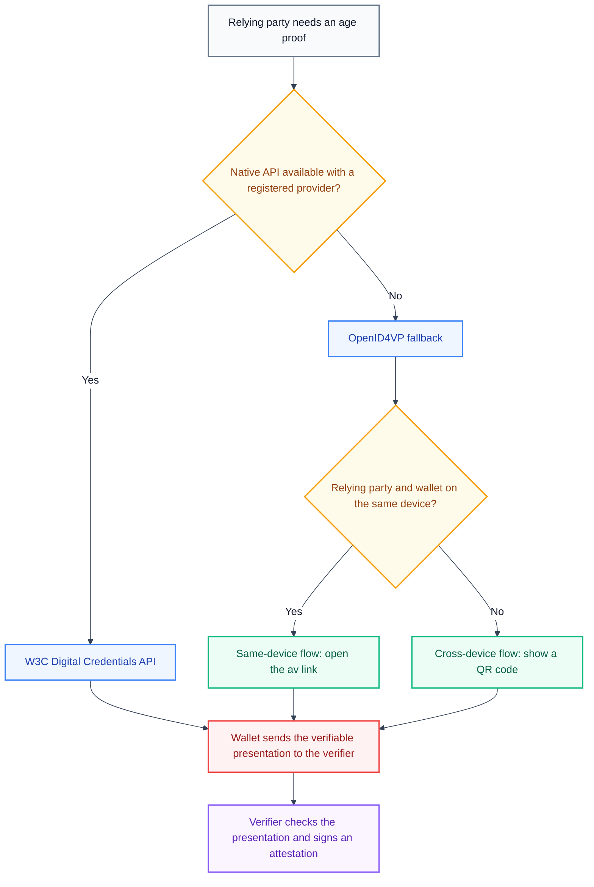

# Protocol modes

A relying party reaches a wallet with one of two protocols. The first protocol is the W3C Digital Credentials API, which the browser provides. The second protocol is OpenID for Verifiable Presentations (OpenID4VP), which uses plain web links and HTTP. This page explains why the system supports both protocols, how the same-device and cross-device flows differ, and how the fallback strategy selects between them.

The EU Age Verification Profile, Annex A, Section A.5, names the W3C Digital Credentials API as the primary method and OpenID4VP as the fallback. For the parameters of an OpenID4VP request, see [OpenID4VP authorization request parameters](../../reference/openid4vp/request-parameters.md).

## The W3C Digital Credentials API

The W3C Digital Credentials API extends `navigator.credentials.get()` with support for digital identity credentials. The relying party calls the browser API, the browser mediates the request and shows a credential chooser, and the wallet returns the response inside the same page through the returned promise. The browser never stores credentials. It only mediates between the relying party and the wallet.

The request and the response use base64url-encoded CBOR, as defined by ISO/IEC 18013-7 Annex C. The wallet encrypts the response to the relying party with HPKE (RFC 9180).

The native API gives the smoothest user experience, but it has practical limits. Not all browsers implement the API. A user preference or an enterprise policy can disable it. A browser extension cannot register as a credential provider, so the API fails with the error `NetworkError: No provider for digital credential requests` when only an extension can serve the request.

## OpenID4VP

OpenID4VP is an OpenID specification for presentation requests. The relying party encodes the request in a URL with query parameters, a nonce, and a DCQL query. The URL uses the `av://` scheme, so the operating system opens the age verification application. The wallet returns the response with an HTTP POST to the `response_uri` of the relying party. The response uses the `direct_post` response mode.

OpenID4VP works in every browser, because the operating system handles the URL scheme and the wallet posts over HTTP. It needs no browser API support. The cost is a reachable HTTPS endpoint on the relying party and a correlation step, because the response arrives in a separate HTTP request.

## Comparison of the two protocols

| Aspect               | W3C Digital Credentials API                             | OpenID4VP                                                       |
| :------------------- | :------------------------------------------------------ | :-------------------------------------------------------------- |
| Invocation           | `navigator.credentials.get()` with the `digital` option | The `av://` link scheme                                         |
| Response delivery    | A JavaScript promise inside the page                    | An HTTP POST to the `response_uri`                              |
| Cross-device support | Limited, and it needs a workaround                      | Native, through a QR code                                       |
| Browser support      | Chrome with a flag, limited                             | Universal, because the operating system handles the link scheme |
| Request format       | Base64url CBOR per ISO/IEC 18013-7                      | Query parameters with a DCQL JSON query                         |
| Response format      | Base64url CBOR, encrypted with HPKE                     | A JWT or CBOR, with no encryption required                      |
| Primary use case     | Same-device, browser-native                             | Cross-device, mobile wallets                                    |

## Same-device and cross-device flows

In a same-device flow, the relying party and the wallet run on one device. The user clicks a link, the operating system opens the wallet, the user approves the presentation, the wallet posts the response, and the relying party redirects the browser to the result page.

In a cross-device flow, the relying party and the wallet run on different devices. The relying party shows a QR code that encodes the `av://` URL. The user scans the code with a phone, the mobile wallet asks for consent, and the wallet posts the response to the `response_uri`. The device that showed the QR code learns about the completion through polling or a WebSocket connection, and then shows the result.

| Property                | Same-device flow                                | Cross-device flow                                  |
| :---------------------- | :---------------------------------------------- | :------------------------------------------------- |
| Devices                 | One device for the relying party and the wallet | Two devices, typically a desktop and a phone       |
| Invocation              | The user opens the `av://` link directly        | The user scans a QR code                           |
| Response delivery       | An HTTP POST to the `response_uri`              | An HTTP POST to the `response_uri`                 |
| Result notification     | A redirect of the browser                       | Polling or WebSocket on the first device           |

The cross-device flow is the reason for the `direct_post` response mode. A URL fragment cannot carry a response from a different device, but an HTTP POST to a public endpoint can.

## The fallback strategy

The system attempts the native API first, because the EU Age Verification Profile names it as the primary method. When the browser does not provide the API, or when no provider is registered, the attempt fails and the system falls back to OpenID4VP. The fallback also covers a wallet that only exists as a browser extension, because an extension cannot register as a native provider.

The decision diagram below shows how the system selects a protocol and a flow.

The fallback is a supported path, not an error path. The EU Age Verification Profile requires the fallback whenever the native API is unavailable, and the OpenID4VP path carries the same nonce binding and the same DCQL query as the native path.

## Related pages

- For the request parameters of the fallback, see [OpenID4VP authorization request parameters](../../reference/openid4vp/request-parameters.md).
- For the query that both protocols carry, see [DCQL queries](../../reference/openid4vp/dcql-queries.md).
- To test the fallback against a wallet, see [Test with the EUDI Wallet](../../how-to-guides/credential-verifier/test-with-the-eudi-wallet.md) and [Test with the age verification app](../../how-to-guides/credential-verifier/test-with-the-av-app.md).
