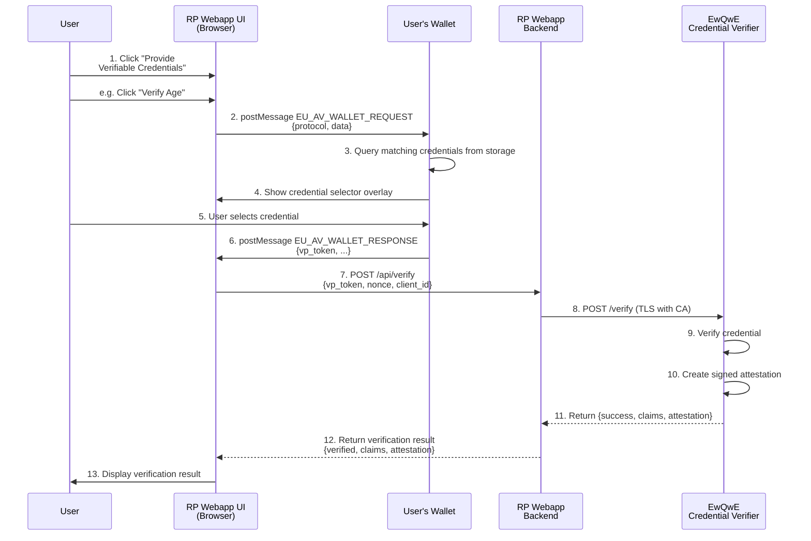

# User Journey - Sequence Diagram

A Digital Identity verification solution is composed of 3 main components:

- The Relying Party (RP) web application which requires a verifiable credential from a user, for example to verify the user's age,
- The user's Digital Wallet that holds the user's credentials. The Digital Wallet can run as a mobile application, desktop application, or browser extension,.
- The EwQwE Credential Verifier server that verifies the credential presented by the user and issues a signed attestation back to the Relying Party.
-language tool linter are you ere

