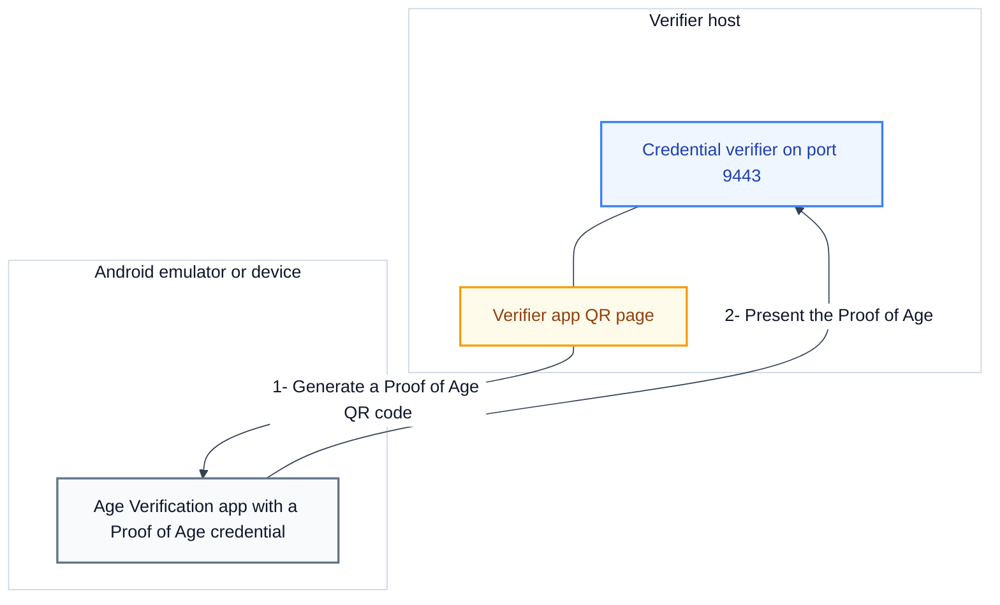

# Test the credential verifier with the AV app

This guide shows how to present a Proof of Age to the ewQwe Credential Verifier from the EU Age Verification (AV) app. The AV app is the official wallet of the EU Age Verification Solution. Use this guide when the verifier runs the Annex A profile and you want to test age verification with a real wallet.

A **Proof of Age** is an attestation that states only whether the holder is over an age threshold. It does not reveal the exact birth date. **Annex A** is the EU Age Verification profile. The **AV app** stores a Proof of Age credential in the mDoc format and presents it over OpenID4VP, which is the OpenID for Verifiable Presentations protocol. The **credential verifier** is the server that validates the presentation and returns a signed attestation.

At the end of this guide, the AV app presents the Proof of Age, and the verifier reports the verification result.

## Prerequisites

- The credential verifier is installed and running over HTTPS. See [Install and run the credential verifier](./install-and-run.md) and [Configure TLS](./configure-tls.md).
- The verifier app is enabled on the verifier. See [Run the verifier app](../../tutorials/verifier-app/run-the-verifier-app.md).
- The verifier trusts the certificate authority (CA) that issued the test credential, so that the verifier reports the issuer as trusted. See [Configuration](../../reference/credential-verifier/configuration.md).
- Android Studio is installed, or you have a physical Android device with Android 10 (API level 29) or higher.
- You know the public hostname and port of the verifier. This is the `public_root_url` value in the verifier configuration.

## How the test setup fits together

<div style="background-color: #ffffff; padding: 18px; border-radius: 8px; border: 1px solid #e2e8f0; margin-bottom: 24px;">



</div>

The verifier app generates a QR code that carries an OpenID4VP authorization request. The AV app reads the QR code and returns the Proof of Age. The verifier validates the credential and shows the result.

## Step 1: Confirm the verifier profile

The AV app uses the Annex A profile. In this profile, the wallet identifies the relying party by its `redirect_uri` and does not require a signed authorization request or a reader trust store. Because of this, you do not add any certificate to the AV app trust store.

The **Proof of Age** credential type in the verifier app selects the Annex A profile and the namespace `eu.europa.ec.av.1`. The table below contrasts the two profiles.

| Aspect            | AV app (Annex A)                   | EUDI wallet (HAIP)                |
| :---------------- | :--------------------------------- | :-------------------------------- |
| Client identifier | `redirect_uri`                     | `x509_san_dns` or `x509_san_hash` |
| Signed request    | Not required                       | Required                          |
| Response mode     | `direct_post`                      | `direct_post.jwt`                 |
| Reader trust      | Not required                       | Required                          |
| Credential        | Proof of Age (`eu.europa.ec.av.1`) | mDL or PID                        |

For the parameters of the request, see [Request parameters](../../reference/openid4vp/request-parameters.md).

## Step 2: Make the verifier reachable from the device

The wallet must reach the public URL of the verifier over HTTPS. If the verifier uses the demo hostname `demo.ewqwe.local`, set up the hostname mapping as described in [Test the credential verifier with the EUDI wallet](./test-with-the-eudi-wallet.md#step-2-make-the-verifier-reachable-from-the-device). You can use the same emulator and the same mapping for both wallet apps.

If the verifier uses an address that the device can reach directly, no mapping is necessary.

## Step 3: Install the AV app

### Option A: Build the ewQwe fork

The ewQwe fork of the AV app trusts all TLS certificates in debug builds. This lets the app reach the self-signed test certificate of the verifier.

1. Clone the repository:

   ```bash
   git clone https://github.com/bgrieder/av-app-android-wallet-ui.git
   cd av-app-android-wallet-ui
   ```

2. In Android Studio, open the project, select the `app` module and the `EUDI_Dev_Device` emulator, select the `devDebug` build variant under **Build**, **Select Build Variant**, and click **Run**.

   Expected result: the AV app installs and starts.

You can also build and install from the command line:

```bash
./gradlew :app:installDevDebug
```

> [!WARNING]
> The trust-all behaviour disables TLS verification. It exists only for local development. Never use it in a production build.

### Option B: Install a pre-built APK

1. Enable Developer Mode on the emulator. In **Settings**, open **About phone**, tap **Build number** seven times, and enter the device PIN if the device asks for it.
2. Open Chrome on the emulator and go to the [AV App releases page](https://github.com/eu-digital-identity-wallet/av-app-android-wallet-ui/releases).
3. Download an APK such as `app-dev-debug.apk`, open the file, and tap **Install**.

> [!IMPORTANT]
> The pre-built APK from the upstream project does not contain the trust-all behaviour. Use this option only when the verifier certificate chains to a CA that the stock app already trusts. Otherwise use Option A.

## Step 4: Obtain a Proof of Age credential

1. Open the AV app and create a PIN code when the app asks for one.
2. Obtain a Proof of Age credential from the development issuer at `https://test.issuer.dev.ageverification.dev`.

Expected result: the Proof of Age credential appears in the app.

## Step 5: Present the Proof of Age to the verifier

1. Open the verifier app at the public URL of the verifier and sign in.
2. On the home page, select **Proof of Age** as the credential type.
3. Click **Generate QR Code**.
4. On the Android device, open the AV app and scan the QR code.
5. Approve the credential sharing in the app.

Expected result: the status badge in the verifier app changes from `pending` to `verified`.

For the full set of status values and their meanings, see [The verifier app](../../reference/verifier-app/verifier-app.md).

## Troubleshooting

### The TLS handshake fails

The verifier presents a self-signed certificate that the app does not trust. Use the ewQwe fork, which trusts all certificates in debug builds, or use a certificate from a publicly trusted CA.

### The app does not open from the QR code

The QR code must contain a URI that the AV app registers. The AV app registers the schemes `av://`, `avsp://`, and `openid4vp://`, among others. Confirm that the verifier generates an Annex A request, and open the deep link directly if the camera scan does not start the app.

### The wallet cannot reach the verifier

Check the hostname mapping from Step 2, confirm that the verifier port is open in the firewall, and confirm that both devices use the same Wi-Fi network.

### The verifier rejects the presentation

The verifier does not trust the CA that issued the Proof of Age credential. Add the issuer CA to the verifier configuration and restart the verifier. See [Configuration](../../reference/credential-verifier/configuration.md).

> [!NOTE]
> The AV app does not require the verifier CA in a trust store. Annex A identifies the relying party by its redirect URI, not by a certificate.

## Next steps

- [Verify a credential](./verify-a-credential.md)
- [Test the credential verifier with the EUDI wallet](./test-with-the-eudi-wallet.md)
- [Selective disclosure](../../explanation/digital-credential/selective-disclosure.md)
- [Glossary](../../glossary.md)
