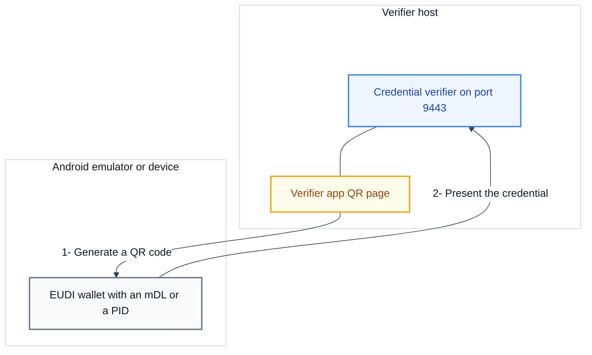
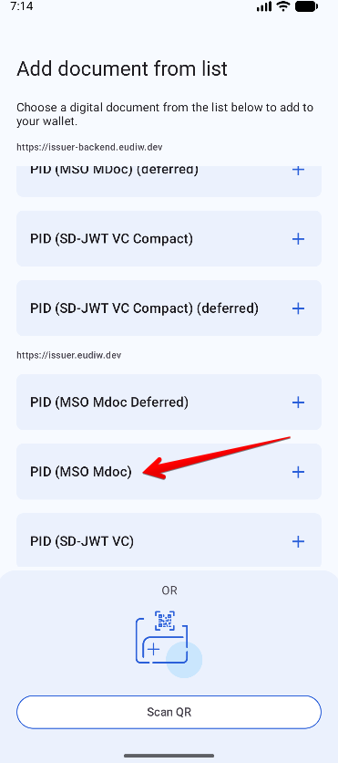
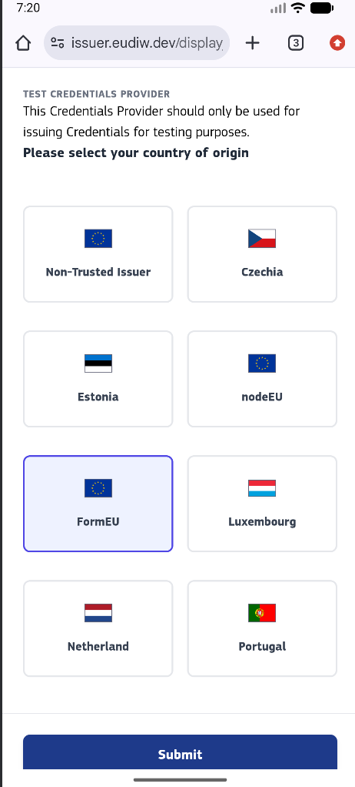
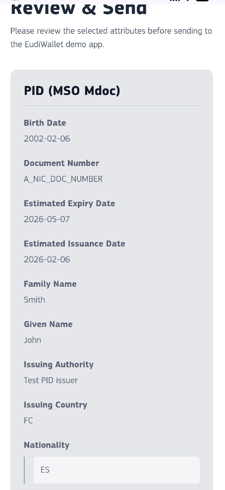
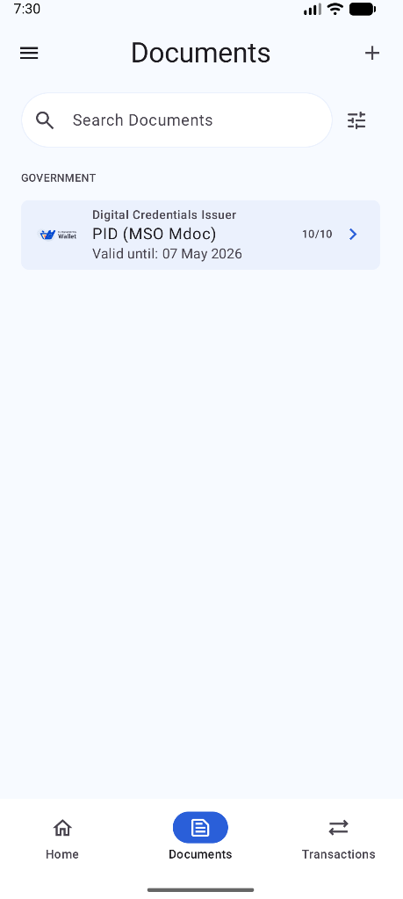

# Test the credential verifier with the EUDI wallet

This guide shows how to present a mobile driving licence (mDL) or a Personal Identification Data (PID) credential to the ewQwe Credential Verifier from the EUDI Wallet. The EUDI Wallet is the reference wallet of the European Commission. Use this guide when the verifier runs the High Assurance Interoperability Profile (HAIP) and you want to test the verification path with a real wallet.

A **mobile driving licence (mDL)** is a digital driving licence in the ISO/IEC 18013-5 **mDoc** format. A **Personal Identification Data (PID)** credential is the EU digital identity document. A **Verifiable Presentation** is the data that a wallet sends to the verifier to prove claims from a stored credential. OpenID4VP is the OpenID for Verifiable Presentations protocol that the wallet and the verifier use to exchange the presentation. The **credential verifier** is the server that validates the presentation and returns a signed attestation.

At the end of this guide, the wallet presents the credential to the verifier, and the verifier reports the verification result.

## Prerequisites

- The credential verifier is installed and running over HTTPS. See [Install and run the credential verifier](./install-and-run.md) and [Configure TLS](./configure-tls.md).
- The verifier app is enabled on the verifier. See [Run the verifier app](../verifier-app/run-the-verifier-app.md).
- The verifier trusts the certificate authority (CA) that issued the test credential, so that the verifier reports the issuer as trusted. See [Configuration](../../reference/credential-verifier/configuration.md).
- Android Studio is installed, or you have a physical Android device with Android 10 (API level 29) or higher.
- You know the public hostname and port of the verifier. This is the `public_root_url` value in the verifier configuration.

## How the test setup fits together

<div style="background-color: #ffffff; padding: 18px; border-radius: 8px; border: 1px solid #e2e8f0; margin-bottom: 24px;">



</div>

The verifier app generates a QR code that carries an OpenID4VP authorization request. The wallet reads the QR code, fetches the request from the verifier, and returns the credential. The verifier validates the credential and shows the result.

## Step 1: Choose the client identifier scheme

The EUDI Wallet accepts only two client identifier schemes: `x509_san_dns` and `x509_san_hash`. A **client identifier scheme** is the rule that the wallet uses to identify the verifier. The wallet rejects the `redirect_uri` scheme that the EU Age Verification profile uses. To test that profile, use [Test the credential verifier with the AV app](./test-with-the-av-app.md) instead.

| Scheme          | Hostname check | Trust method                         |
| :-------------- | :------------- | :----------------------------------- |
| `x509_san_dns`  | Yes            | Certificate chain and leaf DNS name  |
| `x509_san_hash` | No             | SHA-256 hash of the leaf certificate |

The verifier selects the scheme from its configuration. For the parameters, see [Request parameters](../../reference/openid4vp/request-parameters.md).

- If the verifier uses the bundled ewQwe test certificates, it uses `x509_san_dns` with the hostname `demo.ewqwe.local`. The ewQwe wallet fork already trusts the ewQwe test CA. Continue with Step 2.
- If the verifier uses your own certificate, choose `x509_san_hash`. With `x509_san_hash`, the wallet does not check the hostname, so you can skip Step 2. The wallet must still reach the verifier.

## Step 2: Make the verifier reachable from the device

The wallet must reach the verifier over HTTPS. With `x509_san_dns`, the wallet also requires the verifier hostname to resolve on the device. The examples below use the hostname `demo.ewqwe.local`. Replace it with the hostname in your verifier configuration.

### Option A: Android emulator

The Android emulator reaches the host machine through the special address `10.0.2.2`. The ewQwe setup script in Step 3 adds this mapping automatically. To add the mapping to a running emulator manually, run:

```bash
adb root
adb shell "echo '10.0.2.2  demo.ewqwe.local' >> /etc/hosts"
```

Expected result: the emulator resolves `demo.ewqwe.local` to the host machine.

Verify the mapping with:

```bash
adb shell cat /etc/hosts
```

Expected result: the output lists `10.0.2.2  demo.ewqwe.local`.

### Option B: Physical Android device on a local network

Use `dnsmasq` on the machine that runs the verifier. `dnsmasq` is a small DNS server that answers name queries for a local network.

1. Find the local network address of the machine that runs the verifier:

   ```bash
   ipconfig getifaddr en0
   # Example output: 192.168.1.42
   ```

2. Install and configure `dnsmasq`. Replace `192.168.1.42` with the address from the previous command:

   ```bash
   brew install dnsmasq
   echo "address=/demo.ewqwe.local/192.168.1.42" >> /opt/homebrew/etc/dnsmasq.conf
   sudo brew services restart dnsmasq
   ```

3. Verify the resolver on the same machine:

   ```bash
   dig @127.0.0.1 demo.ewqwe.local
   ```

   Expected result: the answer is the local network address.

4. Point the Android device at this resolver. On the device, open **Settings**, open **Wi-Fi**, long-press your network, choose **Modify network**, open **Advanced**, set **IP settings** to **Static**, and set **DNS 1** to the local network address.

The device needs no root access. Every device on the same Wi-Fi network that uses this resolver resolves `demo.ewqwe.local` correctly.

> [!NOTE]
> If you regenerate the test certificates with a different DNS name, update the `public_root_url` value in the verifier configuration and use the same hostname in the DNS setup.

## Step 3: Install the EUDI wallet on the emulator

### Option A: Build the ewQwe fork

The ewQwe fork of the EUDI Wallet trusts the ewQwe test CA in debug builds, so it accepts requests and TLS connections from the bundled test certificates.

1. Clone the repository:

   ```bash
   git clone https://github.com/bgrieder/android-eudi-haip-wallet.git
   cd android-eudi-haip-wallet
   ```

2. Create and start the emulator. The script requires a rootable system image, which is a Google APIs image and not a Play Store image:

   ```bash
   ./start_ewqwe_eudi_emulator.sh
   ```

   The script installs the system image, creates an Android Virtual Device (AVD) named `EUDI_Dev_Device` with the Pixel 6 Pro profile, enables hardware keyboard input, starts the emulator with `-writable-system`, and maps `demo.ewqwe.local` to the host machine.

   Expected result: the emulator starts, and the Step 2 Option A mapping is already in place.

3. In Android Studio, open the project, select the `app` module and the `EUDI_Dev_Device` emulator, and click **Run**.

   Expected result: the wallet installs and starts.

### Option B: Install a pre-built APK

1. Enable Developer Mode on the emulator. In **Settings**, open **About phone**, tap **Build number** seven times, and enter the device PIN if the device asks for it.
2. Open Chrome on the emulator and go to the [EUDI Wallet releases page](https://github.com/eu-digital-identity-wallet/eudi-app-android-wallet-ui/releases).
3. Download an APK such as `app-demo-debug.apk`, open the file, and tap **Install**.
4. If the device asks about **Install unknown apps**, allow Chrome to install apps and try again.

You can also install the APK over ADB:

```bash
adb install app-demo-debug.apk
```

> [!IMPORTANT]
> The pre-built APK from the upstream project does not contain the ewQwe test CA. Use this option only when the verifier certificate chains to a CA that the stock wallet already trusts. Otherwise use Option A and add your CA in Step 4.

## Step 4: Trust the verifier certificate in the wallet

Skip this step if the verifier uses the bundled ewQwe test certificates, because the ewQwe fork already trusts the ewQwe test CA.

The wallet validates the request certificate chain against a **reader trust store**, which is a list of trusted certificate authorities inside the wallet. Add your root CA certificate and rebuild the wallet:

1. Copy the root CA file into the wallet resources:

   ```bash
   cp your-root-ca.pem resources-logic/src/main/assets/ewqwe_dev_cas/your-root-ca.pem
   ```

2. Build and install the wallet:

   ```bash
   ./gradlew :app:installDemoDebug
   ```

Expected result: the wallet accepts requests that your verifier CA signs, and the error `InvalidJarJwt(cause=Untrusted x5c)` no longer appears.

> [!IMPORTANT]
> The leaf certificate of the verifier must contain the `mdlReaderAuth` extended key usage object identifier (OID) `1.0.18013.5.1.6`, a Subject Key Identifier, and an Authority Key Identifier. The certificate must use ECDSA signing and a validity period of at most 1 187 days. A missing `mdlReaderAuth` OID is the most common cause of `InvalidJarJwt(cause=Untrusted x5c)`. See [Request parameters](../../reference/openid4vp/request-parameters.md) for the signing requirements.

## Step 5: Load an mDL or a PID into the wallet

1. Open the wallet and create a PIN code when the wallet asks for one.
2. Tap the add icon (`+`) and choose **Add a Document from List**.

   

3. Select the issuer `https://euidw.dev` and choose **mDL (MSO MDOC)** or **PID (MSO MDOC)**.
4. When the wallet asks for the country, choose **Form EU**.

   

5. Fill in the test form, submit it, and authorize the issuance.

   

Expected result: the credential appears in the wallet.



## Step 6: Present the credential to the verifier

1. Open the verifier app at the public URL of the verifier and sign in.
2. On the home page, select the credential type from the dropdown:
   - **mDL** requests the mobile driving licence.
   - **National ID** requests the PID.
3. Click **Generate QR Code**.
4. On the Android device, open the EUDI Wallet and scan the QR code.
5. Review the authorization request in the wallet. The wallet shows the verifier name from the common name (CN) of the certificate, and a trusted badge when the certificate chain validates. Approve the request with your biometric confirmation.

Expected result: the status badge in the verifier app changes from `pending` to `scanned` and then to `verified`.

For the full set of status values and their meanings, see [The verifier app](../../reference/verifier-app/verifier-app.md).

## Troubleshooting

### The wallet reports InvalidJarJwt with an untrusted x5c error

The wallet does not trust the request certificate chain, or the leaf certificate does not meet the profile. Add the root CA to the reader trust store and rebuild the wallet. Confirm that the leaf certificate contains the `mdlReaderAuth` OID `1.0.18013.5.1.6` and that the Subject Key Identifier and Authority Key Identifier are present.

### The wallet reports that the trust anchor is not found

The root CA is absent from both the reader trust store and the request certificate chain. Include the root CA in the certificate chain, and add it to the reader trust store.

### The wallet cannot reach the verifier

Check the hostname mapping from Step 2, confirm that the verifier port is open in the firewall, and confirm that both devices use the same Wi-Fi network. Some access points block communication between clients, which is also known as client isolation.

### The wallet rejects the request with a client identifier mismatch

With `x509_san_dns`, the hostname in the `client_id` value must equal the DNS name in the leaf certificate of the request chain and the hostname of the `response_uri`. Make all three hostnames equal.

### The TLS handshake fails

The verifier presents a self-signed or privately rooted certificate that the wallet does not trust. Use a certificate from a publicly trusted CA, or a wallet build that trusts your CA.

> [!NOTE]
> To inspect wallet errors, use Logcat in Android Studio and filter by the wallet package name, or run `adb logcat -s OpenId4VpManager PresentationManager WalletCore`.

## Next steps

- [Verify a credential](./verify-a-credential.md)
- [Test the credential verifier with the AV app](./test-with-the-av-app.md)
- [OpenID4VP protocol modes](../../explanation/openid4vp/protocol-modes.md)
- [Glossary](../../glossary.md)
