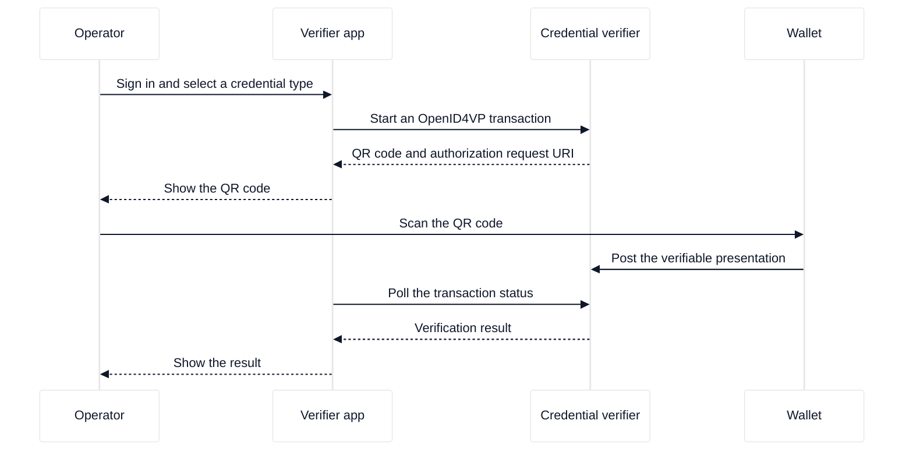

# Run the verifier app

This guide shows how to enable the verifier app on the credential verifier and how to complete a QR-code age verification.

## Goal

Run the verifier app, create the first administrator account, generate a QR code, and read a verification result.

## Prerequisites

- A working credential verifier with TLS. See [Install and run the credential verifier](../credential-verifier/install-and-run.md).
- Node.js 18 or later, to build the single-page application (SPA).
- A wallet that supports the requested credential type. See [Test with the age verification app](../credential-verifier/test-with-the-av-app.md) and [Test with the EUDI wallet](../credential-verifier/test-with-the-eudi-wallet.md).
- An administrator email address and a password of at least 12 characters.

<div style="background-color: #ffffff; padding: 18px; border-radius: 8px; border: 1px solid #e2e8f0; margin-bottom: 24px;">



</div>

## Steps

### 1. Build the SPA

```bash
cd crates/ewqwe-verifier-app/ui
npm install
npm run build
```

Expected: the build writes the SPA to `crates/ewqwe-verifier-app/ui/dist/`. Confirm the output:

```bash
ls crates/ewqwe-verifier-app/ui/dist
```

Expected: `index.html` and an `assets` directory.

### 2. Enable the app

Edit the server configuration file and add this section:

```toml
[verifier_app]
enabled = true
app_name = "My Age Verifier"
ui_dist_path = "../crates/ewqwe-verifier-app/ui/dist"
```

Resolve `ui_dist_path` relative to the directory that holds the configuration file. When the file is `credential_verifier/credential-server.toml`, the value above points at the build output from step 1.

Optional keys are `public_url`, `allowed_credential_types`, `session_secret`, and `[verifier_app.db]`. For more information, see [The verifier app](../../reference/verifier-app/verifier-app.md).

To keep sessions across server restarts, generate a secret and set `session_secret`:

```bash
openssl rand -hex 64
```

### 3. Start the credential verifier

```bash
cd credential_verifier
RUST_LOG=info cargo run --features openssl
```

Expected: the log shows `Verifier App store enabled` and `Attestation Provider server listening on 0.0.0.0:9443`. Leave the process running.

If the log shows `Verifier App ui_dist_path not found`, the server does not serve the SPA. Check step 1 and the path in step 2.

### 4. Create the first administrator

Open `https://localhost:9443/` in a browser. Because no user account exists, the app shows the bootstrap form. Enter an email address and a password of at least 12 characters, then submit the form.

Expected: the app signs you in and shows the Home page. The app accepts the bootstrap route only once. Every later call returns `409 Conflict`.

### 5. Generate a QR code

1. On the Home page, select the credential type.
2. Click **Generate QR Code**.

Expected: the page shows a QR code and a status badge. The app polls the status every 2 seconds.

When the server allows only one credential type, the app hides the dropdown and generates the QR code when the page loads.

### 6. Scan the QR code

Open the wallet on the holder device and scan the QR code. Approve the credential request.

Expected: the status badge moves from `pending` to `scanned`, and then to `verified`.

### 7. Read the result

When the badge shows `verified`, the presentation passed verification. Click **New Verification** to start another transaction, or click **Cancel** to return to the credential type selection.

## Troubleshooting

| Symptom                                  | Cause                                       | Action                                                                |
| :--------------------------------------- | :------------------------------------------ | :-------------------------------------------------------------------- |
| Every `/api/v1` route returns 404        | The app is disabled.                        | Add the `[verifier_app]` section with `enabled = true`, then restart. |
| The root URL returns 404 or a blank page | The SPA is not built, or the path is wrong. | Build the SPA and correct `ui_dist_path`. Check the server log.       |
| Bootstrap returns `409 Conflict`         | An administrator already exists.            | Sign in instead of bootstrapping a second administrator.              |
| The session ends after each restart      | `session_secret` is not set.                | Set a stable `session_secret` value.                                  |
| QR generation returns `400`              | The credential type is not allowed.         | Check `allowed_credential_types` and the per-user allowed types.      |
| The QR code expires before the scan      | The transaction passed its time to live.    | Generate a new QR code.                                               |

## Related pages

- [The verifier app](../../reference/verifier-app/verifier-app.md)
- [Credential verifier configuration](../../reference/credential-verifier/configuration.md)
- [Verification journal](../../reference/credential-verifier/verification-journal.md)
- [Test with the age verification app](../credential-verifier/test-with-the-av-app.md)
