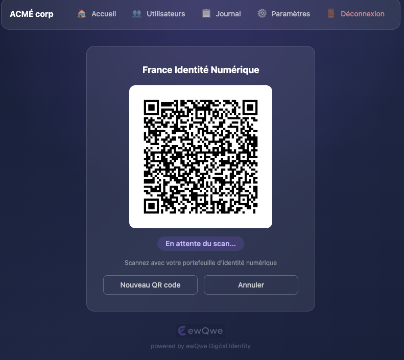

# ewQwe Identity — Introduction

**ewQwe** (pronounced */juːˈkwiː/ — *you-kwee*) **Identity** is an **open-source credential verifier** developed in the EU, compatible with the **EUDI/eIDAS wallet ecosystem**.

The project provides a complete solution — including a multi-lingual admin UI — for verifying digital credentials such as **Proof of Age**, **Person Identification Data (PID)**, and **Mobile Driving Licences (mDL)**.

Out of the box: **age over 18** verification using the widely deployed **France Identité Numérique** wallet.

## What it does

The Credential Verifier is a Rust server that accepts **Verifiable Presentations** from EUDI Wallets via **OpenID4VP**, validates their cryptographic integrity, and returns signed JWT attestations to Relying Parties.

It ships with an **embedded multi-lingual admin UI** — build the SPA, enable it in config, and it's served at the server root URL with no separate frontend deployment.

A **MIT-licensed demo webapp** is also provided, showing how to embed credential verification into an existing web application.

## Supported Standards

| Standard | Purpose |
|----------|---------|
| **OpenID4VP 1.0** | Credential presentation protocol |
| **ISO/IEC 18013-5** | mDoc / mDL credential format |
| **ISO/IEC 18013-7 Annex B** | Online mDoc presentation via OpenID4VP |
| **SD-JWT VC** | Selective Disclosure JWT credentials |
| **HAIP** | High Assurance Interoperability Profile (JAR, JWE, X.509) |
| **EU Age Verification Profile** | Privacy-preserving age checks (DSA-compliant) |

## Components

| Component | Description | License |
|-----------|-------------|---------|
| **Credential Verifier** | Core server: VP Token validation, signed JWT attestations, OpenID4VP transaction lifecycle | AGPL-3.0 |
| **Admin UI** | Embedded SPA: QR-code-driven verification dashboard, user management, audit journal, i18n | AGPL-3.0 |
| **Demo Webapp** | Relying Party demo — vanilla TypeScript SPA that requests credentials via OpenID4VP | MIT |
| **Shared JS Library** | TypeScript library: DCQL query builders, protocol profiles, API client | MIT |
| **OpenID4VP Library** | Reusable Rust crate: DCQL, JAR signing, JWE decryption, transaction stores | AGPL-3.0 |
| **Digital Credential Library** | Rust crate: SD-JWT VC and mDoc credential building, signing, verification | AGPL-3.0 |

## Roadmap

Based on your role:

| Role | Start here |
|------|-----------|
| **Deploying the verifier** | [Credential Verifier Server](./credential_verifier_server.md) |
| **Using the admin dashboard** | [Credential Verifier UI](./credential_verifier_ui.md) |
| **Building a Relying Party** | [Demo Webapp](./demo_webapp.md) then [Demo Architecture](./demo_architecture.md) |
| **Understanding the standards** | [Protocols & Formats Summary](./summary_protocols_formats.md) |

## License

The open-core crates are licensed under **AGPL-3.0**. The TypeScript packages (`@ewqwe/digital-identity` and `demo-webapp`) are licensed under **MIT**.

## Enterprise Version

The **enterprise** version adds production-grade infrastructure:

| Feature | Enterprise Crate |
|---------|-----------------|
| OpenTelemetry (OTLP) tracing & metrics | `ewqwe-enterprise-logging` |
| PostgreSQL & Redis stores | `ewqwe-enterprise-stores` |
| APISIX/eIDAS authentication | `ewqwe-enterprise-auth` |
| mTLS, multi-tenancy, K8s Helm charts | `ewqwe-enterprise-server` |

**Credential Verification as a Service** is coming soon — check [ewqwe.eu](https://ewqwe.eu) for updates.
