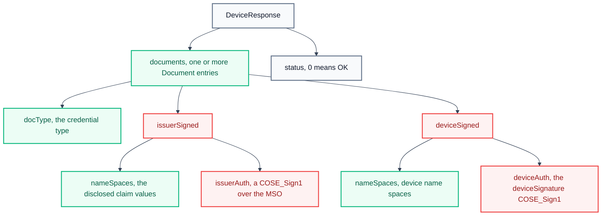
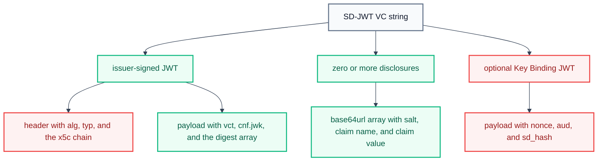

# Credential formats

A digital credential is a signed set of claims about a subject, such as a person. The **issuer** signs the credential, the **holder** stores it, and the **verifier** checks it. A **claim** is a single fact, for example `age_over_18`. A **presentation** is the message that the holder sends to the verifier.

The credential verifier accepts two credential formats:

- `mso_mdoc` — the format of ISO/IEC 18013-5. The format uses CBOR encoding and COSE signatures.
- `dc+sd-jwt` — the SD-JWT VC format. The format uses JSON encoding and JWS signatures.

Both formats support **selective disclosure** (the holder reveals only some claims) and **holder binding** (the holder proves control of a private key). For the privacy effect of selective disclosure, see [Selective disclosure](../../explanation/digital-credential/selective-disclosure.md).

The verifier detects the format from the presentation itself. An mDoc presentation is a Base64URL-encoded CBOR structure. An SD-JWT VC presentation contains the `~` separator character. For the types that the verifier can request, see [Credential types](credential-types.md).

## Format identifiers

The two formats appear in a DCQL query with the identifiers that the table below lists.

| Property        | mso_mdoc                                 | dc+sd-jwt                          |
| :-------------- | :--------------------------------------- | :--------------------------------- |
| DCQL format id  | `"mso_mdoc"`                             | `"dc+sd-jwt"`                      |
| Type identifier | `docType`, a CBOR text string            | `vct`, a URI claim                 |
| DCQL claim path | `[namespace, claim name]`                | `[claim name]`                     |
| Encoding        | CBOR (RFC 8949)                          | JSON                               |
| Signature type  | COSE                                     | JWS                                |
| Algorithm id    | COSE integer, for example `-7` for ES256 | JOSE string, for example `"ES256"` |
| DCQL metadata   | `meta.doctype_value`                     | `meta.vct_values`                  |

## mso_mdoc

The mso_mdoc format is defined in ISO/IEC 18013-5. The format is also called mDoc. The Mobile Security Object (MSO) is the signed data structure at the core of the format.

### Structure

An mDoc presentation is a CBOR map called `DeviceResponse`. The `DeviceResponse` holds one or more `Document` entries. Each `Document` holds a `docType` value, the issuer-signed data, and the device-signed data.

<div style="background-color: #ffffff; padding: 18px; border-radius: 8px; border: 1px solid #e2e8f0; margin-bottom: 24px;">



</div>

The outer structure has the following fields.

```cddl
DeviceResponse = {
  "version": tstr,          ; "1.0"
  "documents": [ Document ],
  "status": 0               ; 0 means OK
}

Document = {
  "docType": tstr,          ; for example "org.iso.18013.5.1.mDL"
  "issuerSigned": IssuerSigned,
  "deviceSigned": DeviceSigned
}
```

### Issuer-signed data

The `issuerSigned` field carries the issuer-authenticated data in two parts.

- `nameSpaces` holds the disclosed claims as `IssuerSignedItem` entries.
- `issuerAuth` is a `COSE_Sign1` structure whose payload is the MSO.

The MSO does not contain claim values. The MSO contains one digest per claim and the public key of the device.

```cddl
MobileSecurityObject = {
  "version": tstr,
  "digestAlgorithm": tstr,            ; "SHA-256"
  "valueDigests": {
    namespace => { digestID => bstr } ; one SHA-256 digest per claim
  },
  "deviceKeyInfo": { "deviceKey": COSE_Key },
  "docType": tstr,
  "validityInfo": { "signed": tdate, "validFrom": tdate, "validUntil": tdate }
}
```

The issuer signature is a `COSE_Sign1` structure. The protected header carries the algorithm, and the unprotected header carries the issuer certificate chain in the `x5chain` header (label 33).

```cddl
issuerAuth = [
  protected:   bstr .cbor { 1: alg },  ; for example alg = -7 (ES256)
  unprotected: { 33: [ x5chain ] },    ; issuer certificate chain
  payload:     bstr .cbor MobileSecurityObject,
  signature:   bstr
]
```

The `x5chain` header holds the issuer leaf certificate and, when present, the issuer CA certificate. The verifier checks the chain against the trusted issuer CAs. For the configuration of those CAs, see [Configuration](../credential-verifier/configuration.md).

### Disclosures

Each claim is an `IssuerSignedItem`. The value carries a random salt, so two encodings of the same claim value have different digests.

```cddl
IssuerSignedItemBytes = #6.24(bstr .cbor IssuerSignedItem)

IssuerSignedItem = {
  "digestID": uint,           ; matches the entry in the MSO valueDigests
  "random": bstr,             ; random salt, at least 16 bytes
  "elementIdentifier": tstr,  ; claim name, for example "given_name"
  "elementValue": any         ; the claim value
}
```

The digest in the MSO is the SHA-256 hash of the complete `IssuerSignedItemBytes` encoding, including the `Tag(24)` wrapper:

```text
digest = SHA-256( cbor( #6.24( bstr( cbor(IssuerSignedItem) ) ) ) )
```

A presentation discloses a claim when its `IssuerSignedItem` appears in `nameSpaces`. The MSO stays unchanged and signed. The verifier recomputes the digest of each disclosed item and compares the result with the matching `valueDigests` entry.

### Key binding

The `deviceSigned` field proves that the presenter controls the device key that the MSO names. The field has two parts: `nameSpaces`, which is usually empty, and `deviceAuth`, which holds the `deviceSignature`.

```cddl
DeviceSigned = {
  "nameSpaces": #6.24(bstr .cbor DeviceNameSpaces),
  "deviceAuth": { "deviceSignature": COSE_Sign1 }
}

DeviceAuthentication = [
  "DeviceAuthentication",
  SessionTranscript,       ; binds the signature to one presentation session
  DocType,
  DeviceNameSpacesBytes
]

DeviceAuthenticationBytes = #6.24(bstr .cbor DeviceAuthentication)
```

The `deviceSignature` uses `DeviceAuthenticationBytes` as a detached payload. The device key from `deviceKeyInfo.deviceKey` signs those bytes. The `Tag(24)` wrapper is part of the signed bytes.

For an OpenID4VP presentation, the `SessionTranscript` binds the presentation to the request:

```cddl
SessionTranscript = [
  null,             ; DeviceEngagementBytes, absent for OpenID4VP
  null,             ; EReaderKeyBytes, absent for OpenID4VP
  OID4VPHandover
]

OID4VPHandover = [ "OpenID4VPHandover", SHA-256( cbor(OID4VPHandoverInfo) ) ]

OID4VPHandoverInfo = [
  clientId,
  nonce,
  jwkThumbprint,    ; verifier encryption key thumbprint, or null
  responseUri
]
```

The `jwkThumbprint` is present only in an encrypted response, for example `direct_post.jwt`. For an unencrypted response, the value is CBOR `null`.

> [!NOTE]
> The verifier accepts `deviceSignature`. The verifier does not accept `deviceMac` (a `COSE_Mac0` value).

### Verification steps

The verifier performs the following checks for an mDoc presentation, in order.

1. Decode the Base64URL or Base64 value to CBOR, parse the `DeviceResponse`, and select the first `Document`.
2. Extract `issuerAuth`, verify the `x5chain` certificate chain against the trusted issuer CAs, and verify the issuer signature over the MSO payload.
3. Parse the MSO, and check that the MSO `docType` matches the `Document` `docType`.
4. For each disclosed `IssuerSignedItem`, recompute the digest and compare it with `valueDigests[namespace][digestID]`.
5. Reconstruct the `SessionTranscript` from `client_id`, `nonce`, `response_uri`, and the response mode. Build `DeviceAuthenticationBytes`, and verify `deviceSignature` with the MSO device key.
6. Check the MSO validity window (`validFrom` and `validUntil`) against the current time.

The COSE algorithms that the verifier supports for the mDoc signatures are listed below.

| COSE algorithm id | Name  | Description                              |
| :---------------- | :---- | :--------------------------------------- |
| `-7`              | ES256 | ECDSA with P-256 and SHA-256             |
| `-35`             | ES384 | ECDSA with P-384 and SHA-384             |
| `-36`             | ES512 | ECDSA with P-521 and SHA-512             |
| `-257`            | RS256 | RSA with PKCS#1 v1.5 padding and SHA-256 |
| `-258`            | RS384 | RSA with PKCS#1 v1.5 padding and SHA-384 |
| `-259`            | RS512 | RSA with PKCS#1 v1.5 padding and SHA-512 |

## SD-JWT VC

SD-JWT VC is the Selective Disclosure JSON Web Token format for Verifiable Credentials. The format is defined in the IETF SD-JWT VC specification.

### Structure

An SD-JWT VC presentation is a single string. The issuer-signed JWT comes first. Zero or more disclosures follow, and an optional Key Binding JWT (KB-JWT) comes last. The elements are separated by the `~` character.

```text
<issuer-signed JWT>~<disclosure 1>~<disclosure 2>~...~<KB-JWT>
```

<div style="background-color: #ffffff; padding: 18px; border-radius: 8px; border: 1px solid #e2e8f0; margin-bottom: 24px;">



</div>

### Issuer-signed data

The issuer-signed JWT is a standard JSON Web Signature. The protected header carries the algorithm, the type `vc+sd-jwt`, and the `x5c` certificate chain of the issuer.

```json
{
  "alg": "ES256",
  "typ": "vc+sd-jwt",
  "x5c": [
    "<issuer leaf certificate, base64 DER>",
    "<issuer CA certificate, base64 DER>"
  ]
}
```

The payload carries the standard claims (`iss`, `iat`, `exp`), the credential type (`vct`), the holder public key (`cnf.jwk`), and the selective-disclosure structure. A claim that uses selective disclosure is replaced by a digest in the `_sd` array. A claim that does not use selective disclosure stays in the payload as clear text.

```json
{
  "iss": "https://issuer.example.com",
  "iat": 1700000000,
  "exp": 1800000000,
  "vct": "eu.europa.ec.eudi.pid.1",
  "cnf": { "jwk": { "kty": "EC", "crv": "P-256" } },
  "_sd_alg": "sha-256",
  "_sd": ["<digest of disclosure 1>", "<digest of disclosure 2>"]
}
```

The verifier requires the `x5c` header. The verifier rejects a presentation whose issuer JWT has no `x5c` header.

### Disclosures

A disclosure is a base64url-encoded JSON array with three elements: the salt, the claim name, and the claim value.

```text
Disclosure = BASE64URL( JSON([ salt, claim_name, claim_value ]) )

Example, before encoding:
[ "dX23abc_SALT_VALUE", "given_name", "Elton" ]

The digest in the issuer payload is:
digest = BASE64URL( SHA-256( ASCII(Disclosure) ) )
```

The holder reveals a claim when the holder includes the matching disclosure in the presentation. The verifier recomputes the digest of each disclosure and compares the result with the `_sd` array. Nested objects use a nested `_sd` array inside the object.

### Key binding

The KB-JWT proves that the presenter controls the private key that `cnf.jwk` names. The holder key signs the KB-JWT.

```json
{
  "alg": "ES256",
  "typ": "kb+jwt"
}
.
{
  "iat": 1700000100,
  "aud": "<client_id of the verifier>",
  "nonce": "<nonce from the authorization request>",
  "sd_hash": "<BASE64URL(SHA-256(issuer-jwt ~ disclosures))>"
}
.
<holder signature>
```

The `sd_hash` binds the KB-JWT to the exact set of disclosures in the presentation. The `nonce` binds the presentation to one transaction, and the `aud` value is the `client_id` of the verifier.

### Verification steps

The verifier performs the following checks for an SD-JWT VC presentation, in order.

1. Split the string at each `~` character into the issuer JWT, the disclosures, and the optional KB-JWT.
2. Read the issuer JWT header. Extract the leaf key from `x5c[0]`, and validate the certificate chain against the trusted issuer CAs.
3. Verify the issuer JWT signature with that key.
4. For each presented disclosure, recompute the digest and check that it appears in the `_sd` array, recursively for nested objects.
5. Verify the KB-JWT signature with the holder key from `cnf.jwk`.
6. Compare the KB-JWT `nonce` with the nonce of the transaction, and check the validity time (`exp`).

## Format comparison

The table below summarizes the differences between the two formats.

| Property                     | mso_mdoc                               | dc+sd-jwt                            |
| :--------------------------- | :------------------------------------- | :----------------------------------- |
| Container                    | `DeviceResponse`                       | JWT and disclosures joined by `~`    |
| Encoding                     | CBOR, binary                           | JSON, base64url                      |
| Issuer signature             | COSE_Sign1                             | JWS                                  |
| Issuer chain header          | `x5chain`, label 33                    | `x5c`                                |
| Selective disclosure         | One salted digest per claim in the MSO | One salted digest per claim in `_sd` |
| Holder binding               | `deviceSignature` over the session     | KB-JWT                               |
| Session binding              | `SessionTranscript`                    | `nonce` and `aud` in the KB-JWT      |
| Credentials per presentation | One or more (`documents` array)        | One                                  |
| Primary standard             | ISO/IEC 18013-5                        | IETF SD-JWT VC                       |

## Related topics

- [Credential types](credential-types.md) describes the doc types, namespaces, and claims of the supported credentials.
- [Selective disclosure](../../explanation/digital-credential/selective-disclosure.md) explains the privacy effect of the disclosure mechanisms.
- [DCQL queries](../openid4vp/dcql-queries.md) describes how a request names a format and a type.
- [Issue a test credential](../../how-to-guides/digital-credential/issue-a-test-credential.md) shows how to build a credential in either format.
