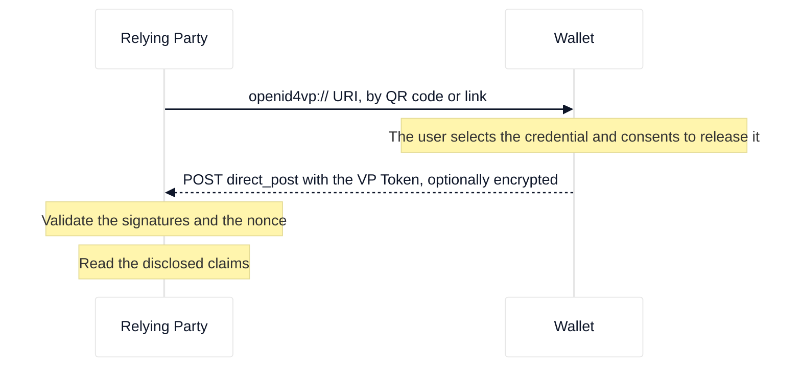
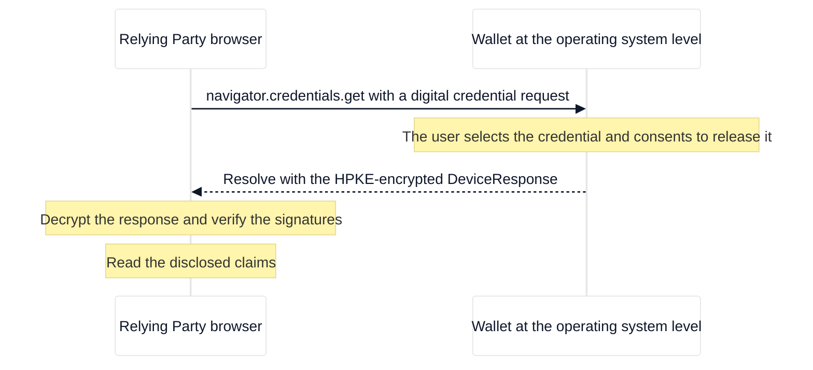

# ISO/IEC 18013-7 — mDoc online presentation

This reference covers ISO/IEC 18013-7, the standard for presenting mobile driving licences (mDLs) and generic mDocs over the internet, and its relationship with the OpenID4VP profiles used in the EUDI ecosystem.

## Overview

ISO/IEC 18013-7 extends the proximity-based protocols of ISO/IEC 18013-5 to remote presentation over the internet. It defines three annexes, each with a different transport and invocation mechanism.

| Annex | Name                            | Transport                          | Wallet adoption           |
| :---- | :------------------------------ | :--------------------------------- | :------------------------ |
| A     | REST API (device retrieval)     | HTTP POST with raw CBOR            | None of the major wallets |
| B     | OpenID4VP (online presentation) | `openid4vp://` URIs, `direct_post` | All major EUDI wallets    |
| C     | W3C Digital Credentials API     | `navigator.credentials.get()`      | All major EUDI wallets    |

> [!NOTE]
> In the France Identité ecosystem and other national mDL deployments, "ISO 18013-7 (Annex B)" is used as an umbrella term for the entire online mDoc presentation flow. Annex C defines the `["dcapi", ...]` CBOR wrapper that carries the DeviceRequest and DeviceResponse inside the browser API. It is the encoding layer, not a standalone profile.

## Annex A: REST API (device retrieval)

Pure HTTP-based remote device retrieval. The verifier sends a CBOR-encoded `DeviceRequest` with an HTTP POST to a wallet endpoint or a proxy server, and receives a CBOR `DeviceResponse` in the HTTP response.

| Aspect           | Detail                                                                                       |
| :--------------- | :------------------------------------------------------------------------------------------- |
| Invocation       | HTTP POST directly to a wallet endpoint or a proxy                                           |
| Request          | CBOR `DeviceRequest` (ISO 18013-5)                                                           |
| Response         | CBOR `DeviceResponse`                                                                        |
| Encryption       | Network-layer session encryption (no standardised protocol)                                  |
| Trust            | No global trust list; the verifier authenticates over TLS                                    |
| Developer effort | CBOR parsing, COSE cryptography, and session key establishment at the network layer          |
| Wallet support   | None. France Identité, EUDI Wallet DE, IT Wallet, and Spanish EUDIW do not implement Annex A |

Implementation status in ewQwe: not implemented. No wallet supports Annex A.

## Annex B: OpenID4VP (online presentation)

Annex B standardises mDoc presentation over the OAuth 2.0 and OpenID Connect framework. The verifier acts as an OAuth 2.0 client and builds an authorization request URI that the wallet processes.

### Flow

<div style="background-color: #ffffff; padding: 18px; border-radius: 8px; border: 1px solid #e2e8f0; margin-bottom: 24px;">



</div>

| Aspect           | Detail                                                                                       |
| :--------------- | :------------------------------------------------------------------------------------------- |
| Invocation       | Universal or deep links (`openid4vp://`), `request_uri` fetch, or an HTTP `direct_post`      |
| Request          | DCQL query (JSON); the legacy Presentation Exchange format is supported as a fallback        |
| Response         | A `vp_token` that carries an mDoc or an SD-JWT, optionally JWE-encrypted (`direct_post.jwt`) |
| Request signing  | JAR (JWT Secured Authorization Request, RFC 9101)                                            |
| Trust model      | The verifier identity is proven by an X.509 certificate or by redirect URI matching          |
| Developer effort | JWT and JWE handling, DCQL evaluation, and OpenID4VP state management                        |
| Wallet support   | All major EUDI wallets                                                                       |

### Profiles that use Annex B

Two profiles use the Annex B transport. See [Protocol modes](../../explanation/openid4vp/protocol-modes.md) for the comparison.

## Annex C: W3C Digital Credentials API (DC API)

Annex C moves the request mechanism into the client-side browser with `navigator.credentials.get()`. The browser and the operating system handle wallet invocation.

### Flow

<div style="background-color: #ffffff; padding: 18px; border-radius: 8px; border: 1px solid #e2e8f0; margin-bottom: 24px;">



</div>

| Aspect           | Detail                                                                                      |
| :--------------- | :------------------------------------------------------------------------------------------ |
| Invocation       | Browser API: `navigator.credentials.get({ digital: ... })`                                  |
| Request payload  | `["dcapi", { nonce, recipientPublicKey }]` plus a CBOR `DeviceRequest`                      |
| Response payload | An HPKE-encrypted mDoc inside `["dcapi", { enc, cipherText }]`                              |
| Encryption       | HPKE (X25519, HKDF-SHA256, AES-128-GCM)                                                     |
| Transport        | The browser and the operating system handle wallet invocation, including cross-device relay |
| Trust model      | Trust is based on web origins and platform-verified app links                               |
| Developer effort | Low. The browser handles wallet discovery and session binding                               |
| Wallet support   | All major EUDI wallets, which wrap the OpenID4VP request as `dc_api.jwt`                    |

### Annex C request format

The request is two base64url-encoded CBOR blobs.

`encryptionInfo` tells the wallet how to encrypt the response:

```text
["dcapi", { nonce: bstr, recipientPublicKey: COSE_Key }]
```

`deviceRequest` states what to present, per ISO 18013-5:

```cbor
{
  "version": "1.0",
  "docRequests": [{
    "docType": "eu.europa.ec.av.1",
    "itemsRequest": {
      "nameSpaces": {
        "eu.europa.ec.av.1": { "age_over_18": true }
      }
    }
  }]
}
```

### Annex C response format

The wallet returns an HPKE-encrypted response:

```json
["dcapi", { "enc": "<base64url>", "cipherText": "<base64url>" }]
```

The relying party decrypts the response with its private key and obtains the CBOR `DeviceResponse`.

## OpenID4VP profiles

Two profiles use the Annex B transport.

- **EU Age Verification (EU-AV) blueprint** — privacy-preserving age checks driven by the Digital Services Act. It uses Annex B as a fallback with the `redirect_uri` scheme, no JAR, and a plain `direct_post`. The primary method is Annex C (DC API).
- **High Assurance Interoperability Profile (HAIP)** — high-security credential exchange for a PID and an mDL. It requires strict JAR signing with X.509 certificates (`x509_san_dns` or `x509_hash`) and JWE-encrypted responses (`direct_post.jwt`).

## References

- [ISO/IEC 18013-5:2021](https://www.iso.org/standard/69084.html) — mDL data model
- [ISO/IEC 18013-7:2025](https://www.iso.org/standard/91154.html) — mDoc online presentation
- [OpenID4VP 1.0](https://openid.net/specs/openid-4-verifiable-presentations-1_0.html)
- [Full reference list](../../references.md)
