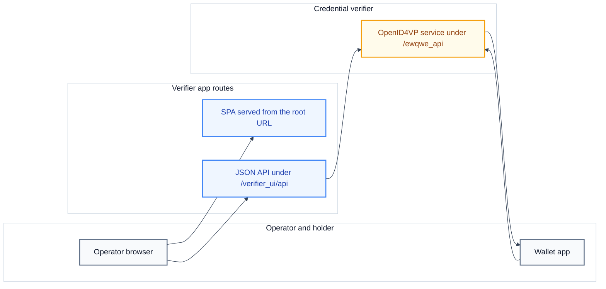

# The verifier app

The verifier app is a web application that the credential verifier serves. It gives an operator a browser interface to start credential verification transactions and to read their results. The app has two parts: a single-page application (SPA) and a JSON API. The credential verifier serves the SPA from the root URL (`/`) and mounts the JSON API under `/verifier_ui/api`.

An operator signs in, selects a credential type, and shows a QR code. The holder scans the QR code with a wallet. The wallet sends a verifiable presentation to the credential verifier. A verifiable presentation is a signed set of credential claims that the holder chooses to share. The verifier app polls the transaction and shows the result.

<div style="background-color: #ffffff; padding: 18px; border-radius: 8px; border: 1px solid #e2e8f0; margin-bottom: 24px;">



</div>

## Relation to the credential verifier

The verifier app runs inside the credential verifier process. The crate `crates/ewqwe-credential-verifier-ui/` holds the routes, the user store, the locale files, and the SPA sources. The credential verifier:

- mounts the app routes under the `/verifier_ui/api` scope;
- serves the SPA from the directory named by `ui_dist_path`;
- shares its OpenID4VP service with the app, so that the app can start wallet transactions;
- writes journal entries for successful verifications.

The app is disabled when the `[verifier_ui]` section is absent from the server configuration file. When the section is present, the app is enabled unless `enabled = false`. When the app is disabled, every `/verifier_ui/api` route returns 404 and the server does not serve the SPA. See [Credential verifier configuration](../credential-verifier/configuration.md).

## HTTP routes

All routes use JSON request and response bodies. A POST or PUT request must send `Content-Type: application/json`. Sessions use an `HttpOnly` session cookie. In the table, `{id}` is a transaction identifier or a user identifier, depending on the route.

| Method | Path                                | Access  | Description                                               |
| :----- | :---------------------------------- | :------ | :-------------------------------------------------------- |
| GET    | `/verifier_ui/api/setup/status`     | public  | Report whether the first administrator exists.            |
| POST   | `/verifier_ui/api/setup/bootstrap`  | public  | Create the first administrator account.                   |
| POST   | `/verifier_ui/api/auth/login`       | public  | Sign in and set the session cookie.                       |
| POST   | `/verifier_ui/api/auth/logout`      | session | End the session.                                          |
| GET    | `/verifier_ui/api/auth/me`          | session | Return the signed-in user profile.                        |
| GET    | `/verifier_ui/api/settings`         | public  | Return the app name, the logo URL, and the allowed types. |
| POST   | `/verifier_ui/api/qr/generate`      | session | Start a transaction and return a QR code.                 |
| GET    | `/verifier_ui/api/qr/{id}/status`   | session | Return the status of a transaction.                       |
| GET    | `/verifier_ui/api/admin/users`      | admin   | List user accounts.                                       |
| POST   | `/verifier_ui/api/admin/users`      | admin   | Create a user account.                                    |
| PUT    | `/verifier_ui/api/admin/users/{id}` | admin   | Update a user account.                                    |
| DELETE | `/verifier_ui/api/admin/users/{id}` | admin   | Delete a user account.                                    |
| GET    | `/verifier_ui/api/admin/journal`    | admin   | List journal entries for the app users.                   |
| PUT    | `/verifier_ui/api/admin/settings`   | admin   | Update the display settings.                              |
| GET    | `/verifier_ui/api/i18n`             | public  | Return locale strings for one language.                   |
| GET    | `/`                                 | public  | Serve the SPA entry page.                                 |
| GET    | `/assets/*`                         | public  | Serve the bundled JavaScript and CSS assets.              |
| GET    | `/logo.png`                         | public  | Serve the logo image.                                     |

### Start a transaction

`POST /verifier_ui/api/qr/generate` accepts an optional body:

```json
{
  "credential_type": "proof-of-age"
}
```

The `credential_type` value is `proof-of-age` (the default), `mdl`, or `national-id`. The response contains the QR code and the identifiers that the app uses to poll the transaction:

```json
{
  "transaction_id": "...",
  "qr_code_data_url": "data:image/png;base64,...",
  "authorization_request_uri": "openid4vp://...",
  "expires_in": 300
}
```

### Poll a transaction

`GET /verifier_ui/api/qr/{id}/status` returns the transaction status:

```json
{
  "status": "pending",
  "expires_in": 287
}
```

| Status     | Meaning                                  |
| :--------- | :--------------------------------------- |
| `pending`  | The wallet has not scanned the code.     |
| `scanned`  | The wallet received the request.         |
| `verified` | The credential passed verification.      |
| `failed`   | The credential failed verification.      |
| `expired`  | The transaction passed its time to live. |

When the verifier app verifies the presentation in process, a `verified` response also contains `age_over_18`, and a `failed` response contains `errors`.

## Configuration

The `[verifier_ui]` section of the server configuration file controls the app. A path resolves relative to the directory that contains the configuration file.

| Key                        | Type             | Default                  | Description                                   |
| :------------------------- | :--------------- | :----------------------- | :-------------------------------------------- |
| `enabled`                  | boolean          | `true` when present      | Serve the app.                                |
| `app_name`                 | string           | `Verifier App`           | Display name in the header.                   |
| `logo_url`                 | string           | built-in logo            | HTTPS URL or `data:` URL for the header logo. |
| `public_url`               | string           | derived from the request | Base URL for wallet callback URIs.            |
| `allowed_credential_types` | array of strings | all types                | Credential types that this server allows.     |
| `session_secret`           | string           | random key at startup    | Secret for signing session cookies.           |
| `ui_dist_path`             | string           | none                     | Directory that holds the built SPA.           |
| `db`                       | table            | `sqlite_memory`          | User account store.                           |

The `allowed_credential_types` value accepts `proof-of-age`, `mdl`, and `national-id`. An empty list allows all types. The `session_secret` value must contain at least 8 characters. When the value is absent, the server generates a random key, and every server restart ends all active sessions.

### Database backends

The app stores user accounts in the backend named by the `[verifier_ui.db]` table.

| Backend         | Persistence | Extra keys | Use                                       |
| :-------------- | :---------- | :--------- | :---------------------------------------- |
| `sqlite_memory` | none        | none       | Development and testing.                  |
| `sqlite_file`   | file        | `path`     | A single instance with persistence.       |
| `postgres`      | server      | `url`      | Multiple instances and high availability. |
| `mysql`         | server      | `url`      | MySQL and MariaDB installations.          |

## Roles

| Role       | Permissions                                       |
| :--------- | :------------------------------------------------ |
| `admin`    | User management, settings, journal, and QR codes. |
| `verifier` | QR code generation and status polling.            |

The first account that `setup/bootstrap` creates is an administrator with `is_superadmin = true`. A superadmin cannot be deleted through the interface. A password must contain at least 12 characters.

Each user can also have a list of allowed credential types. An empty list means that the user inherits the server setting. A user restriction narrows the server setting; it never widens it.

## Credential types and profiles

The credential type selects the OpenID4VP profile and the credential namespace. A namespace groups the claims of one credential format.

| Credential type | Profile                       | Namespace                 |
| :-------------- | :---------------------------- | :------------------------ |
| `proof-of-age`  | Annex A (EU age verification) | `eu.europa.ec.av.1`       |
| `mdl`           | HAIP                          | `org.iso.18013.5.1.mDL`   |
| `national-id`   | HAIP                          | `eu.europa.ec.eudi.pid.1` |

See [Protocol modes](../../explanation/openid4vp/protocol-modes.md) and [Credential types](../digital-credential/credential-types.md).

## Languages

`GET /verifier_ui/api/i18n?lang={code}` returns the locale strings for the requested language. The app detects the browser language and uses the closest supported language. A user can override the language on the Settings page. The browser stores the preference under the key `verifier_ui_lang`.

| Code | Language |
| :--- | :------- |
| `en` | English  |
| `de` | German   |
| `fr` | French   |
| `it` | Italian  |
| `es` | Spanish  |
| `sv` | Swedish  |
| `pl` | Polish   |
| `cs` | Czech    |
| `hr` | Croatian |

## Related pages

- [Run the verifier app](../../tutorials/verifier-app/run-the-verifier-app.md)
- [Credential verifier configuration](../credential-verifier/configuration.md)
- [HTTP API](../credential-verifier/http-api.md)
- [Verification journal](../credential-verifier/verification-journal.md)
- [Protocol modes](../../explanation/openid4vp/protocol-modes.md)
