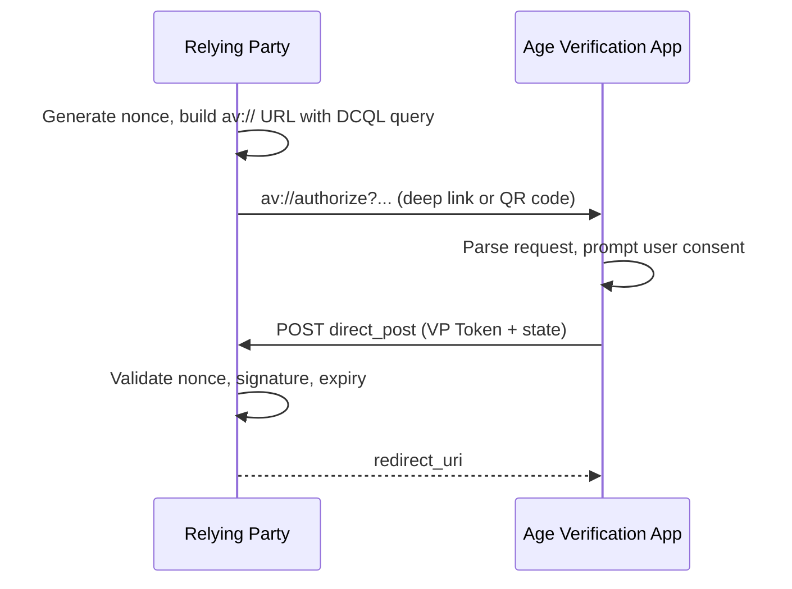

# Age Verification: OpenID4VP Fallback

This page describes the **OpenID4VP** fallback used for age verification when the W3C Digital Credentials API is unavailable, per the **EU Age Verification Profile Annex A, Section A.5**.

## When to use the fallback

The W3C DC API is the primary method, but:
- Browser support is still limited
- It may be disabled by user preference or enterprise policy
- On mobile, production wallets (as of mid-2026) reject the `openid4vp` protocol identifier inside the DC API handler

When the DC API is unavailable, the Relying Party falls back to OpenID4VP via `av://` deep links or QR codes.

## Flow



## Key Requirements (per [Annex A.5](https://ageverification.dev/av-doc-technical-specification/docs/annexes/annex-A/annex-A-av-profile/))

| Parameter | Value | Source |
|-----------|-------|--------|
| URL scheme | `av://` | A.5 §Custom URL Scheme |
| `response_type` | `vp_token` | A.5 §Response Type |
| `response_mode` | `direct_post` | A.5 §Response Mode |
| `client_id_scheme` | `redirect_uri` | A.5 §Client Identifier Scheme |
| Request format | Plain query params (no JAR) | A.5 §Request Signing (explicitly excluded) |
| Query format | DCQL | A.5 §DCQL Query |
| `nonce` | Required | A.5 §Nonce Parameter |

### Explicitly out of scope

- **JAR** (signed Authorization Requests) — not required
- **JWE** encrypted responses (`direct_post.jwt`) — TLS is sufficient
- **Trust lists of RPs** — no pre-registration
- **`x509_san_dns` / `verifier_attestation`** — these depend on trust lists

## Example Authorization Request

```
av://authorize?
  response_type=vp_token
  &response_mode=direct_post
  &client_id=redirect_uri%3Ahttps%3A%2F%2Frp.example.com%2Fcallback
  &response_uri=https%3A%2F%2Frp.example.com%2Fcallback
  &nonce=n-0S6_WzA2Mj
  &dcql_query=%7B%22credentials%22%3A%5B%7B%22id%22%3A%22proof_of_age%22%2C%22format%22%3A%22mso_mdoc%22%2C%22meta%22%3A%7B%22doctype_value%22%3A%22eu.europa.ec.av.1%22%7D%2C%22claims%22%3A%5B%7B%22path%22%3A%5B%22eu.europa.ec.av.1%22%2C%22age_over_18%22%5D%7D%5D%7D%5D%7D
```

Decoded `dcql_query`:

```json
{
  "credentials": [{
    "id": "proof_of_age",
    "format": "mso_mdoc",
    "meta": { "doctype_value": "eu.europa.ec.av.1" },
    "claims": [{ "path": ["eu.europa.ec.av.1", "age_over_18"] }]
  }]
}
```

## Handling the Response

The wallet POSTs to `response_uri` with `application/x-www-form-urlencoded`:

| Field | Description |
|-------|-------------|
| `vp_token` | Base64url-encoded DeviceResponse (mDoc CBOR) |
| `state` | Client-managed state (if provided) |

The RP extracts claims from the `vp_token`, validates the nonce binding, and verifies the issuer signature against the trusted CA directory.

## Security

- **Nonce**: Generate a fresh, cryptographically random nonce per request. Store it server-side. Reject presentations with a missing or incorrect nonce.
- **HTTPS**: `response_uri` must use HTTPS in production.
- **Data minimization**: Request only `age_over_18` — avoid name, address, portrait, or other identifying attributes.

## Comparison with HAIP

| Feature | Age Verification (Annex A) | HAIP (EUDI Wallet) |
|---------|---------------------------|---------------------|
| Client ID scheme | `redirect_uri` | `x509_san_dns`, `x509_hash` |
| Signed request (JAR) | Not required | Required |
| Response mode | `direct_post` | `direct_post.jwt` (JWE) |
| Trust model | TLS + Web PKI | Reader Trust Store + cert validation |
| Target wallet | Age Verification App | EUDI Wallet |

For full details on HAIP, see the [Protocols & Formats Summary](../summary_protocols_formats.md) and the [Relying Party Requirements](../eudi_wallet/relying_party_requirements.md).

## References

- [EU Age Verification Profile — Annex A.5](https://ageverification.dev/av-doc-technical-specification/docs/annexes/annex-A/annex-A-av-profile/)
- [OpenID4VP 1.0](https://openid.net/specs/openid-4-verifiable-presentations-1_0.html)
- [DCQL Queries](./dcql_age_verification.md)
