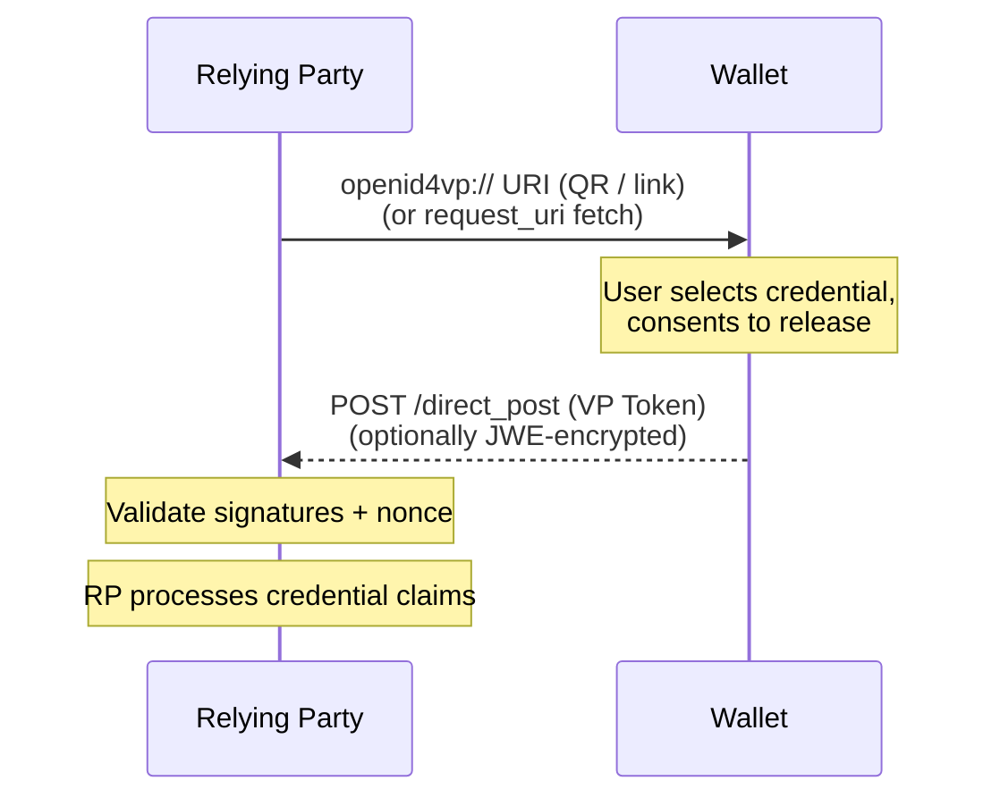
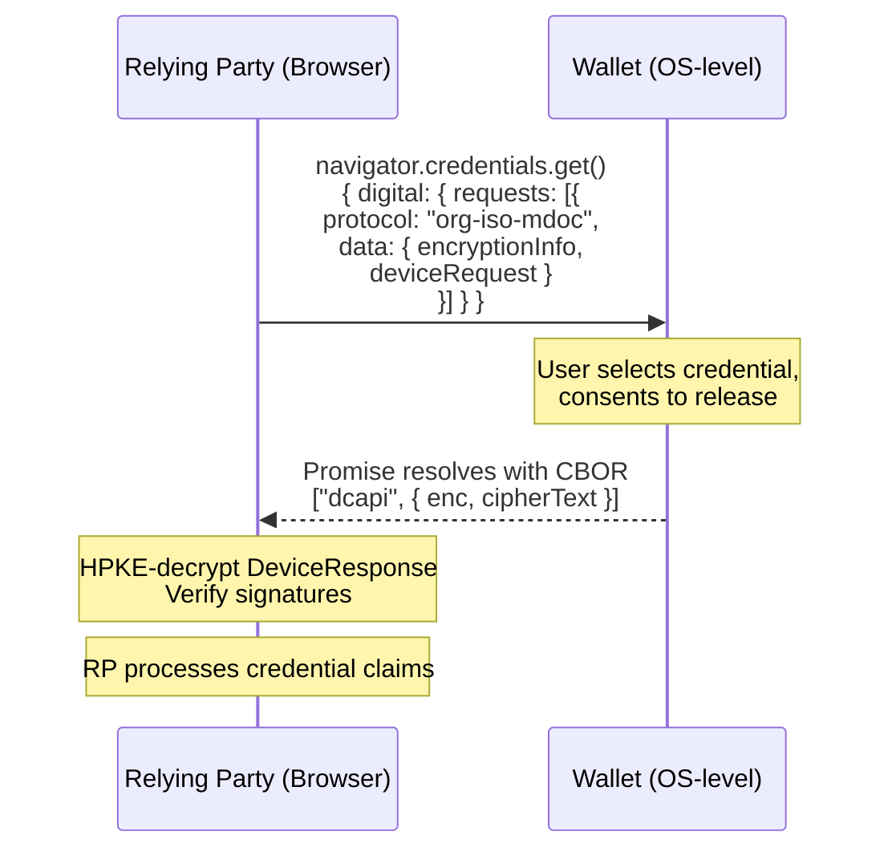

# ISO/IEC 18013-7 — mDoc Online Presentation

This reference covers ISO/IEC 18013-7, the standard for presenting mobile driving licences (mDLs) and generic mDocs over the internet, and its relationship with the OpenID4VP profiles used in the EUDI ecosystem.

---

## Overview

ISO/IEC 18013-7 extends the proximity-based protocols of ISO/IEC 18013-5 to **remote presentation** over the internet. It defines three annexes, each with a different transport and invocation mechanism:

| Annex | Name | Transport | Wallet Adoption |
|-------|------|-----------|-----------------|
| **Annex A** | REST API (Device Retrieval) | HTTP POST with raw CBOR | ❌ None of the major EUDI wallets |
| **Annex B** | OpenID4VP (Online Presentation) | `openid4vp://` URIs, `direct_post` | ✅ All major EUDI wallets |
| **Annex C** | W3C Digital Credentials API | `navigator.credentials.get()` | ✅ All major EUDI wallets |

> **Terminology note:** In the France Identité ecosystem and other national mDL deployments, "ISO 18013-7 (Annex B)" is used as an umbrella term for the entire online mDoc presentation flow. Annex C defines the `["dcapi", ...]` CBOR wrapper that carries the DeviceRequest/DeviceResponse inside the browser API — it is the encoding layer, not a standalone profile.

---

## Annex A: REST API (Device Retrieval)

Pure HTTP-based remote device retrieval: the verifier sends a CBOR-encoded `DeviceRequest` via HTTP POST to a wallet endpoint or proxy server, and receives a CBOR `DeviceResponse` in the HTTP response.

| Aspect | Detail |
|--------|--------|
| **Invocation** | HTTP POST directly to wallet endpoint or proxy |
| **Request** | CBOR `DeviceRequest` (ISO 18013-5) |
| **Response** | CBOR `DeviceResponse` |
| **Encryption** | Network-layer session encryption (no standardised protocol) |
| **Trust** | No global trust list; verifier authenticates via TLS |
| **Developer impact** | Requires CBOR parsing, COSE cryptography, and session key establishment at network layer |
| **Wallet support** | **None** — France Identité, EUDI Wallet DE, IT Wallet, Spanish EUDIW do not implement Annex A |

**Implementation status in ewQwe:** ❌ Not implemented. No wallet supports Annex A; the standard is not used by any major EUDI wallet.

---

## Annex B: OpenID4VP (Online Presentation)

Standardises mDoc presentation over the OAuth 2.0 / OpenID Connect framework. The verifier acts as an OAuth 2.0 client, building an Authorization Request URI that the wallet processes.

### Flow



| Aspect | Detail |
|--------|--------|
| **Invocation** | Universal / deep links (`openid4vp://`), `request_uri` fetch, HTTP `direct_post` |
| **Request** | DCQL query (JSON); legacy PEX supported as fallback |
| **Response** | `vp_token` containing mDoc or SD-JWT, optionally JWE-encrypted (`direct_post.jwt`) |
| **Request signing** | JAR (JWT Secured Authorization Request, RFC 9101) |
| **Trust model** | Verifier identity verified via X.509 certificates or redirect URI matching |
| **Developer impact** | Requires JWT/JWE handling, DCQL evaluation, OpenID4VP state management |
| **Wallet support** | **All major EUDI wallets** |

### Profiles Using Annex B

Two profiles use Annex B transport — see [OpenID4VP Profiles](#openid4vp-profiles) below.

---

## Annex C: W3C Digital Credentials API (DC API)

Moves the request mechanism into the client-side browser using `navigator.credentials.get()`. The browser and OS handle wallet invocation.

### Flow



| Aspect | Detail |
|--------|--------|
| **Invocation** | Browser API: `navigator.credentials.get({ digital: ... })` |
| **Request payload** | `["dcapi", { nonce, recipientPublicKey }]` + CBOR `DeviceRequest` |
| **Response payload** | HPKE-encrypted mDoc inside `["dcapi", { enc, cipherText }]` |
| **Encryption** | HPKE (X25519 + HKDF-SHA256 + AES-128-GCM) |
| **Transport** | Browser/OS handles wallet invocation; BLE proximity checks + relay servers for cross-device |
| **Trust model** | Trust based on web origins and platform-verified App Links |
| **Developer impact** | Minimal — browser handles wallet discovery and session binding |
| **Wallet support** | **All major EUDI wallets** (wraps OpenID4VP request as `dc_api.jwt`) |

### Annex C Request Format

The request is two base64url-encoded CBOR blobs:

**`encryptionInfo`** — tells the wallet how to encrypt the response:
```
["dcapi", { nonce: bstr, recipientPublicKey: COSE_Key }]
```

**`deviceRequest`** — what to present, per ISO 18013-5:

```cbor
{
  "version": "1.0",
  "docRequests": [{
    "docType": "eu.europa.ec.av.1",
    "itemsRequest": {
      "nameSpaces": {
        "eu.europa.ec.av.1": { "age_over_18": true }
      }
    }
  }]
}
```

### Annex C Response Format

The wallet returns an HPKE-encrypted response:

```json
["dcapi", { enc: bstr, cipherText: bstr }]
```

The RP HPKE-decrypts using its private key to obtain the CBOR `DeviceResponse`.

---

## OpenID4VP Profiles

Two profiles use Annex B transport. For a detailed comparison see the [Protocols & Formats Summary](../summary_protocols_formats.md).

- **EU Age Verification (EU-AV) Blueprint** — privacy-preserving age checks driven by the DSA. Uses Annex B as a fallback with `redirect_uri` scheme, no JAR, plain `direct_post`. The primary method is Annex C (DC API).
- **High Assurance Interoperability Profile (HAIP)** — high-security credential exchange for PID and mDL. Requires strict JAR signing with X.509 certificates (`x509_san_dns` or `x509_hash`), and JWE-encrypted responses (`direct_post.jwt`).

## References

- [ISO/IEC 18013-5:2021](https://www.iso.org/standard/69084.html) — mDL data model
- [ISO/IEC 18013-7:2025](https://www.iso.org/standard/91154.html) — mDoc online presentation
- [OpenID4VP 1.0](https://openid.net/specs/openid-4-verifiable-presentations-1_0.html)
- [Full reference list](./references.md)
