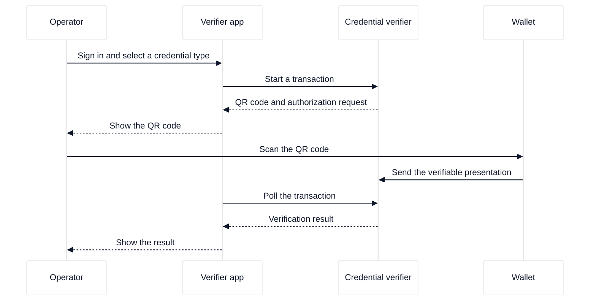

# Run the verifier app

The credential verifier ships with its own web application, the **verifier app**. This tutorial builds that application, enables it, starts the server, and signs in as the first administrator. At the end, the verifier app shows the control page with the credential type selector and the **Generate QR Code** button.

The verifier app is the standard user interface of the credential verifier. Use it to start credential verification transactions and to read their results. The verifier also exposes an HTTP API, so you can build a user interface of your own. That path is described in [Develop your own relying-party UI](../../how-to-guides/credential-verifier/develop-a-relying-party-ui.md) and is not needed for this tutorial.

## What you need

- A working credential verifier with TLS. See [Install and run the server](../../how-to-guides/credential-verifier/install-and-run.md).
- Node.js 18 or later, to build the single-page application.
- An email address and a password of at least 12 characters for the first administrator.

## How the verifier app works

The verifier app has two parts: a single-page application (SPA) that the server serves from the root URL, and a JSON API that the server mounts under `/verifier_ui/api`. An operator signs in, selects a credential type, and shows a QR code. The holder scans the QR code with a wallet, and the wallet sends a verifiable presentation to the credential verifier. The verifier app polls the transaction and shows the result.

A verifiable presentation is a signed set of credential claims that the holder chooses to share. A transaction is one credential request and its result.

<div style="background-color: #ffffff; padding: 18px; border-radius: 8px; border: 1px solid #e2e8f0; margin-bottom: 24px;">



</div>

## Steps

### 1. Build the single-page application

```bash
cd crates/ewqwe-credential-verifier-ui/ui
pnpm install
pnpm build
```

Expected: the build writes the SPA to `crates/ewqwe-credential-verifier-ui/ui/dist/`. Confirm the output:

```bash
ls crates/ewqwe-credential-verifier-ui/ui/dist
```

Expected: `index.html` and an `assets` directory.

### 2. Enable the app

Open the server configuration file and add this section:

```toml
[verifier_ui]
enabled = true
app_name = "My Age Verifier"
ui_dist_path = "../crates/ewqwe-credential-verifier-ui/ui/dist"
```

The path in `ui_dist_path` resolves relative to the directory that holds the configuration file. When the file is `credential_verifier/credential-server.toml`, the value above points at the build output from step 1. See [the verifier app reference](../../reference/verifier-app/verifier-app.md) for every key.

### 3. Start the credential verifier

```bash
cd credential_verifier
RUST_LOG=info cargo run --release
```

Expected: the log shows `Verifier App store enabled` and `Attestation Provider server listening on 0.0.0.0:9443`. Leave the process running.

### 4. Create the first administrator

Open `https://localhost:9443/` in a browser. The server uses a self-signed certificate, so the browser shows a warning. Accept the certificate and continue.

Because no user account exists yet, the app shows the bootstrap form. Enter an email address and a password of at least 12 characters, then submit the form.

Expected: the app signs you in and shows the control page with the **Generate QR Code** button. The bootstrap route accepts only the first call; every later call returns `409 Conflict`.

## What happened

The server built the SPA once, in step 1, and serves the built files. In step 3 it mounted the app under `/verifier_ui/api` and enabled the app because the configuration file contains a `[verifier_ui]` section. In step 4 the app created the first account, stored the account in the user database, and set a session cookie.

The default user database is SQLite in memory, so the account disappears when the server stops. To keep accounts across restarts, configure the database and the session secret. See [Configure the verifier app](../../how-to-guides/verifier-app/configure-the-verifier-app.md).

## Troubleshooting

| Symptom                                    | Cause                                       | Action                                                               |
| :----------------------------------------- | :------------------------------------------ | :------------------------------------------------------------------- |
| Every `/verifier_ui/api` route returns 404 | The app is disabled.                        | Add the `[verifier_ui]` section with `enabled = true`, then restart. |
| The root URL returns 404 or a blank page   | The SPA is not built, or the path is wrong. | Build the SPA and correct `ui_dist_path`. Check the server log.      |
| Bootstrap returns `409 Conflict`           | An administrator already exists.            | Sign in instead of bootstrapping a second administrator.             |
| The session ends after each restart        | `session_secret` is not set.                | Set a stable `session_secret` value.                                 |

## Next steps

- [Complete an age verification](./complete-an-age-verification.md)
- [Configure the verifier app](../../how-to-guides/verifier-app/configure-the-verifier-app.md)
- [The verifier app reference](../../reference/verifier-app/verifier-app.md)
