# Complete an age verification

This tutorial completes two age verifications with the demo webapp: one cross-device verification and one same-device verification. A cross-device verification uses a wallet on a second device. A same-device verification uses a wallet on the same device as the browser.

```mermaid
%%{init: {'theme': 'base', 'themeVariables': { 'background': '#ffffff', 'mainBkg': '#ffffff', 'clusterBkg': '#ffffff', 'clusterBorder': '#cbd5e1', 'lineColor': '#334155', 'primaryColor': '#ffffff', 'secondaryColor': '#ffffff', 'tertiaryColor': '#ffffff', 'primaryTextColor': '#0f172a', 'secondaryTextColor': '#0f172a', 'tertiaryTextColor': '#0f172a', 'edgeLabelBackground': '#ffffff' }}}%%
flowchart TB
    subgraph CROSS["Cross-device verification"]
        direction LR
        SP1[" "]
        RP1["Demo webapp shows a QR code"]
        W1["Wallet on a mobile device scans the QR code"]
        SP1 ~~~ RP1
        RP1 --> W1
    end
    subgraph SAME["Same-device verification"]
        direction LR
        SP2[" "]
        RP2["Demo webapp shows a deep-link button"]
        W2["Wallet app on the same device opens"]
        SP2 ~~~ RP2
        RP2 --> W2
    end
    classDef cMgmt fill:#eff6ff,stroke:#3b82f6,stroke-width:2px,color:#1e40af;
    classDef cExt fill:#f8fafc,stroke:#64748b,stroke-width:2px,color:#0f172a;
    class RP1,RP2 cMgmt;
    class W1,W2 cExt;
    style SP1 fill:none,stroke:none
    style SP2 fill:none,stroke:none
```

## What you need

- The running demo environment from [Run the demo webapp](./run-the-demo-webapp.md).
- A wallet on a mobile device or on the Android emulator. The wallet must support the EU Age Verification Profile (Annex A). See [Test with the age verification app](../../how-to-guides/credential-verifier/test-with-the-av-app.md).
- For the same-device part, a mobile browser on the same device as the wallet.

## Part 1: cross-device verification

In this part, the wallet is on a second device.

### 1. Open the demo webapp

Open `https://localhost:5174/`.

### 2. Select the credential type

Click **Proof of Age**. This credential type uses the Annex A profile.

Expected: the button becomes active, and the profile area shows the profile and the credential format of the selection.

### 3. Select the protocol

In the **Protocol** dropdown, select **OpenID4VP (Cross-Device / QR Code)**.

### 4. Request the credential

Click **Request Credentials**.

Expected: a modal titled **Scan with your Wallet** opens. The modal shows a QR code and a badge that reads **Annex A**. The text below the title names the wallet.

The webapp asked the credential verifier to start a transaction. The credential verifier built an authorization request and returned a QR code. The webapp now polls the transaction every 2 seconds.

### 5. Scan the QR code

On the wallet device, open the wallet and scan the QR code.

### 6. Approve the request

Review the request in the wallet and approve the credential sharing.

Expected: the modal closes when the webapp receives the credential. The webapp then sends the credential to the credential verifier.

### 7. Read the result

Expected: the page moves to the **Verification Result** section. A successful result reads **Verification Successful** and lists the verified claims. For example, the result shows that `age_over_18` is true.

The credential verifier validated the credential and returned the result through the webapp API server. See [The verification process](../../explanation/credential-verifier/verification-process.md).

## Part 2: same-device verification

In this part, the browser and the wallet are on the same device.

### 1. Open the demo webapp on the mobile device

On the device that holds the wallet, open the demo webapp in the mobile browser. Use the address that the device can reach, for example `https://{host}:5174/`. Accept the self-signed certificate.

### 2. Select the credential type and the protocol

Click **Proof of Age**. In the **Protocol** dropdown, select **OpenID4VP (Same-Device / Deep Link)**.

### 3. Request the credential

Click **Request Credentials**.

Expected: a modal titled **Open Wallet App** opens. The modal contains the button **Open EUDI Wallet** and the text **Waiting for response from wallet**.

### 4. Open the wallet

Click **Open EUDI Wallet**. The browser opens the wallet app through a deep link. A deep link is a URL that opens an application instead of a web page.

### 5. Approve the request

Approve the credential sharing in the wallet.

### 6. Return to the browser and read the result

Switch back to the browser.

Expected: the modal closes, and the **Verification Result** section reads **Verification Successful** with the verified claims.

The wallet sent the credential to the credential verifier. The webapp polled the transaction and displayed the result.

## Troubleshooting

| Symptom                                      | Cause                                     | Action                                                            |
| :------------------------------------------- | :---------------------------------------- | :---------------------------------------------------------------- |
| The QR code does not scan                    | The image is small, or the camera is far. | Increase the window size, or use the **Copy Link** button.        |
| The transaction expires                      | The wallet did not answer in 300 seconds. | Generate a new request and try again.                             |
| The wallet reports an error                  | The wallet rejected the request.          | Check that the wallet supports the selected profile.              |
| The result reports a failure                 | The credential failed verification.       | Read the error details in the result section.                     |
| The **Open EUDI Wallet** button does nothing | No wallet app handles the deep link.      | Install a wallet app on the device, or use the cross-device flow. |

> [!NOTE]
> The demo credentials contain test data. A production verifier can reject a demo credential with a signature error. The result section then shows the failure instead of the verified claims.

## Next steps

- [Present a stored credential from the demo wallet extension](../wallet-extension/present-a-stored-credential.md)
- [Protocol modes](../../explanation/openid4vp/protocol-modes.md)
