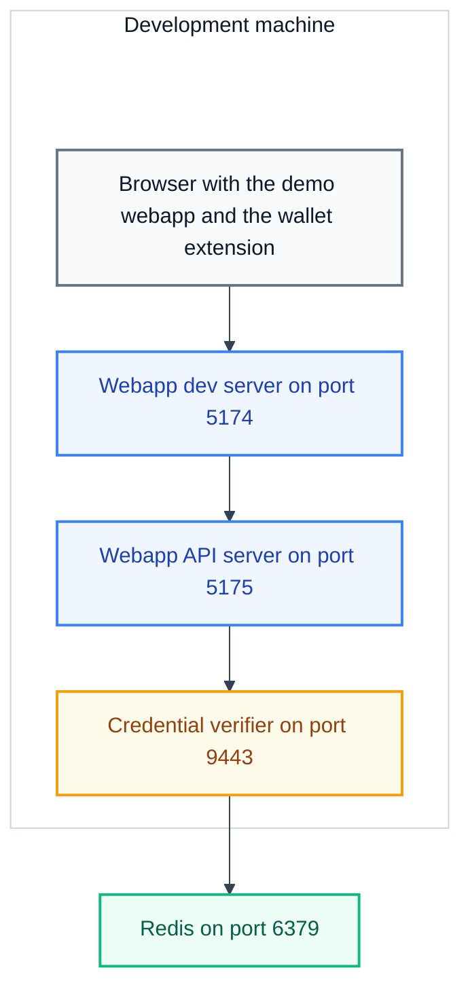

# Run the demo webapp

This tutorial brings up the demo environment. It starts Redis, the credential verifier, the webapp API server, and the demo webapp. At the end, the demo webapp shows a verification request and the demo wallet is loaded.

A demo webapp is also called a relying party. A relying party asks a wallet for a credential, and then sends the credential to the credential verifier. The credential verifier checks the credential and returns the result.

<div style="background-color: #ffffff; padding: 18px; border-radius: 8px; border: 1px solid #e2e8f0; margin-bottom: 24px;">



</div>

## What you need

- A Rust toolchain, from `rustup`.
- Deno 1.40 or later.
- Node.js 18 or later.
- Redis.
- OpenSSL.
- Google Chrome or a Chromium-based browser.
- The repository on your computer.

## Steps

### 1. Start Redis

```bash
redis-server
```

Leave the process running. In a second terminal, check that Redis answers:

```bash
redis-cli ping
```

Expected: `PONG`.

The credential verifier stores each OpenID4VP transaction in Redis. An OpenID4VP transaction is one credential request and its result. Redis removes a transaction when its time to live ends. This tutorial sets the time to live to 300 seconds.

### 2. Generate the development certificates

The credential verifier serves HTTPS. Generate the certificates that the demo uses:

```bash
cd certificates/tls
./generate_tls_certs.sh
cd ../signer
./generate_signer_certs.sh
```

Expected: both scripts print the list of files that they wrote. The TLS script writes `ewqwe.server.cert.pem`, `ewqwe.server.key.pem`, and `ewqwe.ca.pem` in `certificates/tls/`. The signer script writes `ewqwe.signer.leaf.fullchain.pem` and `ewqwe.signer.leaf.key.pem` in `certificates/signer/`.

The TLS script creates a self-signed certificate authority and a server certificate. The signer script creates the key that signs the HAIP authorization requests.

### 3. Create the credential verifier configuration

```bash
cd credential_verifier
```

Create the file `credential-server.toml` with this content:

```toml
host_name = "0.0.0.0"
host_port = 9443
default_username = "demo-user"

disable_authentication = true
disabled_authentication_user = "demo-user"

[tls_params]
server_private_key = "../certificates/tls/ewqwe.server.key.pem"
server_certificate = "../certificates/tls/ewqwe.server.cert.pem"
server_ca_chain = "../certificates/tls/ewqwe.ca.pem"
client_ca_cert_chain = "../certificates/tls/ewqwe.ca.pem"

[openid4vp_config]
transaction_ttl_secs = 300

[openid4vp_config.transaction_store]
backend = "redis"
url = "redis://127.0.0.1:6379"

[openid4vp_config.haip_config]
x509_cert_path = "../certificates/signer/ewqwe.signer.leaf.fullchain.pem"
x509_key_path = "../certificates/signer/ewqwe.signer.leaf.key.pem"
```

A path in this file resolves relative to the file. The verifier loads this file when you start it from the `credential_verifier` directory.

The `disable_authentication = true` value lets the demo webapp call the verifier without a client certificate. Use this value only in a local test environment. See [Credential verifier configuration](../../reference/credential-verifier/configuration.md) and [TLS authentication](../../reference/credential-verifier/tls-authentication.md).

### 4. Start the credential verifier

```bash
RUST_LOG=info cargo run --features openssl
```

The first build takes several minutes. Expected: the log ends with `Attestation Provider server listening on 0.0.0.0:9443`. Leave the process running.

### 5. Check the credential verifier

In a new terminal:

```bash
curl -k https://127.0.0.1:9443/version
```

Expected: a JSON object with the server version. The `-k` option tells curl to accept the self-signed certificate.

### 6. Start the webapp API server

The demo webapp has two processes. The API server forwards every `/ewqwe_api/` request to the credential verifier.

```bash
cd webapp
CA_CERT_PATH=../certificates/tls/ewqwe.ca.pem deno task api
```

Expected: the log shows `Starting webapp proxy server on port 5175` and `Credential Verifier URL: https://127.0.0.1:9443`. Leave the process running.

The `CA_CERT_PATH` value names the certificate authority that the API server trusts. The server reads the file again on each connection, so a later certificate change takes effect without a restart.

### 7. Start the demo webapp

```bash
cd webapp
deno task vite
```

Expected: Vite prints a local address, `https://localhost:5174/`. Leave the process running.

The Vite dev server serves the webapp and forwards each `/ewqwe_api/` request to the API server on port 5175.

### 8. Load the demo wallet extension

Follow [Install the demo wallet extension](../wallet-extension/install-the-demo-wallet-extension.md). The demo wallet stores the credentials that the demo webapp requests.

### 9. Open the demo webapp

Open `https://localhost:5174/` in your browser. The webapp uses a self-signed certificate, so the browser shows a warning. Accept the certificate and continue.

Expected: the page shows a **Request Credentials** card with these parts:

- a **Credential Type** row with the buttons Proof of Age, Mobile Driver's License, National ID, and Health ID;
- a **Requested Claims** list;
- a **Protocol** dropdown;
- a **Request Credentials** button.

This is the first result. The webapp has already built a verification request from the default settings. Click **Show Request JSON** to read the OpenID4VP request that the webapp will send.

## Verification checklist

- Redis answers `PONG`.
- The credential verifier listens on port 9443.
- The webapp API server listens on port 5175.
- The webapp answers at `https://localhost:5174/`.
- The demo wallet extension is loaded in the browser.

## Troubleshooting

| Symptom                                         | Cause                                 | Action                                                           |
| :---------------------------------------------- | :------------------------------------ | :--------------------------------------------------------------- |
| The webapp cannot reach the credential verifier | The API server does not trust the CA. | Set `CA_CERT_PATH` to the generated `ewqwe.ca.pem`.              |
| Redis connection errors                         | Redis is not running.                 | Start `redis-server` and check `redis-cli ping`.                 |
| Port 5174, 5175, or 9443 is in use              | Another process uses the port.        | Stop the other process, or change the port in the configuration. |
| The browser blocks the webapp page              | The self-signed certificate.          | Accept the certificate for `https://localhost:5174/`.            |

## Next steps

- [Complete an age verification](./complete-an-age-verification.md)
- [Present a stored credential from the demo wallet extension](../wallet-extension/present-a-stored-credential.md)
