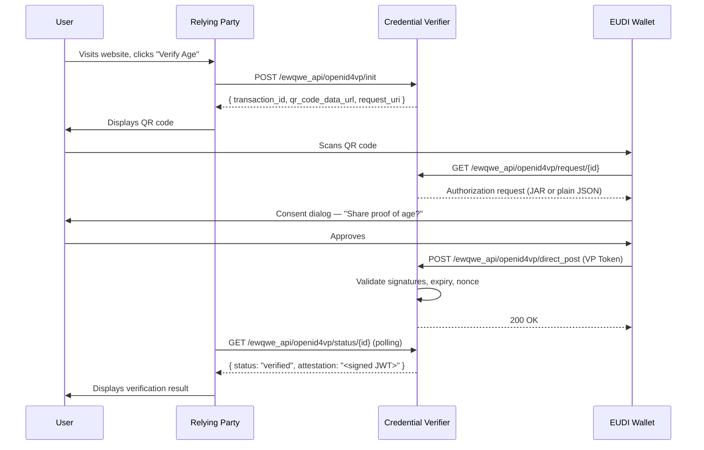

# User Journey

This page describes the end-to-end credential verification flow from the perspective of a Relying Party.

## The Two Profiles

The EU Digital Identity ecosystem defines two main profiles:

| Profile | Purpose | Transport | Request Signing | Response |
|---------|---------|-----------|-----------------|----------|
| **EU Age Verification** (Annex A) | Privacy-preserving age checks | `openid4vp://` deep link or QR, `direct_post` | None (`redirect_uri` scheme) | Plain VP Token |
| **HAIP** | High-assurance identity (PID, mDL) | `openid4vp://` deep link or QR, `direct_post.jwt` | JAR with `x5c` certificate chain | JWE-encrypted VP Token |

For a detailed protocol and format reference, see the [Protocols & Formats Summary](./summary_protocols_formats.md).

## OpenID4VP Cross-Device Flow (QR Code)

This is the primary production flow. The user scans a QR code on the Relying Party's screen with their mobile wallet.

## Verification Flow (Common to All)

Regardless of the transport (QR code, deep link, or DC API), the verification steps are the same:

1. **RP initiates** a transaction with the Credential Verifier, specifying the credential type and claims
2. **Wallet presents** the VP Token to the verifier (encrypted with JWE for HAIP, plain for Annex A)
3. **Verifier validates**: decrypts JWE if present, verifies issuer signatures against the trusted CA directory, checks disclosure digests, validates holder binding (KB-JWT or DeviceSignature), and checks expiry
4. **Verifier returns** a signed JWT attestation to the RP, confirming the verified claims

The RP uses the attestation for access control and session establishment.

## Related Pages

- [Protocols & Formats Summary](./summary_protocols_formats.md) — complete protocol and format reference
- [Credential Verifier Server](./credential_verifier_server.md) — server API and configuration
- [Demo Webapp](./demo_webapp.md) — reference implementation
