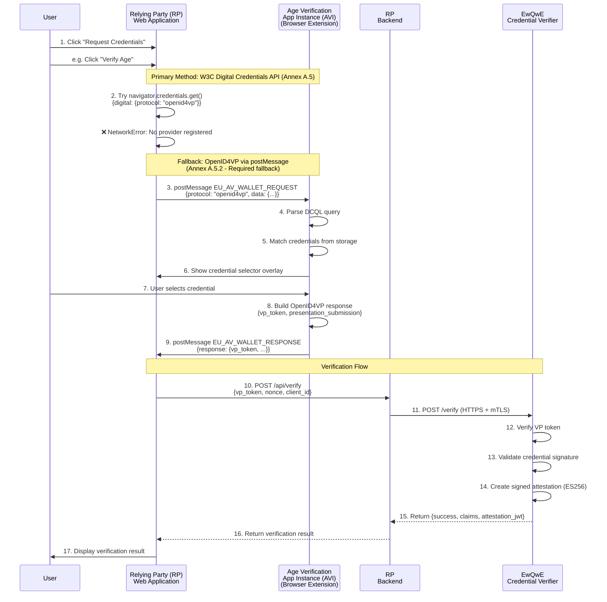

# User Journey - Sequence Diagram

This user journey demonstrates a compliant credential verification solution following the [EU Age Verification Profile (Annex A)](https://ageverification.dev/Technical%20Specification/annexes/annex-A/annex-A-av-profile). While the example focuses on age verification, the same architecture and flow apply to any credential verification scenario, such as verifying driver's licenses, national ID cards, or other digital credentials. The solution consists of three main components:

- The **Relying Party (RP) Web App**: a web application that requests credential verification from users. In the age verification scenario, this could be to verify age requirements for accessing age-restricted content or services. For other scenarios, it could be to verify identity, professional qualifications, or any other attribute.
- The **Age Verification App Instance (AVI)**: the user's digital wallet that securely stores credentials including Proof of Age attestations, Driver's Licenses, National ID cards, and other verifiable credentials. The AVI can be implemented as a mobile application, desktop application, or browser extension.
- The **EwQwE Credential Verifier**: a trusted service that verifies credentials presented by the AVI on behalf of the RP and issues cryptographically signed attestations confirming successful verification.

## Credential Presentation Flow

The sequence diagram below shows the complete flow for credential presentation, implementing the requirements from [Annex A.5](https://ageverification.dev/Technical%20Specification/annexes/annex-A/annex-A-av-profile#a5-proof-of-age-attestation-presentation) of the EU Age Verification Profile. The flow includes:

1. **Primary Method**: Attempting the W3C Digital Credentials API (as per [Annex A.5](https://ageverification.dev/Technical%20Specification/annexes/annex-A/annex-A-av-profile#a5-proof-of-age-attestation-presentation) - default method).
2. **Fallback Mechanism**: Using OpenID4VP via postMessage when the native API is unavailable (as per [Annex A.5.2](https://ageverification.dev/Technical%20Specification/annexes/annex-A/annex-A-av-profile#openid-for-verifiable-presentations-profile-requirements) - required fallback).
3. **Verification**: Backend verification and signed attestation issuance

A detailed explanation of the primary and fallback communication methods is provided in the [RP Demo Webapp -> Demo Wallet Communication Protocol](./webapp_extension_communication.md) chapter.

