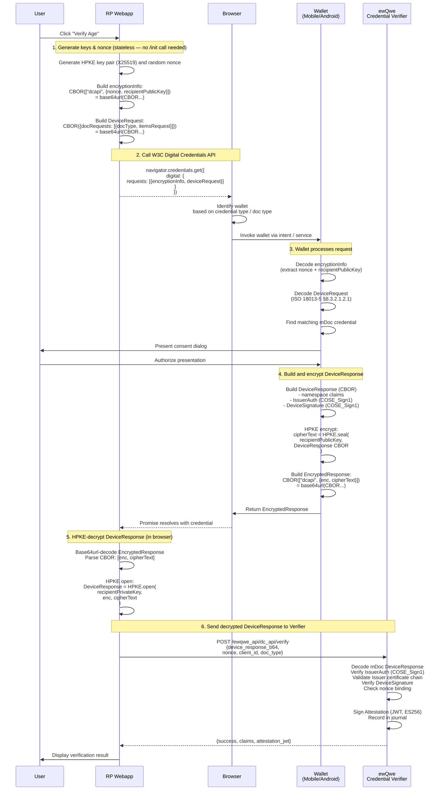
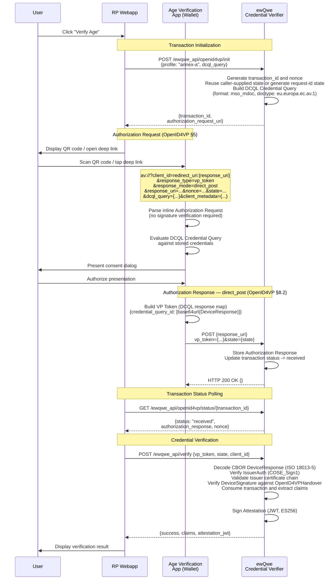
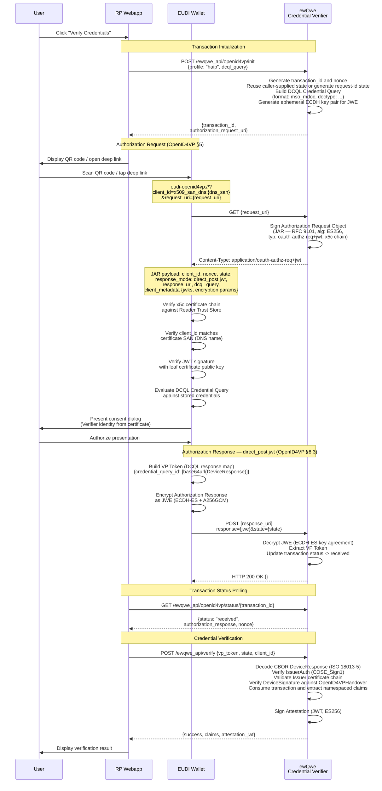
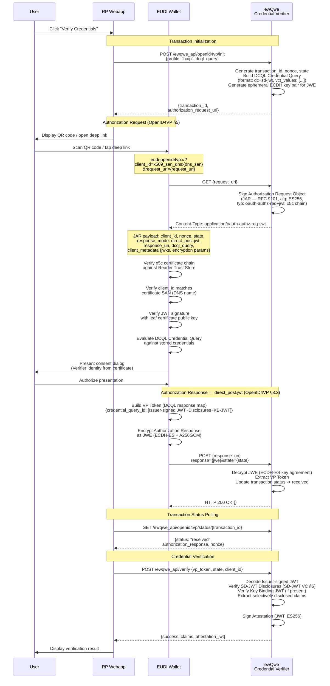

# The User Journey

This page describes the end-to-end **digital credential verification user journey** in the EU Digital Identity ecosystem and how a Relying Party (RP — you!) can request and validate a **verifiable presentation** from a user's wallet, such as a proof of age credential.

The EU ecosystem currently defines **two profiles**, with one of them having two presentation methods:

- **EU Age Verification Profile** (Annex A of the [EU AV specification](https://ageverification.dev/Technical%20Specification/annexes/annex-A/annex-A-av-profile)) — for age verification. It defines **two presentation methods**:
  - **Primary: W3C Digital Credentials API** (per ISO 18013-7 Annex C) — browser-native DC API with ISO mDoc.
  - **Fallback: OpenID4VP** (`redirect_uri`, no JAR, `direct_post`) — for when the W3C DC API is unavailable.
- **HAIP (High Assurance Interoperability Profile)** — a separate profile for high-assurance credentials (PID, mDL). Requires JAR signing, JWE responses, X.509 client IDs. Implemented by the **EUDI Wallet**.

> **Terminology note:** "Annex A" in this documentation refers to the EU Age Verification Profile document (Annex A of the EU AV specification). It should not be confused with ISO 18013-7 Annex A (reader authentication). The DC API wrapper format is defined by ISO 18013-7 **Annex C**.

All paths ultimately converge on the same backend pattern: the Credential Verifier validates the presented credential (mDoc or SD-JWT) and returns a **signed attestation** the RP can use for access control and session establishment.

## W3C Digital Credentials API vs OpenID4VP

Per the [EU Age Verification Profile §A.5](https://ageverification.dev/Technical%20Specification/annexes/annex-A/annex-A-av-profile/#a5-proof-of-age-attestation-presentation):

> "The default method for the presentation of a Proof of Age attestation is the W3C Digital Credentials API. The W3C Digital Credentials API is used as specified in [ISO/IEC 18013-7], Annex C. OpenID for Verifiable Presentations is used as a fallback mechanism when the W3C Digital Credentials API is not available."

### Recommended approach

- **Use the W3C Digital Credentials API as the primary method**: call `navigator.credentials.get()` with ISO 18013-7 Annex C wrapper format for the smoothest, most "web-native" flow. This is the officially recommended primary path.
- **Fallback to OpenID4VP when the W3C API is not available**: use the OpenID4VP presentation flow (`av://` deep link or QR code, `direct_post`, no JAR).

<!--## Two Profiles, Three Presentation Methods-->

| Aspect | EU AV Profile — DC API (Annex C) | EU AV Profile — OpenID4VP Fallback | HAIP (EUDI Wallet) |
|--------|---------------------------------------------|-------------------------------------|---------------------|
| **Profile** | EU Age Verification Profile | EU Age Verification Profile | High Assurance Interoperability Profile |
| **Transport** | W3C Digital Credentials API (`navigator.credentials.get()`) | OpenID4VP (QR/deep link) | OpenID4VP (QR/deep link) |
| **Use Case** | Age verification (primary) | Age verification (fallback) | High-value credentials (PID, mDL) |
| **LoA** | Substantial | Substantial | High |
| **Client ID Scheme** | N/A (browser-mediated) | `redirect_uri` | `x509_san_dns`, `x509_hash` |
| **Request Signing** | Not required | Not required (plain params) | Required (JWT with `x5c` header) |
| **Response Format** | HPKE-encrypted mDoc (Annex C wrapper) | Plain VP Token (`direct_post`) | JWE-encrypted VP Token (`direct_post.jwt`) |
| **Trust Model** | Browser OS mediates wallet selection | RP identified by redirect URI | RP identified by certificate |
| **Root CA Required** | No (W3C API mediation) | No (any HTTPS certificate) | Yes (wallet trust store) |
| **Invocation** | Browser credential picker | `av://`, `openid4vp://` | `eudi-openid4vp://`, `openid4vp://` |
| **Credential Formats** | `mso_mdoc` (`eu.europa.ec.av.1`) | `mso_mdoc` (`eu.europa.ec.av.1`) | `mso_mdoc` (mDL, PID) / `dc+sd-jwt` (PID) |
| **Crypto** | COSE_Sign1 + HPKE (X25519 + AES-128-GCM) | COSE_Sign1 + OpenID4VP Handover | COSE_Sign1 or JWT + JWE (ECDH-ES + A256GCM) |
| **Device Support** | Same-device only (browser-wallet on one device) | Same-device + cross-device (QR) | Same-device + cross-device (QR) |
| **Wallets** | France Identité, EUDI Wallet Referenz, AVI, any mDoc wallet | France Identité, AVI, any OID4VP wallet | EUDI Wallet, any HAIP-compatible wallet |

### The ISO 18013-7 Annex Letters Explained

| Annex | Scope | Used By |
|-------|-------|---------|
| **Annex A** | Reader authentication data structures | (not directly used in AV profiles) |
| **Annex B** | Online services — TLS, reader authentication, server retrieval | France Identité, national mDL (transport) |
| **Annex C** | Digital Credentials API integration — `["dcapi", ...]` wrapper | EU AV Profile primary method |

> **Key point:** When the EU AV Profile says "use the W3C DC API", it means **ISO 18013-7 Annex C**. When France Identité says it supports "ISO 18013-7 (Annex B)", it means the full online transport stack (Annex B + C). This documentation uses "Annex C / DC API" for the browser path and "OpenID4VP" for the fallback.

## Architecture Components

All credential verification flows involve these main components:

- **Relying Party (RP) Web App**: A web application requesting credential verification from users
- **Wallet**: The user's digital wallet storing credentials — e.g. France Identité, EUDI Wallet Referenz, Age Verification App (AVI), or any OID4VP/DC API-compatible wallet
- **ewQwe Credential Verifier**: A trusted backend service that verifies credentials and issues signed attestations

---

## Flow 1: W3C Digital Credentials API (EU AV Profile — Primary Method)

This flow implements the **EU Age Verification Profile's primary presentation method** using the **W3C Digital Credentials API** per **ISO 18013-7 Annex C**.

> **Key difference from OpenID4VP:** No QR code or deep link is used. The browser invokes the wallet directly, passing two CBOR blobs: `encryptionInfo` (wallet encrypts response to RP's public key) and `deviceRequest` (what to present). The wallet returns an **HPKE-encrypted** DeviceResponse which the RP decrypts in the browser.

> **Cross-device support:** The W3C DC API is inherently **same-device** (browser and wallet on one device). For cross-device flows (e.g., QR code on desktop scanned by phone), use the OpenID4VP fallback (Flow 2). Many EU wallets — including France Identité — support both.

### DC API / Annex C Flow

### DC API Key Characteristics

- **W3C Digital Credentials API Transport**: Uses `navigator.credentials.get()` — no redirects, no deep links. The `protocol` field is `"org-iso-mdoc"` (as shown in the EU AV Profile examples)
- **ISO Annex C Wrapper**: Request and response are wrapped in CBOR `["dcapi", ...]` arrays, base64url-encoded without padding
- **HPKE Encryption (RFC 9180)**: The wallet encrypts the DeviceResponse using HPKE (X25519 + HKDF-SHA256 + AES-128-GCM) with the RP's public key from `encryptionInfo`
- **ISO DeviceRequest/DeviceResponse**: Request format per ISO 18013-5 §8.3.2.1.2.1; response per §8.3.2.1.2.3
- **Stateless on the verifier**: The RP generates the HPKE key pair and nonce locally (no server `/init` call needed). The decrypted DeviceResponse is sent directly to `POST /ewqwe_api/dc_api/verify` for verification
- **mDoc-only**: Only `mso_mdoc` format is supported in this flow (no SD-JWT)
- **Same-device only**: Browser and wallet must be on the same device
- **Browser Support**: Requires a browser supporting the W3C Digital Credentials API (Chrome on Android 9+, others in development)

---

## Flow 2: Age Verification App (Annex A OpenID4VP Fallback)

This flow implements the **EU Age Verification Profile's fallback method** using **OpenID4VP** with the `redirect_uri` Client ID Scheme, no JAR signing, and `direct_post` response mode.

> **Same-device vs Cross-device**: The protocol steps are identical regardless of how the Authorization Request reaches the Wallet. In the **cross-device flow**, the RP displays a QR code that the User scans with their Wallet. In the **same-device flow**, the RP opens the `av://` deep link directly. Both flows use `direct_post` for the Authorization Response.

### Annex A OpenID4VP Flow

### Annex A Key Characteristics

- **Inline Authorization Request**: All parameters are passed directly in the `av://` URI — no `request_uri` indirection
- **No JAR**: The Authorization Request is sent as plain query parameters, not as a JWT-Secured Authorization Request (no RFC 9101)
- **`redirect_uri` Client ID Scheme**: `client_id` = `redirect_uri:{response_uri}` — the Verifier is identified by its callback URL
- **`direct_post` Response Mode** (OpenID4VP §8.2): The Wallet POSTs the plain VP Token directly to `response_uri`
- **Simple trust model**: No certificate chain verification; the Verifier is identified solely by its redirect URI
- **`av://` URL Scheme**: Custom deep link registered by the Age Verification App

---

## Flow 3: EUDI Wallet — HAIP Profile, mso_mdoc Credential Format

This flow implements the **High Assurance Interoperability Profile (HAIP)** with `mso_mdoc` credentials (ISO 18013-5). This format is used for mobile driving licenses (`org.iso.18013.5.1.mDL`) and EU PID documents (`eu.europa.ec.eudi.pid.1`).

> **Same-device vs Cross-device**: As with Annex A, the only difference is how the Authorization Request reaches the Wallet. In the **cross-device flow**, the RP displays a QR code. In the **same-device flow**, the RP opens the `eudi-openid4vp://` deep link directly. The JAR fetch, encrypted response, and verification steps are identical.

### HAIP mso_mdoc OpenID4VP Flow

---

## Flow 4: EUDI Wallet — HAIP Profile, SD-JWT VC Credential Format

This flow implements HAIP with `dc+sd-jwt` credentials. This format is used for EU PID documents (`urn:eudi:pid:1`) and other credentials that use selective disclosure with JSON-based claims.

### HAIP SD-JWT VC OpenID4VP Flow

### HAIP Key Characteristics

- **JWT-Secured Authorization Request (JAR)** (RFC 9101) with `ES256` and `x5c` header
- **`x509_san_dns` Client ID Scheme**: Verifier identified by certificate DNS SAN
- **Certificate chain verification**: Wallet verifies `x5c` chain against Reader Trust Store
- **`direct_post.jwt` Response Mode**: Wallet encrypts response as JWE (ECDH-ES + A256GCM)
- **Two Credential Formats**: `mso_mdoc` and `dc+sd-jwt`
- **Root CA required**: Present in Wallet's Reader Trust Store

---

## Wallet Compatibility Matrix

The [France Identité playground marketplace](https://playground.france-identite.gouv.fr/marketplace) lists wallets and verifier implementations from across the EU, all demonstrated to be interoperable with one another. This means our credential verifier — using the same OpenID4VP, HAIP, and DC API protocols — can interoperate with any wallet that works with these verifiers.

### Wallets (Actual Wallet Implementations)

| Member State | Wallet | Supported Protocols | Credential Formats | Mapped Flow |
|-------------|--------|---------------------|-------------------|-------------|
| 🇫🇷 France | **France Identité** | ISO 18013-7 Annex B, OID4VP 1.0 | mdoc | Flow 1, Flow 2 |
| 🇪🇺 EU | **EUDI Wallet Referenz** | HAIP, OID4VP 1.0 | mdoc, sd-jwt | Flow 3, Flow 4 |
| 🇪🇺 EU | **Age Verification App (AVI)** | Annex A OID4VP | mdoc | Flow 2 |

### Verifier Implementations (for Reference)

The following verifiers on the France Identité playground all support OpenID4VP. Any wallet that works with these verifiers will also work with our credential verifier, since we implement the same protocols.

| Member State | Verifier | Key Protocols | Credential Formats |
|-------------|----------|--------------|-------------------|
| 🇱🇺 Luxembourg | **Hopae** | OID4VP 1.0, HAIP, ISO 18013-5/7, W3C DC API | mdoc, sd-jwt |
| 🇸🇪 Sweden | **PassportReader** | OID4VP draft 18/Annex B, OID4VP 1.0 (DCQL, HAIP 1.0), W3C DC API | mdoc, sd-jwt |
| 🇸🇪 Sweden | **iGrant.io** | OID4VP 1.0, W3C DC API, DCQL, HAIP 1.0 | mdoc, sd-jwt |
| 🇸🇮 Slovenia | **Lutralabs** | OID4VP 1.0, HAIP 1.0 | mdoc, sd-jwt |
| 🇳🇱 Netherlands | **Animo** | OID4VP draft 18/24/v1.0 | mdoc, sd-jwt |
| 🇫🇮 Finland | **Hovi** | OID4VP draft 24/v1.0, ISO 18013-5 (BLE) | mdoc, sd-jwt |
| 🇮🇹 Italy | **Namirial** | OID4VP 1.0, OID4VCI 1.0 | mdoc, sd-jwt |
| 🇪🇸 Spain | **hashID** | OID4VP draft 18/20/24/v1.0 | mdoc, sd-jwt |
| 🇩🇪 Germany | **Lissi** | OID4VCI 1.0, OID4VP 1.0 | mdoc, sd-jwt |
| 🇷🇴 Romania | **certSIGN** | OID4VP, OID4VCI, ISO 18013-5:2021 | mdoc, sd-jwt |
| 🇫🇷 France | **DC API Verifier** | OpenID4VP (dc_api.jwt), ISO 18013-7 DeviceRequest over DC API (org-iso-mdoc) | mdoc |

> **Interoperability note:** These verifiers span 10+ EU member states and all implement OpenID4VP — our credential verifier follows the same OpenID4VP and DC API specifications. Your wallet users can use any OID4VP-compatible EU wallet, regardless of which member state issued it.

### Choosing the Right Flow

| Wallet / Scenario | Supported Flow | Why |
|------------------|---------------|-----|
| **W3C DC API-compatible wallet** (e.g. France Identité, EUDI Wallet Referenz) on Android Chrome | **Flow 1** (DC API) | Browser-native flow — no redirects, best UX. Falls back automatically. |
| **AV-compatible wallet** (e.g. France Identité, AVI, any OID4VP wallet implementing Annex A) | **Flow 2** (Annex A OpenID4VP) | No JAR, no client certs. Works cross-device or same-device via QR/deep link. |
| **HAIP-compatible wallet with mDoc** (e.g. EUDI Wallet Referenz with PID/mDL, Hopae) | **Flow 3** (HAIP mDoc) | High-assurance: JAR-signed requests, JWE-encrypted responses, certificate chain trust. |
| **HAIP-compatible wallet with SD-JWT** (e.g. EUDI Wallet Referenz with PID) | **Flow 4** (HAIP SD-JWT) | High-assurance with selective disclosure. Same HAIP trust model as Flow 3. |
| **Unknown wallet**, broadest compatibility | Detect DC API → fallback to OpenID4VP | Try Flow 1 first via `navigator.credentials.get()`, if unavailable use Flow 2. |
| **Cross-device** (e.g. desktop browser + phone wallet) | **Flow 2, 3, or 4** (OpenID4VP via QR) | QR code flow works with any OpenID4VP wallet — Annex A or HAIP. |

---

## Verification Flow (Common to All)

1. **RP receives credential data** via DC API promise or OpenID4VP transaction status
2. **RP sends to verifier**: `POST /ewqwe_api/verify` (OpenID4VP) or `POST /ewqwe_api/dc_api/verify` (DC API)
3. **Verifier validates**: mDoc COSE signatures or SD-JWT disclosures
4. **Verifier returns signed Attestation JWT** (ES256)
5. **RP uses Attestation** for session establishment

---

## References

- [EU Age Verification Profile (Annex A)](https://ageverification.dev/Technical%20Specification/annexes/annex-A/annex-A-av-profile/)
- [Annex A.9 - Comparison with HAIP](https://ageverification.dev/Technical%20Specification/annexes/annex-A/annex-A-av-profile/#a9-comparison-with-haip)
- [OpenID4VP 1.0](https://openid.net/specs/openid-4-verifiable-presentations-1_0.html)
- [ISO/IEC 18013-5](https://www.iso.org/standard/69084.html)
- [ISO/IEC 18013-7](https://www.iso.org/standard/69086.html)
- [RFC 9101 — JAR](https://datatracker.ietf.org/doc/html/rfc9101)
- [RFC 9180 — HPKE](https://www.rfc-editor.org/rfc/rfc9180)
- [W3C Digital Credentials API](https://www.w3.org/TR/digital-credentials/)
- [Annex B vs HAIP Comparison](./annex_b_vs_haip.md)
- [Annex B Implementation Plan](./annex_b_implementation_plan.md)
- [France Identité Wallet Testing Guide](./france_identite_wallet.md)
- [EU Age Verification: ISO mDoc + DCAPI](./age_verification_iso_18013_dcapi.md)
- [Age Verification App Documentation](./av_wallet_android_studio.md)
- [EUDI Wallet Documentation](./eudi_wallet_android_studio.md)
