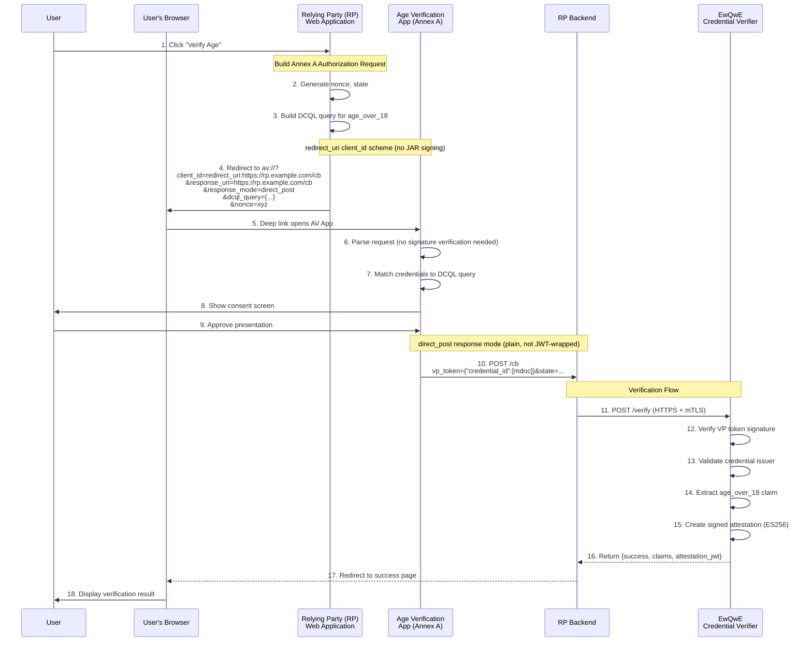
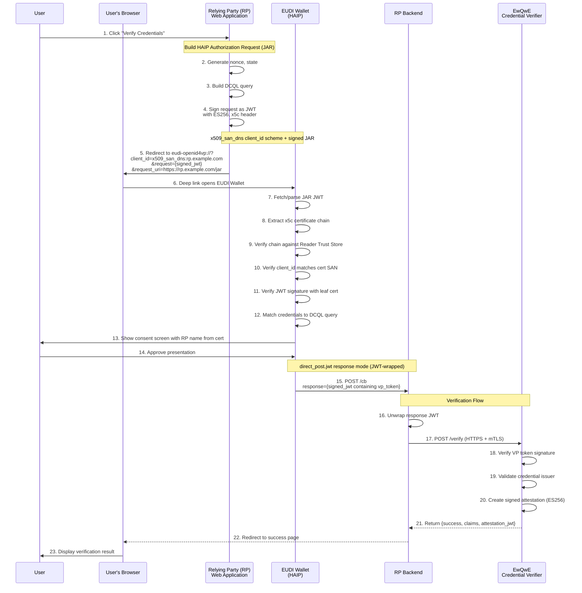
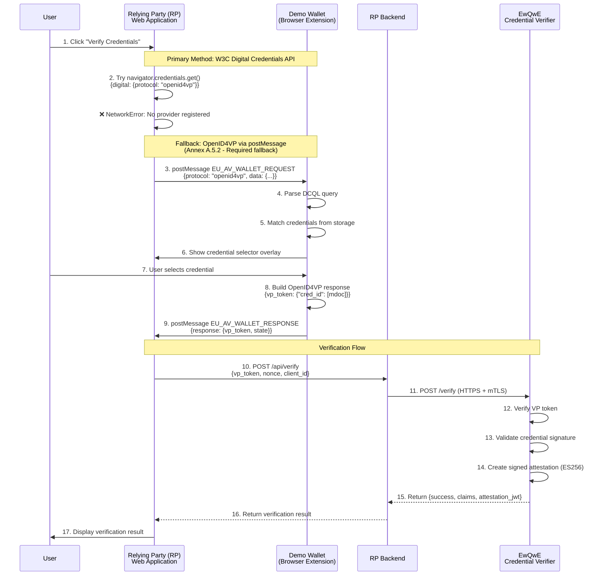

# User Journey - Sequence Diagram

This user journey demonstrates credential verification solutions following two distinct profiles defined for the European Digital Identity ecosystem. While both flows result in age verification, they differ significantly in their trust models, implementation complexity, and target use cases.

## Two Wallets, Two Profiles

The European Digital Identity ecosystem defines **two separate profiles** for credential presentation, each with its own wallet implementation:

| Aspect | Age Verification App (Annex A) | EUDI Wallet (HAIP) |
|--------|-------------------------------|-------------------|
| **Profile** | EU Age Verification Profile | High Assurance Interoperability Profile |
| **Use Case** | Age verification (websites, services) | High-value credentials (PID, mDL) |
| **LoA** | Substantial | High |
| **Client ID Scheme** | `redirect_uri` | `x509_san_dns`, `x509_hash` |
| **Request Signing** | Not required (plain query params) | Required (JWT with `x5c` header) |
| **Response Mode** | `direct_post` | `direct_post.jwt` |
| **Trust Model** | RP identified by redirect URI | RP identified by certificate |
| **Root CA Required** | No (any HTTPS certificate) | Yes (must be in wallet trust store) |
| **URL Scheme** | `av://`, `avsp://`, `openid4vp://` | `eudi-openid4vp://`, `openid4vp://` |
| **Credentials** | `eu.europa.ec.av.1` (age only) | `org.iso.18013.5.1.mDL`, PID, various |

### Key Differences from HAIP

The Annex A profile was designed to be simpler than HAIP because:

| Feature | Annex A Rationale | HAIP Approach |
|---------|-------------------|---------------|
| **No JAR signing** | Reduces implementation complexity | Required for RP authentication |
| **No trust list** | Trust lists for age verification don't exist yet | Relies on pre-established CA trust |
| **Simple client_id** | `redirect_uri:` prefix + callback URL | Certificate-based identity |
| **Plain response** | Direct POST of VP Token | JWT-wrapped response |
| **Lower LoA** | Appropriate for age verification | Required for identity documents |

> **Source**: [Annex A.9 - Comparison with HAIP](https://ageverification.dev/av-doc-technical-specification/docs/annexes/annex-A/annex-A-av-profile/#a9-comparison-with-haip)

## Architecture Components

All credential verification flows involve these main components:

- **Relying Party (RP) Web App**: A web application requesting credential verification from users
- **Wallet (AVI)**: The user's digital wallet storing credentials — either the Age Verification App (Annex A) or EUDI Wallet (HAIP)
- **EwQwE Credential Verifier**: A trusted backend service that verifies credentials and issues signed attestations

## Flow 1: Age Verification App (Annex A Profile)

This flow implements the [EU Age Verification Profile (Annex A)](https://ageverification.dev/av-doc-technical-specification/docs/annexes/annex-A/annex-A-av-profile/), which uses the `redirect_uri` client ID scheme for simplicity.

### Annex A Same-Device Flow

### Annex A Key Characteristics

- **Inline Parameters**: All authorization request parameters must be passed directly in the URL (no `request_uri`)
- **No JAR**: Authorization Request is sent as plain query parameters, not a signed JWT
- **`redirect_uri` scheme**: The `client_id` is literally `redirect_uri:` followed by the callback URL
- **`direct_post`**: The wallet POSTs the VP Token directly (not wrapped in a JWT)
- **Simple trust**: No certificate chain verification; the RP is identified by its redirect URI
- **`av://` deep link**: The AV App registers this custom URL scheme
- **`client_metadata`**: When provided inline, must use `vp_formats_supported` field (not `vp_formats`)

## Flow 2: EUDI Wallet (HAIP Profile)

This flow implements the **High Assurance Interoperability Profile (HAIP)**, which requires signed requests and certificate-based trust.

### HAIP Same-Device Flow

### HAIP Key Characteristics

- **Signed JAR**: Authorization Request must be a signed JWT with `x5c` certificate chain
- **`x509_san_dns` scheme**: The `client_id` is the domain from the certificate's SAN
- **Certificate validation**: Wallet verifies the certificate chain against its trust store
- **`direct_post.jwt`**: The VP Token is wrapped in a signed JWT before POSTing
- **Root CA required**: The RP's root CA must be added to the wallet's Reader Trust Store
- **`eudi-openid4vp://` deep link**: The EUDI Wallet registers this URL scheme

## Flow 3: Browser Extension Wallet (Fallback)

When no native wallet is available, the [Demo Wallet Browser Extension](./demo_wallet_extension.md) provides a fallback mechanism using `postMessage` communication.

## Wallet Compatibility Matrix

When implementing a Relying Party, choose your approach based on which wallets you need to support:

| If you need to support... | Use this profile | Client ID Scheme | Implementation |
|--------------------------|------------------|------------------|----------------|
| **Age Verification App only** | Annex A | `redirect_uri` | Simpler — no JAR signing |
| **EUDI Wallet only** | HAIP | `x509_san_dns` | Complex — requires JAR + trusted CA |
| **Both wallets** | Dual-mode | Both | Implement both code paths |
| **Browser extension (fallback)** | Annex A + postMessage | `redirect_uri` | Same as Annex A |

## Implementation Strategy for Dual-Mode Support

To support both the Age Verification App and EUDI Wallet, your RP should:

1. **Detect the target wallet** (via user selection or device detection)
2. **Build the appropriate request format**:
   - Annex A: Plain query parameters with `client_id=redirect_uri:...`
   - HAIP: Signed JAR with `client_id=x509_san_dns:...`
3. **Use the correct deep link scheme**:
   - Annex A: `av://` or `openid4vp://`
   - HAIP: `eudi-openid4vp://`
4. **Handle different response formats**:
   - Annex A: Plain VP Token in POST body
   - HAIP: JWT-wrapped VP Token

See the [Demo Web Application](./demo_webapp.md) for a reference implementation.

## Verification Flow (Common to All)

Regardless of which wallet and profile is used, the verification flow through the EwQwE Credential Verifier is the same:

1. **RP Backend receives VP Token** (either plain or JWT-wrapped)
2. **RP calls Credential Verifier** via HTTPS (optionally with mTLS)
3. **Verifier validates**:
   - VP Token cryptographic signature
   - Credential issuer certificate chain
   - Credential expiration and revocation status
   - Requested claims are present
4. **Verifier returns signed attestation** confirming successful verification
5. **RP uses attestation** for session establishment or access control

See [The EwQwE Credential Verifier](./credential_verifier_server.md) for detailed API documentation.

## References

- [EU Age Verification Profile (Annex A)](https://ageverification.dev/av-doc-technical-specification/docs/annexes/annex-A/annex-A-av-profile/) — Annex A specification
- [Annex A.9 - Comparison with HAIP](https://ageverification.dev/av-doc-technical-specification/docs/annexes/annex-A/annex-A-av-profile/#a9-comparison-with-haip) — Detailed differences
- [OpenID4VP 1.0 Specification](https://openid.net/specs/openid-4-verifiable-presentations-1_0.html) — Protocol standard
- [Age Verification App Documentation](./av_wallet_android_studio.md) — Installing the AV App
- [EUDI Wallet Documentation](./eudi_wallet_android_studio.md) — Installing the EUDI Wallet
- [Demo Wallet Browser Extension](./demo_wallet_extension.md) — Browser-based fallback
