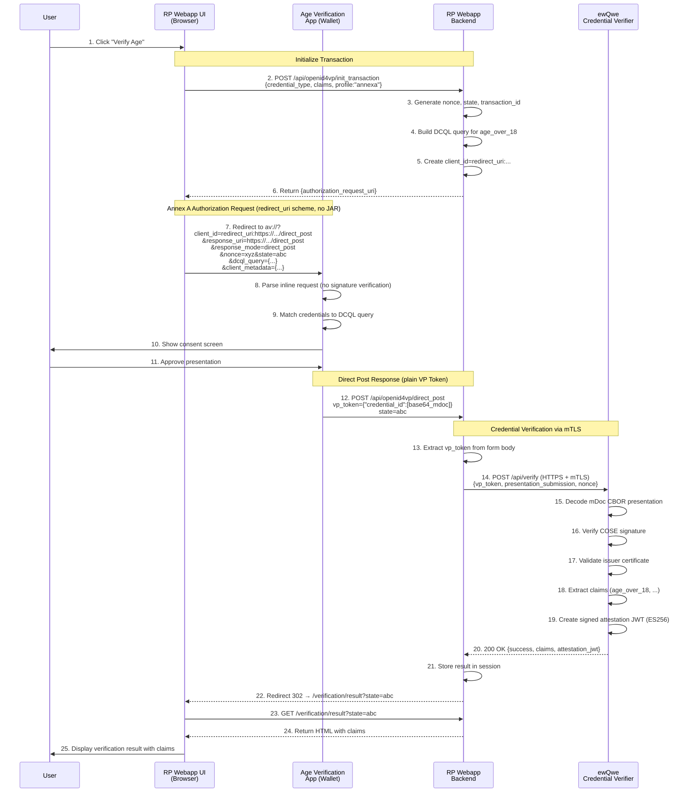
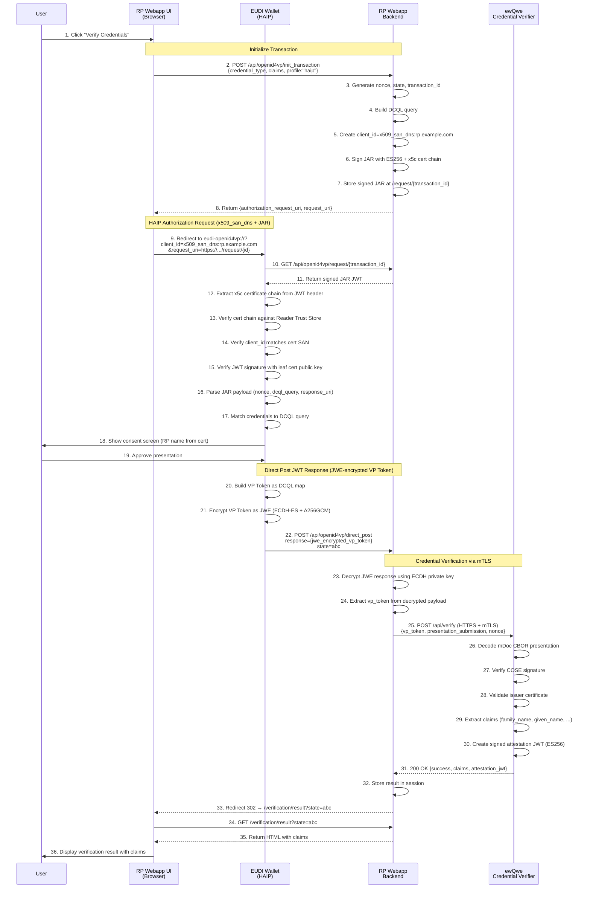

# User Journey

This page describes the end-to-end **digital credential verification user journey** in the EU Digital Identity ecosystem, and how a Relying Party (RP) can request and validate a **verifiable presentation** from a user’s wallet.

Because real-world interoperability today is primarily based on **OpenID4VP** (with the **W3C Digital Credentials API** as a browser-native option when available), the journey is presented in two concrete profiles:

- **EU Age Verification Profile (Annex A)** using the **Age Verification App (AVI)** — simpler integration (`redirect_uri`, no signed JAR, `direct_post`).
- **HAIP** using the **EUDI Wallet** — higher assurance integration (certificate-based `x509_*` client IDs, **signed JAR**, `direct_post.jwt`).

Both paths ultimately converge on the same backend pattern: the RP forwards the received VP Token to the **ewQwe Credential Verifier**, which validates the proof and returns a **signed attestation** the RP can use for access control and session establishment.

## W3C Digital Credentials API vs OpenID4VP

The **W3C Digital Credentials API** is a browser-native way for a website (RP) to request a verifiable presentation from a user’s wallet. When it is available, it can provide the simplest user experience because the browser can directly invoke the wallet via `navigator.credentials.get()`. However, it is **still a draft** and is **not consistently supported across browsers and wallets** yet ([W3C Digital Credentials API, Editor’s Draft / TR](https://www.w3.org/TR/digital-credentials/)).

In the **EU Digital Identity** ecosystem, real-world interoperability for presentations is currently based on **OpenID for Verifiable Presentations (OpenID4VP)**. Both the **EU Age Verification Profile (Annex A)** and **HAIP** are OpenID4VP-based profiles and define how wallets and relying parties exchange presentation requests and responses (including same-device redirects and cross-device direct-post) ([OpenID4VP 1.0](https://openid.net/specs/openid-4-verifiable-presentations-1_0.html), [EU Age Verification Profile — Annex A](https://ageverification.dev/av-doc-technical-specification/docs/annexes/annex-A/annex-A-av-profile/)).

### Recommended approach

- **Prefer the W3C Digital Credentials API when available**: use the browser’s credentials interface (`navigator.credentials.get()`) for the smoothest, most “web-native” flow.
- **Fallback to OpenID4VP when the W3C API is not available**: use the standardized OpenID4VP presentation flows (same-device deep link or cross-device QR code, with `direct_post` / `direct_post.jwt`) to stay compatible with EU wallet implementations.

This “use the browser API when possible, otherwise use OpenID4VP” strategy matches the **EU Age Verification Profile (Annex A)** guidance for age-verification presentations and keeps the RP aligned with the European Digital Identity ecosystem as browser support for the W3C API matures (see [EU Age Verification Profile — Annex A](https://ageverification.dev/av-doc-technical-specification/docs/annexes/annex-A/annex-A-av-profile/), and [OpenID4VP 1.0](https://openid.net/specs/openid-4-verifiable-presentations-1_0.html)).

## Two Wallets, Two Profiles

The European Digital Identity ecosystem defines **two separate profiles** for credential presentation, each with its own wallet implementation:

- The **EU Age Verification Profile (Annex A)**, implemented by the **Age Verification App (AVI)**, focuses on age verification use cases and uses a simpler OpenID4VP flow with `redirect_uri` client IDs and no signed JAR.
- The **High Assurance Interoperability Profile (HAIP)**, implemented by the **EUDI Wallet**, targets high-value credentials like Personal Identity Documents (PID) and mobile driving licenses (mDL), and requires a more complex OpenID4VP flow with certificate-based client IDs, signed JARs, and JWT-wrapped responses.

| Aspect | Age Verification App (Annex A) | EUDI Wallet (HAIP) |
| -------- | --------------------------------- | ------------------- |
| **Profile** | EU Age Verification Profile | High Assurance Interoperability Profile |
| **Use Case** | Age verification (websites, services) | High-value credentials (PID, mDL) |
| **LoA** | Substantial | High |
| **Client ID Scheme** | `redirect_uri` | `x509_san_dns`, `x509_hash` |
| **Request Signing** | Not required (plain query params) | Required (JWT with `x5c` header) |
| **Response Mode** | `direct_post` | `direct_post.jwt` |
| **Trust Model** | RP identified by redirect URI | RP identified by certificate |
| **Root CA Required** | No (any HTTPS certificate) | Yes (must be in wallet trust store) |
| **URL Scheme** | `av://`, `avsp://`, `openid4vp://` | `eudi-openid4vp://`, `openid4vp://` |
| **Credentials** | `eu.europa.ec.av.1` (age only) | `org.iso.18013.5.1.mDL`, PID, various |

### Key Differences from HAIP

The Annex A profile was designed to be simpler than HAIP because:

| Feature | Annex A Rationale | HAIP Approach |
| --------- | ------------------- | --------------- |
| **No JAR signing** | Reduces implementation complexity | Required for RP authentication |
| **No trust list** | Trust lists for age verification don't exist yet | Relies on pre-established CA trust |
| **Simple client_id** | `redirect_uri:` prefix + callback URL | Certificate-based identity |
| **Plain response** | Direct POST of VP Token | JWT-wrapped response |
| **Lower LoA** | Appropriate for age verification | Required for identity documents |

> **Source**: [Annex A.9 - Comparison with HAIP](https://ageverification.dev/av-doc-technical-specification/docs/annexes/annex-A/annex-A-av-profile/#a9-comparison-with-haip)

## Architecture Components

All credential verification flows involve these main components:

- **Relying Party (RP) Web App**: A web application requesting credential verification from users
- **Wallet (AVI)**: The user's digital wallet storing credentials — either the Age Verification App (Annex A) or EUDI Wallet (HAIP)
- **ewQwe Credential Verifier**: A trusted backend service that verifies credentials and issues signed attestations

## Flow 1: Age Verification App (Annex A Profile)

This flow implements the [EU Age Verification Profile (Annex A)](https://ageverification.dev/av-doc-technical-specification/docs/annexes/annex-A/annex-A-av-profile/), which uses the `redirect_uri` client ID scheme for simplicity.

### Annex A Same-Device Flow

### Annex A Key Characteristics

- **Inline Parameters**: All authorization request parameters must be passed directly in the URL (no `request_uri`)
- **No JAR**: Authorization Request is sent as plain query parameters, not a signed JWT
- **`redirect_uri` scheme**: The `client_id` is literally `redirect_uri:` followed by the callback URL
- **`direct_post`**: The wallet POSTs the VP Token directly (not wrapped in a JWT)
- **Simple trust**: No certificate chain verification; the RP is identified by its redirect URI
- **`av://` deep link**: The AV App registers this custom URL scheme
- **`client_metadata`**: When provided inline, must use `vp_formats_supported` field (not `vp_formats`)

## Flow 2: EUDI Wallet (HAIP Profile)

This flow implements the **High Assurance Interoperability Profile (HAIP)**, which requires signed requests and certificate-based trust.

### HAIP Same-Device Flow

### HAIP Key Characteristics

- **Signed JAR**: Authorization Request must be a signed JWT with `x5c` certificate chain
- **`x509_san_dns` scheme**: The `client_id` is the domain from the certificate's SAN
- **Certificate validation**: Wallet verifies the certificate chain against its trust store
- **`direct_post.jwt`**: The VP Token is wrapped in a signed JWT before POSTing
- **Root CA required**: The RP's root CA must be added to the wallet's Reader Trust Store
- **`eudi-openid4vp://` deep link**: The EUDI Wallet registers this URL scheme

## Wallet Compatibility Matrix

When implementing a Relying Party, choose your approach based on which wallets you need to support:

| If you need to support... | Use this profile | Client ID Scheme | Implementation |
|--------------------------|------------------|------------------|----------------|
| **Age Verification App only** | Annex A | `redirect_uri` | Simpler — no JAR signing |
| **EUDI Wallet only** | HAIP | `x509_san_dns` | Complex — requires JAR + trusted CA |
| **Both wallets** | Dual-mode | Both | Implement both code paths |
| **Browser extension (fallback)** | Annex A + postMessage | `redirect_uri` | Same as Annex A |

## Verification Flow (Common to All)

Regardless of which wallet and profile is used, the verification flow through the ewQwe Credential Verifier is the same:

1. **RP Backend receives VP Token** (either plain or JWT-wrapped)
2. **RP calls Credential Verifier** via HTTPS (optionally with mTLS)
3. **Verifier validates**:
   - VP Token cryptographic signature
   - Credential issuer certificate chain
   - Credential expiration and revocation status
   - Requested claims are present
4. **Verifier returns signed attestation** confirming successful verification
5. **RP uses attestation** for session establishment or access control

See [The ewQwe Credential Verifier](./credential_verifier_server.md) for detailed API documentation.

## References

- [EU Age Verification Profile (Annex A)](https://ageverification.dev/av-doc-technical-specification/docs/annexes/annex-A/annex-A-av-profile/) — Annex A specification
- [Annex A.9 - Comparison with HAIP](https://ageverification.dev/av-doc-technical-specification/docs/annexes/annex-A/annex-A-av-profile/#a9-comparison-with-haip) — Detailed differences
- [OpenID4VP 1.0 Specification](https://openid.net/specs/openid-4-verifiable-presentations-1_0.html) — Protocol standard
- [Age Verification App Documentation](./av_wallet_android_studio.md) — Installing the AV App
- [EUDI Wallet Documentation](./eudi_wallet_android_studio.md) — Installing the EUDI Wallet
- [Demo Wallet Browser Extension](./demo_wallet_extension.md) — Browser-based fallback
