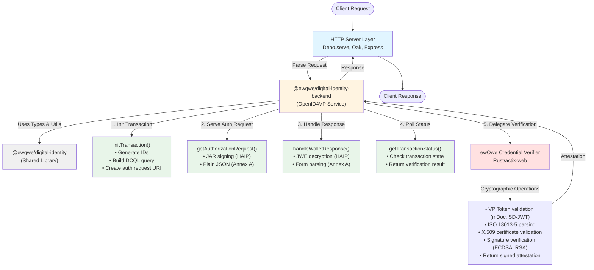

# @ewqwe/digital-identity-backend

Server-side TypeScript/Deno library for implementing OpenID4VP Relying Party backends in the **EU Age Verification** system.

Handles **JAR signing**, **JWE decryption**, **transaction lifecycle management**, and **credential verification delegation** according to [OpenID4VP 1.0](https://openid.net/specs/openid-4-verifiable-presentations-1_0.html), [EU Age Verification Profile (Annex A)](https://ageverification.dev/Technical%20Specification/annexes/annex-A/annex-A-av-profile), and the [HAIP profile](https://github.com/EWC-consortium/eudi-wallet-rfcs/blob/main/ewc-rfc001-issue-verifiable-credential.md) for EUDI Wallets.

This library is **transport-agnostic** — it accepts and returns plain data objects, never HTTP Request/Response. Your server layer maps HTTP routes to service calls.

## Features

- ✅ **Dual Profile Support**: HAIP (EUDI Wallet) and Annex A (Age Verification Apps)
- ✅ **JAR Signing**: Signed JWT Authorization Requests (RFC 9101) with X.509 certificate chains
- ✅ **JWE Decryption**: ECDH-ES+A256KW decryption for HAIP `direct_post.jwt` responses
- ✅ **Transaction Management**: In-memory store with automatic cleanup
- ✅ **Credential Verification Delegation**: Proxies VP Token validation to ewQwe Credential Verifier*
- ✅ **DCQL Support**: Digital Credentials Query Language for flexible credential requests

> **\*Technical Note**: The "Credential Verifier" technically verifies **Verifiable Presentations** (VP Tokens). We use "Credential Verifier" terminology for clarity, as the business purpose is verifying credential authenticity—a term non-expert users readily understand.

- ✅ **Type-Safe**: Full TypeScript types for all OpenID4VP parameters
- ✅ **Zero Framework Dependencies**: Works with any HTTP server (Deno.serve, Oak, Express)

---

## Standards Compliance

| Standard                               | Usage                                                  |
| -------------------------------------- | ------------------------------------------------------ |
| **OpenID4VP 1.0**                      | Authorization request/response flow                    |
| **RFC 9101 (JAR)**                     | Signed JWT Authorization Requests                      |
| **RFC 7516 (JWE)**                     | Response encryption for HAIP profile                   |
| **EU AV Profile Annex A**              | Age Verification App integration (`redirect_uri`)      |
| **HAIP**                               | EUDI Wallet integration (`x509_san_dns`)               |
| **DCQL**                               | Credential query language for W3C Digital Credentials  |
| **ISO/IEC 18013-5**                    | mDL/mDoc format support                                |

---

## Installation

```bash
# Add to deno.json imports
{
  "imports": {
    "@ewqwe/digital-identity-backend": "jsr:@ewqwe/digital-identity-backend@^0.1.0"
  }
}
```

Or import directly:

```typescript
import { OpenID4VPService } from "jsr:@ewqwe/digital-identity-backend@^0.1.0";
```

---

## Quick Start

### 1. Initialize the Service

```typescript
import { OpenID4VPService } from "@ewqwe/digital-identity-backend";

const service = await OpenID4VPService.create({
  publicUrl: "https://rp.example.com",          // Your RP's public URL
  credentialVerifierUrl: "https://127.0.0.1:9443", // ewQwe Credential Verifier
  x509CertPath: "./certs/fullchain.pem",        // X.509 cert chain for JAR
  x509KeyPath: "./certs/privkey.pem",           // Private key for JAR signing
  caCertPath: "./certs/ca.pem",                 // CA cert for mTLS (optional)
  transactionTtlMs: 5 * 60 * 1000,              // 5 minutes (optional)
});
```

### 2. Initialize a Transaction

```typescript
// POST /api/openid4vp/init
const result = await service.initTransaction({
  credential_type: "proof_of_age",
  profile: "annex_a",  // or "haip" for EUDI Wallet
  client_metadata: {
    client_name: "My Age Verification Service",
    logo_uri: "https://rp.example.com/logo.png",
  },
});

// result.authorization_request_uri → Show in QR code or deep link
// result.transaction_id → Store for polling status
```

### 3. Poll Transaction Status

```typescript
// GET /api/openid4vp/status/:id
const status = service.getTransactionStatus(transactionId);

if (status.status === "verified") {
  console.log("Age verified:", status.verification_result);
}
```

### 4. Serve Authorization Request

```typescript
// GET /api/openid4vp/request/:id
const { body, contentType } = await service.getAuthorizationRequest(
  transactionId,
);

// Return HTTP response with content-type
return new Response(body, {
  headers: { "Content-Type": contentType },
});
```

### 5. Handle Wallet Response

```typescript
// POST /api/openid4vp/direct_post
const formData = await request.formData();

if (formData.has("response")) {
  // HAIP: JWE-encrypted response
  const jweResponse = formData.get("response") as string;
  await service.handleWalletResponse(null, jweResponse);
} else {
  // Annex A: Plain form data
  await service.handleWalletResponse({
    vpToken: formData.get("vp_token") as string,
    presentationSubmission: formData.get("presentation_submission") as string,
    state: formData.get("state") as string,
  });
}
```

---

## API Reference

### `OpenID4VPService`

Main service class for managing OpenID4VP transaction lifecycle.

#### Static Methods

##### `OpenID4VPService.create(config: OpenID4VPConfig): Promise<OpenID4VPService>`

Create and initialize a service instance. Loads keys, certificates, and starts background transaction cleanup.

**Parameters:**

```typescript
interface OpenID4VPConfig {
  publicUrl: string;                  // Public URL accessible from mobile wallets
  credentialVerifierUrl: string;      // URL of the credential verifier backend
  x509CertPath: string;               // Path to X.509 certificate chain PEM
  x509KeyPath: string;                // Path to private key PEM
  caCertPath?: string;                // Path to CA certificate PEM (for mTLS)
  transactionTtlMs?: number;          // Transaction TTL in ms (default: 5 min)
}
```

#### Instance Methods

##### `initTransaction(request: InitTransactionRequest): Promise<InitTransactionResponse>`

Initialize a new OpenID4VP transaction. Builds DCQL query, generates IDs, and creates authorization request URI.

**Parameters:**

```typescript
interface InitTransactionRequest {
  dcql_query?: DCQLQuery;             // Explicit DCQL query
  presentation_definition?: unknown;  // Legacy PD (converted to DCQL)
  nonce?: string;                     // Optional nonce (auto-generated if omitted)
  client_metadata?: ClientMetadata;   // RP metadata for wallet display
  profile?: ProfileId;                // "haip" | "annex_a"
  credential_type?: string;           // "mdl" | "pid" | "proof_of_age"
}
```

**Returns:**

```typescript
interface InitTransactionResponse {
  transaction_id: string;             // Unique transaction ID
  authorization_request_uri: string;  // URI to encode in QR code
  profile: ProfileId;                 // Selected profile
  expires_at: number;                 // Unix timestamp
}
```

##### `getTransactionStatus(transactionId: string): TransactionStatusResult`

Poll transaction status. Returns current state and verification result when ready.

**Returns:**

```typescript
interface TransactionStatusResult {
  status: "pending" | "received" | "verified" | "failed" | "expired";
  expires_in?: number;        // seconds until expiry; present when status === "pending"
  // Present when status === "received" — the Authorization Response sent by the wallet
  authorization_response?: {
    vp_token: string;                    // JSON-encoded Record<credentialQueryId, presentation[]>
    presentation_submission?: string;    // DIF PE backward-compat; absent in DCQL responses
    state: string;                       // echoed from original Authorization Request
  };
  nonce?: string;             // original request nonce; present when status === "received"
  error_message?: string;
}
```

##### `getAuthorizationRequest(transactionId: string): Promise<AuthorizationRequestResult>`

Build and return the authorization request (JAR for HAIP, plain JSON for Annex A).

**Returns:**

```typescript
interface AuthorizationRequestResult {
  body: string;                       // JWT string or JSON string
  contentType: string;                // "application/oauth-authz-req+jwt" or "application/json"
}
```

##### `handleWalletResponse(plainData?: DirectPostAuthorizationResponse, jweResponse?: string, fallbackState?: string): Promise<void>`

Process wallet response. Decrypts JWE (HAIP) or parses plain data (Annex A), then delegates verification to credential verifier.

**Parameters:**

```typescript
interface DirectPostAuthorizationResponse {
  vpToken: string;
  presentationSubmission?: string;
  state: string;
}
```

##### `verifyCredential(request: VerifyRequest): Promise<VerifyResponse>`

Proxy verification request to credential verifier backend. Called automatically by `handleWalletResponse()`, but can be used independently.

**Returns:**

```typescript
interface VerifyResponse {
  success: boolean;
  message?: string;
  errors?: string[];
  // ... credential-specific fields
}
```

##### `getPublicJwkSet(): { keys: JWK[] }`

Get the public JWK Set for the JWE encryption key. Served at `/.well-known/jwks.json` for HAIP wallets.

##### `shutdown(): void`

Shut down the service. Stops background timers and closes HTTP clients.

---

## Protocol Profiles

This library supports two OpenID4VP profiles with different characteristics:

### HAIP (High Assurance Interoperability Profile)

Used for **EUDI Wallets** and high-assurance scenarios.

| Parameter                | Value                                          |
| ------------------------ | ---------------------------------------------- |
| `client_id_scheme`       | `x509_san_dns`                                 |
| `client_id`              | `x509_san_dns:rp.example.com`                  |
| `response_mode`          | `direct_post.jwt`                              |
| `authorization_request`  | Signed JWT (JAR) with X.509 cert chain         |
| `wallet_response`        | JWE-encrypted (ECDH-ES+A256KW)                 |
| `url_scheme`             | `eudi-openid4vp://`                            |

**Security features:**

- ✅ X.509 certificate attestation (client identity)
- ✅ JAR signing prevents tampering
- ✅ JWE encryption protects VP Token in transit
- ✅ Requires wallet support for advanced crypto

### Annex A (EU Age Verification Profile)

Used for **Age Verification Apps** (simpler, browser-friendly).

| Parameter                | Value                                          |
| ------------------------ | ---------------------------------------------- |
| `client_id_scheme`       | `redirect_uri`                                 |
| `client_id`              | `redirect_uri:https://rp.example.com/callback` |
| `response_mode`          | `direct_post`                                  |
| `authorization_request`  | Plain JSON                                     |
| `wallet_response`        | Plain form data or JSON                        |
| `url_scheme`             | `av://`                                        |

**Characteristics:**

- ✅ Simpler integration (no JAR, no JWE)
- ✅ Works with basic HTTP clients
- ✅ Suitable for browser-based wallets
- ⚠️ Less transport security (relies on HTTPS)

The library **automatically selects the appropriate profile** based on `credential_type` or explicit `profile` parameter.

---

## Architecture

The backend library is the **middle layer** in a three-tier age verification system:



**Key responsibilities:**

- **HTTP Server**: Transport layer (request parsing, CORS, sessions)
- **@ewqwe/digital-identity-backend**: OpenID4VP protocol orchestration
- **@ewqwe/digital-identity**: Shared types and utilities
- **Credential Verifier**: Cryptographic validation (delegated)

---

## Security Considerations

### X.509 Certificates

- **HAIP requires valid X.509 certificates** with SAN DNS matching your `publicUrl`
- Use production certificates from a trusted CA (Let's Encrypt, DigiCert)
- Test certificates are provided in `credential_verifier/src/tests/certificates/` **for development only**

### Key Management

- **JAR signing key**: Private key for X.509 certificate (ES256 or RS256)
- **JWE encryption key**: Ephemeral P-256 key pair (auto-generated, in-memory)
- **Store private keys securely**: File permissions, environment variables, or secret managers

### mTLS with Credential Verifier

- Optional but **recommended for production**
- Provide `caCertPath` to verify the credential verifier's certificate
- Credential verifier can require client certificates for mutual authentication

### Transaction Storage

- Current implementation uses **in-memory storage** (lost on restart)
- For production, consider persistent storage (Redis, PostgreSQL)
  - Implement `TransactionStore` interface with your backend
  - Extend `OpenID4VPService` to inject custom store

### HTTPS

- **Always use HTTPS in production** for `publicUrl`
- Annex A profile relies on HTTPS for transport security
- HAIP adds JWE encryption but HTTPS is still mandatory

---

## Real-World Example

Complete HTTP server implementation from the ewQwe webapp:

```typescript
import {
  OpenID4VPService,
  NotFoundError,
  ExpiredError,
  BadRequestError,
  VerifierError,
} from "@ewqwe/digital-identity-backend";
import type {
  InitTransactionRequest,
  VerifyRequest,
} from "@ewqwe/digital-identity-backend";

// CORS headers
const CORS_HEADERS = {
  "Access-Control-Allow-Origin": "*",
  "Access-Control-Allow-Methods": "GET, POST, OPTIONS",
  "Access-Control-Allow-Headers": "Content-Type, Authorization",
};

// Initialize service
const service = await OpenID4VPService.create({
  publicUrl: Deno.env.get("PUBLIC_URL") || "http://localhost:5175",
  credentialVerifierUrl: "https://127.0.0.1:9443",
  x509CertPath: "./certs/fullchain.pem",
  x509KeyPath: "./certs/privkey.pem",
  caCertPath: "./certs/ca.pem",
});

// HTTP request handler
async function handleRequest(req: Request): Promise<Response> {
  const url = new URL(req.url);

  // CORS preflight
  if (req.method === "OPTIONS") {
    return new Response(null, { status: 204, headers: CORS_HEADERS });
  }

  try {
    // Initialize transaction
    if (url.pathname === "/api/openid4vp/init" && req.method === "POST") {
      const body: InitTransactionRequest = await req.json();
      const result = await service.initTransaction(body);
      return Response.json(result);
    }

    // Poll status
    if (url.pathname.startsWith("/api/openid4vp/status/")) {
      const id = url.pathname.split("/").pop()!;
      const result = service.getTransactionStatus(id);
      return Response.json(result);
    }

    // Serve authorization request (JAR or JSON)
    if (url.pathname.startsWith("/api/openid4vp/request/")) {
      const id = url.pathname.split("/").pop()!;
      const { body, contentType } = await service.getAuthorizationRequest(id);
      return new Response(body, {
        headers: { "Content-Type": contentType, ...CORS_HEADERS },
      });
    }

    // Handle wallet response
    if (url.pathname === "/api/openid4vp/direct_post" && req.method === "POST") {
      const contentType = req.headers.get("content-type") || "";

      if (contentType.includes("application/x-www-form-urlencoded")) {
        const formData = await req.formData();
        const jweResponse = formData.get("response") as string | null;

        if (jweResponse) {
          // HAIP: encrypted response
          const fallbackState = (formData.get("state") as string) || undefined;
          await service.handleWalletResponse(null, jweResponse, fallbackState);
        } else {
          // Annex A: plain response
          await service.handleWalletResponse({
            vpToken: formData.get("vp_token") as string,
            presentationSubmission: formData.get("presentation_submission") as string,
            state: formData.get("state") as string,
          });
        }
      } else {
        // JSON response
        const body = await req.json();
        await service.handleWalletResponse({
          vpToken: body.vp_token,
          presentationSubmission: body.presentation_submission,
          state: body.state,
        });
      }

      return Response.json({ status: "ok" });
    }

    // Serve JWK Set
    if (url.pathname === "/api/openid4vp/.well-known/jwks.json") {
      const jwks = service.getPublicJwkSet();
      return new Response(JSON.stringify(jwks), {
        headers: { "Content-Type": "application/jwk-set+json", ...CORS_HEADERS },
      });
    }

    // Verification proxy (for direct credential verification)
    if (url.pathname === "/api/verify" && req.method === "POST") {
      const body: VerifyRequest = await req.json();
      const origin = req.headers.get("origin") || "unknown";
      body.client_id = origin;
      const result = await service.verifyCredential(body);
      return Response.json(result);
    }

    // Health check
    if (url.pathname === "/api/health") {
      return Response.json({ status: "ok" });
    }

    return Response.json({ error: "Not found" }, { status: 404 });
  } catch (error) {
    // Error handling
    if (error instanceof NotFoundError) {
      return Response.json({ error: error.message }, { status: 404 });
    }
    if (error instanceof ExpiredError) {
      return Response.json({ error: error.message }, { status: 410 });
    }
    if (error instanceof BadRequestError) {
      return Response.json({ error: error.message }, { status: 400 });
    }
    if (error instanceof VerifierError) {
      return Response.json(
        { error: error.message, details: error.responseText },
        { status: error.status },
      );
    }
    // Unknown error
    const msg = error instanceof Error ? error.message : "Unknown error";
    return Response.json({ error: msg }, { status: 500 });
  }
}

// Start server
Deno.serve({ port: 5175 }, handleRequest);
```

---

## Error Handling

The library exports custom error classes for common failure scenarios:

```typescript
import {
  NotFoundError,
  ExpiredError,
  BadRequestError,
  VerifierError,
} from "@ewqwe/digital-identity-backend";

try {
  const result = await service.getAuthorizationRequest(transactionId);
} catch (error) {
  if (error instanceof NotFoundError) {
    return Response.json({ error: error.message }, { status: 404 });
  }
  if (error instanceof ExpiredError) {
    return Response.json({ error: error.message }, { status: 410 });
  }
  if (error instanceof BadRequestError) {
    return Response.json({ error: error.message }, { status: 400 });
  }
  if (error instanceof VerifierError) {
    return Response.json({
      error: error.message,
      details: error.responseText,
    }, { status: error.status });
  }
  throw error; // Unknown error
}
```

---

## Dependencies

- **jose** (`^5.9.6`): JWT and JWE operations (JAR signing, JWE decryption)
- **@ewqwe/digital-identity**: Shared types and utilities (re-exported)

---

## Development

### Running Tests

```bash
deno test
```

### Type Checking

```bash
deno check mod.ts
```

### Linting

```bash
deno lint
```

---

## License

MIT

---

## Related Projects

- **@ewqwe/digital-identity** — Frontend library for credential requests (browser-side)
- **ewQwe Credential Verifier** — Rust service for cryptographic VP Token validation
- **ewQwe Webapp** — Reference implementation of a Relying Party

---

## Support

For issues, questions, or contributions, see the [main repository](https://github.com/ewqwe/ewqwe-identity).
