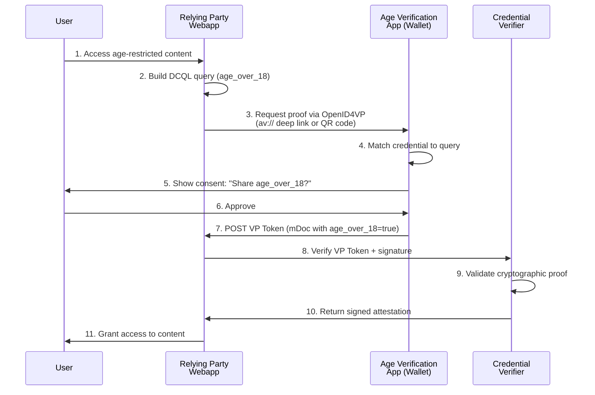

# @ewqwe/digital-identity

**Shared library for building Relying Party web applications that verify digital credentials using OpenID4VP and W3C Digital Credentials API.**

Browser-compatible TypeScript library with zero server-side dependencies. Implements protocol profiles for age verification (Proof of Age), mobile driver's licenses (mDL), and national IDs (PID).

This library is designed to:

- **Implement the UI part of Relying Party webapps** - Handle credential requests, user interactions, and presentation flows in the browser
- **Work in conjunction with the [ewQwe Credential Verifier](../../credential_verifier/)** - Frontend builds requests and sends VP Tokens to the backend verifier for cryptographic validation

> **Technical Note**: While we call it the "Credential Verifier," the service technically verifies **Verifiable Presentations** (VP Tokens) containing credentials. We use "Credential Verifier" for clarity—non-expert users immediately understand verifying credentials, whereas "Presentation Verifier" requires explaining the technical distinction.

## What are Digital Credentials?

**Digital Credentials** are verifiable, cryptographically signed attestations about a person or entity, stored in a digital wallet on a mobile device. In the European Union, the **EU Digital Identity Wallet (EUDI Wallet)** initiative enables citizens to securely store and present credentials like national IDs (Personal Identification Data - PID), mobile driver's licenses (mDL), and age verification attestations.

**Proof of Age verification** is a key use case: when accessing age-restricted services (purchasing alcohol, entering adult venues, streaming age-gated content), users can present a cryptographic proof that they are over a specific age threshold (e.g., 18 or 21) without revealing their exact birthdate or other personal information. The [EU Age Verification Profile (Annex A)](https://ageverification.dev/Technical%20Specification/annexes/annex-A/annex-A-av-profile) standardizes how age verification apps and relying parties exchange these proofs using **OpenID for Verifiable Presentations (OpenID4VP)**, with credentials formatted as ISO/IEC 18013-5 mobile documents (mDocs) containing claims like `age_over_18 = true` in the `eu.europa.ec.av.1` namespace.

## Features

- **DCQL Query Building** - Construct Digital Credentials Query Language queries per OpenID4VP 1.0 §6
- **Protocol Profiles** - Pre-configured HAIP and Annex A profiles with correct parameters
- **Credential Type Configs** - ISO 18013-5 mDL, EU PID, and EU Age Verification claims
- **Type Definitions** - Complete TypeScript types for OpenID4VP, DCQL, and W3C DC API
- **Zero Dependencies** - No npm packages required, works with Deno and Node.js

## How Credential Verification Works

This diagram shows a typical Proof of Age verification flow using the **EU Age Verification Profile (Annex A)**, where a relying party (RP) website requests an age attestation from the user's wallet, then validates it through a credential verifier:



**Key steps:**

1. **DCQL Query** - RP builds a query requesting `age_over_18 = true` from the `eu.europa.ec.av.1` namespace
2. **Presentation Request** - RP sends OpenID4VP authorization request to wallet (via deep link or QR code)
3. **User Consent** - Wallet asks user to approve sharing the age claim
4. **VP Token** - Wallet returns a cryptographically signed mDoc containing the requested claim
5. **Verification** - RP forwards the VP Token to a credential verifier to validate the cryptographic signature and issuer authority
6. **Attestation** - Verifier returns a signed attestation confirming the proof is valid
7. **Access Control** - RP grants access based on the verified attestation

## Standards Implemented

| Standard | Purpose |
|----------|---------|
| [OpenID4VP 1.0](https://openid.net/specs/openid-4-verifiable-presentations-1_0.html) | Verifiable Presentation exchange protocol |
| [DCQL](https://openid.net/specs/openid-4-verifiable-presentations-1_0.html#section-6) | Digital Credentials Query Language |
| [ISO/IEC 18013-5:2021](https://www.iso.org/standard/69084.html) | Mobile Driver's License (mDL) format |
| [EU AV Profile Annex A](https://ageverification.dev/Technical%20Specification/annexes/annex-A/annex-A-av-profile) | Age Verification attestation profile |
| [W3C Digital Credentials API](https://wicg.github.io/digital-credentials/) | Browser native credential API |

## Installation

### Deno

```typescript
// deno.json
{
  "imports": {
    "@ewqwe/digital-identity": "../js-lib/ewqwe-digital-identity/mod.ts"
  }
}
```

### Vite (with Deno or Node.js)

```typescript
// vite.config.ts
import { defineConfig } from "vite";
import * as path from "node:path";

export default defineConfig({
  resolve: {
    alias: {
      "@ewqwe/digital-identity": path.resolve(
        import.meta.dirname,
        "../js-lib/ewqwe-digital-identity/mod.ts"
      ),
    },
  },
});
```

## Architecture

This library is the **frontend component** of the ewQwe Digital Identity system. It works in conjunction with:

1. **[@ewqwe/digital-identity-backend](../ewqwe-digital-identity-backend/)** - Server-side library that:
   - Handles OpenID4VP transaction management
   - Signs JWT Authorization Requests (JAR) for HAIP
   - Manages session state and wallet responses
   - Integrates with the credential verifier

2. **[ewQwe Credential Verifier](../../credential_verifier/)** - Rust service that:
   - Validates cryptographic signatures on VP Tokens
   - Verifies issuer certificates and trust chains
   - Returns signed attestations confirming verification

**Typical integration:**

```typescript
// Frontend (this library)
import { CREDENTIAL_TYPES, PROTOCOL_PROFILES } from "@ewqwe/digital-identity";
const request = buildPresentationRequest("proof-of-age", ["age_over_18"]);

// Send to backend endpoint
const response = await fetch("/api/openid4vp/init", {
  method: "POST",
  body: JSON.stringify({ credentials: request }),
});

// Backend uses @ewqwe/digital-identity-backend
// which delegates verification to the Credential Verifier
```

## Usage

### 1. Build DCQL Queries for Age Verification

```typescript
import {
  buildAgeVerificationQuery,
  buildAgeVerificationQueryWithFallback,
  EU_AV_NAMESPACE,
  EU_AV_DOCTYPE,
} from "@ewqwe/digital-identity";

// Simple age verification (age_over_18 = true)
const query = buildAgeVerificationQuery(18);

// Age verification with mDL fallback (if wallet doesn't have AV credential)
const queryWithFallback = buildAgeVerificationQueryWithFallback(21);

console.log(query);
// {
//   credentials: [{
//     id: "eu_av_proof",
//     format: "mso_mdoc",
//     meta: { doctype_value: "eu.europa.ec.av.1.mdoc" },
//     claims: [{
//       path: ["age_over_18"],
//       namespace: "eu.europa.ec.av.1",
//       values: [true],
//       intent_to_retain: false
//     }]
//   }]
// }
```

### 2. Select Claims from Credential Types

```typescript
import {
  CREDENTIAL_TYPES,
  getDefaultClaims,
  getClaimsForType,
  getProfileForType,
} from "@ewqwe/digital-identity";

// Get available claims for mDL
const mdlClaims = getClaimsForType("mdl");
// Returns: ClaimDefinition[] with family_name, given_name, birth_date, etc.

// Get default claims for Proof of Age
const defaultClaims = getDefaultClaims("proof-of-age");
// Returns: ["age_over_18"]

// Determine protocol profile for a credential type
const profile = getProfileForType("mdl");
// Returns: "haip" (High Assurance Interoperability Profile)

const avProfile = getProfileForType("proof-of-age");
// Returns: "annex-a" (EU Age Verification Profile)
```

### 3. Use Protocol Profile Configurations

```typescript
import { PROTOCOL_PROFILES, type ProtocolProfile } from "@ewqwe/digital-identity";

// Access HAIP profile (for EUDI Wallet with mDL/PID)
const haip = PROTOCOL_PROFILES.haip;
console.log(haip.clientIdScheme);     // "x509_san_dns"
console.log(haip.requestFormat);      // "jar" (JWT Authorization Request)
console.log(haip.responseMode);       // "direct_post.jwt"
console.log(haip.requiresJarSigning); // true

// Access Annex A profile (for Age Verification Apps)
const annexA = PROTOCOL_PROFILES["annex-a"];
console.log(annexA.clientIdScheme);     // "redirect_uri"
console.log(annexA.requestFormat);      // "plain" (no JAR signing)
console.log(annexA.responseMode);       // "direct_post"
console.log(annexA.requiresJarSigning); // false
```

### 4. Build OpenID4VP Authorization Requests

```typescript
import {
  buildAuthorizationRequest,
  buildCrossDeviceAuthorizationRequest,
  generateNonce,
  type DCQLQuery,
} from "@ewqwe/digital-identity";

const nonce = generateNonce();
const dcqlQuery: DCQLQuery = buildAgeVerificationQuery(18);

// Same-device authorization request (deep link)
const authRequest = buildAuthorizationRequest({
  client_id: "https://rp.example.com",
  client_id_scheme: "redirect_uri",
  response_type: "vp_token",
  response_mode: "direct_post",
  response_uri: "https://rp.example.com/api/openid4vp/direct_post",
  nonce,
  dcql_query: dcqlQuery,
});

// Cross-device authorization request (QR code)
const crossDeviceRequest = buildCrossDeviceAuthorizationRequest({
  client_id: "https://rp.example.com",
  client_id_scheme: "redirect_uri",
  request_uri: "https://rp.example.com/api/openid4vp/request/abc123",
  nonce,
});
```

### 5. TypeScript Type Safety

```typescript
import type {
  DCQLQuery,
  DCQLCredentialQuery,
  OpenID4VPRequest,
  OpenID4VPResponse,
  VerifyResponse,
  CredentialTypeConfig,
  ProfileId,
} from "@ewqwe/digital-identity";

// Strongly typed DCQL queries
const query: DCQLQuery = {
  credentials: [
    {
      id: "age_proof",
      format: "mso_mdoc",
      meta: { doctype_value: "eu.europa.ec.av.1.mdoc" },
      claims: [
        {
          path: ["age_over_18"],
          namespace: "eu.europa.ec.av.1",
          values: [true],
          intent_to_retain: false,
        },
      ],
    },
  ],
};

// Type-safe OpenID4VP request/response
interface MyOpenID4VPRequest extends OpenID4VPRequest {
  credential_type: string;
}
```

## Real-World Example

From the [demo webapp](../../webapp/src/credentials.ts) - **Building credential presentation requests**:

```typescript
import type {
  OpenID4VPRequest,
  PresentationDefinition,
  InputDescriptor,
  ConstraintField,
} from "@ewqwe/digital-identity";
import { CREDENTIAL_TYPES, PROTOCOL_PROFILES } from "@ewqwe/digital-identity";

/**
 * Build an OpenID4VP presentation request
 * Works for any credential type: mDL, PID, or Proof of Age
 */
function buildPresentationRequest(
  credentialType: string,
  selectedClaims: string[],
): OpenID4VPRequest {
  const config = CREDENTIAL_TYPES[credentialType];
  if (!config) {
    throw new Error(`Unknown credential type: ${credentialType}`);
  }

  const profile = PROTOCOL_PROFILES[config.profile];
  const nonce = crypto.randomUUID();
  const state = crypto.randomUUID();

  // Build constraint fields from selected claims
  const fields: ConstraintField[] = selectedClaims.map((claimId) => {
    const claim = config.claims.find((c) => c.id === claimId);
    return {
      path: [`$['${config.namespace}']['${claimId}']`],
      id: claimId,
      name: claim?.name || claimId,
      intent_to_retain: false,
    };
  });

  const inputDescriptor: InputDescriptor = {
    id: `${credentialType}_credential`,
    name: config.name,
    purpose: `We need to verify your ${config.name.toLowerCase()}`,
    format: {
      mso_mdoc: {
        alg: ["ES256", "ES384", "ES512", "EdDSA"],
      },
    },
    constraints: {
      limit_disclosure: "required",
      fields,
    },
  };

  const presentationDefinition: PresentationDefinition = {
    id: crypto.randomUUID(),
    name: `${config.name} Verification`,
    purpose: `Verify identity using ${config.name}`,
    input_descriptors: [inputDescriptor],
  };

  return {
    client_id: window.location.origin,
    client_id_scheme: profile.clientIdScheme,
    response_type: "vp_token",
    response_mode: profile.responseMode,
    nonce,
    state,
    presentation_definition: presentationDefinition,
    client_metadata: {
      client_name: "Digital Credentials Demo",
      client_purpose: "Identity verification for demo purposes",
      vp_formats: {
        mso_mdoc: { alg: ["ES256", "ES384", "ES512", "EdDSA"] },
        jwt_vp: { alg: ["ES256", "ES384", "ES512", "EdDSA"] },
      },
    },
  };
}

// Example: Request Proof of Age (18+)
const request = buildPresentationRequest("proof-of-age", ["age_over_18"]);
// Uses Annex A profile automatically:
// - client_id_scheme: "redirect_uri"
// - response_mode: "direct_post"
// - No JAR signing required

// Example: Request mDL claims
const mdlRequest = buildPresentationRequest("mdl", [
  "family_name",
  "given_name",
  "birth_date",
  "age_over_18",
]);
// Uses HAIP profile automatically:
// - client_id_scheme: "x509_san_dns"
// - response_mode: "direct_post.jwt"
// - Requires JAR signing on backend
```

## API Reference

### DCQL Constants

| Constant | Value | Description |
|----------|-------|-------------|
| `EU_AV_NAMESPACE` | `"eu.europa.ec.av.1"` | EU Age Verification namespace |
| `EU_AV_DOCTYPE` | `"eu.europa.ec.av.1.mdoc"` | EU Age Verification document type |
| `ISO_MDL_NAMESPACE` | `"org.iso.18013.5.1"` | ISO mDL namespace |
| `ISO_MDL_DOCTYPE` | `"org.iso.18013.5.1.mDL"` | ISO mDL document type |
| `EU_PID_NAMESPACE` | `"eu.europa.ec.eudi.pid.1"` | EU PID namespace |
| `EU_PID_DOCTYPE` | `"eu.europa.ec.eudi.pid.1"` | EU PID document type |

### DCQL Functions

#### `buildAgeVerificationQuery(ageThreshold: number): DCQLQuery`

Build a minimal age verification query requesting `age_over_N = true`.

**Parameters:**

- `ageThreshold` - Age threshold to verify (e.g., 18, 21)

**Returns:** DCQL query object

#### `buildAgeVerificationQueryWithFallback(ageThreshold: number): DCQLQuery`

Build an age verification query with mDL fallback using `credential_sets`.

**Parameters:**

- `ageThreshold` - Age threshold to verify

**Returns:** DCQL query with EU AV primary and mDL fallback

#### `generateNonce(): string`

Generate a cryptographically secure nonce for OpenID4VP requests.

**Returns:** UUID v4 string

#### `convertPresentationDefinitionToDCQL(pd: PresentationDefinition): DCQLQuery`

Convert legacy DIF Presentation Definition format to DCQL.

**Parameters:**

- `pd` - Presentation Definition object

**Returns:** Equivalent DCQL query

### Configuration Functions

#### `getClaimsForType(credentialType: string): ClaimDefinition[]`

Get all available claims for a credential type.

**Parameters:**

- `credentialType` - One of: `"mdl"`, `"national-id"`, `"proof-of-age"`

**Returns:** Array of claim definitions with id, name, path, description

#### `getDefaultClaims(credentialType: string): string[]`

Get the default claim IDs for a credential type.

**Parameters:**

- `credentialType` - Credential type identifier

**Returns:** Array of claim IDs (e.g., `["age_over_18"]` for proof-of-age)

#### `getProfileForType(credentialType: string): ProfileId`

Determine which protocol profile to use for a credential type.

**Parameters:**

- `credentialType` - Credential type identifier

**Returns:** `"haip"` or `"annex-a"`

## Protocol Profile Details

### HAIP (High Assurance Interoperability Profile)

Used for: **mDL**, **PID** (National ID)

| Parameter | Value |
|-----------|-------|
| Client ID Scheme | `x509_san_dns` |
| Request Format | JAR (signed JWT with `x5c` header) |
| Response Mode | `direct_post.jwt` |
| URL Schemes | `eudi-openid4vp://`, `openid4vp://` |
| JAR Signing | Required (ES256) |

**Target Wallet:** EUDI Wallet Reference Implementation

**Reference:** [OpenID4VP HAIP Draft](https://openid.net/specs/openid-4-verifiable-presentations-1_0.html)

### Annex A (EU Age Verification Profile)

Used for: **Proof of Age** attestations

| Parameter | Value |
|-----------|-------|
| Client ID Scheme | `redirect_uri` |
| Request Format | Plain JSON (no JAR) |
| Response Mode | `direct_post` |
| URL Schemes | `av://` |
| JAR Signing | Forbidden (redirect_uri scheme) |

**Target Wallet:** Age Verification Apps

**Reference:** [EU AV Profile Annex A](https://ageverification.dev/Technical%20Specification/annexes/annex-A/annex-A-av-profile)

> **Note:** The `redirect_uri` client_id_scheme explicitly forbids signed JWT Authorization Requests (JAR). All parameters must be passed as plain query parameters.

## Namespaces and Claims

### EU Age Verification Claims

Namespace: `eu.europa.ec.av.1`

| Claim | Type | Description |
|-------|------|-------------|
| `age_over_18` | boolean | Person is 18 or older |
| `age_over_21` | boolean | Person is 21 or older |
| `age_over_65` | boolean | Person is 65 or older |

### ISO mDL Claims (ISO/IEC 18013-5)

Namespace: `org.iso.18013.5.1`

| Claim | Type | Description |
|-------|------|-------------|
| `family_name` | string | Surname(s) or primary identifier |
| `given_name` | string | Given name(s) |
| `birth_date` | full-date | Date of birth (YYYY-MM-DD) |
| `age_over_18` | boolean | Derived from birth_date |
| `age_over_21` | boolean | Derived from birth_date |
| `portrait` | byte string | Portrait image of the holder |
| `document_number` | string | Driver's license number |
| `issue_date` | full-date | Date of issuance |
| `expiry_date` | full-date | Date of expiration |

See [ISO/IEC 18013-5:2021](https://www.iso.org/standard/69084.html) for complete claim definitions.

## Contributing

This library is part of the **ewQwe Digital Identity** system.

See the [main project README](../../README.md) for architecture and contribution guidelines.

## License

See [LICENSE](../../LICENSE) in the root of the repository.

## References

- [OpenID for Verifiable Presentations 1.0](https://openid.net/specs/openid-4-verifiable-presentations-1_0.html)
- [Digital Credentials Query Language (DCQL)](https://openid.net/specs/openid-4-verifiable-presentations-1_0.html#section-6)
- [EU Age Verification Profile Annex A](https://ageverification.dev/Technical%20Specification/annexes/annex-A/annex-A-av-profile)
- [ISO/IEC 18013-5:2021 - Mobile Driving Licence](https://www.iso.org/standard/69084.html)
- [W3C Digital Credentials API](https://wicg.github.io/digital-credentials/)
- [RFC 9101 - JWT Secured Authorization Request (JAR)](https://www.rfc-editor.org/rfc/rfc9101.html)
